# Care Scene - Arquitectura 4+1 Completa
## Sistema de Monitoreo Inteligente para Cuidado Asistencial

> **Documento Arquitectónico Maestro** - Vista 4+1 con diagramas UML, casos de uso, pseudocódigo y especificaciones componente a componente.

**Versión:** 1.0
**Fecha:** 2025-10-03
**Autores:** Equipo Care Scene

---

## 📋 Índice

1. [Resumen Ejecutivo](#resumen-ejecutivo)
2. [Vista Lógica](#vista-lógica)
3. [Vista de Procesos](#vista-de-procesos)
4. [Vista de Desarrollo](#vista-de-desarrollo)
5. [Vista Física/Despliegue](#vista-física-despliegue)
6. [Vista de Escenarios (+1)](#vista-de-escenarios)
7. [Componentes Detallados](#componentes-detallados)
8. [Casos de Uso](#casos-de-uso)
9. [Especificaciones de Interfaces](#especificaciones-de-interfaces)
10. [Backlog y División de Trabajo](#backlog-división-trabajo)

---

## 1. Resumen Ejecutivo {#resumen-ejecutivo}

### 1.1 Visión General

**Care Scene** es un sistema distribuido de monitoreo inteligente para cuidado asistencial que detecta eventos de riesgo (caídas, salidas de cama, posturas peligrosas) mediante visión artificial y modelos de IA, permitiendo intervención oportuna del personal de enfermería.

### 1.2 Principios Arquitectónicos

1. **Separación de Responsabilidades**
   - **Orion ve** (streaming + inferencias)
   - **Scene Experts entienden** (interpretación de escena)
   - **Room Orchestrator gestiona** (coordinación)
   - **Alerting actúa** (notificaciones)
   - **Eureka coordina** (registro + config)

2. **Event-Driven Architecture**
   - Data Plane: MQTT pub/sub
   - Control Plane: REST + MQTT commands

3. **Progressive Enhancement**
   - LQ continuo → HQ on-demand
   - Expert activation basada en contexto
   - Budget-aware resource allocation

4. **Mallado de Expertos**
   - Expertos especializados colaborando
   - Activación dinámica según escena
   - Dependency management vía Expert Graph

### 1.3 Arquitectura de Alto Nivel


---

## 2. Vista Lógica {#vista-lógica}

### 2.1 Diagrama de Componentes


### 2.2 Responsabilidades por Componente

#### 2.2.1 Orion (Care Streamer)
- ✅ Captura de video RTSP
- ✅ Ejecución de modelos AI (person detection, pose estimation, flow analysis)
- ✅ Stream dual LQ/HQ con switching dinámico
- ✅ Publicación de inferencias vía MQTT
- ✅ Configuración dinámica de ROIs, modelos, thresholds
- ❌ NO interpreta eventos de dominio
- ❌ NO mantiene contexto temporal de largo plazo

#### 2.2.2 Scene Experts (Sala)
- ✅ Interpreta inferencias de Orion
- ✅ Mantiene contexto temporal por experto
- ✅ Detecta patrones de comportamiento
- ✅ Emite eventos de dominio (sleep.restless, edge_of_bed.confirmed, etc.)
- ✅ Declara requisitos para Orion (ROIs, modelos, FPS)
- ❌ NO ejecuta modelos AI
- ❌ NO genera alertas (eso es Alerting Service)

#### 2.2.3 Room Orchestrator
- ✅ Coordina expertos para UNA habitación
- ✅ Activa/desactiva expertos según contexto
- ✅ Configura Orion (LQ↔HQ, ROIs, modelos)
- ✅ Procesa eventos y toma decisiones
- ✅ Consulta Expert Graph Service para resolución de scenarios
- ✅ Mantiene estado de la habitación
- ❌ NO gestiona múltiples habitaciones (v1.0 KISS)
- ❌ NO gestiona budget HQ global (no hay límite en v1.0)

#### 2.2.4 Expert Graph Service
- ✅ Almacena manifests de expertos (capabilities, dependencies)
- ✅ Resuelve scenarios (bed_exit_monitoring, posture_risk, etc.)
- ✅ Calcula orden de activación de expertos
- ✅ Valida dependencies y compatibilidad de versiones
- ✅ Genera configuración inicial de Orion
- ✅ Define upgrades progresivos
- ❌ NO activa expertos directamente (eso es Room Orchestrator)
- ❌ NO procesa eventos runtime

---

## 3. Vista de Procesos {#vista-de-procesos}

### 3.1 Flujo de Estados de Orion


### 3.2 Flujo de Activación de Expertos


### 3.3 Concurrencia y Threading

#### Orion
```
Thread 1: Video Capture (main loop)
  └─> Capture frame → Decode → Buffer

Thread 2: LQ Inference
  └─> Read buffer → Run models → Publish

Thread 3: HQ Inference (on-demand)
  └─> Read buffer → Run models → Publish

Thread 4: Config Listener (MQTT)
  └─> Receive config → Apply → ACK
```

#### Scene Experts
```
Process 1: Inference Listener (MQTT subscriber)
  └─> Receive inference → Route to expert

Process 2-6: Expert Workers (1 per expert type)
  └─> Process inference → Update context → Emit event if needed

Process 7: Event Publisher (MQTT publisher)
  └─> Collect events → Batch → Publish
```

#### Room Orchestrator
```
Process 1: Event Listener (MQTT subscriber)
  └─> Receive event → Queue

Process 2: Decision Engine (event loop)
  └─> Dequeue event → Process → Execute actions

Process 3: Telemetry Reporter (periodic)
  └─> Collect metrics → Publish
```

---

## 4. Vista de Desarrollo {#vista-de-desarrollo}

### 4.1 Estructura de Módulos

#### Room Orchestrator Service
```
room_orchestrator_service/
├── room_orchestrator/
│   ├── core/
│   │   ├── decision_engine.py      # Motor de decisiones
│   │   ├── expert_manager.py       # Gestión de expertos
│   │   ├── orion_manager.py        # Gestión de Orion
│   │   └── room_state.py           # Estado de habitación
│   ├── clients/
│   │   ├── expert_graph_client.py  # Cliente HTTP Expert Graph
│   │   └── mqtt_client.py          # Cliente MQTT
│   ├── telemetry/
│   │   └── telemetry_reporter.py   # Reportes telemetría
│   ├── config/
│   │   └── room_302.yaml           # Config por habitación
│   └── main.py                     # Entry point
├── tests/
│   ├── test_deferred_activation.py
│   ├── test_orion_upgrade.py
│   └── test_integration.py
├── Dockerfile
├── requirements.txt
└── README.md
```

#### Scene Experts Service
```
scene_experts/
├── experts/
│   ├── sleep/
│   │   └── sleep_expert.py         # Sleep state detection
│   ├── edge/
│   │   └── edge_expert.py          # Edge of bed detection
│   ├── exit/
│   │   └── exit_expert.py          # Bed exit detection
│   ├── caregiver/
│   │   └── caregiver_expert.py     # Caregiver presence
│   └── posture/
│       └── posture_expert.py       # Posture risk analysis
├── core/
│   ├── base_expert.py              # Abstract base class
│   ├── expert_manager.py           # Expert coordinator
│   └── models.py                   # Data models
├── integrations/
│   └── mqtt_integration.py         # MQTT pub/sub
├── config/
│   └── experts_config.yaml
├── tests/
└── requirements.txt
```

#### Expert Graph Service
```
expert_graph_service/
├── expert_graph/
│   ├── models/
│   │   ├── expert_manifest.py      # Expert manifest schema
│   │   └── scenario_manifest.py    # Scenario schema
│   ├── resolvers/
│   │   ├── dependency_resolver.py  # Dependency graph
│   │   └── scenario_resolver.py    # Scenario resolution
│   ├── api/
│   │   └── rest_api.py             # FastAPI endpoints
│   ├── storage/
│   │   └── manifest_store.py       # YAML manifest loader
│   └── main.py
├── config/
│   ├── experts/                    # Expert manifests
│   │   ├── sleep_expert.yaml
│   │   ├── edge_expert.yaml
│   │   └── exit_expert.yaml
│   └── scenarios/                  # Scenario manifests
│       ├── bed_exit_monitoring.yaml
│       └── posture_risk_monitoring.yaml
├── tests/
└── requirements.txt
```

### 4.2 Diagrama de Clases Principal


---

## 5. Vista Física / Despliegue {#vista-física-despliegue}

### 5.1 Arquitectura de Deployment


### 5.2 Especificaciones de Hardware

#### Edge NUC (por habitación)
```yaml
Hardware:
  CPU: Intel Core i5-1135G7 (4C/8T)
  RAM: 16 GB DDR4
  GPU: NVIDIA Jetson Xavier NX (384 CUDA cores) o Intel Iris Xe
  Storage: 256 GB NVMe SSD
  Network: Gigabit Ethernet

Software:
  OS: Ubuntu 22.04 LTS
  Container Runtime: Docker 24.0
  GPU Drivers: NVIDIA CUDA 11.8 / Intel OpenCL

Cámaras:
  Resolution: 1080p
  FPS: 30
  Protocol: RTSP
  Codec: H.264
  Night Vision: IR 850nm
```

#### Facility Server
```yaml
Hardware:
  CPU: Intel Xeon E-2288G (8C/16T)
  RAM: 64 GB DDR4 ECC
  Storage: 2 TB NVMe SSD (RAID 1)
  Network: 10 Gigabit Ethernet

Services:
  - MQTT Broker (Mosquitto)
  - Eureka Registry
  - Prometheus + Node Exporter
  - Grafana
```

#### Application Cluster (Kubernetes)
```yaml
Nodes: 3 worker nodes
Per Node:
  CPU: 16 vCPU
  RAM: 32 GB
  Storage: 500 GB SSD

Total Capacity:
  CPU: 48 vCPU
  RAM: 96 GB
  Pods: ~200
```

---

## 6. Vista de Escenarios (+1) {#vista-de-escenarios}

### 6.1 Caso de Uso Principal: "José se levanta de la cama (02:15 AM)"

#### Actores
- **José** (Residente, 78 años, riesgo de caídas alto)
- **Sistema Care Scene** (Orion + Scene Experts + Room Orchestrator)
- **Enfermera Clara** (Personal de enfermería de turno nocturno)

#### Precondiciones
- José está durmiendo profundamente (deep sleep)
- Orion en modo LQ @10fps
- Solo SleepExpert + CaregiverExpert activos
- No hay alertas pendientes

#### Flujo Principal

```mermaid
sequenceDiagram
    autonumber
    participant José as José (Residente)
    participant Cam as Cámara IP
    participant Orion as Orion-302
    participant Sleep as SleepExpert
    participant Edge as EdgeExpert
    participant Exit as ExitExpert
    participant Orch as Room Orchestrator
    participant Graph as Expert Graph
    participant Alert as Alerting
    participant Clara as Enfermera Clara

    Note over José: 02:12 AM - Deep Sleep
    Cam->>Orion: RTSP LQ stream
    Orion->>Sleep: inference: flow_roi HEAD=0.01
    Sleep->>Sleep: Mantiene estado: sleep.deep

    Note over José: 02:15 AM - Se mueve inquieto
    José->>Cam: Gira en la cama
    Cam->>Orion: RTSP LQ
    Orion->>Orion: Detecta flow_roi HEAD=0.18 > θ2
    Orion->>Sleep: inference: flow_roi HEAD=0.18
    Sleep->>Sleep: Detecta transición: deep → restless
    Sleep->>Orch: event: sleep.restless

    Note over Orch: Evalúa activaciones diferidas
    Orch->>Orch: Check deferred activations
    Orch->>Orch: Encuentra: EdgeExpert on sleep.restless
    Orch->>Edge: activate(room_id=302)
    Edge-->>Orch: ACK (active)

    Orch->>Orch: Check Orion upgrades
    Orch->>Orion: UPDATE config (add pose-lite, expand ROIs)
    Orion-->>Orch: ACK

    Note over José: 02:16 AM - Se sienta al borde
    José->>Cam: Se desplaza hacia borde derecho
    Cam->>Orion: RTSP LQ @10fps
    Orion->>Orion: pose_lite: torso_angle=45°
    Orion->>Edge: inference: pose_keypoints (torso_angle=45°, hip_to_edge=22cm)
    Edge->>Edge: Crea candidato: edge.intent (t=0s)

    Note over Orch: Necesita HQ para confirmar
    Orch->>Orch: Trigger HQ activation
    Orch->>Orion: UPGRADE to HQ 2s (ROI: BED_RIGHT_EDGE)
    Orion-->>Orch: ACK (switching to HQ)

    Cam->>Orion: RTSP HQ @12fps
    Orion->>Orion: pose_hq: torso_angle=62°, hip_to_edge=11cm
    Orion->>Edge: inference: pose_keypoints HQ
    Edge->>Edge: Valida: ángulo>55°, distancia<15cm, sostenido 1.8s
    Edge->>Edge: Confirma: edge_of_bed.confirmed
    Edge->>Orch: event: edge_of_bed.confirmed
    Edge->>Alert: event: edge_of_bed.confirmed

    Note over Orch: Activa ExitExpert
    Orch->>Orch: Check deferred: ExitExpert on edge.confirmed
    Orch->>Exit: activate(room_id=302)
    Exit-->>Orch: ACK

    Orch->>Orion: EXTEND HQ 10s (ROIs: EDGES + FLOOR_BEDSIDE)
    Orion-->>Orch: ACK

    Note over Alert: Genera alerta
    Alert->>Alert: Evalúa severidad: HIGH (02:16 AM)
    Alert->>Clara: PUSH: "Hab 302 - Sentado al borde"

    Note over José: 02:17 AM - Pone pies en suelo
    José->>Cam: Desciende pies
    Cam->>Orion: RTSP HQ
    Orion->>Orion: feet_ankles: feet_on_floor=true
    Orion->>Exit: inference: feet_on_floor=true, pelvis_out_bed=true
    Exit->>Exit: Valida: sostenido 1.2s > t2
    Exit->>Exit: Confirma: bed_exit.confirmed
    Exit->>Orch: event: bed_exit.confirmed (CRITICAL)
    Exit->>Alert: event: bed_exit.confirmed

    Note over Orch: Máxima prioridad
    Orch->>Orch: Desactiva SleepExpert, EdgeExpert
    Orch->>Orch: Solo ExitExpert activo
    Orch->>Orion: HQ SUSTAINED 5min (priority: CRITICAL)
    Orion-->>Orch: ACK

    Alert->>Alert: Severidad: CRITICAL
    Alert->>Clara: PUSH + SOUND: "Hab 302 - SALIDA DE CAMA"

    Note over Clara: Interviene
    Clara->>José: Asiste a José (2 minutos después)
    Clara->>Alert: ACK alerta
    Alert->>Orch: silence 10min

    Note over José: 02:29 AM - Retorna a cama
    Clara->>José: Ayuda a volver a cama
    José->>Cam: Acostado en cama
    Orion->>Exit: inference: feet_on_floor=false, person_in_bed=true
    Exit->>Exit: Valida: sostenido 185s > t3
    Exit->>Exit: Confirma: safe_return.detected
    Exit->>Orch: event: safe_return.detected
    Exit->>Alert: event: safe_return.detected

    Note over Orch: Vuelve a estado base
    Orch->>Exit: deactivate()
    Orch->>Sleep: activate()
    Orch->>Orion: DOWNGRADE to LQ @10fps
    Orion-->>Orch: ACK

    Alert->>Alert: Auto-cierra alerta bed_exit
    Alert->>Clara: NOTIFICATION: "Hab 302 - Retorno seguro"
```



#### Postcondiciones
- José de vuelta en cama, monitoreado en LQ
- SleepExpert activo, EdgeExpert y ExitExpert inactivos
- Alerta cerrada, telemetría registrada
- Clara recibe confirmación de retorno seguro

#### Variantes

**Variante 6.1a: Falsa Alarma (Solo se gira)**
```
Steps 1-8: Igual
Step 9: José solo se gira, no se sienta
Step 10: Edge Expert detecta pose_angle < 55° (no sentado)
Step 11: Edge Expert descarta candidato
Step 12: NO emite edge_of_bed.confirmed
Step 13: Orion vuelve a LQ después de 2s
Step 14: EdgeExpert se desactiva por timeout (30s sin actividad)
```

**Variante 6.1b: Cuidador Presente**
```
Steps 1-15: Igual
Step 16: CaregiverExpert detecta: person_count=2
Step 17: CaregiverExpert emite: caregiver.present
Step 18: Room Orchestrator silencia expertos 10min
Step 19: Alerting NO genera alerta (supervisión humana activa)
```

---

### 6.2 Caso de Uso Secundario: "Monitoreo de Postura de Riesgo (José)"

#### Actores
- José (residente con historial de posturas que afectan circulación)
- PostureExpert
- Room Orchestrator

#### Escenario
José tiene tendencia a dormir en postura lateral extrema contra la reja, causando presión prolongada.

#### Flujo

```mermaid
sequenceDiagram
    participant José
    participant Orion
    participant Sleep as SleepExpert
    participant Posture as PostureExpert
    participant Orch as Room Orchestrator
    participant Alert as Alerting

    Note over Orch: Scenario: posture_risk_monitoring
    Orch->>Sleep: activate()
    Orch->>Posture: activate()
    Orch->>Orion: config (HQ, pose-hq, spine-curvature)

    Note over José: 01:30 AM - Duerme lateral
    José->>Orion: Postura lateral derecha
    Orion->>Posture: pose_keypoints (spine_curvature, pressure_points)
    Posture->>Posture: Analiza: presión en hombro derecho
    Posture->>Posture: Mantiene tracking (t=0)

    Note over José: 01:45 AM - Mantiene postura
    Posture->>Posture: Sostenida 15min
    Posture->>Posture: Detecta: posture.lateral_extreme
    Posture->>Alert: event: posture.lateral_extreme (severity: MEDIUM)

    Alert->>Enfermera: NOTIFICATION: "Hab 302 - Postura prolongada"
    Enfermera->>José: Asiste a ajustar postura

    José->>Orion: Postura ajustada (supino)
    Posture->>Posture: Detecta: posture.adjusted
    Posture->>Alert: event: posture.adjusted
    Alert->>Alert: Cierra alerta
```



---

## 7. Componentes Detallados {#componentes-detallados}

A continuación se documenta cada componente en detalle con pseudocódigo, interfaces y especificaciones.

### 7.1 Room Orchestrator

#### 7.1.1 Especificación

**Responsabilidad:** Coordinar expertos y Orion para UNA habitación, procesando eventos y tomando decisiones según scenario.

**Dependencias:**
- Expert Graph Service (REST)
- MQTT Broker (pub/sub)
- Scene Experts (vía MQTT)
- Orion (vía MQTT)

**Configuración:**
```yaml
room_orchestrator:
  room_id: "302"
  instance_id: room-orch-302

  resident:
    resident_id: jose_302
    risk_level: high
    conditions: [fall_risk, posture_risk]

  scenario:
    default: bed_exit_monitoring

  orion:
    instance_lq: orion-lq-302
    instance_hq: orion-hq-302
    default_mode: LQ
    hq_duration_default_s: 5.0

  expert_graph:
    service_url: http://expert-graph:8080
    cache_ttl_s: 300

  mqtt:
    broker: mosquitto:1883
    topics:
      events_in: care/detections/+/302
      health_in: care/health/orion-*-302
      control_out: care/control/{orion_instance}
      expert_config_out: care/expert/config/{expert_id}-302

  telemetry:
    enabled: true
    report_interval_s: 30
    topic: care/telemetry/room-orch-302
```

#### 7.1.2 Pseudocódigo Principal

```python
class RoomOrchestrator:
    """Orquestador para UNA habitación."""

    def __init__(self, config: dict):
        self.room_id = config["room_id"]
        self.resident = config["resident"]
        self.orion_lq = config["orion"]["instance_lq"]
        self.orion_hq = config["orion"].get("instance_hq")

        # Clients
        self.expert_graph_client = ExpertGraphClient(
            config["expert_graph"]["service_url"]
        )
        self.mqtt_client = MQTTClient(config["mqtt"])

        # Core components
        self.state = RoomState(room_id=self.room_id)
        self.decision_engine = DecisionEngine(self)
        self.expert_mgr = ExpertManager(self)
        self.orion_mgr = OrionManager(self)
        self.telemetry = TelemetryReporter(self)

    def start(self):
        """Inicia monitoreo de habitación."""

        # 1. Determinar scenario
        scenario_id = self._select_scenario()
        logger.info(f"Starting room {self.room_id} with scenario {scenario_id}")

        # 2. Resolver scenario con Expert Graph
        resolution = self.expert_graph_client.resolve_scenario({
            "scenario_id": scenario_id,
            "room_id": self.room_id,
            "context": {
                "resident_risk_level": self.resident["risk_level"],
                "time_of_day": datetime.now().strftime("%H:%M"),
                "conditions": self.resident.get("conditions", [])
            }
        })

        # 3. Guardar resolution
        self.state.scenario_id = scenario_id
        self.state.scenario_resolution = resolution

        # 4. Activar expertos inmediatos
        for expert_spec in resolution["experts_to_activate"]:
            if expert_spec["activation_mode"] == "immediate":
                self.expert_mgr.activate_expert(expert_spec)
                logger.info(f"Activated expert: {expert_spec['expert']}")

        # 5. Guardar activaciones diferidas
        self.state.deferred_activations = [
            exp for exp in resolution["experts_to_activate"]
            if exp["activation_mode"] == "on_event"
        ]
        logger.info(f"Deferred activations: {len(self.state.deferred_activations)}")

        # 6. Configurar Orion inicial (LQ)
        orion_config = resolution["orion_config"]["initial"]
        self.orion_mgr.configure(self.orion_lq, orion_config)
        self.state.orion_config = orion_config
        logger.info(f"Orion configured: LQ @{orion_config['fps']}fps")

        # 7. Guardar upgrades progresivos
        self.state.orion_progressive_upgrades = \
            resolution["orion_config"]["progressive_upgrades"]

        # 8. Conectar MQTT y escuchar eventos
        self.mqtt_client.connect()
        self.mqtt_client.subscribe(
            f"care/detections/+/{self.room_id}",
            self.on_event
        )
        self.mqtt_client.subscribe(
            f"care/health/orion-*-{self.room_id}",
            self.on_orion_health
        )

        # 9. Iniciar telemetría
        self.telemetry.start()

        logger.info(f"Room Orchestrator {self.room_id} started successfully")

    def on_event(self, event: dict):
        """Callback para eventos de Scene Experts."""

        # Validar que evento es de esta room
        if event.get("room_id") != self.room_id:
            logger.warning(f"Event from wrong room: {event.get('room_id')}")
            return

        logger.info(f"Event received: {event['event']}")
        self.state.last_event = datetime.now()
        self.state.event_count += 1

        # Delegar a decision engine
        self.decision_engine.process_event(event)

    def on_orion_health(self, health: dict):
        """Callback para health de Orion."""
        orion_id = health.get("instance_id")
        status = health.get("status")
        logger.debug(f"Orion {orion_id} health: {status}")

        if status != "healthy":
            logger.error(f"Orion {orion_id} unhealthy: {health}")
            # TODO: Handle unhealthy Orion

    def _select_scenario(self) -> str:
        """Selecciona scenario según perfil de residente."""

        risk_level = self.resident.get("risk_level", "medium")
        conditions = self.resident.get("conditions", [])

        # Lógica de selección
        if "posture_risk" in conditions:
            return "posture_risk_monitoring"
        elif risk_level in ["high", "very_high"]:
            return "bed_exit_monitoring"
        elif "nocturia" in conditions:
            return "nocturia_monitoring"
        else:
            return "sleep_quality_baseline"

    def shutdown(self):
        """Apaga orchestrator gracefully."""
        logger.info(f"Shutting down Room Orchestrator {self.room_id}")

        # Detener telemetría
        self.telemetry.stop()

        # Desactivar todos los expertos
        for expert_id in self.state.active_experts[:]:
            self.expert_mgr.deactivate_expert(expert_id)

        # Desconectar MQTT
        self.mqtt_client.disconnect()

        logger.info("Shutdown complete")
```

#### 7.1.3 Decision Engine

```python
class DecisionEngine:
    """Motor de decisiones para Room Orchestrator."""

    def __init__(self, orchestrator: RoomOrchestrator):
        self.orch = orchestrator

    def process_event(self, event: dict):
        """Procesa evento de Scene Expert."""

        event_type = event["event"]
        timestamp = event.get("timestamp")

        logger.info(f"Processing event: {event_type}")

        # 1. Check activaciones diferidas
        triggered_experts = self._check_deferred_activations(event)
        for expert_spec in triggered_experts:
            logger.info(f"Triggering deferred expert: {expert_spec['expert']}")
            self.orch.expert_mgr.activate_expert(expert_spec)

            # Remover de lista de diferidos
            self.orch.state.deferred_activations.remove(expert_spec)

        # 2. Check upgrades de Orion
        triggered_upgrades = self._check_orion_upgrades(event)
        for upgrade in triggered_upgrades:
            logger.info(f"Triggering Orion upgrade: {upgrade['config']['stream']}")
            self._apply_orion_upgrade(upgrade)

            # Remover de lista de upgrades
            self.orch.state.orion_progressive_upgrades.remove(upgrade)

        # 3. Registrar decisión en telemetría
        self._record_decision(event, triggered_experts, triggered_upgrades)

    def _check_deferred_activations(self, event: dict) -> list:
        """Revisa si evento dispara activación diferida."""

        triggered = []
        event_type = event["event"]

        for deferred in self.orch.state.deferred_activations:
            trigger_event = deferred["trigger_event"]

            if self._matches_trigger(event_type, trigger_event):
                triggered.append(deferred)
                logger.debug(f"Matched trigger: {trigger_event}")

        return triggered

    def _matches_trigger(self, event_type: str, trigger: str) -> bool:
        """Verifica si evento matchea trigger."""

        # Trigger simple: "sleep.restless"
        if event_type == trigger:
            return True

        # Trigger OR: "sleep.restless || sleep.awake"
        if "||" in trigger:
            conditions = [c.strip() for c in trigger.split("||")]
            return event_type in conditions

        # Trigger AND: "edge.confirmed && caregiver.absent"
        if "&&" in trigger:
            conditions = [c.strip() for c in trigger.split("&&")]
            # TODO: Evaluar múltiples condiciones
            # Por ahora solo soportamos simple OR
            return False

        return False

    def _check_orion_upgrades(self, event: dict) -> list:
        """Revisa si evento dispara upgrade de Orion."""

        triggered = []
        event_type = event["event"]

        for upgrade in self.orch.state.orion_progressive_upgrades:
            trigger = upgrade["trigger"]

            if self._matches_trigger(event_type, trigger):
                triggered.append(upgrade)
                logger.debug(f"Matched upgrade trigger: {trigger}")

        return triggered

    def _apply_orion_upgrade(self, upgrade: dict):
        """Aplica upgrade de configuración de Orion."""

        config = upgrade["config"]

        # Determinar si es LQ o HQ
        if config.get("stream") == "HQ":
            orion_instance = self.orch.orion_hq or self.orch.orion_lq
            logger.info(f"Upgrading to HQ: {orion_instance}")
        else:
            orion_instance = self.orch.orion_lq
            logger.info(f"Updating LQ config: {orion_instance}")

        # Aplicar configuración
        self.orch.orion_mgr.configure(orion_instance, config)
        self.orch.state.orion_config = config

        # Programar downgrade si es temporal
        if "duration_s" in config:
            duration = config["duration_s"]
            logger.info(f"HQ will auto-downgrade after {duration}s")
            # TODO: Schedule downgrade

    def _record_decision(self, event: dict, triggered_experts: list,
                        triggered_upgrades: list):
        """Registra decisión en telemetría."""

        decision = {
            "event": event["event"],
            "room_id": self.orch.room_id,
            "timestamp": datetime.now().isoformat(),
            "triggered_experts": [e["expert"] for e in triggered_experts],
            "triggered_upgrades": len(triggered_upgrades),
            "active_experts_count": len(self.orch.state.active_experts)
        }

        self.orch.state.last_decision = decision
        self.orch.telemetry.record_decision(decision)
```

#### 7.1.4 Expert Manager

```python
class ExpertManager:
    """Gestiona activación/desactivación de expertos."""

    def __init__(self, orchestrator: RoomOrchestrator):
        self.orch = orchestrator

    def activate_expert(self, expert_spec: dict):
        """Activa experto."""

        expert_id = expert_spec["expert"]

        # Verificar si ya está activo
        if expert_id in self.orch.state.active_experts:
            logger.warning(f"Expert {expert_id} already active")
            return

        # Obtener configuración del experto
        config = self._get_expert_config(expert_id)

        # Publicar comando de activación vía MQTT
        topic = f"care/expert/config/{expert_id}-{self.orch.room_id}"
        payload = {
            "command": "activate",
            "room_id": self.orch.room_id,
            "config": config,
            "timestamp": datetime.now().isoformat()
        }

        self.orch.mqtt_client.publish(topic, json.dumps(payload), qos=1)

        # Registrar como activo
        self.orch.state.active_experts.append(expert_id)
        logger.info(f"Expert {expert_id} activated")

    def deactivate_expert(self, expert_id: str):
        """Desactiva experto."""

        if expert_id not in self.orch.state.active_experts:
            logger.warning(f"Expert {expert_id} not active")
            return

        # Publicar comando de desactivación
        topic = f"care/expert/config/{expert_id}-{self.orch.room_id}"
        payload = {
            "command": "deactivate",
            "room_id": self.orch.room_id,
            "timestamp": datetime.now().isoformat()
        }

        self.orch.mqtt_client.publish(topic, json.dumps(payload), qos=1)

        # Remover de activos
        self.orch.state.active_experts.remove(expert_id)
        logger.info(f"Expert {expert_id} deactivated")

    def _get_expert_config(self, expert_id: str) -> dict:
        """Obtiene configuración específica de experto."""

        # TODO: Obtener de Eureka o config local
        # Por ahora retorna config vacío
        return {
            "room_id": self.orch.room_id,
            "resident_profile": self.orch.resident
        }
```

#### 7.1.5 Orion Manager

```python
class OrionManager:
    """Gestiona configuración de Orion instances."""

    def __init__(self, orchestrator: RoomOrchestrator):
        self.orch = orchestrator

    def configure(self, orion_instance: str, config: dict):
        """Actualiza configuración de Orion."""

        topic = f"care/control/{orion_instance}"
        payload = {
            "command": "update_config",
            "config": config,
            "timestamp": datetime.now().isoformat()
        }

        self.orch.mqtt_client.publish(topic, json.dumps(payload), qos=1)

        logger.info(f"Orion {orion_instance} configured: {config.get('stream')} @{config.get('fps')}fps")

    def activate_roi(self, orion_instance: str, roi_id: str, duration_s: float):
        """Activa ROI temporalmente."""

        topic = f"care/control/{orion_instance}"
        payload = {
            "command": "activate_roi",
            "roi_id": roi_id,
            "duration_s": duration_s,
            "timestamp": datetime.now().isoformat()
        }

        self.orch.mqtt_client.publish(topic, json.dumps(payload), qos=1)

        logger.info(f"ROI {roi_id} activated for {duration_s}s on {orion_instance}")

    def pause(self, orion_instance: str):
        """Pausa inferencia de Orion."""

        topic = f"care/control/{orion_instance}"
        payload = {
            "command": "pause_inference",
            "timestamp": datetime.now().isoformat()
        }

        self.orch.mqtt_client.publish(topic, json.dumps(payload), qos=1)
        logger.info(f"Orion {orion_instance} paused")

    def resume(self, orion_instance: str):
        """Reanuda inferencia de Orion."""

        topic = f"care/control/{orion_instance}"
        payload = {
            "command": "resume_inference",
            "timestamp": datetime.now().isoformat()
        }

        self.orch.mqtt_client.publish(topic, json.dumps(payload), qos=1)
        logger.info(f"Orion {orion_instance} resumed")
```

#### 7.1.6 Room State

```python
from dataclasses import dataclass, field
from typing import Optional, List
from datetime import datetime

@dataclass
class RoomState:
    """Estado de UNA habitación."""

    # Identificación
    room_id: str

    # Scenario
    scenario_id: str = ""
    scenario_resolution: dict = field(default_factory=dict)

    # Expertos
    active_experts: List[str] = field(default_factory=list)
    deferred_activations: List[dict] = field(default_factory=list)

    # Orion
    orion_config: dict = field(default_factory=dict)
    orion_progressive_upgrades: List[dict] = field(default_factory=list)

    # Eventos
    last_event: Optional[datetime] = None
    event_count: int = 0

    # Decisiones
    last_decision: Optional[dict] = None
    decision_count: int = 0

    def to_dict(self) -> dict:
        """Serializa a dict para telemetría."""
        return {
            "room_id": self.room_id,
            "scenario_id": self.scenario_id,
            "active_experts": self.active_experts,
            "deferred_activations_count": len(self.deferred_activations),
            "orion_mode": self.orion_config.get("stream", "LQ"),
            "orion_fps": self.orion_config.get("fps", 0),
            "last_event": self.last_event.isoformat() if self.last_event else None,
            "event_count": self.event_count,
            "decision_count": self.decision_count
        }
```

---

### 7.2 Scene Experts

*(Documentación completa en sección siguiente para mantener legibilidad)*

### 7.3 Expert Graph Service

*(Documentación completa en sección siguiente)*

---

## 8. Casos de Uso Detallados {#casos-de-uso}

### 8.1 UC-001: Inicializar Monitoreo de Habitación

**Actor Principal:** Sistema / Administrator

**Precondiciones:**
- Room Orchestrator deployado
- Expert Graph Service disponible
- MQTT broker disponible
- Orion instance registrada en Eureka

**Flujo Principal:**

1. Administrator inicia Room Orchestrator con config room_302.yaml
2. Room Orchestrator lee configuración
3. Room Orchestrator determina scenario: bed_exit_monitoring
4. Room Orchestrator consulta Expert Graph Service:
   ```
   POST /scenarios/bed_exit_monitoring/resolve
   Body: {
     "room_id": "302",
     "context": {
       "resident_risk_level": "high",
       "time_of_day": "14:30"
     }
   }
   ```
5. Expert Graph Service resuelve dependencies y retorna:
   - Expertos a activar (immediate + deferred)
   - Configuración inicial de Orion
   - Upgrades progresivos
6. Room Orchestrator activa expertos inmediatos:
   - sleep_expert
   - caregiver_expert
7. Room Orchestrator configura Orion LQ:
   ```
   MQTT publish care/control/orion-lq-302
   {
     "command": "update_config",
     "config": {
       "stream": "LQ",
       "fps": 10,
       "models": ["person-bbox", "flow-basic"],
       "rois": ["BED_FULL"]
     }
   }
   ```
8. Room Orchestrator guarda activaciones diferidas:
   - edge_expert (trigger: sleep.restless)
   - exit_expert (trigger: edge_of_bed.confirmed)
9. Room Orchestrator se suscribe a topics MQTT:
   - care/detections/+/302
   - care/health/orion-*-302
10. Room Orchestrator inicia telemetría
11. Sistema está listo para monitorear

**Postcondiciones:**
- Room Orchestrator activo
- SleepExpert + CaregiverExpert procesando inferencias
- Orion en modo LQ
- Telemetría reportando

**Flujos Alternativos:**

**4a. Expert Graph Service no disponible:**
1. Retry con exponential backoff (3 intentos)
2. Si falla, cargar configuración cached
3. Si no hay cache, usar configuración default hardcoded
4. Log error y continuar

**8a. Orion no responde ACK:**
1. Retry comando (2 intentos)
2. Si falla, marcar Orion como unhealthy
3. Alertar a operadores
4. Continuar en modo degradado

---

### 8.2 UC-002: Activar Experto Diferido

**Actor Principal:** Decision Engine

**Trigger:** Evento que matchea trigger de activación diferida

**Precondiciones:**
- Room Orchestrator activo
- Hay activaciones diferidas pendientes
- Evento recibido de Scene Expert

**Flujo Principal:**

1. Room Orchestrator recibe evento:
   ```json
   {
     "event": "sleep.restless",
     "room_id": "302",
     "confidence": 0.92,
     "timestamp": "2025-10-03T02:15:30Z"
   }
   ```
2. Decision Engine procesa evento
3. Decision Engine revisa deferred_activations
4. Encuentra match: edge_expert con trigger "sleep.restless"
5. Decision Engine llama Expert Manager.activate_expert()
6. Expert Manager publica comando MQTT:
   ```
   care/expert/config/edge_expert-302
   {
     "command": "activate",
     "room_id": "302",
     "config": {...}
   }
   ```
7. EdgeExpert recibe comando y se activa
8. EdgeExpert confirma vía health check
9. Room Orchestrator registra edge_expert en active_experts
10. Room Orchestrator remueve de deferred_activations
11. Decision Engine verifica si hay upgrade de Orion asociado
12. Si hay upgrade, ejecuta:
    ```
    care/control/orion-lq-302
    {
      "command": "update_config",
      "config": {
        "fps": 10,
        "models": ["person-bbox", "pose-lite"],
        "rois": ["BED_FULL", "BED_EDGES"]
      }
    }
    ```
13. Telemetría registra activación

**Postcondiciones:**
- EdgeExpert activo y procesando inferencias
- Orion configurado con modelos adicionales
- deferred_activations actualizado

---

### 8.3 UC-003: Upgrade Orion LQ → HQ

**Actor Principal:** Decision Engine

**Trigger:** Evento crítico (edge_of_bed.confirmed)

**Precondiciones:**
- Orion HQ instance disponible
- Evento recibido que requiere HQ

**Flujo Principal:**

1. EdgeExpert detecta edge_of_bed.confirmed
2. EdgeExpert publica evento vía MQTT
3. Room Orchestrator recibe evento
4. Decision Engine revisa orion_progressive_upgrades
5. Encuentra upgrade con trigger: "edge_of_bed.confirmed"
6. Upgrade config:
   ```json
   {
     "stream": "HQ",
     "fps": 12,
     "models": ["pose-hq", "feet-ankles"],
     "rois": ["BED_EDGES", "FLOOR_BEDSIDE"],
     "duration_s": 10
   }
   ```
7. Orion Manager determina instance: orion-hq-302
8. Orion Manager publica comando:
   ```
   care/control/orion-hq-302
   {
     "command": "update_config",
     "config": {...}
   }
   ```
9. Orion HQ activa stream HQ @12fps
10. Orion HQ ejecuta modelos HQ
11. Orion HQ publica inferencias HQ
12. Scene Experts procesan inferencias HQ (mayor precisión)
13. Después de 10s, Orion auto-downgrade a LQ
14. Telemetría registra uso de HQ (duración, razón)

**Postcondiciones:**
- HQ usado temporalmente
- Inferencias de alta calidad obtenidas
- Budget HQ consumido (si aplica v1.5+)

**Flujos Alternativos:**

**9a. Orion HQ no disponible:**
1. Mantener LQ con FPS aumentado
2. Log warning
3. Continuar con mejor esfuerzo

---

## 9. Especificaciones de Interfaces {#especificaciones-de-interfaces}

### 9.1 MQTT Topics

#### 9.1.1 Data Plane Topics

| Topic Pattern | Direction | QoS | Payload | Description |
|---------------|-----------|-----|---------|-------------|
| `care/inferences/{orion_id}/{room_id}` | Orion → Experts | 0 | [InferenceSchema](#inference-schema) | Inferencias de Orion |
| `care/events/{expert_id}/{room_id}` | Experts → All | 1 | [EventSchema](#event-schema) | Eventos de Scene Experts |
| `care/alerts/{room_id}` | Alerting → Apps | 2 | [AlertSchema](#alert-schema) | Alertas críticas |

#### 9.1.2 Control Plane Topics

| Topic Pattern | Direction | QoS | Payload | Description |
|---------------|-----------|-----|---------|-------------|
| `care/control/{orion_id}` | Orchestrator → Orion | 1 | [CommandSchema](#command-schema) | Comandos a Orion |
| `care/expert/config/{expert_id}-{room_id}` | Orchestrator → Expert | 1 | [ExpertConfigSchema](#expert-config-schema) | Config a Expertos |
| `care/health/{service_id}` | All → Eureka | 0 | [HealthSchema](#health-schema) | Health checks |

#### 9.1.3 Telemetry Topics

| Topic Pattern | Direction | QoS | Payload | Description |
|---------------|-----------|-----|---------|-------------|
| `care/telemetry/{service_id}` | All → Observability | 0 | [TelemetrySchema](#telemetry-schema) | Métricas runtime |

### 9.2 Schemas MQTT

#### Inference Schema {#inference-schema}

```json
{
  "$schema": "http://json-schema.org/draft-07/schema#",
  "type": "object",
  "required": ["instance_id", "room_id", "inference_type", "timestamp"],
  "properties": {
    "instance_id": {"type": "string", "example": "orion-lq-302"},
    "room_id": {"type": "string", "example": "302"},
    "inference_type": {
      "type": "string",
      "enum": ["pose_keypoints", "person_detection", "flow_roi", "multi_person"]
    },
    "roi": {"type": "string", "example": "BED_HEAD"},
    "source_stream": {"type": "string", "enum": ["LQ", "HQ"]},
    "model": {"type": "string", "example": "pose-lite-v2"},
    "data": {
      "type": "object",
      "description": "Contenido específico según inference_type"
    },
    "metadata": {
      "type": "object",
      "properties": {
        "processing_time_ms": {"type": "number"},
        "confidence": {"type": "number", "minimum": 0, "maximum": 1}
      }
    },
    "timestamp": {"type": "string", "format": "date-time"}
  }
}
```

**Ejemplo - Pose Keypoints:**
```json
{
  "instance_id": "orion-hq-302",
  "room_id": "302",
  "inference_type": "pose_keypoints",
  "roi": "BED_RIGHT_EDGE",
  "source_stream": "HQ",
  "model": "pose-hq-v2",
  "data": {
    "keypoints": {
      "head": {"x": 320, "y": 180, "confidence": 0.92},
      "left_shoulder": {"x": 290, "y": 220, "confidence": 0.88},
      "right_shoulder": {"x": 350, "y": 218, "confidence": 0.85},
      "left_hip": {"x": 295, "y": 310, "confidence": 0.83},
      "right_hip": {"x": 345, "y": 308, "confidence": 0.81}
    },
    "torso_angle_deg": 62,
    "hip_com_to_edge_cm": 11,
    "feet_on_floor": false
  },
  "metadata": {
    "processing_time_ms": 45,
    "confidence": 0.87
  },
  "timestamp": "2025-10-03T02:16:17.234Z"
}
```

#### Event Schema {#event-schema}

```json
{
  "$schema": "http://json-schema.org/draft-07/schema#",
  "type": "object",
  "required": ["event", "expert_id", "room_id", "confidence", "timestamp"],
  "properties": {
    "event": {
      "type": "string",
      "examples": [
        "sleep.deep", "sleep.restless", "edge_of_bed.intent",
        "edge_of_bed.confirmed", "bed_exit.confirmed", "caregiver.present"
      ]
    },
    "expert_id": {
      "type": "string",
      "examples": ["sleep_expert", "edge_expert", "exit_expert"]
    },
    "room_id": {"type": "string"},
    "confidence": {"type": "number", "minimum": 0, "maximum": 1},
    "severity": {
      "type": "string",
      "enum": ["info", "low", "medium", "high", "critical"]
    },
    "context": {
      "type": "object",
      "description": "Contexto específico del evento"
    },
    "source_inferences": {
      "type": "array",
      "items": {"type": "string"}
    },
    "timestamp": {"type": "string", "format": "date-time"}
  }
}
```

**Ejemplo - Edge of Bed Confirmed:**
```json
{
  "event": "edge_of_bed.confirmed",
  "expert_id": "edge_expert",
  "room_id": "302",
  "confidence": 0.90,
  "severity": "high",
  "context": {
    "roi": "BED_RIGHT_EDGE",
    "pose": "sitting-lateral",
    "torso_angle_deg": 62,
    "hip_com_to_edge_cm": 11,
    "sustain_ms": 1800,
    "previous_state": "sleep.restless"
  },
  "source_inferences": ["pose_keypoints", "person_detection"],
  "timestamp": "2025-10-03T02:17:05.123Z"
}
```

#### Command Schema {#command-schema}

```json
{
  "$schema": "http://json-schema.org/draft-07/schema#",
  "type": "object",
  "required": ["command", "timestamp"],
  "properties": {
    "command": {
      "type": "string",
      "enum": [
        "update_config", "activate_roi", "pause_inference",
        "resume_inference", "restart"
      ]
    },
    "config": {
      "type": "object",
      "description": "Configuración nueva (si command=update_config)"
    },
    "roi_id": {"type": "string"},
    "duration_s": {"type": "number"},
    "timestamp": {"type": "string", "format": "date-time"}
  }
}
```

---

## 10. Backlog y División de Trabajo {#backlog-división-trabajo}

### 10.1 Estructura del Backlog

El backlog está organizado en **Epics** que pueden ser asignados a equipos o agentes independientes.

#### Epic 1: Room Orchestrator Core (v1.0)
**Estimación:** 3 semanas
**Dependencias:** Expert Graph Service API
**Equipo:** Agent Team Alpha

**User Stories:**
- [x] RO-001: Implementar Decision Engine
- [x] RO-002: Implementar Expert Manager
- [x] RO-003: Implementar Orion Manager
- [x] RO-004: Implementar Room State
- [x] RO-005: Integración con Expert Graph Client
- [x] RO-006: MQTT Event Listener
- [x] RO-007: Tests unitarios
- [ ] RO-008: Tests de integración
- [ ] RO-009: Documentación API

#### Epic 2: Scene Experts Mesh (v1.0)
**Estimación:** 4 semanas
**Dependencias:** Orion inferencias disponibles
**Equipo:** Agent Team Beta

**User Stories:**
- [x] SE-001: Implementar BaseExpert interface
- [x] SE-002: Implementar SleepExpert
- [x] SE-003: Implementar EdgeExpert
- [x] SE-004: Implementar ExitExpert
- [x] SE-005: Implementar CaregiverExpert
- [ ] SE-006: Implementar PostureExpert (v1.2)
- [x] SE-007: Implementar Expert Manager (coordinator)
- [ ] SE-008: QoS Control Plane
- [x] SE-009: Tests por experto
- [ ] SE-010: Integration tests

#### Epic 3: Expert Graph Service (v1.0)
**Estimación:** 2 semanas
**Dependencias:** Ninguna (independiente)
**Equipo:** Agent Team Gamma

**User Stories:**
- [ ] EG-001: Implementar Manifest Store
- [ ] EG-002: Implementar Dependency Resolver
- [ ] EG-003: Implementar Scenario Resolver
- [ ] EG-004: REST API (FastAPI)
- [ ] EG-005: Crear manifests de expertos (YAML)
- [ ] EG-006: Crear manifests de scenarios (YAML)
- [ ] EG-007: Tests de dependency resolution
- [ ] EG-008: API documentation (OpenAPI)

#### Epic 4: Observability & Telemetry (v1.1)
**Estimación:** 2 semanas
**Dependencias:** Todos los servicios core
**Equipo:** Agent Team Delta

**User Stories:**
- [ ] OB-001: Prometheus exporter por servicio
- [ ] OB-002: Grafana dashboards
- [ ] OB-003: Structured logging (JSON)
- [ ] OB-004: Trace IDs end-to-end
- [ ] OB-005: ClickHouse event pipeline
- [ ] OB-006: Health check endpoints
- [ ] OB-007: Alerting rules (AlertManager)

#### Epic 5: Deployment & Infrastructure (v1.0)
**Estimación:** 1 semana
**Dependencias:** Todos los servicios
**Equipo:** DevOps

**User Stories:**
- [x] DI-001: Dockerfiles optimizados
- [ ] DI-002: Docker Compose stack completo
- [ ] DI-003: Kubernetes manifests
- [ ] DI-004: Helm charts
- [ ] DI-005: CI/CD pipeline (GitHub Actions)
- [ ] DI-006: Integration tests en CI
- [ ] DI-007: Deployment documentation

### 10.2 División de Trabajo entre Agentes

#### Modelo de Trabajo Propuesto

Para facilitar el desarrollo paralelo sin requerir que cada agente entienda todo el sistema:

1. **Contratos de Interface Primero**
   - Definir todos los schemas MQTT
   - Definir todas las APIs REST
   - Definir modelos de datos compartidos
   - Publicar en repositorio compartido

2. **Desarrollo Independiente por Epic**
   - Cada equipo trabaja en su Epic
   - Usa mocks para dependencies externas
   - Tests unitarios con fixtures

3. **Integration Sprints**
   - Cada 2 semanas: integration sprint
   - Todos los equipos integran sus componentes
   - Tests end-to-end
   - Fix integration issues

4. **Comunicación Asíncrona**
   - Documentación viva en `/docs`
   - ADRs (Architecture Decision Records) para cambios
   - API changes comunicados vía Slack
   - Weekly sync meetings

### 10.3 Backlog Priorizado para Próximos 3 Meses

#### Sprint 1-2 (Semanas 1-4): Foundation
**Objetivo:** Componentes core funcionando independientemente

**Prioridad Alta:**
- Epic 3: Expert Graph Service (completo)
- RO-001 a RO-007 (Room Orchestrator core)
- SE-001 a SE-005 (Scene Experts básicos)

**Entregables:**
- Expert Graph Service con API funcional
- Room Orchestrator puede resolver scenarios
- 4 expertos implementados y testeados

#### Sprint 3-4 (Semanas 5-8): Integration
**Objetivo:** Sistema integrado end-to-end

**Prioridad Alta:**
- RO-008: Integration tests Room Orchestrator
- SE-009: Tests por experto
- SE-010: Integration tests Scene Experts
- DI-001 a DI-003: Docker deployment

**Entregables:**
- Caso José funcionando end-to-end
- Docker Compose stack deployable
- Tests de integración pasando

#### Sprint 5-6 (Semanas 9-12): Production Readiness
**Objetivo:** Sistema listo para producción

**Prioridad Alta:**
- Epic 4: Observability completo
- DI-004 a DI-007: Kubernetes + CI/CD
- SE-006: PostureExpert
- Documentación completa

**Entregables:**
- Sistema deployable en K8s
- Dashboards de monitoreo
- CI/CD automatizado
- Documentación de operador

### 10.4 Tareas Específicas para Agentes

#### Agent Alpha - Room Orchestrator

**Setup:**
```bash
cd room_orchestrator_service
python -m venv venv
source venv/bin/activate
pip install -r requirements.txt
```

**Tareas:**

1. **Completar Integration Tests** (RO-008)
   - Test completo: scenario resolution → expert activation → orion upgrade
   - Mock Expert Graph Service responses
   - Mock MQTT broker
   - Validar deferred activations
   - Validar orion progressive upgrades

2. **Implementar Retry Logic** (v1.1)
   - Exponential backoff para Expert Graph calls
   - Circuit breaker pattern
   - Fallback a cached configuration

3. **Health Checks** (v1.1)
   - HTTP endpoint `/health`
   - Validar MQTT connection
   - Validar Expert Graph connection
   - Retornar estado de Orions

**Archivos a modificar:**
```
room_orchestrator/
├── core/
│   ├── decision_engine.py       # Agregar retry logic
│   └── room_state.py            # Agregar persistence
├── clients/
│   └── expert_graph_client.py   # Circuit breaker
├── api/
│   └── health.py                # NUEVO: Health endpoint
└── tests/
    └── test_integration.py      # NUEVO: Integration tests
```

#### Agent Beta - Scene Experts

**Setup:**
```bash
cd scene_experts
python -m venv venv
source venv/bin/activate
pip install -r requirements.txt
```

**Tareas:**

1. **Implementar PostureExpert** (SE-006)
   - Analiza pose_keypoints para posturas de riesgo
   - Detecta presión prolongada
   - Emite eventos: posture.lateral_extreme, posture.risk_circulation

2. **QoS Control Plane** (SE-008)
   - Implementar QoSManager
   - Throttling por experto
   - Budget de CPU/memoria
   - Shedding de inferencias low-confidence

3. **Integration Tests** (SE-010)
   - Test completo: inference → event emission
   - Mock MQTT broker
   - Validar activación/desactivación dinámica

**Archivos a crear/modificar:**
```
experts/
├── posture/
│   ├── posture_expert.py        # NUEVO
│   └── __init__.py
├── core/
│   ├── qos_manager.py           # NUEVO: QoS control
│   └── expert_manager.py        # Modificar: agregar QoS
└── tests/
    ├── test_posture_expert.py   # NUEVO
    └── test_integration.py      # NUEVO
```

#### Agent Gamma - Expert Graph Service

**Setup:**
```bash
cd expert_graph_service
python -m venv venv
source venv/bin/activate
pip install -r requirements.txt
```

**Tareas:**

1. **Implementar Core Components** (EG-001 a EG-003)
   - ManifestStore: carga YAML manifests
   - DependencyResolver: topological sort
   - ScenarioResolver: genera activation plan

2. **REST API** (EG-004)
   - FastAPI application
   - Endpoints:
     - POST /scenarios/{id}/resolve
     - GET /scenarios
     - GET /experts/{id}/manifest
     - POST /validate

3. **Create Manifests** (EG-005, EG-006)
   - 5 expert manifests (YAML)
   - 4 scenario manifests (YAML)

**Archivos a crear:**
```
expert_graph/
├── models/
│   ├── expert_manifest.py       # Pydantic models
│   └── scenario_manifest.py
├── resolvers/
│   ├── dependency_resolver.py   # Grafo + topological sort
│   └── scenario_resolver.py     # Scenario resolution logic
├── api/
│   └── rest_api.py              # FastAPI app
├── storage/
│   └── manifest_store.py        # YAML loader + cache
└── main.py                      # Entry point

config/
├── experts/                     # YAML manifests
│   ├── sleep_expert.yaml
│   ├── edge_expert.yaml
│   ├── exit_expert.yaml
│   ├── caregiver_expert.yaml
│   └── posture_expert.yaml
└── scenarios/
    ├── bed_exit_monitoring.yaml
    ├── posture_risk_monitoring.yaml
    ├── nocturia_monitoring.yaml
    └── sleep_quality_baseline.yaml
```

**API Example:**
```python
# expert_graph/api/rest_api.py
from fastapi import FastAPI, HTTPException
from expert_graph.resolvers import ScenarioResolver
from expert_graph.storage import ManifestStore

app = FastAPI(title="Expert Graph Service")

manifest_store = ManifestStore("config/")
scenario_resolver = ScenarioResolver(manifest_store)

@app.post("/scenarios/{scenario_id}/resolve")
async def resolve_scenario(scenario_id: str, request: ResolveRequest):
    """Resuelve scenario y retorna activation plan."""
    try:
        resolution = scenario_resolver.resolve(
            scenario_id=scenario_id,
            context=request.context
        )
        return resolution
    except KeyError:
        raise HTTPException(status_code=404, detail="Scenario not found")
```

#### Agent Delta - Observability

**Setup:**
```bash
# Setup Prometheus + Grafana stack
cd observability/
docker-compose up -d
```

**Tareas:**

1. **Prometheus Exporters** (OB-001)
   - Agregar `/metrics` endpoint a cada servicio
   - Métricas custom:
     - room_orchestrator_active_experts
     - room_orchestrator_events_processed_total
     - room_orchestrator_hq_activations_total
     - scene_expert_inferences_processed_total
     - scene_expert_events_emitted_total

2. **Grafana Dashboards** (OB-002)
   - Dashboard "Room Orchestrator Overview"
   - Dashboard "Scene Experts Activity"
   - Dashboard "Orion Health"
   - Dashboard "Event Pipeline"

3. **ClickHouse Pipeline** (OB-005)
   - MQTT → Kafka → ClickHouse
   - Tabla `events` con schema completo
   - Materialized views para KPIs

**Archivos a crear:**
```
observability/
├── prometheus/
│   ├── prometheus.yml           # Config + scrape targets
│   └── alerts.yml               # Alert rules
├── grafana/
│   ├── dashboards/
│   │   ├── room_orchestrator.json
│   │   ├── scene_experts.json
│   │   └── event_pipeline.json
│   └── datasources.yml
├── clickhouse/
│   ├── schema.sql               # Tabla events
│   └── views.sql                # Materialized views
└── docker-compose.yml
```

---

## 11. Anexos

### 11.1 Glosario

| Término | Definición |
|---------|------------|
| **Orion** | Servicio headless de inferencia visual (Care Streamer) |
| **Scene Expert** | Componente especializado que interpreta inferencias |
| **Room Orchestrator** | Coordinador de expertos para una habitación |
| **Expert Graph Service** | Servicio que resuelve dependencies y scenarios |
| **LQ** | Low Quality stream (@10fps, modelos ligeros) |
| **HQ** | High Quality stream (@12fps, modelos pesados) |
| **ROI** | Region of Interest en frame de video |
| **Deferred Activation** | Activación de experto basada en evento |
| **Progressive Upgrade** | Upgrade gradual de configuración según eventos |
| **Scenario** | Configuración predefinida de monitoreo |

### 11.2 Referencias

- [ROOM_ORCHESTRATOR_DESIGN.md](/home/visiona/kare/care_scene/docs/ROOM_ORCHESTRATOR_DESIGN.md)
- [SCENE_EXPERTS_MESH.md](/home/visiona/kare/care_scene/docs/SCENE_EXPERTS_MESH.md)
- [EXPERT_GRAPH_SERVICE_DESIGN.md](/home/visiona/kare/care_scene/docs/EXPERT_GRAPH_SERVICE_DESIGN.md)
- [ARQUITECTURA_SEPARACION_DE_RESPONSABILIDADES.md](/home/visiona/kare/care_scene/docs/ARQUITECTURA_SEPARACION_DE_RESPONSABILIDADES.md)
- [4 + 1 Architectural View –Care Scene v1.0.md](/home/visiona/kare/care_scene/docs/sESSIONS_WEEKS/4 + 1 Architectural View –Care Scene v1.0.md)

### 11.3 Historial de Cambios

| Versión | Fecha | Autor | Cambios |
|---------|-------|-------|---------|
| 1.0 | 2025-10-03 | Equipo Care Scene | Versión inicial completa |

---

**Fin del Documento**

*Este documento es el blueprint arquitectónico completo de Care Scene. Debe actualizarse con cada cambio significativo en la arquitectura.*
