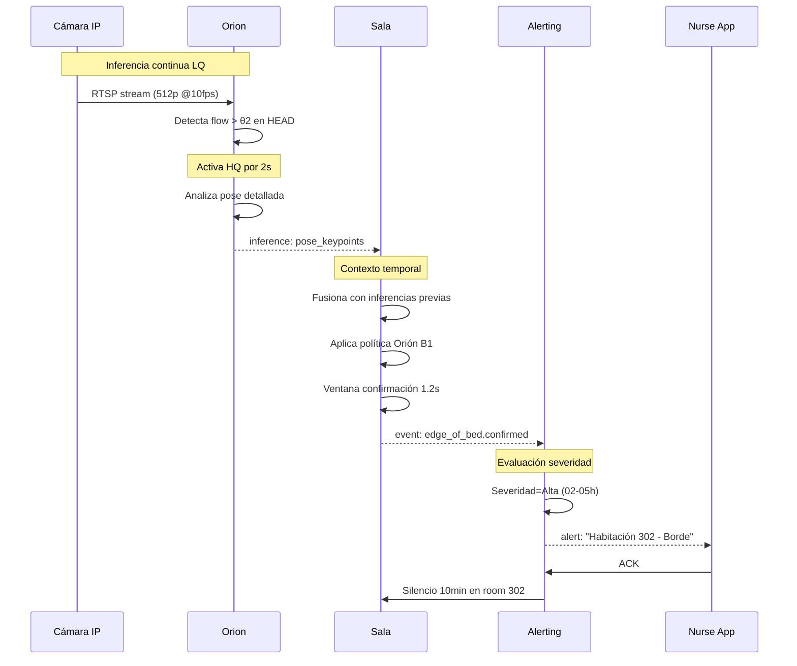

# Care Scene - Arquitectura de Separación de Responsabilidades

> Sistema de monitoreo inteligente para residencias geriátricas basado en **separación limpia de responsabilidades**: sensores que ven, expertos que interpretan, orquestadores que coordinan.

---

## 🎯 Principio Fundamental

**Orion NO es el experto. Orion es el sensor.**

```
          ┌─────────────────┐         ┌───────────────────┐
          │ EXPERT REGISTRY │◄────────│   ORCHESTRATOR    │
          │ "Package Mgr"   │ consulta│ "Director Circo"  │
          │ Grafo expertos  │         │ Gestiona atención │
          └────────┬────────┘         └─────────┬─────────┘
                   │ manifests                  │ (decide qué hacer)
                   │                            │
         ┌─────────┴────────┬───────────────────┼────────────────────┐
         ▼                  ▼                   ▼                    ▼
    ┌─────────┐        ┌─────────┐         ┌─────────┐         ┌─────────┐
    │ ORION   │────┐   │ ORION   │─────┐   │ ORION   │         │ ORION   │
    │ Rm 302  │MQTT│   │ Rm 303  │MQTT │   │ Rm 304  │         │ ...     │
    │ "Veo"   │data│   │ "Veo"   │data │   │ "Veo"   │         │         │
    └─────────┘plane   └─────────┘plane│   └─────────┘         └─────────┘
                │                      │
                └──────────────────────┴────────────────┐
                                                        ▼
                                              ┌──────────────────┐
                                              │ SCENE EXPERTS    │
                                              │     MESH         │
                                              │ Sleep/Edge/Exit  │
                                              │ "Interpretamos"  │
                                              └────────┬─────────┘
                                                       │ eventos
                                                       ▼
                                              ┌──────────────────┐
                                              │   ALERTING       │
                                              │   Service        │
                                              │ "Notifico"       │
                                              └──────────────────┘

                              ┌─────────────────────┐
                              │      EUREKA         │
                              │  Config + Registry  │
                              │  (Control Plane)    │
                              └─────────────────────┘
```

---

## 📦 Servicios Principales

### 1. **Expert Registry (Package Manager de Expertos)** 📦

**Rol:** Gestiona grafo de dependencias entre expertos

**Hace:**
- Almacena manifests de expertos (como package.json)
- Resuelve dependencias (como npm install)
- Calcula orden de activación (topological sort)
- Valida compatibilidad de versiones
- Detecta dependencias circulares

**NO hace:**
- NO ejecuta expertos
- NO maneja recursos HQ
- NO toma decisiones de negocio

**API ejemplo:**
```json
POST /resolve
{
  "requested_experts": ["exit_expert"]
}

Response:
{
  "to_activate": ["sleep_expert", "edge_expert", "exit_expert"],
  "activation_order": ["sleep", "edge", "exit"],
  "orion_requirements": {...}
}
```

📖 [Documentación completa](./EXPERT_REGISTRY_DESIGN.md)

---

### 2. **Orchestrator (Director del Circo)** 🎪

**Rol:** Gestor de recursos y atención

**Hace:**
- Escucha eventos de Scene Experts
- **Consulta Expert Registry** para resolver dependencias
- Decide qué Orion activar HQ, cuándo y dónde
- Gestiona budget de HQ (max 8 simultáneos de 30)
- Coordina con Eureka para distribuir políticas
- Prioriza habitaciones (crítico > alto > medio > bajo)

**NO hace:**
- NO interpreta eventos clínicos
- NO procesa video
- NO genera alertas

**Decisión ejemplo:**
```json
{
  "trigger": "edge_of_bed.intent en room 302",
  "decision": "Activar HQ 5s en Orion-302, focus BED_RIGHT_EDGE",
  "reason": "Confirmar si realmente sentado al borde"
}
```

📖 [Documentación completa](ORCHESTRATOR_DESIGN.md)

---

### 2. **Orion (Care Streamer)** 🎥

**Rol:** Sensor inteligente headless

**Hace:**
- Procesa streams RTSP (LQ continuo + HQ on-demand)
- Ejecuta modelos de AI según configuración
- Emite **inferencias crudas** (keypoints, bboxes, flow)
- Reporta salud y métricas

**NO hace:**
- NO interpreta eventos clínicos
- NO decide severidades
- NO conoce políticas de enfermería

**Output ejemplo:**
```json
{
  "inference_type": "pose_keypoints",
  "roi": "BED_RIGHT_EDGE",
  "torso_angle_deg": 62,
  "hip_to_edge_cm": 11,
  "confidence": 0.90
}
```

📖 [Documentación completa](ORION_INFERENCE_CONTRACT%20(v1.md)

---

### 3. **Sala (Scene Experts Mesh)** 🧠🕸️

**Rol:** Mallado de expertos especializados (activación dinámica)

**Expertos:**
- **SleepExpert** 😴 - Estados de sueño (siempre activo)
- **EdgeExpert** 🪑 - Sentarse al borde (activo si hay movimiento)
- **ExitExpert** 🚶 - Salida de cama (activo si edge confirmed)
- **CaregiverExpert** 👤 - Presencia cuidador (siempre activo)
- **PostureExpert** 🛏️ - Posturas riesgo (activo en residentes específicos)

**Activación dinámica:**
```
Deep sleep → SleepExpert + CaregiverExpert (2/5)
Restless → + EdgeExpert (3/5)
Edge confirmed → + ExitExpert (4/5)
Exit confirmed → Solo ExitExpert (1/5, máximo foco)
```

**Cada experto:**
- Escucha solo inferencias de su dominio
- Mantiene contexto temporal específico
- Emite eventos especializados
- Declara qué necesita de Orion

**Output ejemplo:**
```json
{
  "event": "edge_of_bed.confirmed",
  "expert": "EdgeExpert",
  "room_id": "302",
  "sustain_ms": 1200,
  "confidence": 0.90
}
```

📖 [Documentación completa](SCENE_EXPERTS_MESH.md) | [Diseño original](SALA_SCENE_EXPERT_DESIGN.md)

---

### 4. **Alerting Service** 📢

**Rol:** Gestor de alertas y priorización

**Hace:**
- Escucha eventos de Sala
- Aplica reglas de severidad
- Gestiona silencios post-intervención
- Enruta a nurse app, dashboard, etc.

---

### 5. **Eureka (Service Registry + Config Server)** 🎛️

**Rol:** Control plane central

**Hace:**
- Registro de servicios (Orion, Sala, Orchestrator, etc.)
- **Distribución de configuración dinámica** (políticas YAML)
- Health checks y heartbeats
- Telemetría de plataforma
- API REST para Orchestrator (POST /config/{instance_id})

**NO hace:**
- NO toca data plane
- NO procesa eventos/alertas
- NO toma decisiones (eso es Orchestrator)

---

## 📊 Flujo End-to-End (Caso José 02:15 AM)



---

## 🗂️ Documentación Detallada

| Documento | Descripción |
|-----------|-------------|
| [ARQUITECTURA_SEPARACION_DE_RESPONSABILIDADES.md](ARQUITECTURA_SEPARACION_DE_RESPONSABILIDADES.md) | Visión general de roles y responsabilidades |
| [ORCHESTRATOR_DESIGN.md](ORCHESTRATOR_DESIGN.md) | **Orchestrator: gestor de recursos, budget HQ, priorización** |
| [SCENE_EXPERTS_MESH.md](SCENE_EXPERTS_MESH.md) | **Mallado de expertos: SleepExpert, EdgeExpert, ExitExpert, etc. (activación dinámica)** |
| [ORION_INFERENCE_CONTRACT.md](ORION_INFERENCE_CONTRACT%20(v1.md) | Contrato de inferencias MQTT (schemas, topics, QoS) |
| [SALA_SCENE_EXPERT_DESIGN.md](SALA_SCENE_EXPERT_DESIGN.md) | Diseño original de Sala (reglas, estado, anti-flickering) |

---

## 🔧 Configuración por Capas

### Orion recibe (de Eureka):
```yaml
streams:
  lq: {resolution: "512p", fps: 10, models: ["person", "pose-lite", "flow"]}
  hq: {resolution: "1080p", fps: 25, models: ["pose-hq"], trigger_window_ms: 2000}

rois:
  BED_FULL: [[10,50], [630,430]]
  BED_HEAD: [[10,50], [630,150]]
  FLOOR_BEDSIDE_RIGHT: [[640,300], [720,480]]

thresholds:
  flow_low: 0.02    # θ1
  flow_high: 0.15   # θ2
```

### Sala recibe (de Eureka):
```yaml
policy: "orion_b1_kiss"

event_rules:
  edge_of_bed_confirmed:
    trigger: "COM_to_edge <= 15cm AND torso_angle > 55°"
    sustain_ms: 1200
    severity: "high"

anti_flickering:
  min_sustain_ms: 1000
  silence_caregiver_min: 10
```

---

## 🧪 Testing

### Unit Tests (por servicio)

**Orion:**
```bash
pytest tests/orion/test_pose_inference.py -v
pytest tests/orion/test_lq_hq_trigger.py -v
```

**Sala:**
```bash
pytest tests/sala/test_microawake_rule.py -v
pytest tests/sala/test_edge_detection.py -v
pytest tests/sala/test_anti_flickering.py -v
```

### Integration Tests

```bash
# End-to-end con video sintético
pytest tests/integration/test_jose_scenario.py -v

# Validar latencias
pytest tests/integration/test_slo_compliance.py -v
```

---

## 📈 Métricas de Éxito (Caso José)

| Métrica | Target | Medición |
|---------|--------|----------|
| Recall posturas de riesgo | ≥95% | Sala emite evento cuando José está mal posicionado |
| Falsas alarmas | <1 por noche | Alerting no notifica por movimientos normales |
| Latencia detección→alerta | <5s | Timestamp exit_confirmed → timestamp alerta |
| Uptime sistema | 99.9% | Orion + Sala healthy 24/7 |
| Confianza enfermeros | Sistema NO apagado | Telemetría de silenciado manual |

---

## 🚀 Deployment

### Docker Compose

```yaml
version: "3.8"

services:
  mosquitto:
    image: eclipse-mosquitto:2
    ports: ["1883:1883"]

  eureka:
    build: ./eureka
    ports: ["8761:8761"]

  orchestrator:
    build: ./orchestrator
    environment:
      MQTT_BROKER: mosquitto:1883
      EUREKA_URL: http://eureka:8761
      HQ_BUDGET_MAX: 8
    depends_on: [mosquitto, eureka]

  orion-room-302:
    build: ./orion_service
    environment:
      INSTANCE_ID: orion-nuc-001
      ROOM_ID: "302"
      RTSP_URL: rtsp://cam-302.local/stream
      EUREKA_URL: http://eureka:8761

  sala:
    build: ./sala
    environment:
      MQTT_BROKER: mosquitto:1883
      EUREKA_URL: http://eureka:8761
    depends_on: [mosquitto, eureka]

  alerting:
    build: ./alerting_service
    depends_on: [mosquitto, sala, orchestrator]
```

---

## 🔄 Roadmap

### v1.0 (MVP - Actual)
- ✅ Orion: LQ/HQ dinámico, inferencias básicas
- ✅ Sala: Reglas Orión B1 KISS (MAW, EDGE, EXIT)
- ✅ Eureka: Registro y configuración
- ✅ MQTT: Data plane + control plane

### v1.1 (Próximo)
- ⬜ Reglas de sueño (DEEP, LIGHT, RESTLESS)
- ⬜ Ajuste adaptativo de umbrales por residente
- ⬜ Profiler para analítica de largo plazo

### v1.2 (Futuro)
- ⬜ ML para políticas personalizadas
- ⬜ Detección de patrones nocturnos (nocturia)
- ⬜ Multi-escena (Sala-Pasillo, Sala-Baño)

---

## 📚 Referencias Técnicas

- **Caso de estudio:** [docs/ejemplo_jose.md](ejemplo_jose.md)
- **Política Orión B1 KISS:** [docs/talk/orion_tabla_de_eventos_en_cama_v_1_kiss.md](orion_tabla_de_eventos_en_cama_v_1_kiss.md)
- **Planogramas de habitaciones:** [docs/talk/planogramas/](./talk/planogramas/)
- **Timeline nocturna completa:** [docs/talk/Untitled 1.md](Orion%20-%20Una%20Explicación%20Sencilla%20de%20Nuestro%20"Sensor%20Inteligente".md)

---

## 💡 Analogías para Entender

| Servicio | Analogía Médica | Qué Hace |
|----------|----------------|----------|
| **Orion** | Radiólogo | Lee placas, reporta "masa 3cm lóbulo superior" |
| **Sala** | Médico internista | Lee reporte, diagnostica "probable adenocarcinoma" |
| **Orchestrator** | Jefe de guardia | Asigna recursos: "sala 3 necesita más atención, enviar especialista" |
| **Alerting** | Triaje | Decide "a emergencia ahora" vs "esperar 30min" |
| **Eureka** | Administración hospitalaria | Distribuye protocolos, coordina turnos |

---

## ❓ FAQ

**P: ¿Por qué separar Orion y Sala?**
R: Modularidad. Puedes cambiar modelos de AI sin tocar lógica clínica, y viceversa. Puedes tener 1 Sala escuchando 30 Orion.

**P: ¿Qué pasa si Sala se cae?**
R: Orion sigue emitiendo inferencias. Al volver Sala, retoma desde donde quedó (no pierde eventos recientes si hay buffer MQTT).

**P: ¿Cómo se calibran los umbrales θ/α/λ?**
R: Eureka distribuye políticas YAML. Primera noche: baseline automático por percentiles. Luego: ajuste manual o ML.

**P: ¿Qué hace Profiler?**
R: Escucha eventos de Sala, almacena en JSONL, genera analítica de largo plazo (ISD, MAW_rate, scores nocturnos). Es un servicio aparte.

---

## 🏁 Quick Start

```bash
# 1. Clonar repo
git clone https://github.com/your-org/care_scene.git
cd care_scene

# 2. Levantar stack
docker-compose up -d

# 3. Verificar servicios
curl http://localhost:8761/eureka/apps  # Eureka registry
mosquitto_sub -t 'care/inferences/#' -v  # Inferencias de Orion
mosquitto_sub -t 'care/detections/#' -v  # Eventos de Sala

# 4. Test con video sintético (caso José)
python tests/integration/run_jose_scenario.py

# 5. Ver dashboard
open http://localhost:3000/dashboard
```

---

**Filosofía Care Scene:**
- **Orion ve** (sensor headless)
- **Sala entiende** (experto clínico)
- **Orchestrator gestiona** (director del circo)
- **Alerting actúa** (notificación)
- **Eureka coordina** (config + registry)

**Separation of concerns limpia, event-driven, escalable.**

---

**Sala diagnostica. Orchestrator maneja el circo.**

---

*Última actualización: 2025-10-03*
*Documentado por: Equipo Care Scene*
*Estado: Arquitectura v1.0 - En desarrollo MVP*
