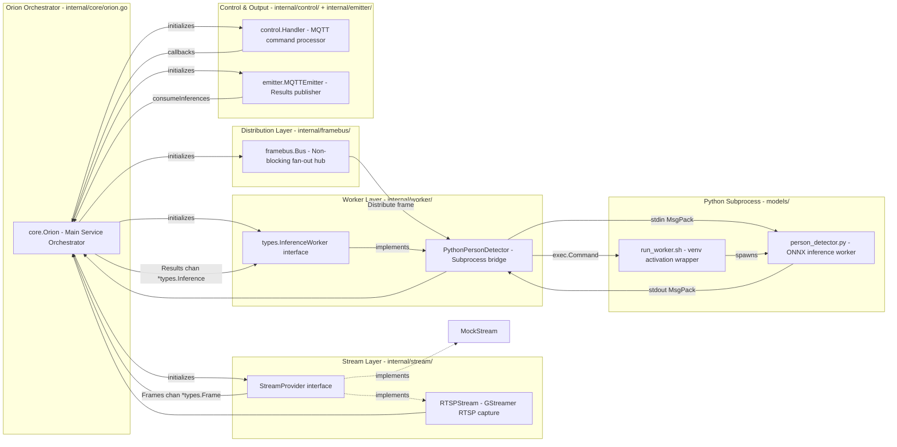
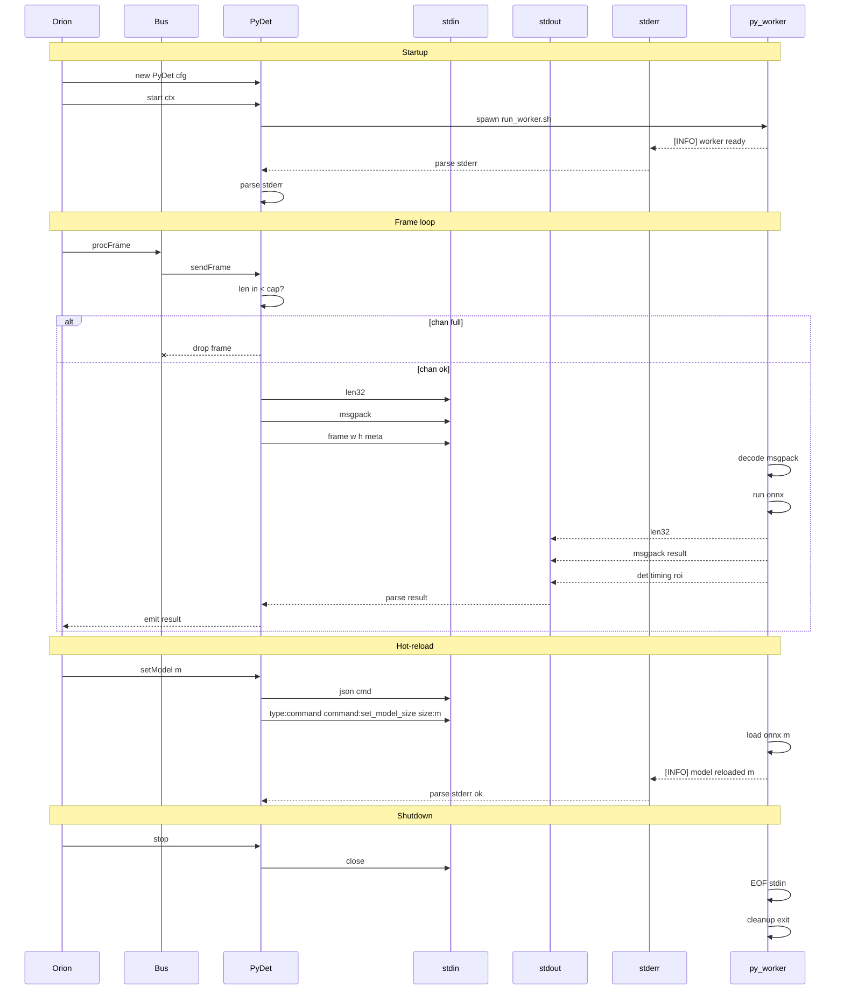
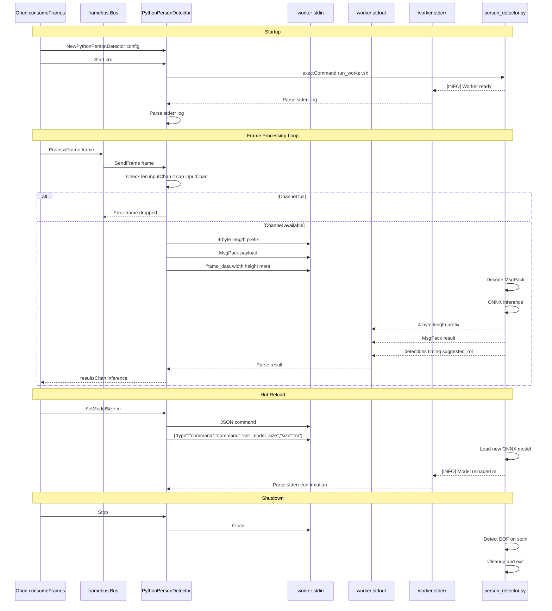
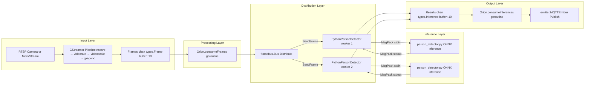

## Purpose and Scope

This document describes the high-level architecture of the Orion service, explaining how the major components interact to provide real-time video inference. It covers the Go-Python hybrid design, the GStreamer-based streaming pipeline, the MQTT control plane, and the frame distribution architecture.

For specific component implementation details, see:

- Service orchestration and lifecycle: [Service Orchestration](2.1-service-orchestration.md)
- MQTT topic structure and commands: [Topic Structure](3.1-topic-structure.md) and [Command Reference](3.2-command-reference.md)
- Python worker protocol details: [Python Worker Bridge](2.5-python-worker-bridge.md)
- Configuration parameters: [Configuration Guide](#6.4-configuration-guide)

## System Design Principles

Orion implements a **hybrid Go-Python architecture** with the following core principles:

1. **Pragmatic Performance**: The system intentionally drops frames to maintain real-time processing rather than queuing and falling behind. This ensures consistent low-latency operation.
    
2. **MQTT-Centric Control**: All runtime configuration and monitoring flows through MQTT topics, enabling hot-reload capabilities and external system integration.
    
3. **Component Isolation**: Each major subsystem (streaming, processing, inference, control) operates independently with well-defined interfaces, enabling fault isolation and recovery.
    
4. **Attention-Based Optimization**: The ROI processor selects between YOLO320 (fast) and YOLO640 (accurate) models based on region size, achieving 3-5x performance improvement on focused regions.
    

**Sources**:  [internal/core/orion.go]()

## Component Architecture

The following diagram maps the system's natural language components to their code entities in the codebase:

**Sources**: [internal/core/orion.go](internal/core/orion.go#L20-L40) [internal/core/orion.go42-107](internal/core/orion.go#L42-L107)

> Nota: El Roi Procesor no va ser parte del Go Go informara el ROI y dejara que los Workers Trabajen ese Roi.
### The Orion Orchestrator

The `core.Orion` struct [internal/core/orion.go20-40](internal/core/orion.go#L20-L40) serves as the main service orchestrator. It coordinates all components through a centralized lifecycle:

| Field            | Type                      | Purpose                           |
| ---------------- | ------------------------- | --------------------------------- |
| `stream`         | `StreamProvider`          | Video frame source (RTSP or Mock) |
| `frameBus`       | `*framebus.Bus`           | Frame distribution hub            |
| `roiProcessor`   | `*roiprocessor.Processor` | ROI attention and model selection |
| `workers`        | `[]types.InferenceWorker` | Inference worker pool             |
| `emitter`        | `*emitter.MQTTEmitter`    | Inference result publisher        |
| `controlHandler` | `*control.Handler`        | MQTT command processor            |

The orchestrator implements three primary goroutines during `Run()` [internal/core/orion.go109-329](internal/core/orion.go#L109-L329):

1. **Frame Consumer** (`consumeFrames`) - Reads frames from stream, applies ROI processing, distributes to FrameBus
2. **Inference Consumer** (`consumeInferences`) - Collects results from workers, publishes to MQTT
3. **Worker Watchdog** (`watchWorkers`) - Monitors worker health, implements auto-recovery

**Sources**: [internal/core/orion.go20-75](internal/core/orion.go#L20-L75) [internal/core/orion.go298-317](internal/core/orion.go#L298-L317)
> Nota: El Roi Procesor no va ser parte del Go Go informara el ROI y dejara que los Workers Trabajen ese Roi.
### Stream Pipeline

The `StreamProvider` interface abstracts video frame sources:

```
type StreamProvider interface {
    Start(ctx context.Context) error
    Stop() error
    Frames() <-chan *types.Frame
    SetTargetFPS(fps float64) error
}
```

Two implementations exist:

1. **RTSPStream** [internal/stream/rtsp.go](internal/stream/rtsp.go) - Wraps GStreamer pipeline (`rtspsrc → videorate → videoscale → jpegenc`) for live RTSP streams
2. **MockStream** [internal/stream/mock.go](internal/stream/mock.go) - Generates test patterns using `videotestsrc` for development without cameras

The stream provider runs a warm-up phase [internal/core/orion.go211-260](internal/core/orion.go#L211-L260) to measure actual FPS and calculate optimal inference rate using `stream.WarmupStream()` and `stream.CalculateOptimalInferenceRate()`.

**Sources**: [CLAUDE.md68-72](CLAUDE.md#L68-L72) [internal/core/orion.go132-210](internal/core/orion.go#L132-L210)

### Frame Distribution

The `framebus.Bus` [internal/framebus/bus.go](internal/framebus/bus.go) implements a **non-blocking fan-out pattern**. When a frame arrives:

1. The bus calls `Distribute(frame)` on all registered workers
2. Each worker's `SendFrame()` uses a `select` with `default` case
3. If the worker's input channel is full, the frame is **dropped** (not queued)
4. Drop metrics are tracked per-worker

This design prioritizes **real-time responsiveness** over completeness. The system would rather skip frames than fall behind and accumulate latency.

**Sources**: [CLAUDE.md74-77](CLAUDE.md#L74-L77) [internal/core/orion.go293-295](internal/core/orion.go#L293-L295)

### ROI Attention System

The `roiprocessor.Processor` [internal/roiprocessor/processor.go](internal/roiprocessor/processor.go) implements intelligent region-of-interest processing with multi-model selection:

**Priority Hierarchy** (evaluated in order):

1. External ROIs (from MQTT commands)
2. Full frame (fallback)

**Model Selection Logic**:

```
merged_area = merged_roi.width × merged_roi.height
if merged_area >= threshold_640 (default: 102,400 px):
    use YOLO640 (higher accuracy, ~50ms)
else:
    use YOLO320 (faster, ~20ms)
```

The processor adds `roi_processing` metadata to each frame [internal/core/orion.go56-59](internal/core/orion.go#L56-L59) instructing the Python worker which model to use and what crop to apply.

**Sources**: [CLAUDE.md99-110](CLAUDE.md#L99-L110) [internal/core/orion.go55-64](internal/core/orion.go#L55-L64)

## Communication Patterns








### Go-Python Subprocess Bridge

**Protocol Details**:

**Go → Python (stdin)**: MsgPack with length-prefix framing

- 4-byte little-endian uint32 (payload length)
- MsgPack-encoded payload (frame data + metadata)
- **No base64 encoding** - raw JPEG bytes for efficiency

**Python → Go (stdout)**: Same framing

- 4-byte length prefix
- MsgPack result (detections, timing, suggested ROI)

**Python → Go (stderr)**: Structured logging

- Go parses log levels: `[ERROR]`, `[WARNING]`, `[INFO]`, `[DEBUG]`
- Used for worker readiness signals and debugging

**Sources**: [CLAUDE.md111-151](CLAUDE.md#L111-L151) [internal/worker/person_detector_python.go](internal/worker/person_detector_python.go)

### MQTT Topic Topology

The MQTT control plane enables:

- **Runtime reconfiguration** without service restart
- **Multiple concurrent clients** (CLI tools, monitoring, automation)
- **Bidirectional communication** (commands → service, results → clients)

**Sources**:  [internal/control/handler.go](internal/control/handler.go) [internal/emitter/mqtt.go](internal/emitter/mqtt.go)

## Frame Processing Pipeline

The following diagram shows the complete data flow from video source to inference results:





**Key Characteristics**:

1. **Non-blocking at every stage**: All channel operations use `select` with `default` case to prevent blocking
2. **Intentional frame drops**: If any component is slow, frames are dropped rather than queued
3. **Feedback loop**: Python workers return `suggested_roi` to inform the ROI processor's next decision
4. **Parallel workers**: Multiple Python processes handle frames concurrently (though typically only 1-2 workers due to inference time)

**Sources**:  [internal/core/orion.go298-329](internal/core/orion.go#L298-L329)

## Lifecycle Management

### Startup Sequence

The `Orion.Run()` method [internal/core/orion.go109-329](internal/core/orion.go#L109-L329) orchestrates component initialization:

1. **Configuration Load**: `config.Load(configPath)` parses `config/orion.yaml`
2. **Component Initialization**:
    - Create `roiprocessor.Processor` with thresholds
    - Create `framebus.Bus`
    - Create Python workers via `worker.NewPythonPersonDetector()`
    - Create `emitter.MQTTEmitter`
3. **Stream Selection**: Choose `RTSPStream` or `MockStream` based on `camera.rtsp_url`
4. **Stream Start**: Call `stream.Start(ctx)`
5. **Warm-up Phase**: Run `stream.WarmupStream()` to measure real FPS
6. **MQTT Connection**: `emitter.Connect(ctx)`
7. **Control Plane**: Create and start `control.Handler`
8. **Worker Launch**: `frameBus.Start(ctx)` spawns Python subprocesses
9. **Goroutine Launch**: Start `consumeFrames`, `consumeInferences`, `watchWorkers`, stats logger

**Sources**: [internal/core/orion.go109-329](internal/core/orion.go#L109-L329)

### Operational State

During normal operation, the orchestrator maintains:

- **Frame distribution loop**: Continuously reads from `stream.Frames()`, processes ROIs, distributes to workers
- **Inference collection loop**: Continuously reads from worker result channels, publishes to MQTT
- **Health monitoring**: The watchdog goroutine checks worker `lastSeenAt` metrics every 30 seconds with adaptive timeout [internal/core/orion.go391-454](internal/core/orion.go#L391-L454)
- **MQTT control listener**: The control handler processes incoming commands asynchronously

**Sources**: [internal/core/orion.go298-329](internal/core/orion.go#L298-L329) [internal/core/orion.go391-454](internal/core/orion.go#L391-L454)

### Shutdown Sequence

The `Orion.Shutdown()` method [internal/core/orion.go331-389](internal/core/orion.go#L331-L389) implements graceful teardown with strict ordering:

1. **Stop Workers First**: `frameBus.Stop()` - Workers depend on stream frames, so stop them before the stream
2. **Stop Stream**: `stream.Stop()` - No more frames needed
3. **Stop Control Plane**: `controlHandler.Stop()` - No more commands accepted
4. **Wait for Goroutines**: `wg.Wait()` - Ensure clean goroutine shutdown
5. **Disconnect MQTT**: `emitter.Disconnect()` - Final cleanup

This ordering prevents resource leaks and ensures workers can complete in-flight inferences before the stream closes.

**Sources**: [internal/core/orion.go331-389](internal/core/orion.go#L331-L389)

### Auto-Recovery Mechanism

The worker watchdog [internal/core/orion.go391-454](internal/core/orion.go#L391-L454) implements a **KISS (Keep It Simple, Stupid) recovery approach**:

**Adaptive Timeout Calculation**:

```
timeout = max(30s, 3 × inference_period)
where inference_period = 1 / max_inference_rate_hz
```

**Recovery Logic**:

1. Check if `time.Since(metrics.LastSeenAt) > timeout`
2. If hung, attempt **one restart**: `worker.Stop()` → `worker.Start(ctx)`
3. If restart fails, log error and require manual intervention
4. No retry loops or complex state machines

This ensures the system can recover from transient worker failures (OOM, Python crashes) while avoiding infinite restart loops for persistent issues.

**Sources**: [internal/core/orion.go391-454](internal/core/orion.go#L391-L454) [CLAUDE.md153-158](CLAUDE.md#L153-L158)

## Thread Safety and Concurrency

The architecture implements several concurrency patterns:

| Component                | Mechanism                     | Purpose                                    |
| ------------------------ | ----------------------------- | ------------------------------------------ |
| `roiprocessor.Processor` | `sync.RWMutex`                | Thread-safe ROI updates from MQTT commands |
| `framebus.Bus`           | Per-worker goroutines         | Parallel frame distribution                |
| Worker metrics           | `atomic` operations           | Lock-free counter updates                  |
| Context cancellation     | `context.Context`             | Coordinated shutdown across goroutines     |
| Channel buffering        | Buffered channels (size 5-10) | Absorb short bursts without blocking       |


All channel sends use the pattern:

```
select {
case ch <- value:
    // Success
default:
    // Drop and continue (non-blocking)
}
```