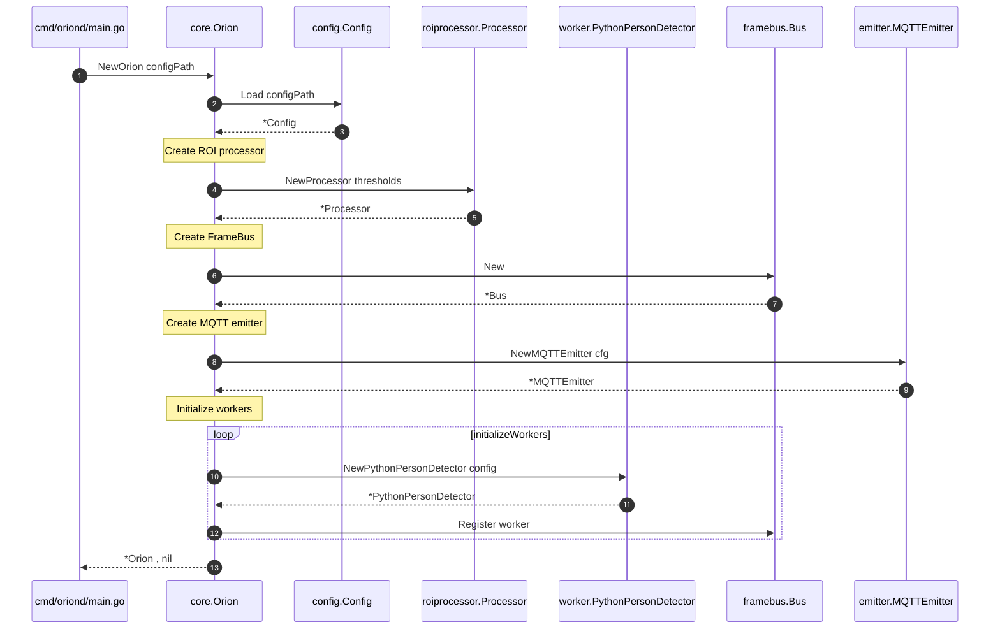
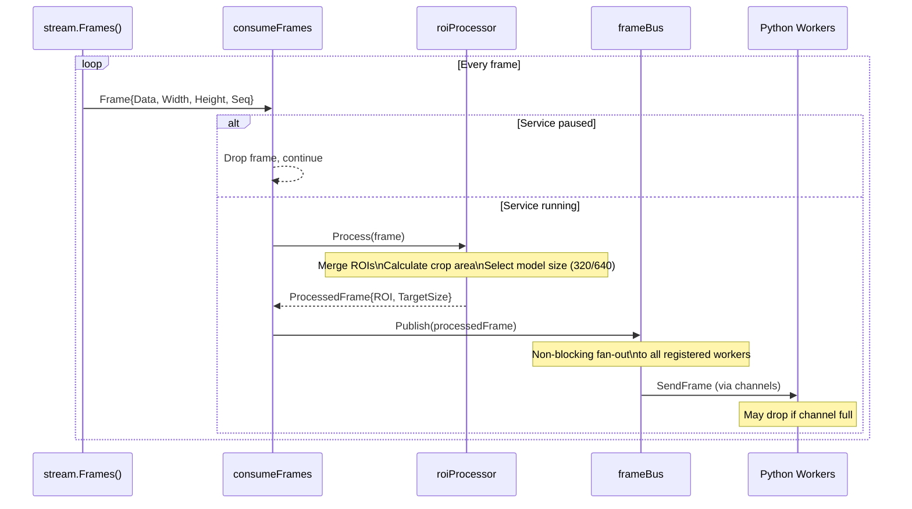
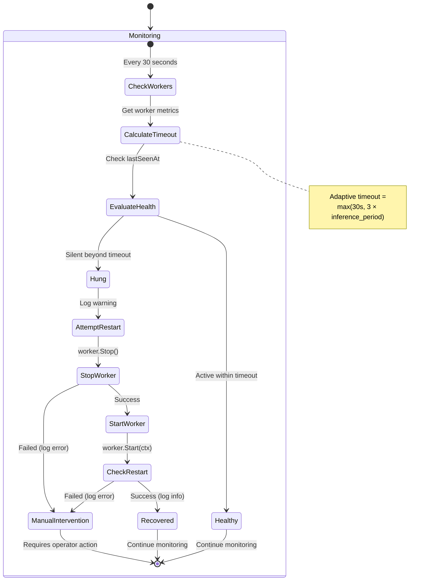
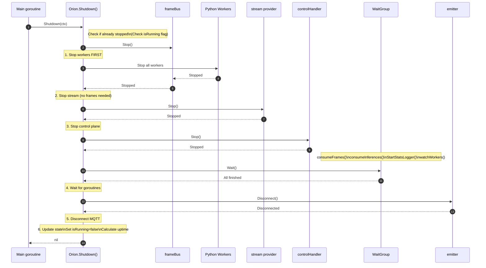
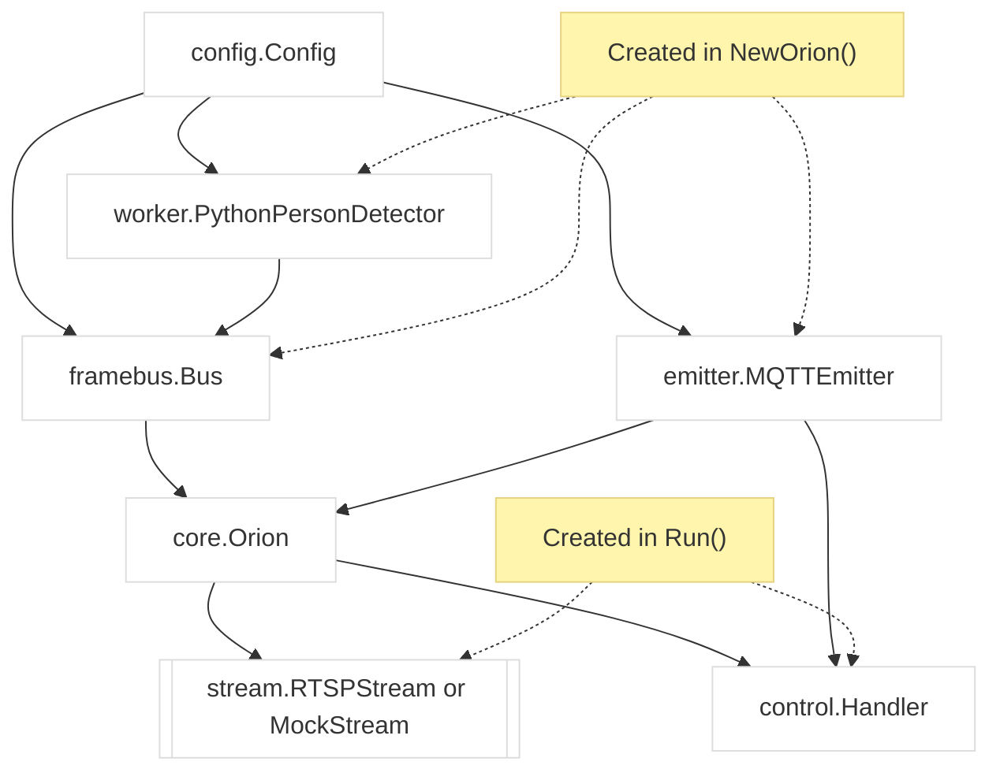

# Core Service (oriond)

Relevant source files

- [CLAUDE.md](CLAUDE.md)
- [internal/core/health.go](internal/core/health.go)
- [internal/core/orion.go](internal/core/orion.go)

The **Core Service** (`oriond`) is the main daemon that orchestrates all components of the Orion video inference system. It manages the complete lifecycle of video stream ingestion, frame processing, worker coordination, MQTT communication, and graceful shutdown. This service acts as the central integration point where GStreamer video capture, ROI processing, Python worker management, and MQTT control plane converge.

For details on specific subsystems managed by this service, see: Stream Providers ([#2.2](2.2-stream-providers.md)), ROI Attention System ([#2.3](#2.3-roi-attention-system)), Frame Distribution ([#2.4](2.4-frame-distribution.md)), and Python Worker Bridge ([#2.5](2.5-python-worker-bridge.md)). For MQTT control plane details, see [#3](3-mqtt-control-plane.md).

---

## Service Architecture

The `Orion` struct in [internal/core/orion.go20-40](internal/core/orion.go#L20-L40) serves as the main orchestrator, holding references to all major subsystems and coordinating their interactions.

```mermaid
%%{init: {"flowchart": {"curve":"basis","useMaxWidth": true}, "themeVariables": {"fontSize":"12px"}}}%%
flowchart TD
  %% ==== Clusters ====
  subgraph Orion_Service_Orchestrator
    direction TB

    subgraph Synchronization
      MU[mu RWMutex]
      WG[wg WaitGroup]
    end

    subgraph Core_Components
      STREAM[stream StreamProvider RTSPStream o MockStream]
      ROI[roiProcessor Processor ROI Attention]
      FBUS[frameBus Bus Frame Distribution]
      WORKERS[workers InferenceWorker Python Detectors]
      EMIT[emitter MQTTEmitter Results Publisher]
      CTRL[controlHandler Handler Command Processor]
    end

    subgraph Lifecycle_State
      STARTED[started time Time]
      RUNNING[isRunning bool]
      PAUSED[isPaused bool]
      RUNCTX[runCtx context Context]
      CANCEL[cancelCtx CancelFunc]
    end

    ORION[Orion struct internal core orion go]
  end

  %% ==== Enlaces desde Orion a Core ====
  ORION --> STREAM
  ORION --> ROI
  ORION --> FBUS
  ORION --> WORKERS
  ORION --> EMIT
  ORION --> CTRL

  %% ==== Enlaces desde Orion a Lifecycle ====
  ORION --> STARTED
  ORION --> RUNNING
  ORION --> PAUSED
  ORION --> RUNCTX
  ORION --> CANCEL

  %% ==== Enlaces desde Orion a Sync ====
  ORION --> MU
  ORION --> WG
```





**Sources:** [internal/core/orion.go20-40](internal/core/orion.go#L20-L40)

---

## Service Responsibilities

The orchestrator manages five critical areas:

|Responsibility|Implementation|Key Methods|
|---|---|---|
|**Component Lifecycle**|Initialize, start, coordinate, and shutdown all subsystems|`NewOrion()`, `Run()`, `Shutdown()`|
|**Frame Pipeline**|Coordinate frame flow from stream → ROI processor → FrameBus → workers|`consumeFrames()` goroutine|
|**Inference Collection**|Collect results from workers and publish to MQTT|`consumeInferences()` goroutine|
|**Health Monitoring**|Auto-recovery watchdog for hung workers|`watchWorkers()` goroutine|
|**Runtime Configuration**|Hot-reload support for rate, model size, ROIs, etc.|Control handler callbacks|

**Sources:** [internal/core/orion.go109-329](internal/core/orion.go#L109-L329)

---

## Initialization Sequence

The service initialization follows a dependency-ordered sequence:





The `NewOrion()` function [internal/core/orion.go42-75](internal/core/orion.go#L42-L75) performs validation and construction of all components before any are started. This ensures that configuration errors are detected early, before resources are allocated.

**Sources:** [internal/core/orion.go42-107](internal/core/orion.go#L42-L107)

---

## Startup and Run Loop


```mermaid
flowchart TD
    A[Run(ctx)] --> B[Acquire lock<br/>Set isRunning=true]
    B --> C[Create cancellable context<br/>Store runCtx, cancelCtx]
    C --> D[Initialize stream provider<br/>(RTSP or Mock)]
    D --> E{RTSP URL<br/>configured?}
    E -- Yes --> F[NewRTSPStream()]
    E -- No --> G[NewMockStream()]
    F --> H[stream.Start(ctx)]
    G --> H[stream.Start(ctx)]
    H --> I[Stream warmup phase<br/>(measure real FPS)]
    I --> J[Calculate optimal inference rate<br/>Update process_interval]
    J --> K[emitter.Connect(ctx)]
    K --> L[Setup control handler<br/>Register callbacks]
    L --> M[controlHandler.Start(ctx)]
    M --> N[frameBus.Start(ctx)<br/>(starts all workers)]
    N --> O[Launch service goroutines]

    O --> P1[wg.Add(1)<br/>go consumeFrames(ctx)]
    O --> P2[wg.Add(1)<br/>go consumeInferences(ctx)]
    O --> P3[wg.Add(1)<br/>go frameBus.StartStatsLogger()]
    O --> P4[wg.Add(1)<br/>go watchWorkers(ctx)]

    P1 --> Q[Service Running]
    P2 --> Q
    P3 --> Q
    P4 --> Q

    Q --> R[Wait for ctx.Done()]
    R --> S[Return nil]
```


**Sources:** [internal/core/orion.go109-329](internal/core/orion.go#L109-L329)

### Stream Warmup Phase

The warmup phase [internal/core/orion.go211-260](internal/core/orion.go#L211-L260) measures actual stream FPS over a configured duration (default 5 seconds) to calculate optimal inference rate:

1. **Consume frames** without inference for `warmup_duration_s`
2. **Measure FPS** statistics (mean, std dev)
3. **Calculate optimal rate** = `min(max_inference_rate_hz, measured_fps)`
4. **Calculate process_interval** = `ceil(stream_fps / inference_rate)`

This auto-tuning ensures the service adapts to actual stream characteristics rather than relying solely on configuration.

**Sources:** [internal/core/orion.go211-260](internal/core/orion.go#L211-L260)

---

## Frame Processing Pipeline

The `consumeFrames()` goroutine [internal/core/orion.go331-399](internal/core/orion.go#L331-L399) implements the core frame processing loop:




**Sources:** [internal/core/orion.go331-399](internal/core/orion.go#L331-L399)

The consumer handles pause state by checking `o.isPaused` flag without holding locks, allowing hot pause/resume without blocking.

---

## Inference Collection and Publishing

The `consumeInferences()` goroutine [internal/core/orion.go401-471](internal/core/orion.go#L401-L471) collects inference results from workers and publishes to MQTT:

The consumer also maintains the feedback loop for hybrid auto-focus by passing `suggested_roi` from Python workers back to the ROI processor [internal/core/orion.go427-440](internal/core/orion.go#L427-L440)


```mermaid
flowchart LR
    Workers[Python Workers]
    Consumer[consumeInferences()]
    Validate[Validate inference data]
    Enrich[Enrich with metadata<br/>(instance_id, room_id)]
    Publish[emitter.PublishInference()]
    MQTT[MQTT Topic:<br/>care/inferences/{id}]
    UpdateROI[Update ROI processor<br/>with suggested_roi]
    Feedback[Feedback loop for<br/>hybrid auto-focus]

    Workers -- results channel --> Consumer
    Consumer --> Validate
    Validate --> Enrich
    Enrich --> Publish
    Publish --> MQTT

    Consumer --> UpdateROI
    UpdateROI --> Feedback
```

**Sources:** [internal/core/orion.go401-471](internal/core/orion.go#L401-L471)

---

## Worker Health Watchdog

The `watchWorkers()` goroutine [internal/core/orion.go391-454](internal/core/orion.go#L391-L454) implements automatic recovery for hung or crashed workers:

The adaptive timeout formula prevents false positives when inference rate is low. For example:

- At 1 Hz inference: timeout = max(30s, 3×1s) = **30s**
- At 0.1 Hz inference: timeout = max(30s, 3×10s) = **30s**
- At 5 Hz inference: timeout = max(30s, 3×0.2s) = **30s**

The watchdog attempts recovery **once per failure** (KISS approach), logging errors if restart fails. This prevents infinite restart loops while still providing basic auto-recovery.




**Sources:** [internal/core/orion.go391-454](internal/core/orion.go#L391-L454)

---

## Runtime Configuration Callbacks

The service registers hot-reload callbacks with the control handler [internal/core/orion.go268-286](internal/core/orion.go#L268-L286) Each callback implements thread-safe configuration updates:

|Command|Callback Method|Hot-Reload Mechanism|Service Interruption|
|---|---|---|---|
|`set_inference_rate`|`setInferenceRate()`|Stream restart with new FPS|~2 seconds|
|`set_model_size`|`setModelSize()`|JSON command to Python workers|None|
|`set_attention_rois`|`setAttentionROIs()`|RWMutex-protected update|None|
|`clear_attention_rois`|`clearAttentionROIs()`|RWMutex-protected update|None|
|`set_auto_focus_strategy`|`setAutoFocusStrategy()`|RWMutex-protected update|None|
|`enable_auto_focus`|`enableAutoFocus()`|RWMutex-protected update|None|
|`disable_auto_focus`|`disableAutoFocus()`|RWMutex-protected update|None|
|`pause_inference`|`pauseInference()`|Set boolean flag|None|
|`resume_inference`|`resumeInference()`|Clear boolean flag|None|
|`get_status`|`getStatus()`|Read-only aggregation|None|
|`shutdown`|`shutdownViaControl()`|Cancel context|Graceful shutdown|

**Sources:** [internal/core/orion.go268-286](internal/core/orion.go#L268-L286) [internal/core/control_callbacks.go1-300](internal/core/control_callbacks.go#L1-L300)

---


## Graceful Shutdown

The `Shutdown()` method [internal/core/orion.go331-389](internal/core/orion.go#L331-L389) implements ordered component shutdown:

The shutdown sequence order is critical:

1. **Workers first** - They depend on stream frames
2. **Stream second** - No more frames needed after workers stop
3. **Control plane third** - No more commands needed
4. **Wait for goroutines** - Ensures clean shutdown
5. **MQTT last** - Disconnect cleanly

The shutdown respects a configured timeout (`shutdown_timeout_s`, default 5 seconds) via context deadline in `cmd/oriond/main.go`.




Si querés, después lo ajustamos con timeouts/ctx por llamada (p.ej. `Stop(ctx)` vs `Stop()`), o agregamos “alt”/“opt” para caminos de error si algún componente no responde.

**Sources:** [internal/core/orion.go331-389](internal/core/orion.go#L331-L389)

---

## Goroutine Coordination

The service uses `sync.WaitGroup` [internal/core/orion.go35](internal/core/orion.go#L35-L35) to track four long-running goroutines:

|Goroutine|Purpose|Launched At|Exit Condition|
|---|---|---|---|
|`consumeFrames()`|Process frames from stream → FrameBus|[internal/core/orion.go298-299](internal/core/orion.go#L298-L299)|`ctx.Done()` or stream closed|
|`consumeInferences()`|Collect results from workers → MQTT|[internal/core/orion.go301-303](internal/core/orion.go#L301-L303)|`ctx.Done()`|
|`StartStatsLogger()`|Periodic FrameBus statistics|[internal/core/orion.go305-310](internal/core/orion.go#L305-L310)|`ctx.Done()`|
|`watchWorkers()`|Worker health monitoring|[internal/core/orion.go312-317](internal/core/orion.go#L312-L317)|`ctx.Done()`|

All goroutines use `defer wg.Done()` to ensure the WaitGroup counter is decremented even on panic, preventing shutdown deadlock.

**Sources:** [internal/core/orion.go298-317](internal/core/orion.go#L298-L317)

---

## Configuration Management

The service loads configuration from `config/orion.yaml` during initialization. Key configuration sections used by the orchestrator:

```
instance_id: "orion-default"
room_id: "room-01"

stream:
  # hot reload by command mqtt  resolution: "512p"  fps: 10  warmup_duration_s: 5 max fps..

camera:
  # recibe by mqtt commans 

models: # models abailability para trabajo.
  person_detector:
    max_inference_rate_hz: 1.0
    process_interval: 10      # Auto-calculated from warmup
    model_path: "models/yolo11n_fp32_640.onnx"
    model_path_320: "models/yolo11n_fp32_320.onnx"
    confidence: 0.5

mqtt:
  broker: "localhost:1883"

shutdown_timeout_s: 5
```

The `parseResolution()` helper [internal/core/orion.go480-498](internal/core/orion.go#L480-L498) converts resolution strings to width/height pairs.

**Sources:** [internal/core/orion.go480-498](internal/core/orion.go#L480-L498) [internal/config/config.go1-200](internal/config/config.go#L1-L200)

---

## Component Dependencies

The orchestrator instantiates components in dependency order:

This ensures that no component is started before its dependencies are ready.





**Sources:** [internal/core/orion.go42-107](internal/core/orion.go#L42-L107) [internal/core/orion.go109-329](internal/core/orion.go#L109-L329)