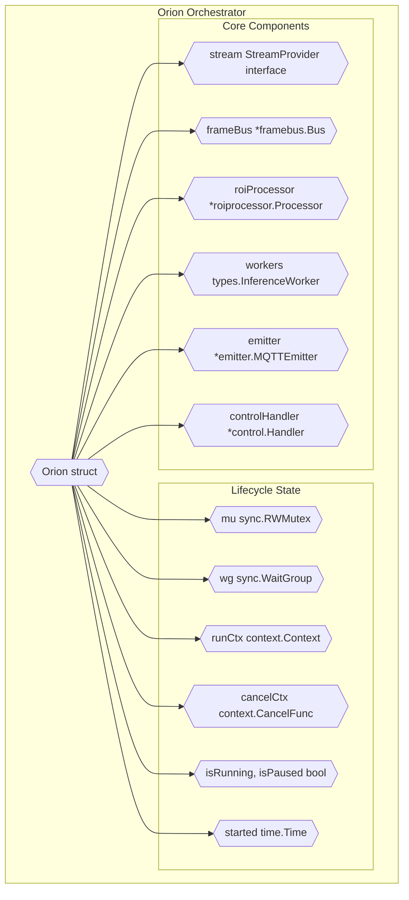
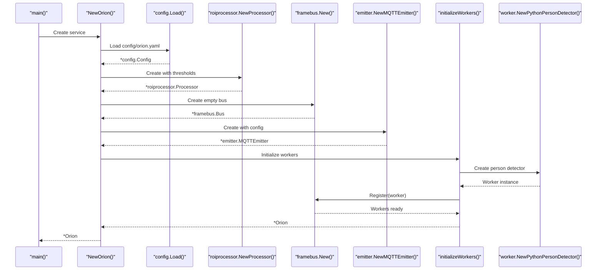
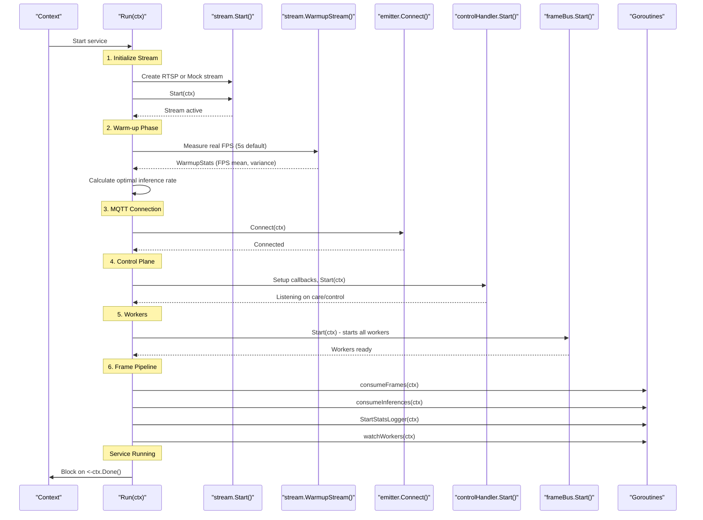
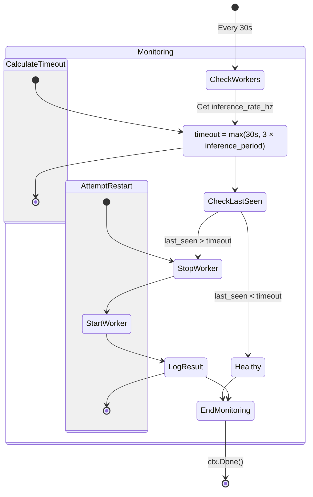
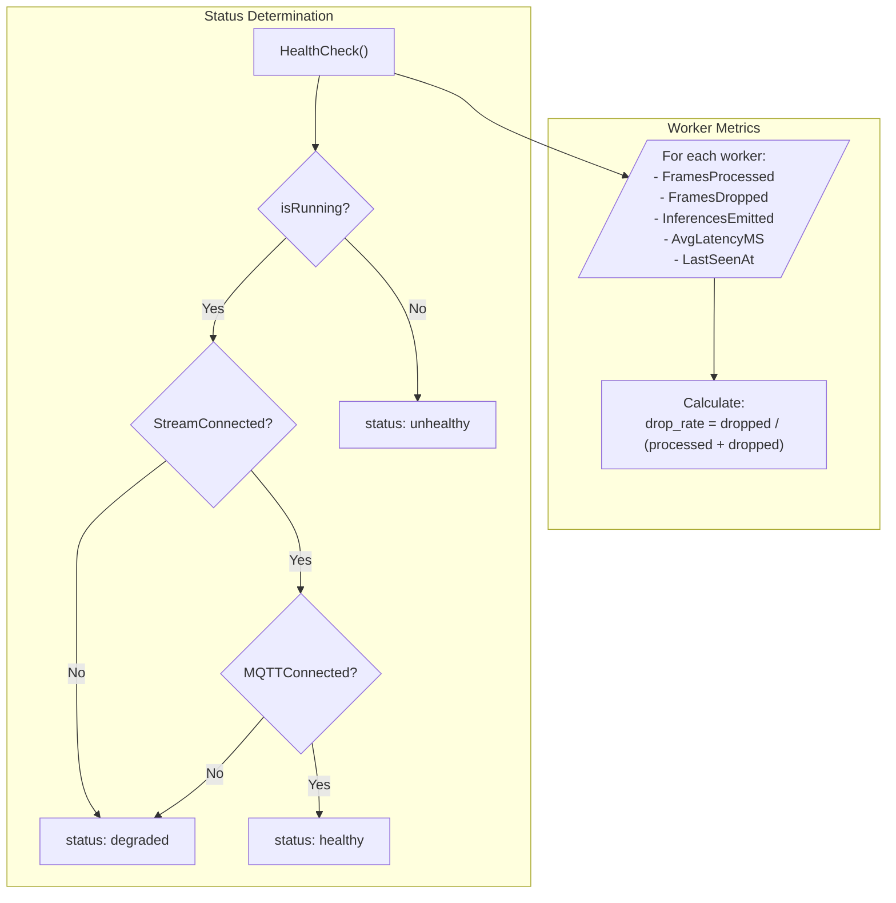
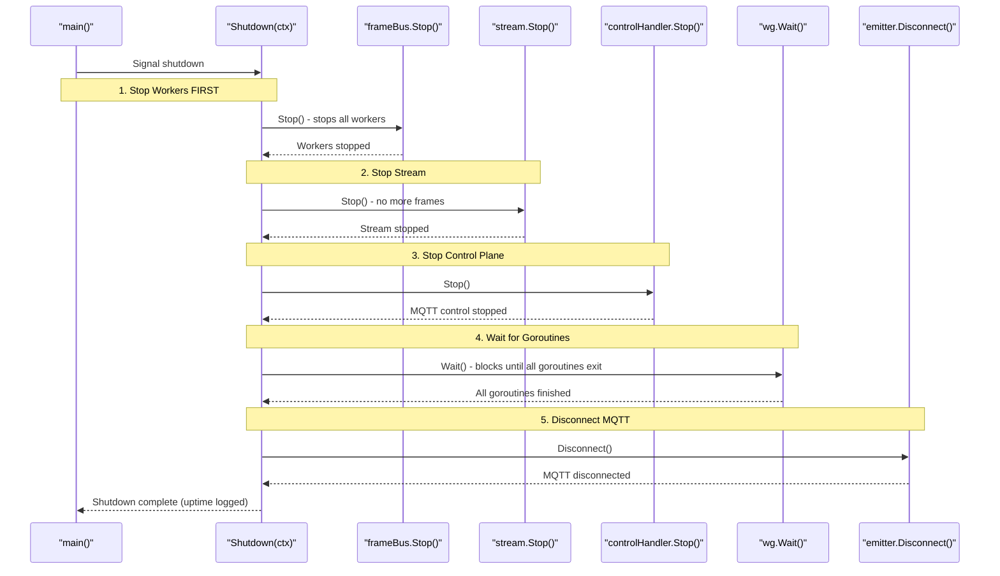

# Service Orchestration

Relevant source files

- [internal/core/health.go](internal/core/health.go)
- [internal/core/orion.go](internal/core/orion.go)

## Purpose and Scope

This document describes the `Orion` service orchestrator implemented in [internal/core/orion.go](internal/core/orion.go) which serves as the central coordinator for the Orion daemon. The orchestrator manages component lifecycle, coordinates goroutine execution, implements health monitoring with automatic worker recovery, and ensures graceful shutdown.

For details about individual components managed by the orchestrator:

- Stream providers (RTSP/Mock): see [2.2](2.2-stream-providers.md)
- ROI processing: see [2.3](#2.3-roi-attention-system)
- Frame distribution: see [2.4](2.4-frame-distribution.md)
- Python worker communication: see [2.5](2.5-python-worker-bridge.md)
- MQTT control plane: see [3](3-mqtt-control-plane.md)

---

## Orchestrator Architecture

### The Orion Struct

The `Orion` struct ([internal/core/orion.go21-40](internal/core/orion.go#L21-L40)) acts as the central orchestrator, maintaining references to all service components and coordinating their lifecycle:




**Component Responsibilities:**

|Component|Type|Responsibility|
|---|---|---|
|`stream`|`StreamProvider`|Provides video frames from RTSP or mock source|
|`frameBus`|`*framebus.Bus`|Non-blocking fan-out to distribute frames to workers|
|`roiProcessor`|`*roiprocessor.Processor`|ROI attention system and model selection|
|`workers`|`[]types.InferenceWorker`|Python subprocess workers for ONNX inference|
|`emitter`|`*emitter.MQTTEmitter`|Publishes inference results to MQTT broker|
|`controlHandler`|`*control.Handler`|Processes MQTT control commands|

**Sources:** [internal/core/orion.go21-40](internal/core/orion.go#L21-L40)

---

## Service Lifecycle

### Initialization Sequence

The `NewOrion` function ([internal/core/orion.go43-75](internal/core/orion.go#L43-L75)) creates a new service instance through a multi-stage initialization:

The `initializeWorkers` function ([internal/core/orion.go78-107](internal/core/orion.go#L78-L107)) creates Python subprocess workers and registers them with the frame bus. Currently, only the person detector is configured, but the architecture supports multiple worker types.




**Sources:** [internal/core/orion.go43-107](internal/core/orion.go#L43-L107)

---

### Startup Sequence



The `Run` method ([internal/core/orion.go110-329](internal/core/orion.go#L110-L329)) orchestrates service startup with precise component ordering and warm-up phase:

**Warm-up Phase:** The service consumes frames for 5 seconds without inference ([internal/core/orion.go212-260](internal/core/orion.go#L212-L260)) to measure actual stream FPS. This measurement calculates the optimal `process_interval` to achieve the configured `max_inference_rate_hz` without overwhelming workers.

**Goroutine Coordination:** The orchestrator launches four primary goroutines, tracked by `sync.WaitGroup`:

| Goroutine          | Function                    | Purpose                                                       |
| ------------------ | --------------------------- | ------------------------------------------------------------- |
| Frame Consumer     | `consumeFrames`             | Reads from stream, applies ROI logic, distributes to FrameBus |
| Inference Consumer | `consumeInferences`         | Collects worker results, publishes to MQTT                    |
| Stats Logger       | `frameBus.StartStatsLogger` | Periodic frame processing statistics (every 10s)              |
| Worker Watchdog    | `watchWorkers`              | Health monitoring and auto-recovery (every 30s)               |
|                    |                             |                                                               |
|                    |                             |                                                               |


**Sources:** [internal/core/orion.go110-329](internal/core/orion.go#L110-L329)

---

### Runtime Coordination

During normal operation, the orchestrator coordinates three concurrent data flows:

```mermaid
flowchart LR

  %% clusters
  subgraph Frame_Flow [Frame Flow]
    A{{"stream.Frames()<br/>(chan *types.Frame)"}}
    B{{"consumeFrames()<br/>goroutine"}}
    C{{"roiProcessor.ProcessFrame()"}}
    D{{"frameBus.Send()"}}
  end

  subgraph Inference_Flow [Inference Flow]
    E{{"worker.Results()<br/>(chan *types.Inference)"}}
    F{{"consumeInferences()<br/>goroutine"}}
    G{{"emitter.Emit()"}}
  end

  subgraph Control_Flow [Control Flow]
    H{{"MQTT subscribe<br/>care/control/{id}"}}
    I{{"controlHandler.handleCommand()"}}
    J{{"CommandCallbacks"}}
    K{{"Update components"}}
  end

  %% frame path
  A --> B --> C --> D
  D -. "Fan-out" .-> E

  %% inference path
  E --> F --> G
  G -. "Publish" .-> H

  %% control path
  H --> I --> J --> K
```




**Frame Consumer** ([internal/core/orion.go501-569](internal/core/orion.go#L501-L569)): The `consumeFrames` goroutine reads frames from the stream channel, respects pause state, applies ROI processing via `roiProcessor.ProcessFrame()`, and sends to the frame bus. It operates in a tight loop with select-based context cancellation.

**Inference Consumer** ([internal/core/orion.go571-622](internal/core/orion.go#L571-L622)): The `consumeInferences` goroutine aggregates results from all workers (using a `reflect.SelectCase` multiplexer), enriches them with metadata, and publishes to MQTT topics. It handles worker channel closures gracefully.

**Control Flow**: The `controlHandler` receives MQTT commands and invokes registered callbacks ([internal/core/orion.go268-286](internal/core/orion.go#L268-L286)). The orchestrator provides callback implementations for all commands (e.g., `setInferenceRate`, `setModelSize`, `pauseInference`).

**Sources:** [internal/core/orion.go268-286](internal/core/orion.go#L268-L286) [internal/core/orion.go501-622](internal/core/orion.go#L501-L622)

---

## Worker Watchdog (Auto-Recovery)

The orchestrator implements automatic worker recovery via the `watchWorkers` goroutine ([internal/core/orion.go392-454](internal/core/orion.go#L392-L454)):





### Adaptive Timeout Mechanism

The watchdog uses an **adaptive timeout** based on the configured inference rate:

```
timeout = max(30s, 3 × inference_period)

where: inference_period = 1 / inference_rate_hz
```

This ensures workers receive sufficient time to complete 3 full inference cycles before being declared hung. For example:

- At 1 Hz: timeout = max(30s, 3s) = **30s**
- At 0.5 Hz: timeout = max(30s, 6s) = **30s**
- At 0.1 Hz: timeout = max(30s, 30s) = **30s**
- At 10 Hz: timeout = max(30s, 0.3s) = **30s**

**Worker Metrics**: Each worker tracks `LastSeenAt` timestamp ([internal/core/orion.go419](internal/core/orion.go#L419-L419)), which updates on every frame processed or result emitted.

**Recovery Logic** ([internal/core/orion.go430-450](internal/core/orion.go#L430-L450)):

1. Call `worker.Stop()` to terminate the hung subprocess
2. Call `worker.Start(ctx)` to spawn a new subprocess
3. Log outcome (success or failure requiring manual intervention)

The watchdog attempts recovery **once** per detection cycle (KISS approach). If restart fails, manual intervention is required.

**Sources:** [internal/core/orion.go392-454](internal/core/orion.go#L392-L454)

---

## Health Monitoring

The orchestrator provides comprehensive health monitoring through the `HealthCheck` method ([internal/core/health.go32-88](internal/core/health.go#L32-L88)):

### Health Status Model





**Health Status Levels:**

|Status|Condition|Meaning|
|---|---|---|
|`healthy`|Service running, stream + MQTT connected|Fully operational|
|`degraded`|Service running, but stream OR MQTT disconnected|Partial functionality|
|`unhealthy`|Service not running|Not operational|

**Worker Health Metrics** ([internal/core/health.go11-18](internal/core/health.go#L11-L18)):

```
type WorkerHealthMetrics struct {
    FramesProcessed   uint64    // Total frames sent to worker
    FramesDropped     uint64    // Frames dropped due to backpressure
    InferencesEmitted uint64    // Successful inference results
    DropRate          float64   // Calculated: dropped / (processed + dropped)
    AvgLatencyMS      float64   // Mean inference time
    LastSeenAt        time.Time // Last activity timestamp
}
```

### HTTP Health Endpoints

The orchestrator exposes three HTTP endpoints ([internal/core/health.go90-167](internal/core/health.go#L90-L167)):

|Endpoint|Purpose|Response|
|---|---|---|
|`/health`|Liveness probe|Returns 200 if process is alive|
|`/readiness`|Readiness probe|Returns 200 if ready, 503 if unhealthy, 200 with degraded status|
|`/metrics`|Prometheus stub|Placeholder for future Prometheus integration|

These endpoints run on a separate HTTP server started via `StartHealthServer(port)` ([internal/core/health.go138-167](internal/core/health.go#L138-L167)).

**Sources:** [internal/core/health.go32-88](internal/core/health.go#L32-L88) [internal/core/health.go90-167](internal/core/health.go#L90-L167)

---

## Graceful Shutdown

The `Shutdown` method ([internal/core/orion.go332-389](internal/core/orion.go#L332-L389)) performs ordered component teardown:





**Shutdown Ordering Rationale:**

1. **Workers First** ([internal/core/orion.go344-349](internal/core/orion.go#L344-L349)): Workers depend on stream frames. Stopping them first prevents them from blocking on frame channels.
    
2. **Stream Second** ([internal/core/orion.go352-357](internal/core/orion.go#L352-L357)): Stream produces frames consumed by workers. Once workers are stopped, stream can be safely terminated.
    
3. **Control Plane Third** ([internal/core/orion.go360-365](internal/core/orion.go#L360-L365)): Control handler manages MQTT subscriptions. Stop before MQTT disconnect.
    
4. **Wait for Goroutines** ([internal/core/orion.go368-370](internal/core/orion.go#L368-L370)): Block until all `wg.Add(1)` goroutines complete. This ensures clean exit.
    
5. **MQTT Last** ([internal/core/orion.go373-377](internal/core/orion.go#L373-L377)): Disconnect MQTT after all components have stopped publishing.
    

**Shutdown Timeout**: The orchestrator provides a configurable timeout via `ShutdownTimeout()` ([internal/core/orion.go472-478](internal/core/orion.go#L472-L478)), defaulting to 5 seconds if not specified in config.

**MQTT-Triggered Shutdown**: The control handler can trigger shutdown via the `shutdownViaControl` callback ([internal/core/orion.go268-286](internal/core/orion.go#L268-L286)), which calls `o.cancelCtx()` to cancel the run context.

**Sources:** [internal/core/orion.go332-389](internal/core/orion.go#L332-L389) [internal/core/orion.go472-478](internal/core/orion.go#L472-L478)