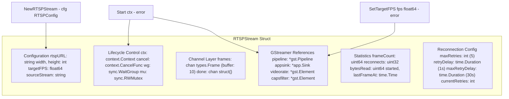
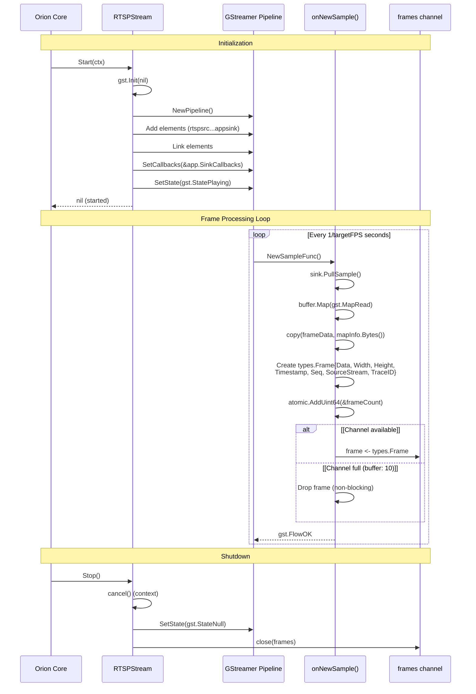
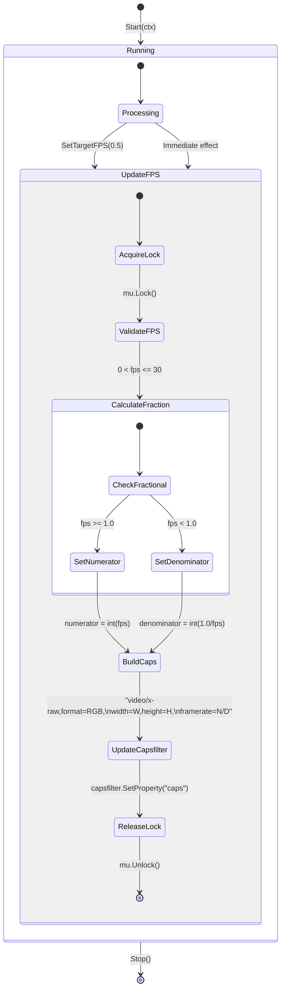

# Stream Providers

Relevant source files

- [internal/stream/rtsp.go](internal/stream/rtsp.go)

Stream providers are the input layer of the Orion service, responsible for capturing video frames from external sources and delivering them to the processing pipeline. This document covers the `StreamProvider` interface and its two implementations: `RTSPStream` for real RTSP camera streams and `MockStream` for testing.

For information about how frames are distributed to workers after capture, see [Frame Distribution](2.4-frame-distribution.md). For ROI processing applied to captured frames, see [ROI Attention System](#2.3-roi-attention-system).

**Sources:** [internal/stream/rtsp.go1-513](internal/stream/rtsp.go#L1-L513) [internal/stream/mock.go1-185](internal/stream/mock.go#L1-L185)

## StreamProvider Interface

Both stream implementations satisfy an implicit `StreamProvider` interface with the following contract:

|Method|Return Type|Purpose|
|---|---|---|
|`Start(ctx context.Context)`|`error`|Initialize and begin frame capture|
|`Frames()`|`<-chan types.Frame`|Return read-only channel for frame output|
|`Stop()`|`error`|Gracefully shutdown the stream|
|`Stats()`|`types.StreamStats`|Return current stream statistics|

The `RTSPStream` additionally provides `SetTargetFPS(fps float64) error` for hot-reload support of inference rate changes.

**Sources:** [internal/stream/rtsp.go145-170](internal/stream/rtsp.go#L145-L170) [internal/stream/rtsp.go426-428](internal/stream/rtsp.go#L426-L428) [internal/stream/rtsp.go431-482](internal/stream/rtsp.go#L431-L482) [internal/stream/rtsp.go485-512](internal/stream/rtsp.go#L485-L512) [internal/stream/mock.go45-66](internal/stream/mock.go#L45-L66) [internal/stream/mock.go69-71](internal/stream/mock.go#L69-L71) [internal/stream/mock.go74-98](internal/stream/mock.go#L74-L98) [internal/stream/mock.go101-125](internal/stream/mock.go#L101-L125)

## RTSPStream Architecture

### Component Structure




¿Querés que agregue más flechas (por ejemplo, GStreamer → Channels, o Stats actualizados desde el pipeline) para reflejar mejor el flujo real del código?

**RTSPStream Component Structure**

The `RTSPStream` struct maintains six categories of state:

1. **Configuration** - Stream parameters loaded from `RTSPConfig`
2. **GStreamer References** - Pointers to pipeline elements for hot-reload
3. **Channel Layer** - Frame output and shutdown signaling
4. **Lifecycle Control** - Context-based shutdown and mutex protection
5. **Statistics** - Atomic counters for monitoring
6. **Reconnection Config** - Exponential backoff parameters

**Sources:** [internal/stream/rtsp.go18-54](internal/stream/rtsp.go#L18-L54) [internal/stream/rtsp.go56-64](internal/stream/rtsp.go#L56-L64) [internal/stream/rtsp.go66-89](internal/stream/rtsp.go#L66-L89)

### GStreamer Pipeline

The RTSP stream uses a GStreamer pipeline for hardware-accelerated video decoding and frame rate control:

```mermaid
flowchart LR
  RTSP["rtspsrc<br/>location: rtspURL<br/>protocols: 4 (TCP)<br/>latency: 200ms"]
  Depay["rtph264depay<br/>H.264 RTP depayloader"]
  Decode["avdec_h264<br/>libav H.264 decoder"]
  Convert["videoconvert<br/>Format conversion"]
  Scale["videoscale<br/>Resolution scaling"]
  Rate["videorate<br/>drop-only: true<br/>skip-to-first: true"]
  Caps["capsfilter<br/>video/x-raw,format=RGB<br/>width=W, height=H<br/>framerate=N/D"]
  Sink["app.Sink<br/>sync: false<br/>max-buffers: 1<br/>drop: true"]
  OnNewSample["onNewSample()"]
  FrameChan["frames chan types.Frame"]

  RTSP -- "Dynamic pad-added" --> Depay
  Depay --> Decode --> Convert --> Scale --> Rate --> Caps --> Sink
  Sink -- "NewSampleFunc callback" --> OnNewSample
  OnNewSample --> FrameChan
```





**GStreamer Pipeline Structure**

The pipeline implements the following stages:

- **rtspsrc** - RTSP client configured for TCP transport (protocols=4) for go2rtc compatibility
- **rtph264depay** - Extracts H.264 frames from RTP packets
- **avdec_h264** - Hardware-accelerated H.264 decoding
- **videoconvert** - Converts to RGB format for Python workers
- **videoscale** - Scales to target resolution
- **videorate** - Frame rate limiter (drop-only mode, no frame duplication)
- **capsfilter** - Enforces output caps with framerate constraint
- **app.Sink** - Application sink with callback for frame extraction

**Sources:** [internal/stream/rtsp.go244-307](internal/stream/rtsp.go#L244-L307) [internal/stream/rtsp.go310-316](internal/stream/rtsp.go#L310-L316)

### Frame Capture Sequence




¿Querés que marque también quién incrementa `reconnects`/`lastFrameAt` y dónde se actualizan stats? Lo sumo como notas o mensajes internos.


**Frame Capture Flow**

Frame capture uses the `app.Sink` callback pattern from go-gst:

1. GStreamer invokes `NewSampleFunc` when a frame is available (at `targetFPS` rate)
2. `onNewSample()` pulls the sample using `sink.PullSample()`
3. Buffer is mapped to read bytes with `buffer.Map(gst.MapRead)`
4. Frame data is copied to prevent GStreamer from reusing the buffer
5. A `types.Frame` struct is created with metadata (seq, timestamp, trace ID)
6. Frame is sent to the channel (non-blocking - drops if full)
7. Callback returns `gst.FlowOK` to continue processing

**Sources:** [internal/stream/rtsp.go370-423](internal/stream/rtsp.go#L370-L423) [internal/stream/rtsp.go295-299](internal/stream/rtsp.go#L295-L299)

## Hot-Reload FPS Control

The `RTSPStream` supports runtime FPS changes without service restart:





**Hot-Reload State Machine**

The `SetTargetFPS()` method implements lock-free FPS updates:

1. **Acquire Lock** - Protects targetFPS and capsfilter reference
2. **Validate FPS** - Must be between 0.1 and 30 Hz
3. **Calculate Fraction** - Convert float to GStreamer framerate fraction
    - For fps >= 1.0: framerate = `fps/1` (e.g., 5.0 → 5/1)
    - For fps < 1.0: framerate = `1/(1/fps)` (e.g., 0.5 → 1/2)
4. **Update Capsfilter** - Set new caps on running pipeline element
5. **Release Lock** - No pipeline restart required

This approach provides **~2-second interruption** (time for GStreamer to adjust) versus a full restart which would take 5-10 seconds including reconnection.

**Sources:** [internal/stream/rtsp.go93-142](internal/stream/rtsp.go#L93-L142)

## Reconnection Logic

RTSPStream implements exponential backoff reconnection for network resilience:

|Parameter|Default Value|Purpose|
|---|---|---|
|`maxRetries`|5|Maximum consecutive reconnection attempts|
|`retryDelay`|1 second|Initial backoff delay|
|`maxRetryDelay`|30 seconds|Maximum backoff cap|
|`currentRetries`|0 (reset on success)|Attempt counter|

**Exponential Backoff Formula:**

```
delay = retryDelay * 2^(currentRetries-1)
delay = min(delay, maxRetryDelay)
```

**Retry Schedule:**

- Attempt 1: 1 second
- Attempt 2: 2 seconds
- Attempt 3: 4 seconds
- Attempt 4: 8 seconds
- Attempt 5: 16 seconds
- After 5 failures: Stream stops

The `runPipeline()` goroutine continuously calls `connectAndStream()` in a loop. On pipeline error, it increments `reconnects` and sleeps with exponential backoff. On successful `gst.StatePlaying` transition, `currentRetries` is reset to 0.

**Sources:** [internal/stream/rtsp.go173-228](internal/stream/rtsp.go#L173-L228) [internal/stream/rtsp.go231-366](internal/stream/rtsp.go#L231-L366) [internal/stream/rtsp.go354-363](internal/stream/rtsp.go#L354-L363)


## Frame Channel Buffering

Both stream providers use identical channel buffering strategies:

|Parameter|Value|Rationale|
|---|---|---|
|Channel buffer|10 frames|Absorbs temporary processing delays|
|Send behavior|Non-blocking|Drops frames rather than blocking pipeline|
|Channel capacity check|None|Always attempts send, relies on select default case|

```
// Non-blocking frame send (both RTSP and Mock)
select {
case s.frames <- frame:
    // Frame sent successfully
default:
    // Channel full - drop frame
    slog.Debug("dropping frame, channel full", "seq", frame.Seq)
}
```

This design prioritizes **real-time processing** over completeness. If downstream consumers (FrameBus, workers) cannot keep up, frames are dropped at the source rather than queuing indefinitely. This prevents memory growth and ensures the system always processes recent frames.

**Sources:** [interior/stream/rtsp.go410-420](interior/stream/rtsp.go#L410-L420) [internal/stream/mock.go145-154](internal/stream/mock.go#L145-L154)

## Statistics Tracking

Both providers implement `Stats()` returning `types.StreamStats`:

|Field|RTSPStream Source|MockStream Source|Purpose|
|---|---|---|---|
|`FrameCount`|`atomic.LoadUint64(&frameCount)`|`framesEmitted`|Total frames captured|
|`FPSTarget`|`int(targetFPS)`|`fps`|Configured frame rate|
|`FPSReal`|`frameCount / uptime`|`framesEmitted / uptime`|Actual measured FPS|
|`LatencyMS`|`time.Since(lastFrameAt)`|0|Time since last frame|
|`SourceStream`|`sourceStream`|`source`|Stream identifier (LQ/HQ)|
|`Resolution`|`fmt.Sprintf("%dx%d")`|`fmt.Sprintf("%dx%d")`|Frame dimensions|
|`Reconnects`|`atomic.LoadUint32(&reconnects)`|0|Reconnection count|
|`BytesRead`|`atomic.LoadUint64(&bytesRead)`|0|Total bytes processed|

The RTSPStream uses atomic operations for lock-free statistics updates from the GStreamer callback thread, while MockStream uses mutex-protected fields since all updates occur in the generator goroutine.

**Sources:** [internal/stream/rtsp.go485-512](internal/stream/rtsp.go#L485-L512) 