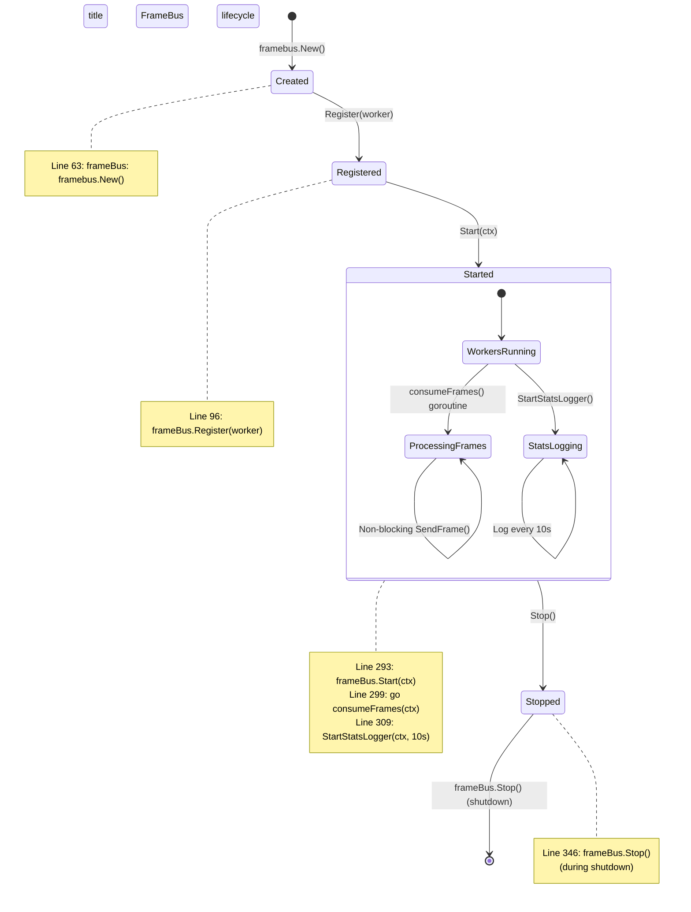
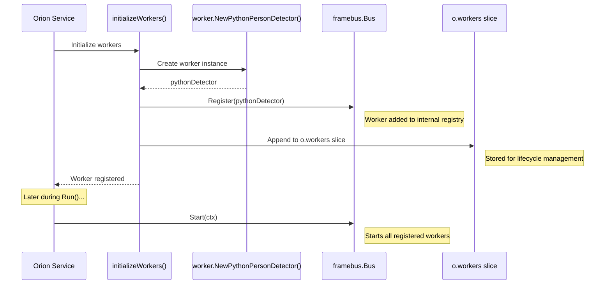
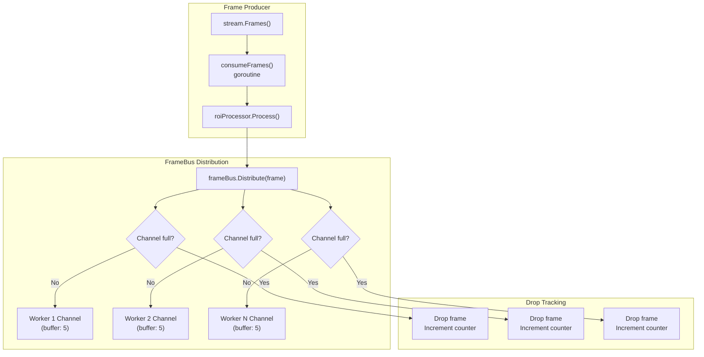
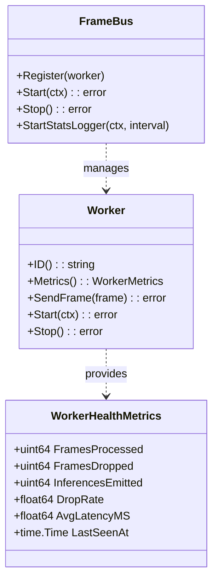
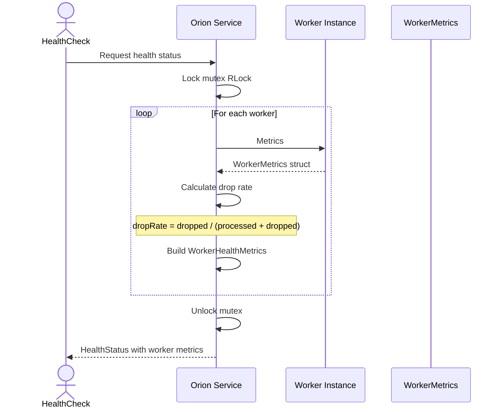
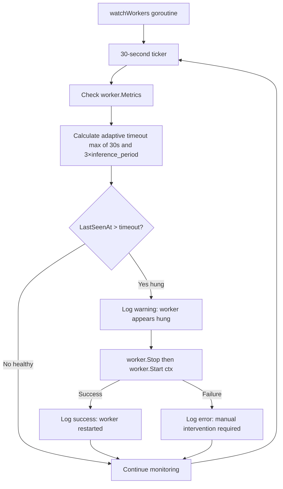
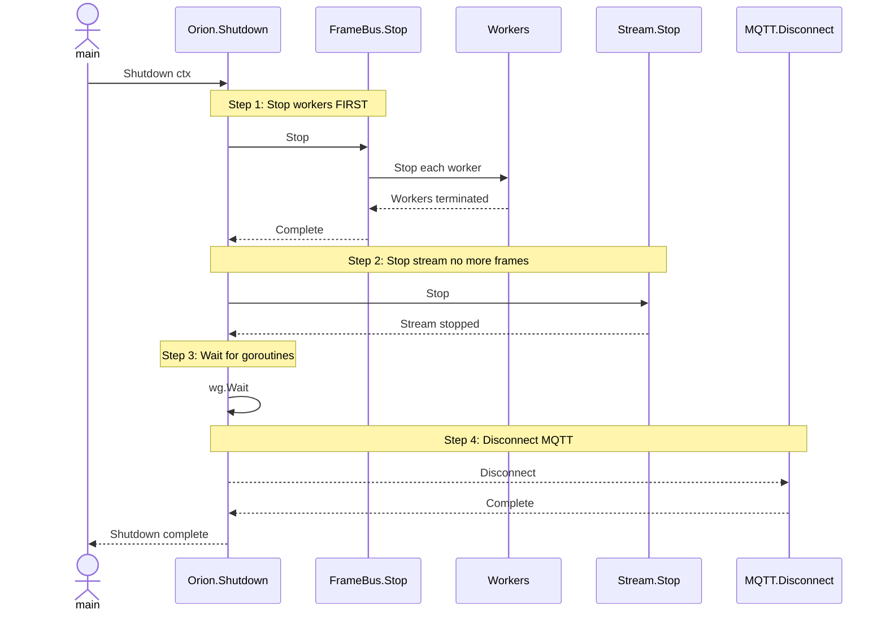

# Frame Distribution

Relevant source files

- [CLAUDE.md](CLAUDE.md)
- [internal/core/health.go](internal/core/health.go)
- [internal/core/orion.go](internal/core/orion.go)

## Purpose and Scope

The Frame Distribution system is responsible for distributing video frames from the ROI Processor to multiple inference workers using a non-blocking fan-out pattern. This document covers the `framebus.Bus` component, its registration mechanism, drop policy for backpressure management, and worker metrics collection.

For information about the ROI processing that precedes frame distribution, see [ROI Attention System](#2.3-roi-attention-system). For details on the Python worker bridge that receives distributed frames, see [Python Worker Bridge](2.5-python-worker-bridge.md).

## Architectural Position

The FrameBus sits between the ROI Processor and the Python inference workers in the processing pipeline:


```mermaid
flowchart LR
  Stream[Stream Provider - RTSP/Mock]
  Consumer[consumeFrames()<br/>goroutine]
  FrameBus[FrameBus<br/>(non-blocking fan-out)]
  Worker1[Python Worker 1<br/>person_detector.py]
  Worker2[Python Worker 2<br/>person_detector.py]
  WorkerN[Python Worker N<br/>person_detector.py]
  MQTT[MQTT Emitter]

  Stream -->|Frame channel<br/>(buffer: 10)| Consumer
  Consumer -> frame| FrameBus

  FrameBus -.-> |SendFrame()<br/>(non-blocking)| Worker1
  FrameBus -.-> |SendFrame()<br/>(non-blocking)| Worker2
  FrameBus -.-> |SendFrame()<br/>(non-blocking)| WorkerN

  Worker1 -->|Results channel| MQTT
  Worker2 -->|Results channel| MQTT
  WorkerN -->|Results channel| MQTT
```


**Sources:** [internal/core/orion.go1-499](internal/core/orion.go#L1-L499)

## Component Lifecycle

The FrameBus is initialized during Orion service creation and follows a strict lifecycle:




**Sources:** [internal/core/orion.go62-107](internal/core/orion.go#L62-L107) [internal/core/orion.go292-310](internal/core/orion.go#L292-L310) [internal/core/orion.go343-349](internal/core/orion.go#L343-L349)

## Worker Registration

Workers must implement the `types.InferenceWorker` interface and register with the FrameBus before it starts. The registration process is simple and happens during initialization:

### Registration Flow




### Registration Code Path

The registration occurs in `initializeWorkers()`:

|Step|Location|Action|
|---|---|---|
|1. Create worker|[internal/core/orion.go84-94](internal/core/orion.go#L84-L94)|`worker.NewPythonPersonDetector(config)`|
|2. Register with FrameBus|[internal/core/orion.go96](internal/core/orion.go#L96-L96)|`o.frameBus.Register(pythonDetector)`|
|3. Store in workers slice|[internal/core/orion.go97](internal/core/orion.go#L97-L97)|`o.workers = append(o.workers, pythonDetector)`|
|4. Log confirmation|[internal/core/orion.go104](internal/core/orion.go#L104-L104)|`slog.Info("workers initialized", "count", len(o.workers))`|

**Sources:** [internal/core/orion.go77-107](internal/core/orion.go#L77-L107)

## Non-Blocking Frame Distribution

The FrameBus implements a **non-blocking fan-out pattern** where frames are distributed to all registered workers without blocking the producer. If a worker cannot accept a frame immediately, the frame is dropped rather than queued.

### Distribution Pattern




### Non-Blocking Send Pattern

The distribution uses a `select` statement with a `default` case to implement non-blocking sends. The typical pattern is:

```
select {
case workerChannel <- frame:
    // Frame sent successfully
    atomic.AddUint64(&framesProcessed, 1)
default:
    // Channel full - drop frame
    atomic.AddUint64(&framesDropped, 1)
}
```

This pattern ensures:

- **Producer never blocks**: The `consumeFrames()` goroutine continues processing at stream rate
- **Real-time processing**: System maintains low latency by dropping old frames rather than queuing
- **Worker autonomy**: Each worker processes at its own pace without affecting others

**Sources:** [internal/core/orion.go298-303](internal/core/orion.go#L298-L303) [CLAUDE.md186-188](CLAUDE.md#L186-L188)

## Drop Policy and Backpressure Management

The FrameBus implements an **intentional frame drop policy** as a core architectural principle. This is a deliberate design choice to maintain real-time processing.

### Why Drop Frames?

|Queuing Approach|Drop Approach (Orion)|
|---|---|
|Frames accumulate in queues|Frames dropped when worker busy|
|Latency increases unbounded|Latency remains constant (~2s)|
|Memory usage grows|Memory usage constant|
|Processing stale frames|Always processing recent frames|
|System falls further behind|System maintains real-time|

### Drop Rate Calculation

Drop rates are calculated per-worker and tracked in health metrics:

```
dropRate = framesDropped / (framesProcessed + framesDropped)
```

This calculation occurs in the health check system:

**Sources:** [internal/core/health.go60-65](internal/core/health.go#L60-L65)

### Expected Drop Rates

Drop rates depend on the configured inference rate:

|Inference Rate|Stream FPS|Expected Drop Rate|Reason|
|---|---|---|---|
|1.0 Hz|30 FPS|~97%|Processing 1 frame per second, dropping 29|
|2.0 Hz|30 FPS|~93%|Processing 2 frames per second, dropping 28|
|5.0 Hz|30 FPS|~83%|Processing 5 frames per second, dropping 25|
|10.0 Hz|30 FPS|~67%|Processing 10 frames per second, dropping 20|

**High drop rates are normal and expected** - they indicate the system is maintaining real-time processing by discarding stale frames.

**Sources:** [CLAUDE.md277-280](CLAUDE.md#L277-L280)

## Worker Metrics and Monitoring

The FrameBus tracks detailed per-worker metrics that are exposed through the health check system and periodic stats logging.

### Tracked Metrics




### Metrics Collection Flow





**Sources:** [internal/core/health.go54-75](internal/core/health.go#L54-L75)

### Stats Logging

The FrameBus starts a periodic stats logger that outputs metrics every 10 seconds:

|Component|Location|Interval|
|---|---|---|
|Stats Logger Start|[internal/core/orion.go306-310](internal/core/orion.go#L306-L310)|10 seconds|
|Health Check Collection|[internal/core/health.go54-75](internal/core/health.go#L54-L75)|On-demand|

The stats logger runs in a dedicated goroutine and logs:

- Frames processed per worker
- Frames dropped per worker
- Drop rates
- Worker health status

**Sources:** [internal/core/orion.go306-310](internal/core/orion.go#L306-L310)

## Integration with Worker Watchdog

The FrameBus metrics feed into the worker health watchdog system, which uses the `LastSeenAt` timestamp to detect hung workers:




The watchdog relies on the `LastSeenAt` metric being updated by workers after each successful inference. If no updates occur within the adaptive timeout window, the worker is considered hung and automatically restarted.

**Sources:** [internal/core/orion.go391-454](internal/core/orion.go#L391-L454)

## Shutdown Sequence

During graceful shutdown, the FrameBus is stopped **before** the stream to ensure clean worker termination:




The shutdown order is critical:

1. **Workers first** - Prevents workers from trying to process frames from a stopped stream
2. **Stream second** - No more frames will be produced
3. **Goroutines** - Wait for `consumeFrames()` and other goroutines to exit
4. **MQTT last** - Disconnect after all processing is complete

**Sources:** [internal/core/orion.go332-389](internal/core/orion.go#L332-L389)

## Performance Characteristics

The FrameBus design optimizes for:

|Characteristic|Implementation|Benefit|
|---|---|---|
|**Low Latency**|Non-blocking sends|Producer never waits for slow consumers|
|**Real-time Processing**|Drop policy|Always processing recent frames, not stale backlog|
|**Constant Memory**|Fixed channel buffers|No unbounded queue growth|
|**Worker Isolation**|Independent channels|One slow worker doesn't affect others|
|**Observable**|Per-worker metrics|Easy to identify bottlenecks|

### Channel Buffer Sizing

Workers use a buffer size of 5 frames (inferred from Python worker configuration). This small buffer:

- Allows brief processing time variations
- Prevents excessive memory usage
- Maintains real-time processing (drops occur quickly if worker falls behind)

**Sources:** [internal/worker/person_detector_python.go](internal/worker/person_detector_python.go) (inferred), [CLAUDE.md85-87](CLAUDE.md#L85-L87)