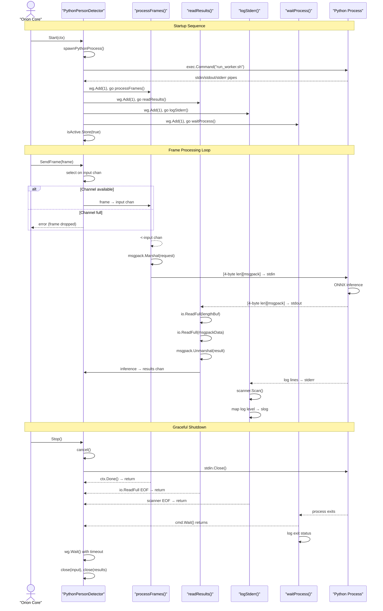
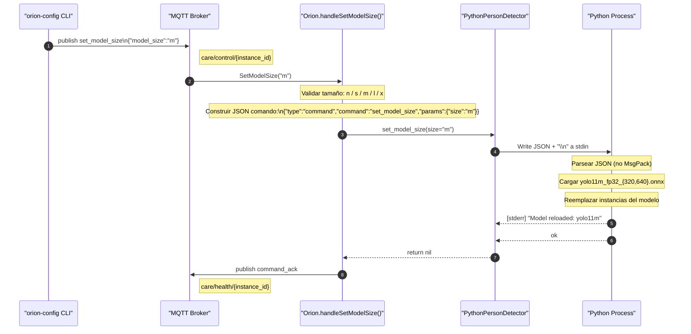

# Python Worker Bridge

Relevant source files

- [internal/worker/person_detector_python.go](internal/worker/person_detector_python.go)
- [tools/orion-config/commands/model.go](tools/orion-config/commands/model.go)

The Python Worker Bridge manages subprocess-based communication between the Go orchestrator and Python ONNX inference workers. It implements the `types.InferenceWorker` interface by spawning a Python process, marshaling frames via stdin using MsgPack with length-prefix framing, and unmarshaling inference results from stdout. The bridge handles backpressure through non-blocking channel sends with explicit frame dropping, supports hot-reload of ONNX models without process restart, and coordinates four goroutines for concurrent frame processing, result consumption, stderr logging, and process lifecycle management.

For the Python-side implementation of the inference worker, see [Person Detector](4.1-person-detector.md). For how frames are distributed to workers, see [Frame Distribution](2.4-frame-distribution.md). For worker health monitoring and auto-recovery, see [Service Orchestration](2.1-service-orchestration.md).

## Architecture Overview

The `PythonPersonDetector` struct implements a subprocess bridge with four goroutines orchestrating bidirectional communication with a Python process.

**Sources:** [internal/worker/person_detector_python.go225-259](internal/worker/person_detector_python.go#L225-L259) [internal/worker/person_detector_python.go339-376](internal/worker/person_detector_python.go#L339-L376)

## Communication Protocol

The bridge uses **MsgPack binary serialization with 4-byte length-prefix framing** for message boundary detection. This eliminates the need for base64 encoding (5x faster than JSON) and provides reliable framing over the stdin/stdout stream.

### Protocol Structure

### Frame Request Schema

The Go side constructs a MsgPack-encoded request with raw frame bytes (no base64):

|Field|Type|Description|
|---|---|---|
|`frame_data`|`[]byte`|Raw JPEG image bytes (MsgPack handles binary natively)|
|`width`|`int`|Frame width in pixels|
|`height`|`int`|Frame height in pixels|
|`meta.instance_id`|`string`|Orion instance identifier|
|`meta.room_id`|`string`|Room identifier|
|`meta.seq`|`uint64`|Frame sequence number|
|`meta.timestamp`|`string`|RFC3339Nano timestamp|
|`meta.roi_processing`|`object` (optional)|ROI metadata for multi-model selection|

**Sources:** [internal/worker/person_detector_python.go489-552](internal/worker/person_detector_python.go#L489-L552)

### Inference Result Schema

Python returns a MsgPack-encoded result:

|Field|Type|Description|
|---|---|---|
|`data.detections`|`array`|YOLO detection array with bboxes and confidences|
|`data.person_count`|`int`|Number of persons detected|
|`data.frame_seq`|`uint64`|Echoed frame sequence number|
|`data.metadata.roi_processing`|`object`|Echoed ROI metadata from request|
|`timing.total_ms`|`float64`|Total processing time|
|`timing.inference_ms`|`float64`|ONNX inference time|
|`timing.preprocessing_ms`|`float64`|Letterbox + normalization time|
|`timing.postprocessing_ms`|`float64`|NMS + ROI calculation time|
|`suggested_roi`|`object` (optional)|Suggested ROI for next frame (hybrid auto-focus)|

**Sources:** [internal/worker/person_detector_python.go554-702](internal/worker/person_detector_python.go#L554-L702)

## Goroutine Architecture

The worker spawns four goroutines with distinct responsibilities, coordinated via `sync.WaitGroup` and `context.Context`.




**Sources:** [internal/worker/person_detector_python.go339-439](internal/worker/person_detector_python.go#L339-L439) [internal/worker/person_detector_python.go441-485](internal/worker/person_detector_python.go#L441-L485) [internal/worker/person_detector_python.go554-702](internal/worker/person_detector_python.go#L554-L702) [internal/worker/person_detector_python.go706-740](internal/worker/person_detector_python.go#L706-L740) [internal/worker/person_detector_python.go743-777](internal/worker/person_detector_python.go#L743-L777)

### Goroutine Responsibilities

|Goroutine|Triggers|Blocking Operations|Exit Condition|
|---|---|---|---|
|`processFrames()`|`<-input` channel|`sendFrame()` with 2s timeout|`ctx.Done()` or input channel closed|
|`readResults()`|`io.ReadFull(stdout)`|Blocks on stdout until length-prefix available|`io.EOF` or `ctx.Done()`|
|`logStderr()`|`scanner.Scan(stderr)`|Blocks on stderr until newline|`scanner.Err()` or EOF|
|`waitProcess()`|N/A|`cmd.Wait()` until process exits|Process exit (any exit code)|

**Sources:** [internal/worker/person_detector_python.go441-485](internal/worker/person_detector_python.go#L441-L485) [internal/worker/person_detector_python.go554-702](internal/worker/person_detector_python.go#L554-L702) [internal/worker/person_detector_python.go706-740](internal/worker/person_detector_python.go#L706-L740) [internal/worker/person_detector_python.go743-777](internal/worker/person_detector_python.go#L743-L777)

## Worker Lifecycle

### Initialization: `NewPythonPersonDetector()`

Creates the worker struct with buffered channels and validates configuration. Does **not** start the subprocess.

```
// Channel capacities are critical for backpressure behavior
input:   make(chan types.Frame, 5)      // Small buffer, drop frames if worker slow
results: make(chan types.Inference, 10)  // Larger buffer, accumulate bursts
```

**Sources:** [internal/worker/person_detector_python.go272-305](internal/worker/person_detector_python.go#L272-L305)

### Startup: `Start(ctx)`

```mermaid
flowchart TD
  %% ===== Main flow =====
  Start[Start(ctx)] --> Check{isActive.Load()}

  Check -- true --> Error[return error]
  Check -- false --> RecreateChans[Recreate channels<br/>(essential for restart)]

  RecreateChans --> CreateCtx[ctx, cancel =<br/>context.WithCancel(ctx)]
  CreateCtx --> Spawn[spawnPythonProcess()]

  Spawn -- error --> Error
  Spawn -- success --> SetActive[isActive.Store(true)]

  SetActive --> InitLastSeen[lastSeenAt.Store(now)]
  InitLastSeen --> Launch1[wg.Add(1)<br/>go processFrames()]
  Launch1 --> Launch2[wg.Add(1)<br/>go logStderr()]
  Launch2 --> Return[return nil]

  %% ===== Detail: spawnPythonProcess() =====
  subgraph "spawnPythonProcess()"
    direction TB
    BuildArgs[Build args:<br/>--model, --confidence,<br/>--model-320 (if set)]
      --> ExecCmd[exec.CommandContext('run_worker.sh', args)]
      --> SetupPipes[Setup stdin/stdout/stderr pipes]
      --> CmdStart[cmd.Start()]
      --> SpawnReader[wg.Add(1)<br/>go readResults()]
      --> SpawnWaiter[wg.Add(1)<br/>go waitProcess()]
  end
```


**Critical Detail:** Channels are **recreated** on every `Start()` call, enabling auto-recovery restarts after worker crashes.

**Sources:** [internal/worker/person_detector_python.go339-376](internal/worker/person_detector_python.go#L339-L376) [internal/worker/person_detector_python.go379-439](internal/worker/person_detector_python.go#L379-L439)

### Shutdown: `Stop()`

```mermaid
flowchart TD
  %% ===== Stop flow =====
  Stop[Stop()] --> Check{isActive.Load()}

  %% If already inactive, just return
  Check -- false --> Return[return nil]

  %% If active, begin shutdown
  Check -- true --> SetInactive[isActive.Store(false)<br/>IMMEDIATELY]
  SetInactive --> CancelCtx[cancel()]
  CancelCtx --> CloseStdin[stdin.Close()]
  CloseStdin --> WaitGoroutines[wg.Wait() with<br/>2s timeout]

  %% Timeout fork
  WaitGoroutines --> Timeout{timeout?}
  Timeout -- yes --> Kill[cmd.Process.Kill()]
  Kill --> SafeCloseInput[safeClose(input)<br/>with panic recovery]

  Timeout -- no --> SafeCloseInput

  SafeCloseInput --> SafeCloseResults[safeClose(results)<br/>with panic recovery]
  SafeCloseResults --> Return
```

**Critical Details:**

- `isActive.Store(false)` happens **before** any channel operations to prevent double-close panics
- `safeClose()` uses `defer recover()` to handle concurrent close attempts
- 2-second timeout for graceful shutdown, then force kill

**Sources:** [internal/worker/person_detector_python.go827-902](internal/worker/person_detector_python.go#L827-L902)

## Backpressure & Error Handling

```mermaid
flowchart TD
  %% ===== SendFrame flow =====
  Send[SendFrame(frame)] --> Active{isActive.Load()}

  %% If inactive, drop immediately
  Active -- false --> Drop[default:<br/>framesDropped++<br/>return error]

  %% If active, try to enqueue
  Active -- true --> Sel{select on<br/>input chan}

  Sel -- available --> Ok[case w.input <- frame:<br/>return nil]
  Sel -- full --> Drop
```

### Non-Blocking SendFrame

The `SendFrame()` method implements **explicit frame dropping** rather than blocking:

**Rationale:** Frame dropping is acceptable in real-time video processing. Backpressure indicates the Python worker is slower than the frame rate, and queuing would only increase latency.

**Sources:** [internal/worker/person_detector_python.go313-336](internal/worker/person_detector_python.go#L313-L336)

### Stdin Write Timeout

The `sendFrame()` helper uses a 2-second timeout to detect hung Python processes:

```
select {
case err := <-writeErr:
    return err
case <-time.After(2 * time.Second):
    return fmt.Errorf("stdin write timeout (python worker may be hung)")
case <-w.ctx.Done():
    return fmt.Errorf("worker context cancelled during write")
}
```

If the timeout fires, the frame is dropped and an error is logged, but the worker **continues processing** subsequent frames. The health monitor (see [Service Orchestration](2.1-service-orchestration.md)) will detect the hung worker via `lastSeenAt` staleness and trigger auto-recovery.

**Sources:** [internal/worker/person_detector_python.go540-551](internal/worker/person_detector_python.go#L540-L551)

### Result Channel Overflow

The `readResults()` goroutine uses non-blocking sends to the results channel:

```
select {
case w.results <- inference:
    atomic.AddUint64(&w.inferenceCount, 1)
    w.lastSeenAt.Store(time.Now())
default:
    slog.Warn("dropping inference, results channel full", "worker_id", w.id)
}
```

If the MQTT emitter is slow to consume results, inferences are dropped to prevent memory accumulation.

**Sources:** [internal/worker/person_detector_python.go683-700](internal/worker/person_detector_python.go#L683-L700)

## Hot-Reload Mechanism

The `SetModelSize()` method enables **model hot-swap without process restart** by sending a JSON control command via stdin.

### Protocol Multiplexing

The Python worker expects two message types on stdin:

1. **Frame data:** MsgPack with length-prefix (4-byte `uint32`)
2. **Control commands:** JSON with newline terminator (`\n`)

The Python side distinguishes them by attempting to parse as JSON first, falling back to MsgPack if JSON parsing fails.

### Hot-Reload Flow



**Key Properties:**

- **No interruption** to frame processing during reload
- Python loads new model, swaps atomically, continues inference
- Models must exist on disk (`models/yolo11{size}_fp32_{320,640}.onnx`)
- Invalid size returns error **before** sending command

**Sources:** [internal/worker/person_detector_python.go904-946](internal/worker/person_detector_python.go#L904-L946) [tools/orion-config/commands/model.go10-76](tools/orion-config/commands/model.go#L10-L76)

## Metrics & Health Monitoring

### Atomic Counters

All metrics use atomic operations for lock-free updates from multiple goroutines:

```
type PythonPersonDetector struct {
    frameCount     uint64  // Total frames received via SendFrame()
    inferenceCount uint64  // Total inferences emitted to results channel
    totalLatencyMS uint64  // Cumulative inference latency for averaging
    framesDropped  uint64  // Frames dropped due to full input channel
    lastSeenAt     atomic.Value // time.Time of last inference
}
```

**Sources:** [internal/worker/person_detector_python.go249-255](internal/worker/person_detector_python.go#L249-L255)

### Metrics Snapshot

The `Metrics()` method returns a consistent snapshot:

```
func (w *PythonPersonDetector) Metrics() types.WorkerMetrics {
    framesProcessed := atomic.LoadUint64(&w.frameCount)
    framesDropped := atomic.LoadUint64(&w.framesDropped)
    inferencesEmitted := atomic.LoadUint64(&w.inferenceCount)
    totalLatencyMS := atomic.LoadUint64(&w.totalLatencyMS)
    
    var avgLatencyMS float64
    if inferencesEmitted > 0 {
        avgLatencyMS = float64(totalLatencyMS) / float64(inferencesEmitted)
    }
    
    return types.WorkerMetrics{
        FramesProcessed:   framesProcessed,
        FramesDropped:     framesDropped,
        InferencesEmitted: inferencesEmitted,
        AvgLatencyMS:      avgLatencyMS,
        LastSeenAt:        lastSeen,
    }
}
```

**Health Indicators:**

- **`LastSeenAt` staleness:** If `time.Since(lastSeenAt) > 10s`, worker is hung
- **High `FramesDropped` rate:** Worker slower than incoming frame rate
- **`AvgLatencyMS` spike:** Model size too large for hardware

**Sources:** [internal/worker/person_detector_python.go799-824](internal/worker/person_detector_python.go#L799-L824)

## Subprocess Execution

### Wrapper Script: `run_worker.sh`

The worker spawns Python via a shell wrapper rather than directly executing the Python binary:

```
exec.CommandContext(ctx, "models/run_worker.sh", args...)
```

**Responsibilities of `run_worker.sh`:**

1. Activate Python virtual environment
2. Set environment variables (e.g., `PYTHONUNBUFFERED=1`)
3. Execute `python models/person_detector.py` with arguments
4. Ensure proper signal propagation for graceful shutdown

**Sources:** [internal/worker/person_detector_python.go392-396](internal/worker/person_detector_python.go#L392-L396)

### Arguments Passed

|Argument|Example Value|Purpose|
|---|---|---|
|`--model`|`models/yolo11n_fp32_640.onnx`|Primary ONNX model path (640x640)|
|`--confidence`|`0.50`|Detection confidence threshold|
|`--model-320`|`models/yolo11n_fp32_320.onnx`|Secondary model for ROI attention (optional)|

If `--model-320` is provided, the Python worker enables **multi-model ROI attention**, selecting the model based on `meta.roi_processing.target_size` in each frame request.

**Sources:** [internal/worker/person_detector_python.go382-390](internal/worker/person_detector_python.go#L382-L390)

## Integration with ROI System

### ROI Metadata Flow

When the ROI processor (see [ROI Attention System](#2.3-roi-attention-system)) applies cropping or auto-focus, it attaches metadata to the frame:

```
frame.ROIProcessing = &types.ROIProcessingMetadata{
    TargetSize:       320,  // Tells Python which model to use
    CropApplied:      true,
    Source:           "auto_focus",
    AutoFocusEnabled: true,
    AttentionROIs:    [...],
    MergedROI:        &NormalizedRect{...},
}
```

The worker includes this in the MsgPack request:

```
meta["roi_processing"] = frame.ROIProcessing
```

Python **echoes this metadata back** in the result, and the worker reconstructs it for MQTT publishing.

**Sources:** [internal/worker/person_detector_python.go500-502](internal/worker/person_detector_python.go#L500-L502) [internal/worker/person_detector_python.go621-668](internal/worker/person_detector_python.go#L621-L668)

### Suggested ROI (Hybrid Auto-Focus)

Python can suggest an ROI for the **next frame** based on detection results:

```
# Python calculates bounding box around all detections
suggested_roi = {
    "x": 0.2, "y": 0.3, "width": 0.6, "height": 0.4
}
```

The Go worker extracts this and populates the `suggestedROI` field:

```
var suggestedROI *types.NormalizedRect
if suggestedData, ok := result["suggested_roi"].(map[string]interface{}); ok {
    suggestedROI = &types.NormalizedRect{
        X: suggestedData["x"].(float64),
        Y: suggestedData["y"].(float64),
        Width: suggestedData["width"].(float64),
        Height: suggestedData["height"].(float64),
    }
}
```

This feeds back into the ROI processor's priority system (priority tier 2: Python suggested ROIs).

**Sources:** [internal/worker/person_detector_python.go604-618](internal/worker/person_detector_python.go#L604-L618) [internal/worker/person_detector_python.go973-975](internal/worker/person_detector_python.go#L973-L975)

## Error Recovery Scenarios

|Failure Mode|Detection Method|Recovery Action|Handled By|
|---|---|---|---|
|Python process crash|`waitProcess()` logs error|Worker health check fails, auto-recovery restart|[Service Orchestration](2.1-service-orchestration.md) worker watchdog|
|Stdin write timeout|`sendFrame()` 2s timeout|Log error, drop frame, continue|Worker continues, frame dropped|
|JSON/MsgPack parse error|`json.Unmarshal()` / `msgpack.Unmarshal()` fails|Log error, skip message, continue|Worker continues, message dropped|
|Input channel full|`select default` on send|Increment `framesDropped`, return error|Caller (FrameBus) logs, continues|
|Results channel full|`select default` on send|Log warning, drop inference|Worker continues, inference dropped|
|Stop timeout (2s)|`select` on `wg.Wait()`|Force kill Python process|Worker forcibly terminates subprocess|
|Model file missing|Python startup failure|`cmd.Start()` returns error|`Start()` returns error to caller|

**Sources:** [internal/worker/person_detector_python.go473-482](internal/worker/person_detector_python.go#L473-L482) [internal/worker/person_detector_python.go540-551](internal/worker/person_detector_python.go#L540-L551) [internal/worker/person_detector_python.go595-601](internal/worker/person_detector_python.go#L595-L601) [internal/worker/person_detector_python.go697-699](internal/worker/person_detector_python.go#L697-L699) [internal/worker/person_detector_python.go855-870](internal/worker/person_detector_python.go#L855-L870)