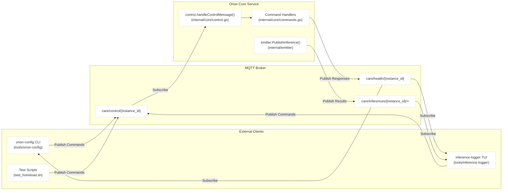
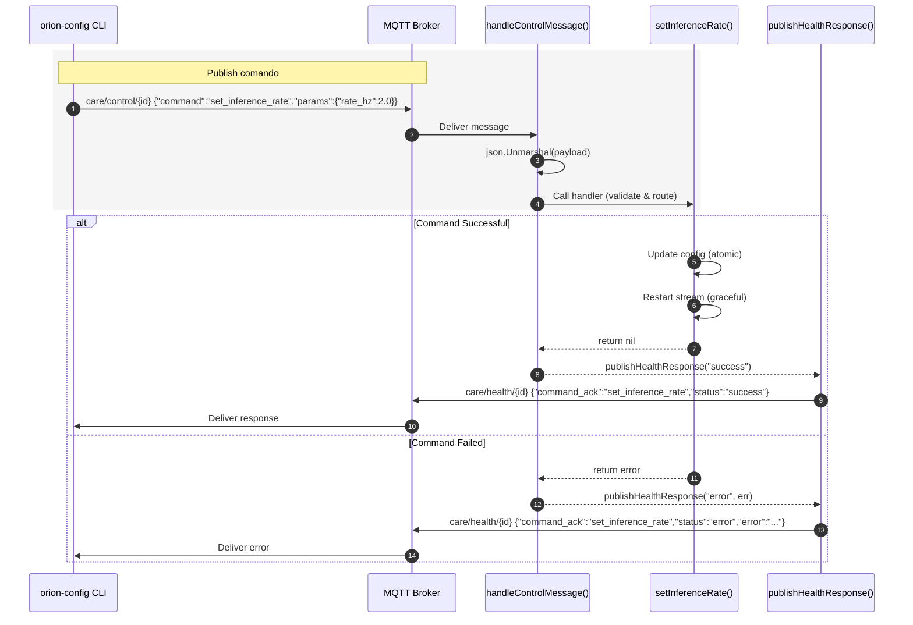
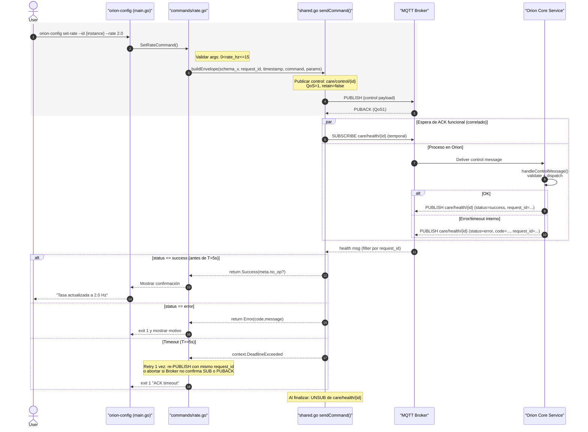
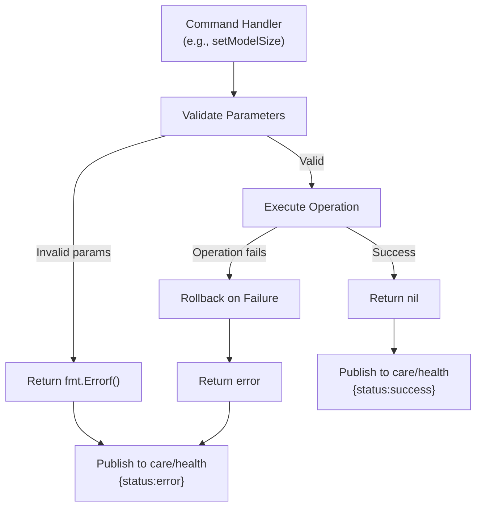

# MQTT Control Plane

Relevant source files

- [internal/core/commands.go](internal/core/commands.go)
- [models/download_models.sh](models/download_models.sh)
- [test_broadcast.sh](test_broadcast.sh)
- [tools/orion-config/commands/broadcast.go](tools/orion-config/commands/broadcast.go)
- [tools/test_hotreload.sh](tools/test_hotreload.sh)

The MQTT Control Plane provides runtime configuration and monitoring for the Orion service through a publish-subscribe message bus. This architecture enables external tools (`orion-config`, `inference-logger`, test scripts) to interact with a running Orion instance without requiring service restarts or direct API access. The control plane handles command dispatch, status reporting, and inference result streaming.

For detailed information about message schemas and topic structure, see [Topic Structure](3.1-topic-structure.md). For a complete reference of available commands, see [Command Reference](3.2-command-reference.md). For implementation details of hot-reload mechanisms, see [Hot-Reload Mechanisms](3.3-hot-reload-mechanisms.md).

## Architecture Overview

The MQTT control plane implements a **command-response pattern** over three distinct topic hierarchies. Commands flow from external clients to the Orion service via the `care/control/{instance_id}` topic. The service publishes responses to the `care/health/{instance_id}` topic and streams inference results to `care/inferences/{instance_id}/+`.




**Sources:** [internal/core/commands.go1-487](internal/core/commands.go#L1-L487) [tools/orion-config/commands/broadcast.go1-607](tools/orion-config/commands/broadcast.go#L1-L607) [tools/test_hotreload.sh1-114](tools/test_hotreload.sh#L1-L114)

## Communication Patterns

The control plane supports three primary communication patterns:

|Pattern|Description|Example|
|---|---|---|
|**Command-Response**|Client sends command, service responds with acknowledgment|`set_inference_rate` → `command_ack`|
|**Query-Response**|Client requests data, service responds with payload|`get_status` → status data|
|**Stream**|Service continuously publishes events|Inference results on `care/inferences`|

### Command-Response Flow





**Sources:** [internal/core/commands.go151-208](internal/core/commands.go#L151-L208)

### Message Structure

All MQTT messages use JSON encoding. Command messages follow this schema:

```
{
  "command": "command_name",
  "params": {
    "param1": "value1",
    "param2": 123
  }
}
```

Response messages follow this schema:

```
{
  "command_ack": "command_name",
  "status": "success|error",
  "data": {...},
  "error": "error message if status=error"
}
```

**Sources:** [tools/test_hotreload.sh31-75](tools/test_hotreload.sh#L31-L75)

## Command Processing Pipeline

The Orion service processes MQTT commands through a centralized handler that dispatches to specialized command implementations. The handler provides error handling, logging, and response publishing.

```mermaid
flowchart TB
  subgraph Control Message Handler
    S[Subscribe to<br/>care/control/{instance_id}]
    P[json.Unmarshal()<br/>validate envelope:<br/>schema_v, request_id, command, params]
    D[Dispatch by command]

    S --> P --> D
  end

  subgraph Command Handlers (commands.go)
    GS[getStatus()]
    SR[setInferenceRate(rate_hz)]
    SM[setModelSize(size)]
    ROI[setAttentionROIs(rois)]
    PR[pauseInference() / resumeInference()]
    SD[shutdownViaControl()]
    AF[setAutoFocusStrategy() / enableAutoFocus()]
    BC[Broadcast commands]
  end

  D -->|get_status| GS
  D -->|set_inference_rate| SR
  D -->|set_model_size| SM
  D -->|set_attention_rois| ROI
  D -->|pause/resume| PR
  D -->|shutdown| SD
  D -->|autofocus| AF
  D -->|broadcast_*| BC

  subgraph Service Components
    ST[stream.SetTargetFPS()<br/>stream.Stop()<br/>stream.Start()]
    WK[worker.SetModelSize()]
    RP[roiProcessor.SetAttentionROIs()]
    CT[cancelCtx()]
  end

  %% Success paths
  SR -->|atomic config update| ST
  SM --> WK
  ROI --> RP
  SD --> CT

  %% Health / Ack
  P -. on any parse/validate error .-> HERR[/publishHealthResponse("error", details)/]
  GS -.-> HS[/publishHealthResponse("success", data)/]
  SR -.-> HOK[/publishHealthResponse("success")/]
  SM -.-> HOK
  ROI -.-> HOK
  PR -.-> HOK
  SD -.-> HOK
  AF -.-> HOK
  BC -.-> HOK

  %% Topics
  HOK -->|care/health/{instance_id}<br/>QoS 0| CLI[(orion-config CLI)]
  HERR -->|care/health/{instance_id}<br/>QoS 0| CLI


```

**Sources:** [internal/core/commands.go14-92](internal/core/commands.go#L14-L92) [internal/core/commands.go151-208](internal/core/commands.go#L151-L208) [internal/core/commands.go210-266](internal/core/commands.go#L210-L266) [internal/core/commands.go289-326](internal/core/commands.go#L289-L326)

## Topic Hierarchy

The control plane uses a three-tier topic hierarchy based on instance ID, enabling multi-instance deployments where multiple Orion services operate independently on the same MQTT broker.

|Topic Pattern|Direction|Purpose|QoS|
|---|---|---|---|
|`care/control/{instance_id}`|Client → Service|Command delivery|1|
|`care/health/{instance_id}`|Service → Client|Status and acknowledgments|1|
|`care/inferences/{instance_id}/+`|Service → Client|Inference result stream|0|

The `{instance_id}` variable is configured in `config/orion.yaml` and defaults to `orion-test-001`. The wildcard `+` in the inferences topic allows for future expansion (e.g., different model types).

**Sources:** [tools/test_hotreload.sh6-17](tools/test_hotreload.sh#L6-L17) [test_broadcast.sh8-16](test_broadcast.sh#L8-L16)

## Client Integration

External tools interact with the control plane by establishing MQTT client connections and publishing to control topics. The typical client workflow is:

1. Connect to MQTT broker (default: `localhost:1883`)
2. Subscribe to `care/health/{instance_id}` to receive responses
3. Publish command to `care/control/{instance_id}`
4. Wait for acknowledgment on health topic
5. Optionally subscribe to `care/inferences/{instance_id}/+` for result streaming

### Example: orion-config CLI

The `orion-config` tool demonstrates client integration:




**Sources:** [tools/orion-config/commands/broadcast.go428-510](tools/orion-config/commands/broadcast.go#L428-L510)

### Example: Test Scripts

Shell-based test scripts use `mosquitto_pub` for direct MQTT command injection:

```
# From test_hotreload.sh
mosquitto_pub -h localhost -p 1883 \
  -t "care/control/orion-test-001" \
  -m '{"command":"set_inference_rate","params":{"rate_hz":2.0}}'
```

This pattern enables rapid testing and debugging of command handlers without requiring compiled tools.

**Sources:** [tools/test_hotreload.sh31-36](tools/test_hotreload.sh#L31-L36)

## State Management

The Orion service maintains mutable state that MQTT commands can modify. State updates are protected by a read-write mutex (`o.mu`) to ensure thread safety during concurrent command processing.

|State Category|Protection Mechanism|Update Method|
|---|---|---|
|Configuration (`o.cfg`)|`sync.RWMutex`|Lock → Modify → Unlock|
|Inference pause flag (`o.isPaused`)|`sync.RWMutex`|`pauseInference()` / `resumeInference()`|
|ROI processor state|Internal mutex in `roiProcessor`|Method calls (thread-safe)|
|Worker state|Worker-specific locking|`worker.SetModelSize()`|

The mutex pattern ensures that `get_status` queries return consistent snapshots even while other commands are modifying state.

**Sources:** [internal/core/commands.go95-125](internal/core/commands.go#L95-L125) [internal/core/commands.go151-208](internal/core/commands.go#L151-L208)

## Error Handling

Command handlers return errors through the Go error interface. The control message handler translates these errors into MQTT health responses:





Example error handling from `setModelSize`:

[internal/core/commands.go210-266](internal/core/commands.go#L210-L266) - If model hot-swap fails, the handler rolls back configuration changes before returning the error:

```
if err := pythonWorker.SetModelSize(size); err != nil {
    // Rollback config changes
    if o.cfg.Models.PersonDetector != nil {
        o.cfg.Models.PersonDetector.Size = oldSize
        o.cfg.Models.PersonDetector.ModelPath = oldPath
    }
    return err
}
```

**Sources:** [internal/core/commands.go247-259](internal/core/commands.go#L247-L259)

## Performance Characteristics

The MQTT control plane introduces minimal overhead to the inference pipeline:

- **Command latency**: ~10-50ms (network + broker + handler)
- **Health response latency**: ~20-100ms (includes `get_status` aggregation)
- **Inference stream throughput**: No overhead (separate topic, QoS 0)

Commands that modify state (e.g., `set_inference_rate`) may cause temporary pipeline interruptions as documented in [Hot-Reload Mechanisms](3.3-hot-reload-mechanisms.md).

**Sources:** [internal/core/commands.go160-198](internal/core/commands.go#L160-L198)