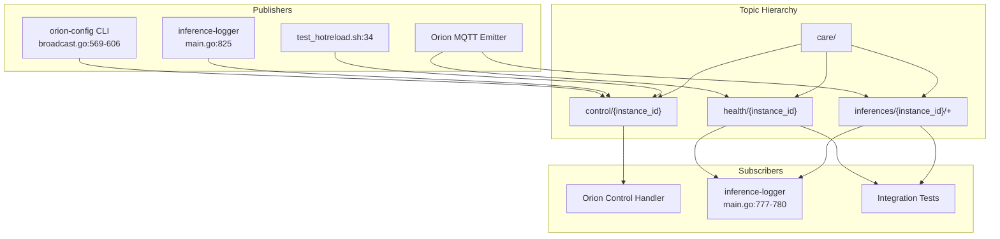
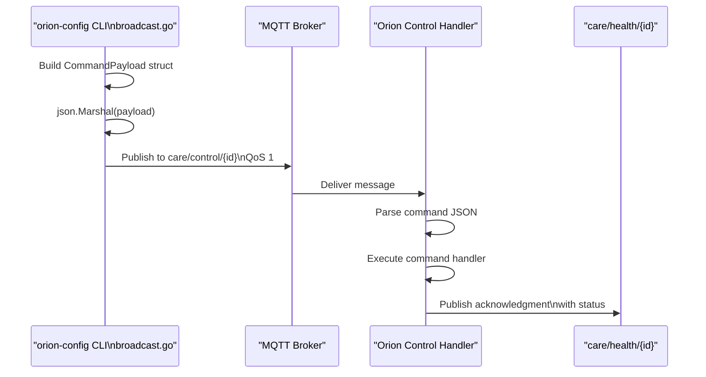
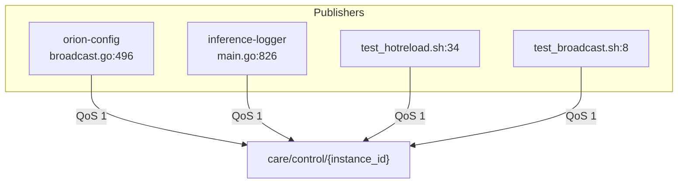
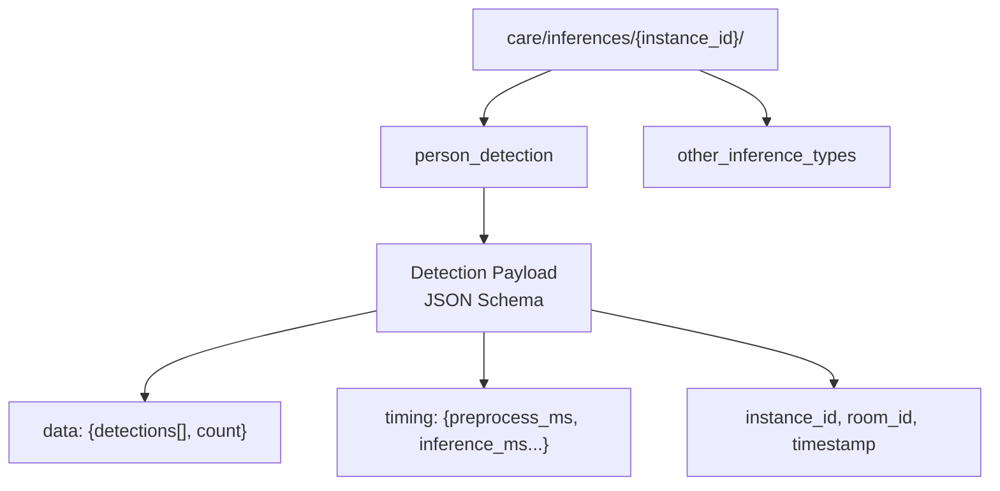
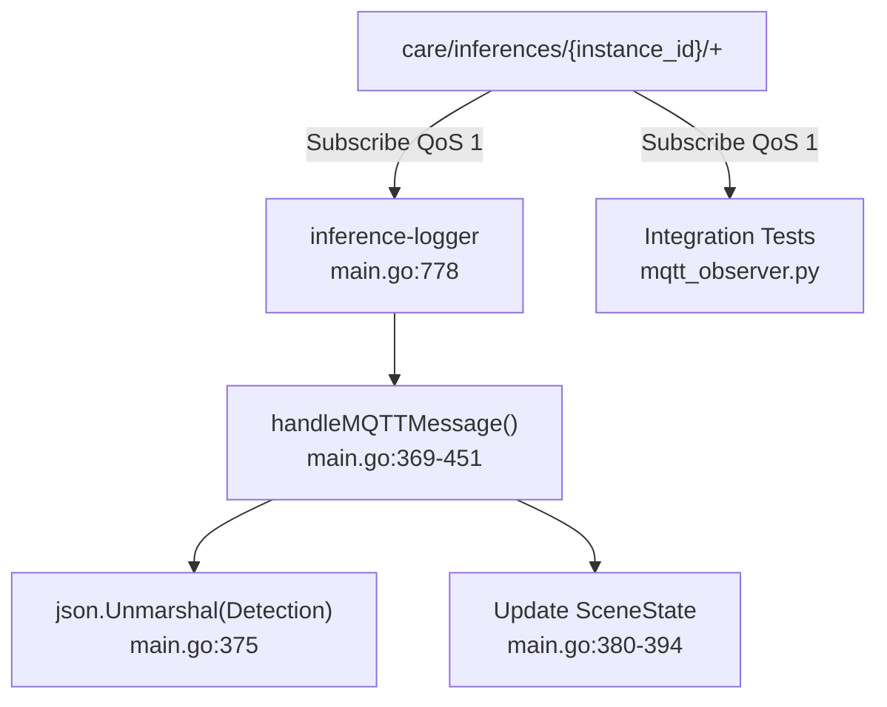
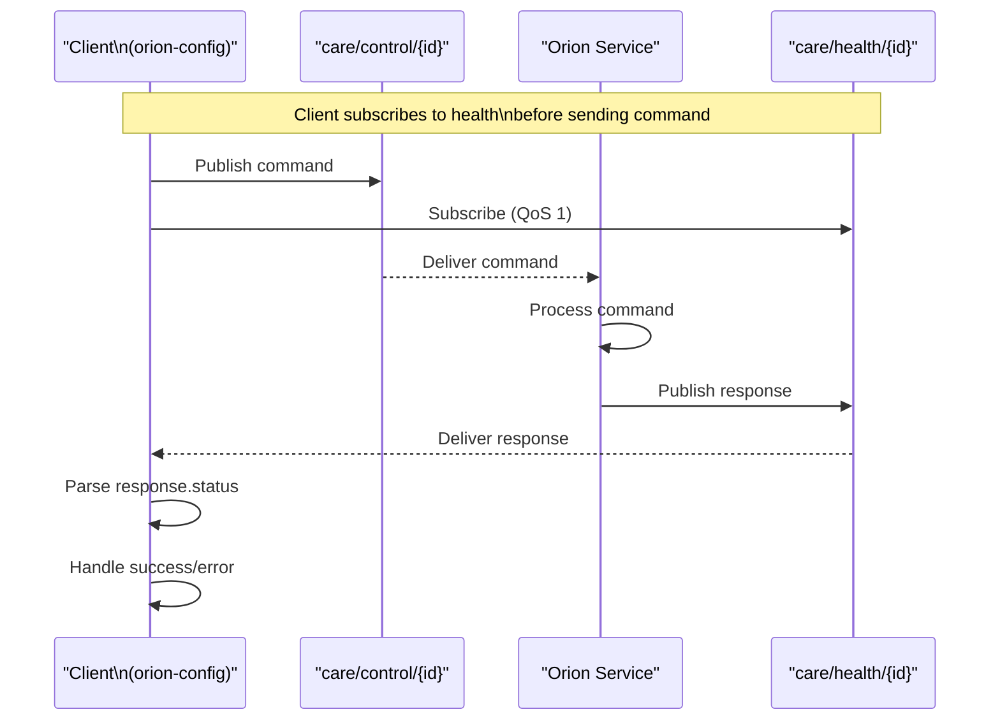
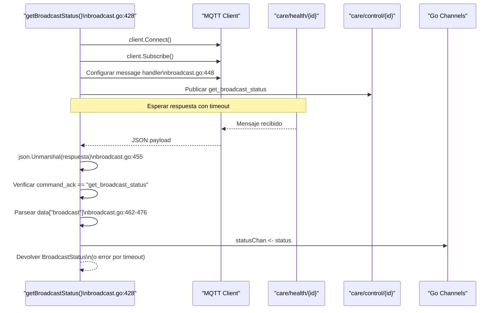
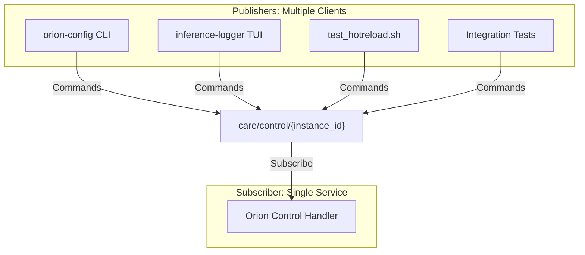

# Topic Structure

Relevant source files

- [test_broadcast.sh](test_broadcast.sh)
- [tools/inference-logger/BUBBLETEA_BEST_PRACTICES 1.md](tools/inference-logger/BUBBLETEA_BEST_PRACTICES%201.md)
- [tools/inference-logger/main.go](tools/inference-logger/main.go)
- [tools/orion-config/commands/broadcast.go](tools/orion-config/commands/broadcast.go)
- [tools/test_hotreload.sh](tools/test_hotreload.sh)

## Purpose and Scope

This document details the MQTT topic hierarchy used by care-orion for runtime control, inference result distribution, and service health monitoring. The system uses three primary topic families: `care/control/{instance_id}` for command dispatch, `care/inferences/{instance_id}/+` for inference result streaming, and `care/health/{instance_id}` for command acknowledgments and status reporting.

For information about the specific commands available, see [Command Reference](3.2-command-reference.md). For the hot-reload mechanisms that use these topics, see [Hot-Reload Mechanisms](3.3-hot-reload-mechanisms.md).

---

## Topic Hierarchy Overview

The care-orion MQTT control plane is organized into three distinct topic hierarchies, each serving a specific communication pattern.

### Topic Structure Diagram

**Sources:** [tools/orion-config/commands/broadcast.go495](tools/orion-config/commands/broadcast.go#L495-L495) [tools/inference-logger/main.go777-800](tools/inference-logger/main.go#L777-L800) [tools/test_hotreload.sh7](tools/test_hotreload.sh#L7-L7)

### Topic Hierarchy Table




|Topic Pattern|Direction|QoS|Purpose|Retained|
|---|---|---|---|---|
|`care/control/{instance_id}`|→ Orion|1|Command dispatch from external tools|No|
|`care/inferences/{instance_id}/{type}`|← Orion|1|Inference results streaming|No|
|`care/health/{instance_id}`|← Orion|1|Command acknowledgments and status|No|

**Sources:** [tools/inference-logger/main.go777-780](tools/inference-logger/main.go#L777-L780)

---

## Control Topic: `care/control/{instance_id}`

The control topic receives JSON-encoded commands from external tools to modify Orion runtime behavior. All commands follow a standardized payload structure.

### Control Message Flow Diagram



**Sources:** [tools/orion-config/commands/broadcast.go486-499](tools/orion-config/commands/broadcast.go#L486-L499) [tools/test_hotreload.sh31-36](tools/test_hotreload.sh#L31-L36)

### Command Payload Schema

The `CommandPayload` structure is used by all clients publishing to the control topic:

```
// From broadcast.go (implied structure)
type CommandPayload struct {
    Command string                 `json:"command"`
    Params  map[string]interface{} `json:"params,omitempty"`
}
```

**Examples from test scripts:**

|Command|Params|File Reference|
|---|---|---|
|`set_inference_rate`|`{"rate_hz": 2.0}`|[test_hotreload.sh31](test_hotreload.sh#L31-L31)|
|`set_model_size`|`{"size": "s"}`|[test_hotreload.sh57](test_hotreload.sh#L57-L57)|
|`start_broadcast`|`{"rtmp_url": "...", "filter": "edgetv", "overlay_mode": "box"}`|[broadcast.go569-578](broadcast.go#L569-L578)|
|`get_broadcast_status`|`{}`|[broadcast.go486-488](broadcast.go#L486-L488)|
|`shutdown`|`{}`|[inference-logger/main.go310](inference-logger/main.go#L310-L310)|

**Sources:** [tools/orion-config/commands/broadcast.go486-499](tools/orion-config/commands/broadcast.go#L486-L499) [tools/test_hotreload.sh31-100](tools/test_hotreload.sh#L31-L100) [tools/inference-logger/main.go813-822](tools/inference-logger/main.go#L813-L822)

### Control Topic Publishers

Multiple clients can publish to the same control topic simultaneously:




**Sources:** [tools/orion-config/commands/broadcast.go495-499](tools/orion-config/commands/broadcast.go#L495-L499) [tools/inference-logger/main.go825-827](tools/inference-logger/main.go#L825-L827) [tools/test_hotreload.sh34](tools/test_hotreload.sh#L34-L34) [test_broadcast.sh8](test_broadcast.sh#L8-L8)

---

## Inference Topic: `care/inferences/{instance_id}/+`

The inference topic hierarchy streams real-time detection results from Orion to monitoring clients. The `+` wildcard allows subscribing to all inference types for an instance.

### Inference Topic Structure




**Sources:** [tools/inference-logger/main.go372-406](tools/inference-logger/main.go#L372-L406)

### Detection Message Schema

The `Detection` struct defines the inference result format:

```
// From inference-logger/main.go:79-102
type Detection struct {
    InstanceID    string `json:"instance_id"`
    RoomID        string `json:"room_id"`
    InferenceType string `json:"inference_type"`
    Timestamp     string `json:"timestamp"`
    Data          struct {
        Detections []struct {
            BBox struct {
                X      int `json:"x"`
                Y      int `json:"y"`
                Width  int `json:"width"`
                Height int `json:"height"`
            } `json:"bbox"`
            Confidence float64 `json:"confidence"`
        } `json:"detections"`
        Count int `json:"count"`
    } `json:"data"`
    Timing struct {
        PreprocessMS  float64 `json:"preprocess_ms"`
        InferenceMS   float64 `json:"inference_ms"`
        PostprocessMS float64 `json:"postprocess_ms"`
        TotalMS       float64 `json:"total_ms"`
    } `json:"timing"`
}
```

**Sources:** [tools/inference-logger/main.go79-102](tools/inference-logger/main.go#L79-L102)

### Inference Topic Subscribers



**Sources:** [tools/inference-logger/main.go778](tools/inference-logger/main.go#L778-L778) [tools/inference-logger/main.go369-406](tools/inference-logger/main.go#L369-L406)

---

## Health Topic: `care/health/{instance_id}`

The health topic provides bidirectional status communication. Orion publishes command acknowledgments and status updates, while clients subscribe to receive confirmations.

### Health Message Flow Diagram



**Sources:** [tools/orion-config/commands/broadcast.go446-509](tools/orion-config/commands/broadcast.go#L446-L509)

### Response Message Schema

The `Response` struct defines the health/status message format:

```
// From inference-logger/main.go:112-118
type Response struct {
    CommandAck string                 `json:"command_ack"`
    Status     string                 `json:"status"`
    Data       map[string]interface{} `json:"data,omitempty"`
    Error      string                 `json:"error,omitempty"`
    Timestamp  string                 `json:"timestamp"`
}
```

**Response Status Values:**

|Status|Meaning|Example Use Case|
|---|---|---|
|`success`|Command executed successfully|[inference-logger/main.go419](inference-logger/main.go#L419-L419)|
|`error`|Command failed|[inference-logger/main.go414-416](inference-logger/main.go#L414-L416)|
|`paused`|Inference is paused|[inference-logger/main.go418](inference-logger/main.go#L418-L418)|

**Sources:** [tools/inference-logger/main.go112-118](tools/inference-logger/main.go#L112-L118) [tools/inference-logger/main.go409-450](tools/inference-logger/main.go#L409-L450)

### Health Topic Request-Response Pattern

The `getBroadcastStatus` function demonstrates the request-response pattern over health topic:




**Sources:** [tools/orion-config/commands/broadcast.go428-510](tools/orion-config/commands/broadcast.go#L428-L510)

### BroadcastStatus Data Structure

The health topic can carry complex nested data structures in the `Data` field:

```
// From broadcast.go:13-21
type BroadcastStatus struct {
    Running       bool   `json:"running"`
    Filter        string `json:"filter"`
    OverlayMode   string `json:"overlay_mode"`
    RTMPURL       string `json:"rtmp_url"`
    Architecture  string `json:"architecture"`
    FramesProcessed uint64 `json:"frames_processed"`
    FramesDropped   uint64 `json:"frames_dropped"`
}
```

This structure is extracted from the response `Data` map at [broadcast.go462-476](broadcast.go#L462-L476)

**Sources:** [tools/orion-config/commands/broadcast.go13-21](tools/orion-config/commands/broadcast.go#L13-L21) [tools/orion-config/commands/broadcast.go462-476](tools/orion-config/commands/broadcast.go#L462-L476)

---

## Pub/Sub Patterns

The care-orion MQTT architecture implements several distinct publish-subscribe patterns.

### Multi-Publisher, Single-Subscriber (Control Topic)



**Sources:** [tools/orion-config/commands/broadcast.go495-499](tools/orion-config/commands/broadcast.go#L495-L499) [tools/inference-logger/main.go825-827](tools/inference-logger/main.go#L825-L827) [tools/test_hotreload.sh34](tools/test_hotreload.sh#L34-L34)

### Single-Publisher, Multi-Subscriber (Inference Topic)


**Sources:** [tools/inference-logger/main.go778](tools/inference-logger/main.go#L778-L778)

### Request-Response Pattern (Control + Health Topics)

This pattern uses two topics to implement synchronous-like request-response over MQTT:

```mermaid
flowchart TD
  subgraph Req["Request Phase"]
    C1[Client]
    PUB[Publish to<br/>care/control/{id}]
  end

  subgraph Orion["Orion Service"]
    HND[Command Handler]
    RESP[Response Publisher]
  end

  subgraph Resp["Response Phase"]
    SUB[Subscribe to<br/>care/health/{id}]
    C2[Client<br/>(same instance)]
  end

  %% Flujo principal
  C1 --> PUB --> HND --> RESP --> SUB --> C2

  %% Regla operativa
  C1 -. Must subscribe<br/>before publishing .-> C2

```

**Implementation Pattern:**

1. Client subscribes to `care/health/{instance_id}` with message handler ([broadcast.go446-479](broadcast.go#L446-L479))
2. Client publishes command to `care/control/{instance_id}` ([broadcast.go495-499](broadcast.go#L495-L499))
3. Client waits with timeout on response channel ([broadcast.go502-509](broadcast.go#L502-L509))
4. Orion processes command and publishes acknowledgment to health topic
5. Client's message handler receives response, parses it, and sends to channel

**Sources:** [tools/orion-config/commands/broadcast.go428-510](tools/orion-config/commands/broadcast.go#L428-L510)

---

## Topic Naming Conventions

The topic structure follows consistent naming patterns:

### Instance ID Pattern

All topics include `{instance_id}` to support multiple Orion instances:

- **Default instance ID:** `orion-test-001` ([test_hotreload.sh6](test_hotreload.sh#L6-L6) [test_broadcast.sh8](test_broadcast.sh#L8-L8))
- **CLI override:** `inference-logger {instance_id}` ([inference-logger/main.go849-852](inference-logger/main.go#L849-L852))
- **Test scripts:** Hardcoded or environment variable

### Wildcard Usage

The `+` single-level wildcard is used for inference type subscription:

- Pattern: `care/inferences/{instance_id}/+` ([inference-logger/main.go778](inference-logger/main.go#L778-L778))
- Matches: `care/inferences/orion-test-001/person_detection`
- Does not match: `care/inferences/orion-test-001/group/person` (multi-level)

**Sources:** [tools/inference-logger/main.go778](tools/inference-logger/main.go#L778-L778) [tools/test_hotreload.sh6](tools/test_hotreload.sh#L6-L6) [test_broadcast.sh8](test_broadcast.sh#L8-L8)

---

## Message Encoding and QoS

### JSON Encoding

All messages use JSON encoding with `application/json` implicit content type:

```
// Command encoding (broadcast.go:490-492)
jsonPayload, err := json.Marshal(payload)
client.Publish(controlTopic, 1, false, jsonPayload)

// Response decoding (broadcast.go:455-457)
var response struct {
    CommandAck string                 `json:"command_ack"`
    Status     string                 `json:"status"`
    Data       map[string]interface{} `json:"data"`
}
json.Unmarshal(msg.Payload(), &response)
```

**Sources:** [tools/orion-config/commands/broadcast.go490-499](tools/orion-config/commands/broadcast.go#L490-L499) [tools/orion-config/commands/broadcast.go455-457](tools/orion-config/commands/broadcast.go#L455-L457)

### Quality of Service (QoS)

All topics use **QoS 1** (at least once delivery):

|Topic|QoS Level|Reason|
|---|---|---|
|`care/control/{id}`|1|Ensure command delivery|
|`care/inferences/{id}/+`|1|Ensure detection delivery for logging|
|`care/health/{id}`|1|Ensure acknowledgment delivery|

**No retained messages:** All topics use `retained: false` to avoid stale data ([broadcast.go496](broadcast.go#L496-L496) [inference-logger/main.go826](inference-logger/main.go#L826-L826))

**Sources:** [tools/orion-config/commands/broadcast.go496](tools/orion-config/commands/broadcast.go#L496-L496) [tools/inference-logger/main.go784](tools/inference-logger/main.go#L784-L784) [tools/inference-logger/main.go826](tools/inference-logger/main.go#L826-L826)

---

## Connection Management

### Client ID Patterns

MQTT clients use timestamped client IDs to ensure uniqueness:

```
// orion-config pattern (broadcast.go:436)
clientID := fmt.Sprintf("orion-config-broadcast-%d", time.Now().Unix())

// inference-logger pattern (main.go:758)
clientID := fmt.Sprintf("orion-logger-%d", time.Now().Unix())
```

**Clean session:** All clients use `SetCleanSession(true)` to avoid persistent subscriptions ([broadcast.go437](broadcast.go#L437-L437))

**Sources:** [tools/orion-config/commands/broadcast.go436-437](tools/orion-config/commands/broadcast.go#L436-L437) [tools/inference-logger/main.go758-762](tools/inference-logger/main.go#L758-L762)

### Auto-Reconnection

The `inference-logger` enables auto-reconnect for persistent monitoring:

```
// From main.go:763-764
opts.SetAutoReconnect(true)
opts.SetConnectRetry(true)
```

**Connection timeout:** 5-second timeout for initial connection ([inference-logger/main.go769](inference-logger/main.go#L769-L769))

**Subscription timeout:** 3-second timeout per subscription ([inference-logger/main.go794](inference-logger/main.go#L794-L794))

**Sources:** [tools/inference-logger/main.go760-800](tools/inference-logger/main.go#L760-L800)

---

## Summary

The care-orion MQTT topic structure provides a clean separation of concerns:

1. **Control Topic** (`care/control/{instance_id}`): Command dispatch with multi-publisher support
2. **Inference Topic** (`care/inferences/{instance_id}/+`): Real-time detection streaming with wildcard subscriptions
3. **Health Topic** (`care/health/{instance_id}`): Command acknowledgments and status reporting

All communication uses **JSON encoding** with **QoS 1** delivery guarantees. The request-response pattern over separate topics enables synchronous-like interactions while maintaining MQTT's pub/sub architecture.

**Sources:** [tools/orion-config/commands/broadcast.go](tools/orion-config/commands/broadcast.go) [tools/inference-logger/main.go](tools/inference-logger/main.go) [tools/test_hotreload.sh](tools/test_hotreload.sh) [test_broadcast.sh](test_broadcast.sh)