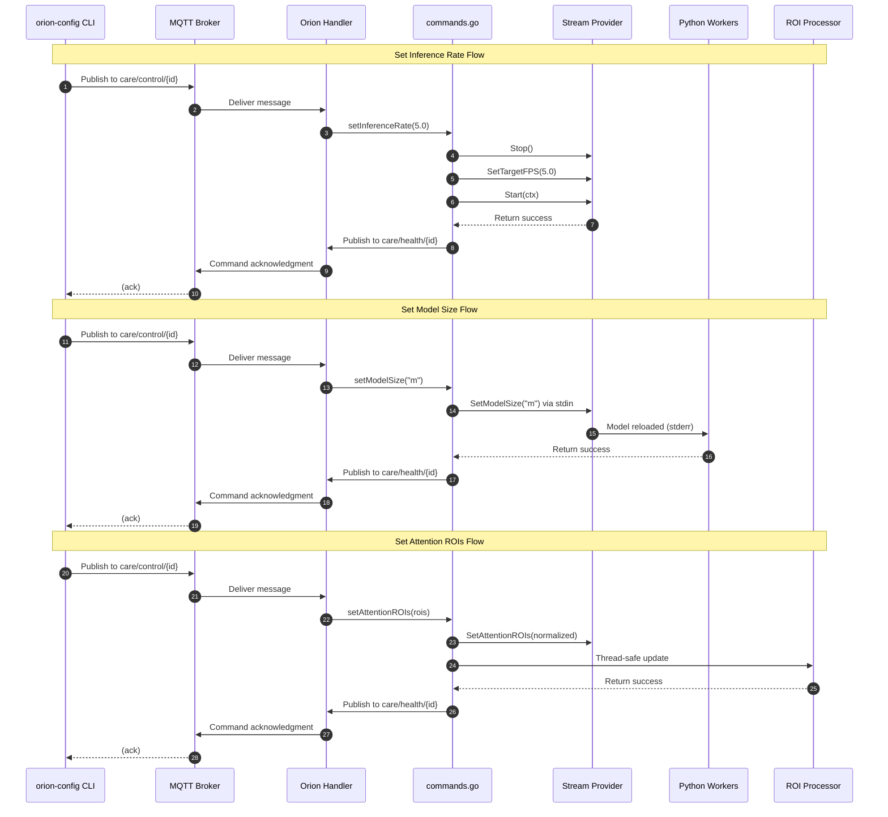

# Command Reference

Relevant source files

- [internal/core/commands.go](internal/core/commands.go)
- [models/download_models.sh](models/download_models.sh)
- [tools/orion-config/README.md](tools/orion-config/README.md)
- [tools/orion-config/main.go](tools/orion-config/main.go)

This page provides a complete reference for all MQTT control commands supported by the Orion service. These commands enable runtime reconfiguration and monitoring without service restart via the `care/control/{instance_id}` MQTT topic.

For the underlying MQTT topic structure and message schemas, see [Topic Structure](3.1-topic-structure.md). For details on how hot-reload mechanisms work internally, see [Hot-Reload Mechanisms](3.3-hot-reload-mechanisms.md). For interactive command-line usage, see [orion-config](#5.1-orion-config).

---

## Command Message Format

All control commands follow a standard JSON message format published to the `care/control/{instance_id}` topic:

```
{
  "command": "command_name",
  "params": {
    "key": "value"
  }
}
```

The service responds via the `care/health/{instance_id}` topic with acknowledgment messages:

```
{
  "type": "command_ack",
  "command": "command_name",
  "success": true,
  "message": "descriptive message",
  "data": {}
}
```

**Sources:** [internal/core/commands.go1-486](internal/core/commands.go#L1-L486)

---

## Command Processing Architecture

The following diagram shows how commands flow from MQTT to their implementations:

**Sources:** [internal/core/commands.go1-486](internal/core/commands.go#L1-L486)

---

## Service Status Commands

### `get_status`

Retrieves comprehensive service status including uptime, stream stats, worker stats, and current configuration.

**Request:**

```
{
  "command": "get_status"
}
```

**Response:**

```
{
  "type": "status",
  "instance_id": "orion-test-001",
  "room_id": "room-102",
  "uptime_s": 3600.5,
  "running": true,
  "paused": false,
  "stream": {
    "connected": true,
    "fps_real": 2.1,
    "fps_target": 2.0,
    "frame_count": 7200,
    "latency_ms": 45,
    "reconnects": 0
  },
  "framebus": {
    "workers_count": 2,
    "frames_distributed": 7200,
    "dropped_by_worker": 15
  },
  "workers": [
    {"id": "worker-0"},
    {"id": "worker-1"}
  ],
  "emitter": {
    "connected": true,
    "published": 7185,
    "errors": 0
  },
  "config": {
    "stream": {
      "resolution": "640x480",
      "rtsp_url": "rtsp://127.0.0.1:8554/bed/102"
    },
    "models": {
      "person_detector": {
        "model_path": "models/yolo11n.onnx",
        "size": "n",
        "confidence": 0.5,
        "max_inference_rate_hz": 2.0
      }
    },
    "mqtt": {
      "broker": "tcp://localhost:1883",
      "control_topic": "care/control/orion-test-001",
      "inference_topic": "care/inferences/orion-test-001"
    },
    "rois": {
      "active": ["BED_FULL", "BED_HEAD"],
      "count": 5
    }
  }
}
```

**Implementation:** [internal/core/commands.go14-92](internal/core/commands.go#L14-L92)

**Sources:** [internal/core/commands.go14-92](internal/core/commands.go#L14-L92) [tools/orion-config/README.md58-73](tools/orion-config/README.md#L58-L73)

---

## Inference Control Commands

### `pause_inference`

Pauses inference processing while maintaining stream capture. Frames continue to be received but are not distributed to workers.

**Request:**

```
{
  "command": "pause_inference"
}
```

**Response:**

```
{
  "type": "command_ack",
  "command": "pause_inference",
  "success": true,
  "message": "inference paused"
}
```

**Error Response:**

```
{
  "type": "command_ack",
  "command": "pause_inference",
  "success": false,
  "message": "already paused"
}
```

**Implementation:** [internal/core/commands.go95-105](internal/core/commands.go#L95-L105)

**Sources:** [internal/core/commands.go95-105](internal/core/commands.go#L95-L105)

---

### `resume_inference`

Resumes inference processing after being paused.

**Request:**

```
{
  "command": "resume_inference"
}
```

**Response:**

```
{
  "type": "command_ack",
  "command": "resume_inference",
  "success": true,
  "message": "inference resumed"
}
```

**Error Response:**

```
{
  "type": "command_ack",
  "command": "resume_inference",
  "success": false,
  "message": "not paused"
}
```

**Implementation:** [internal/core/commands.go108-118](internal/core/commands.go#L108-L118)

**Sources:** [internal/core/commands.go108-118](internal/core/commands.go#L108-L118)

---

### `set_inference_rate`

Updates the target inference rate (frames per second). This command triggers a stream restart to update GStreamer caps, causing a ~2 second interruption.

**Request:**

```
{
  "command": "set_inference_rate",
  "params": {
    "rate_hz": 5.0
  }
}
```

**Parameters:**

|Parameter|Type|Range|Description|
|---|---|---|---|
|`rate_hz`|float|0.1 - 30.0|Target inference rate in Hz|

**Common Presets:**

|Preset|Rate (Hz)|Use Case|
|---|---|---|
|Slow|0.5|Minimal resources, infrequent updates|
|Normal|2.0|Balanced performance and accuracy|
|Fast|5.0|High precision, real-time monitoring|

**Response:**

```
{
  "type": "command_ack",
  "command": "set_inference_rate",
  "success": true,
  "message": "inference rate updated to 5.0 Hz"
}
```

**Error Response:**

```
{
  "type": "command_ack",
  "command": "set_inference_rate",
  "success": false,
  "message": "invalid rate: 35.00 (must be between 0.1 and 30 Hz)"
}
```

**Implementation Notes:**

- Requires stream restart (~2s interruption)
- Updates GStreamer pipeline caps
- Re-launches `consumeFrames()` goroutine
- Configuration persists in `o.cfg.Models.PersonDetector.MaxInferenceRateHz`

**Implementation:** [internal/core/commands.go151-208](internal/core/commands.go#L151-L208)

**Sources:** [internal/core/commands.go151-208](internal/core/commands.go#L151-L208) [tools/orion-config/README.md27-41](tools/orion-config/README.md#L27-L41)

---

### `set_model_size`

Hot-swaps the YOLO model size without service restart. Supports nano (n), small (s), medium (m), large (l), and extra-large (x) variants.

**Request:**

```
{
  "command": "set_model_size",
  "params": {
    "size": "m"
  }
}
```

**Parameters:**

|Parameter|Type|Values|Description|
|---|---|---|---|
|`size`|string|n, s, m, l, x|YOLO11 model variant|

**Model Characteristics:**

|Size|Inference Time|Accuracy|Use Case|
|---|---|---|---|
|n (nano)|~15ms|~85%|Fastest, resource-constrained|
|s (small)|~30ms|~88%|Balanced performance|
|m (medium)|~50ms|~92%|Precision monitoring|
|l (large)|~80ms|~94%|High accuracy required|
|x (extra-large)|~120ms|~95%|Maximum accuracy|

**Response:**

```
{
  "type": "command_ack",
  "command": "set_model_size",
  "success": true,
  "message": "model size updated to m",
  "data": {
    "size": "m",
    "model_path": "models/yolo11m.onnx"
  }
}
```

**Error Response:**

```
{
  "type": "command_ack",
  "command": "set_model_size",
  "success": false,
  "message": "invalid model size: z (must be n/s/m/l/x)"
}
```

**Implementation Notes:**

- No service interruption
- Sends JSON command to Python workers via stdin
- Updates `o.cfg.Models.PersonDetector.Size` and `ModelPath`
- Rolls back config on worker update failure
- Uses glob patterns to find model files: `models/yolo11{size}.onnx` or `models/yolo11{size}_*.onnx`

**Implementation:** [internal/core/commands.go211-287](internal/core/commands.go#L211-L287)

**Sources:** [internal/core/commands.go211-287](internal/core/commands.go#L211-L287) [tools/orion-config/README.md43-56](tools/orion-config/README.md#L43-L56)

---

## ROI Attention Commands

### `set_attention_rois`

Updates the Region of Interest (ROI) attention areas for intelligent model selection. ROIs are specified in normalized coordinates (0.0 - 1.0).

**Request:**

```
{
  "command": "set_attention_rois",
  "params": {
    "rois": [
      {
        "x": 0.2,
        "y": 0.3,
        "width": 0.6,
        "height": 0.5
      },
      {
        "x": 0.0,
        "y": 0.0,
        "width": 0.3,
        "height": 0.3
      }
    ]
  }
}
```

**Parameters:**

|Parameter|Type|Range|Description|
|---|---|---|---|
|`rois`|array|-|Array of ROI rectangles|
|`rois[].x`|float|0.0 - 1.0|Normalized X coordinate (left edge)|
|`rois[].y`|float|0.0 - 1.0|Normalized Y coordinate (top edge)|
|`rois[].width`|float|0.0 - 1.0|Normalized width|
|`rois[].height`|float|0.0 - 1.0|Normalized height|

**Validation Rules:**

- All coordinates must be in range [0.0, 1.0]
- `x + width` must be ≤ 1.0
- `y + height` must be ≤ 1.0
- Width and height must be > 0.0

**Response:**

```
{
  "type": "command_ack",
  "command": "set_attention_rois",
  "success": true,
  "message": "attention ROIs updated",
  "data": {
    "num_rois": 2
  }
}
```

**Implementation Notes:**

- Thread-safe update with immediate effect
- Enables 3-5x performance improvement by using smaller model for small crops
- ROIs are merged and area-calculated to select YOLO320 or YOLO640 model

**Implementation:** [internal/core/commands.go290-326](internal/core/commands.go#L290-L326)

**Sources:** [internal/core/commands.go290-326](internal/core/commands.go#L290-L326)

---

### `clear_attention_rois`

Removes all attention ROIs, enabling full-frame processing.

**Request:**

```
{
  "command": "clear_attention_rois"
}
```

**Response:**

```
{
  "type": "command_ack",
  "command": "clear_attention_rois",
  "success": true,
  "message": "attention ROIs cleared - full frame processing enabled"
}
```

**Implementation:** [internal/core/commands.go329-333](internal/core/commands.go#L329-L333)

**Sources:** [internal/core/commands.go329-333](internal/core/commands.go#L329-L333)

---

### `get_attention_rois`

Retrieves current attention ROIs and processor statistics.

**Request:**

```
{
  "command": "get_attention_rois"
}
```

**Response:**

```
{
  "type": "roi_status",
  "attention_rois": [
    {
      "x": 0.2,
      "y": 0.3,
      "width": 0.6,
      "height": 0.5
    }
  ],
  "num_rois": 1,
  "stats": {
    "rois_processed": 7200,
    "model_320_selected": 5400,
    "model_640_selected": 1800,
    "active_rois": 1
  }
}
```

**Implementation:** [internal/core/commands.go336-350](internal/core/commands.go#L336-L350)

**Sources:** [internal/core/commands.go336-350](internal/core/commands.go#L336-L350)

---

## Auto-Focus Commands

### `set_auto_focus_strategy`

Changes the auto-focus tracking strategy at runtime. Strategies control how the system adapts ROIs based on detected person movement.

**Request:**

```
{
  "command": "set_auto_focus_strategy",
  "params": {
    "strategy": "velocity",
    "velocity_threshold": 0.05,
    "velocity_factor": 1.5,
    "max_expansion": 0.3
  }
}
```

**Parameters:**

|Parameter|Type|Required|Description|
|---|---|---|---|
|`strategy`|string|Yes|Strategy name: `simple`, `smoothing`, or `velocity`|
|`alpha`|float|No|Smoothing factor for `smoothing` strategy (0.0-1.0)|
|`velocity_threshold`|float|No|Movement threshold for `velocity` strategy|
|`velocity_factor`|float|No|Expansion factor for `velocity` strategy|
|`max_expansion`|float|No|Maximum ROI expansion for `velocity` strategy|

**Strategy Descriptions:**

|Strategy|Description|Parameters|
|---|---|---|
|`simple`|Direct ROI from detected bounding box|None|
|`smoothing`|Exponential smoothing of ROI across frames|`alpha` (default: 0.3)|
|`velocity`|Adaptive ROI based on person movement|`velocity_threshold`, `velocity_factor`, `max_expansion`|

**Response:**

```
{
  "type": "command_ack",
  "command": "set_auto_focus_strategy",
  "success": true,
  "message": "auto-focus strategy updated to velocity"
}
```

**Error Response:**

```
{
  "type": "command_ack",
  "command": "set_auto_focus_strategy",
  "success": false,
  "message": "invalid strategy: invalid_name (valid: simple, smoothing, velocity)"
}
```

**Implementation:** [internal/core/commands.go354-401](internal/core/commands.go#L354-L401)

**Sources:** [internal/core/commands.go354-401](internal/core/commands.go#L354-L401)

---

### `get_auto_focus_strategy`

Retrieves current auto-focus strategy configuration and applied counts.

**Request:**

```
{
  "command": "get_auto_focus_strategy"
}
```

**Response:**

```
{
  "type": "auto_focus_strategy",
  "strategy": "velocity",
  "params": {
    "smoothing_alpha": 0.3,
    "velocity_threshold": 0.05,
    "velocity_factor": 1.5,
    "max_expansion": 0.3
  },
  "strategy_applied": {
    "simple": 120,
    "smoothing": 350,
    "velocity": 6730
  },
  "auto_focus_enabled": true
}
```

**Implementation:** [internal/core/commands.go404-428](internal/core/commands.go#L404-L428)

**Sources:** [internal/core/commands.go404-428](internal/core/commands.go#L404-L428)

---

### `enable_auto_focus`

Enables the auto-focus tracking system, allowing automatic ROI adjustment based on person detections.

**Request:**

```
{
  "command": "enable_auto_focus"
}
```

**Response:**

```
{
  "type": "command_ack",
  "command": "enable_auto_focus",
  "success": true,
  "message": "auto-focus enabled"
}
```

**Implementation:** [internal/core/commands.go431-435](internal/core/commands.go#L431-L435)

**Sources:** [internal/core/commands.go431-435](internal/core/commands.go#L431-L435)

---

### `disable_auto_focus`

Disables the auto-focus tracking system, using only external ROIs or full-frame processing.

**Request:**

```
{
  "command": "disable_auto_focus"
}
```

**Response:**

```
{
  "type": "command_ack",
  "command": "disable_auto_focus",
  "success": true,
  "message": "auto-focus disabled"
}
```

**Implementation:** [internal/core/commands.go438-442](internal/core/commands.go#L438-L442)

**Sources:** [internal/core/commands.go438-442](internal/core/commands.go#L438-L442)

---

### `clear_auto_focus_history`

Clears the auto-focus detection history buffer, resetting tracking state.

**Request:**

```
{
  "command": "clear_auto_focus_history"
}
```

**Response:**

```
{
  "type": "command_ack",
  "command": "clear_auto_focus_history",
  "success": true,
  "message": "auto-focus history cleared"
}
```

**Implementation:** [internal/core/commands.go445-449](internal/core/commands.go#L445-L449)

**Sources:** [internal/core/commands.go445-449](internal/core/commands.go#L445-L449)

---

### `get_auto_focus_stats`

Retrieves detailed auto-focus statistics including history hit/miss rates and current detections.

**Request:**

```
{
  "command": "get_auto_focus_stats"
}
```

**Response:**

```
{
  "type": "auto_focus_stats",
  "enabled": true,
  "stats": {
    "auto_focus_frames": 6850,
    "history_hits": 6720,
    "history_misses": 130,
    "total_detections": 6850,
    "current_detections": 1,
    "history_frames": 30,
    "history_size": 30,
    "expansion_pct": 15.0
  },
  "strategy": {
    "current": "velocity",
    "applied": {
      "simple": 120,
      "smoothing": 350,
      "velocity": 6380
    }
  },
  "suggested_roi": {
    "x": 0.35,
    "y": 0.25,
    "width": 0.4,
    "height": 0.6
  }
}
```

**Implementation:** [internal/core/commands.go452-486](internal/core/commands.go#L452-L486)

**Sources:** [internal/core/commands.go452-486](internal/core/commands.go#L452-L486)

---

## Service Lifecycle Commands

### `shutdown`

Initiates graceful shutdown of the Orion service via MQTT control command.

**Request:**

```
{
  "command": "shutdown"
}
```

**Response:**

```
{
  "type": "command_ack",
  "command": "shutdown",
  "success": true,
  "message": "shutdown initiated"
}
```

**Implementation Notes:**

- Triggers context cancellation
- Causes `Run()` to exit gracefully
- Main process handles shutdown sequence:
    1. Stop workers
    2. Stop stream
    3. Disconnect MQTT
    4. Exit cleanly

**Implementation:** [internal/core/commands.go128-144](internal/core/commands.go#L128-L144)

**Sources:** [internal/core/commands.go128-144](internal/core/commands.go#L128-L144)

---

## Command Flow Diagram

The following diagram maps command execution from MQTT message to component updates:




**Sources:** [internal/core/commands.go1-486](internal/core/commands.go#L1-L486) [tools/orion-config/README.md148-187](tools/orion-config/README.md#L148-L187)

---

## Error Handling

All commands follow a consistent error handling pattern:

**Validation Errors:**

- Invalid parameter types
- Out-of-range values
- Missing required parameters
- Malformed ROI definitions

**Runtime Errors:**

- Component unavailable
- State conflicts (e.g., already paused)
- Model file not found
- Stream restart failure

**Error Response Format:**

```
{
  "type": "command_ack",
  "command": "command_name",
  "success": false,
  "message": "detailed error message",
  "error_code": "VALIDATION_ERROR"
}
```

**Sources:** [internal/core/commands.go1-486](internal/core/commands.go#L1-L486)

---

## Usage Examples

### CLI Usage

Using the `orion-config` tool (see [orion-config](#5.1-orion-config) for details):

```
# Interactive menu mode
make config

# Direct command mode
make config-rate INSTANCE_ID=orion-test-001
make config-model INSTANCE_ID=orion-test-001
make config-get INSTANCE_ID=orion-test-001
```

**Sources:** [tools/orion-config/README.md75-134](tools/orion-config/README.md#L75-L134)

---

### Direct MQTT Usage

Using `mosquitto_pub` for automation:

```
# Get current status
mosquitto_pub -t 'care/control/orion-test-001' -m '{
  "command": "get_status"
}'

# Set inference rate to 5 Hz
mosquitto_pub -t 'care/control/orion-test-001' -m '{
  "command": "set_inference_rate",
  "params": {"rate_hz": 5.0}
}'

# Hot-swap to medium model
mosquitto_pub -t 'care/control/orion-test-001' -m '{
  "command": "set_model_size",
  "params": {"size": "m"}
}'

# Set attention ROI (bed area)
mosquitto_pub -t 'care/control/orion-test-001' -m '{
  "command": "set_attention_rois",
  "params": {
    "rois": [
      {"x": 0.2, "y": 0.3, "width": 0.6, "height": 0.5}
    ]
  }
}'

# Enable velocity-based auto-focus
mosquitto_pub -t 'care/control/orion-test-001' -m '{
  "command": "set_auto_focus_strategy",
  "params": {
    "strategy": "velocity",
    "velocity_threshold": 0.05,
    "velocity_factor": 1.5
  }
}'

# Pause inference temporarily
mosquitto_pub -t 'care/control/orion-test-001' -m '{
  "command": "pause_inference"
}'

# Resume inference
mosquitto_pub -t 'care/control/orion-test-001' -m '{
  "command": "resume_inference"
}'

# Graceful shutdown
mosquitto_pub -t 'care/control/orion-test-001' -m '{
  "command": "shutdown"
}'
```

**Sources:** [tools/orion-config/README.md122-133](tools/orion-config/README.md#L122-L133)

---

## Command Summary Table

|Command|Parameters|Hot-Reload|Interruption|Use Case|
|---|---|---|---|---|
|`get_status`|None|N/A|None|Service monitoring|
|`pause_inference`|None|Yes|None|Temporary pause|
|`resume_inference`|None|Yes|None|Resume after pause|
|`set_inference_rate`|`rate_hz`|Yes|~2s|Adjust processing rate|
|`set_model_size`|`size`|Yes|None|Model accuracy tradeoff|
|`set_attention_rois`|`rois[]`|Yes|None|Define focus areas|
|`clear_attention_rois`|None|Yes|None|Full-frame processing|
|`get_attention_rois`|None|N/A|None|View ROI config|
|`set_auto_focus_strategy`|`strategy`, params|Yes|None|Change tracking behavior|
|`get_auto_focus_strategy`|None|N/A|None|View strategy config|
|`enable_auto_focus`|None|Yes|None|Enable tracking|
|`disable_auto_focus`|None|Yes|None|Disable tracking|
|`clear_auto_focus_history`|None|Yes|None|Reset tracking state|
|`get_auto_focus_stats`|None|N/A|None|View tracking metrics|
|`shutdown`|None|N/A|Service exit|Graceful shutdown|

**Sources:** [internal/core/commands.go1-486](internal/core/commands.go#L1-L486) [tools/orion-config/README.md1-382](tools/orion-config/README.md#L1-L382)