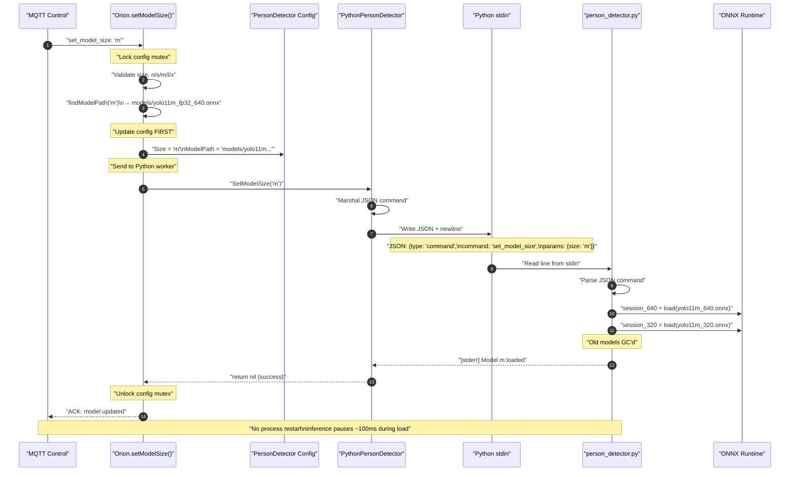
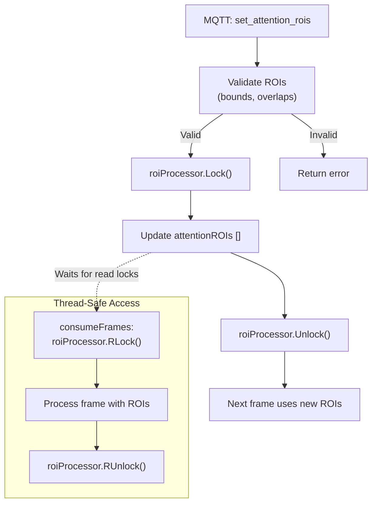
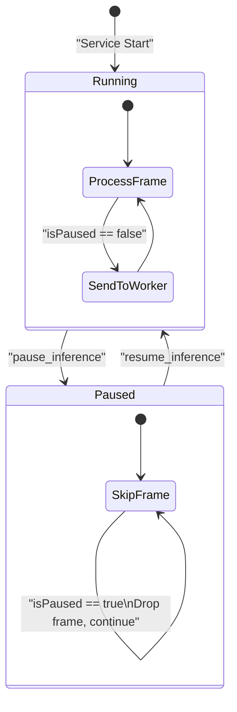

# Hot-Reload Mechanisms

Relevant source files

- [internal/core/commands.go](internal/core/commands.go)
- [internal/worker/person_detector_python.go](internal/worker/person_detector_python.go)
- [models/download_models.sh](models/download_models.sh)
- [tools/orion-config/commands/model.go](tools/orion-config/commands/model.go)

**Purpose**: This page documents the runtime reconfiguration mechanisms that enable the Orion service to update configuration parameters without service restart. These mechanisms support dynamic adjustments to inference rates, model sizes, ROI regions, and auto-focus strategies while maintaining service continuity.

**Scope**: Covers the five primary hot-reload mechanisms: inference rate updates (stream restart), model hot-swap (Python reload), ROI updates (thread-safe), auto-focus strategy changes, and pause/resume operations. For MQTT command reference, see [Command Reference](3.2-command-reference.md). For ROI processing concepts, see [ROI Attention System](#2.3-roi-attention-system).

---

## Overview

The Orion service implements **five distinct hot-reload mechanisms**, each with different performance characteristics and implementation strategies:

|Mechanism|Implementation|Service Interruption|Thread-Safety|Command|
|---|---|---|---|---|
|**Inference Rate**|Stream restart with new FPS|~2s interruption|Mutex lock on config|`set_inference_rate`|
|**Model Size**|Python worker hot-swap|None (brief pause ~100ms)|Config-then-worker update|`set_model_size`|
|**ROI Updates**|Thread-safe pointer swap|None (immediate)|`sync.RWMutex`|`set_attention_rois`|
|**Auto-Focus Strategy**|Strategy pattern switch|None (immediate)|`sync.RWMutex`|`set_auto_focus_strategy`|
|**Pause/Resume**|Boolean flag toggle|None (immediate)|`sync.RWMutex`|`pause_inference`, `resume_inference`|

**Design Philosophy**: The system prioritizes **operational flexibility** over theoretical purity. The inference rate change triggers a stream restart because GStreamer caps renegotiation is unreliable—accepting a 2-second interruption for guaranteed correctness (KISS principle).

Sources: [internal/core/commands.go146-208](internal/core/commands.go#L146-L208) [internal/worker/person_detector_python.go904-946](internal/worker/person_detector_python.go#L904-L946)

---

## Hot-Reload Mechanism Details

### 1. Inference Rate Updates (Stream Restart)

**Implementation**: Updates the GStreamer pipeline framerate by stopping and restarting the stream with new FPS configuration.


**Why Stream Restart?**: GStreamer caps renegotiation (changing `videorate` caps on a running pipeline) is unreliable and causes pipeline stalls. The KISS approach is to accept a 2-second interruption for guaranteed correctness.

**Key Code Paths**:

- [internal/core/commands.go151-208](internal/core/commands.go#L151-L208) - Command handler with stream restart logic
- [internal/core/orion.go](internal/core/orion.go) - `consumeFrames` goroutine management

**Performance Impact**:

- **Interruption**: ~2 seconds (stream stop + GStreamer pipeline rebuild + restart)
- **Frame Loss**: All frames during interruption window
- **Recovery**: Automatic, no manual intervention required

Sources: [internal/core/commands.go146-208](internal/core/commands.go#L146-L208)

---

### 2. Model Hot-Swap (Python Worker Reload)

**Implementation**: Sends a JSON command to the Python subprocess, which reloads the ONNX model without process termination.





**JSON Protocol**: Commands are sent as JSON lines via stdin, multiplexed with MsgPack frame data:

```
{
  "type": "command",
  "command": "set_model_size",
  "params": {
    "size": "m"
  }
}
```

**Model File Discovery**: Uses glob patterns to find ONNX models:

```
// Pattern matching logic
patterns := []string{
    "models/yolo11{size}.onnx",
    "models/yolo11{size}_*.onnx",  // e.g., yolo11m_fp32_640.onnx
}
```

**Rollback on Failure**: If Python worker fails to load the model, the Go config is rolled back:

```
// Config updated FIRST (optimistic)
cfg.Models.PersonDetector.Size = size
cfg.Models.PersonDetector.ModelPath = newModelPath

// Worker update attempt
if err := pythonWorker.SetModelSize(size); err != nil {
    // ROLLBACK on failure
    cfg.Models.PersonDetector.Size = oldSize
    cfg.Models.PersonDetector.ModelPath = oldPath
    return err
}
```

**Key Code Paths**:

- [internal/core/commands.go210-266](internal/core/commands.go#L210-L266) - Command handler with rollback logic
- [internal/worker/person_detector_python.go904-946](internal/worker/person_detector_python.go#L904-L946) - Python worker hot-swap implementation
- [internal/core/commands.go268-287](internal/core/commands.go#L268-L287) - Model file discovery

**Performance Impact**:

- **Interruption**: None (frame processing continues)
- **Inference Pause**: ~100ms during model load (Python blocks on ONNX load)
- **Memory**: Brief spike as both old and new models exist during swap

Sources: [internal/core/commands.go210-266](internal/core/commands.go#L210-L266) [internal/worker/person_detector_python.go904-946](internal/worker/person_detector_python.go#L904-L946) [tools/orion-config/commands/model.go1-91](tools/orion-config/commands/model.go#L1-L91)

---

### 3. ROI Updates (Thread-Safe)

**Implementation**: Uses `sync.RWMutex` to safely update the attention ROI list without stopping frame processing.





**Thread-Safety Mechanism**:

- **Write Lock**: `SetAttentionROIs()` acquires exclusive write lock
- **Read Lock**: `ProcessFrame()` acquires shared read lock
- **Immediate Effect**: Next frame after write lock release uses new ROIs
- **No Frame Drop**: Reader-writer lock allows concurrent reads during processing

**ROI Validation**:

```
func ValidateROIs(rois []types.NormalizedRect) error {
    for _, roi := range rois {
        // Bounds check (0.0 to 1.0 normalized)
        if roi.X < 0 || roi.X > 1 || roi.Y < 0 || roi.Y > 1 {
            return fmt.Errorf("ROI out of bounds")
        }
        if roi.Width <= 0 || roi.Height <= 0 {
            return fmt.Errorf("ROI dimensions must be positive")
        }
        if roi.X + roi.Width > 1 || roi.Y + roi.Height > 1 {
            return fmt.Errorf("ROI exceeds frame bounds")
        }
    }
    return nil
}
```

**Key Code Paths**:

- [internal/core/commands.go289-333](internal/core/commands.go#L289-L333) - ROI update and validation
- [internal/roiprocessor/](internal/roiprocessor/) - Thread-safe ROI processor implementation

**Performance Impact**:

- **Interruption**: None (immediate effect on next frame)
- **Lock Contention**: Minimal (read locks don't block each other)
- **Frame Loss**: None

Sources: [internal/core/commands.go289-333](internal/core/commands.go#L289-L333)

---

### 4. Auto-Focus Strategy Changes

**Implementation**: Switches the auto-focus strategy enum and parameters using thread-safe config update.

**Supported Strategies**:

|Strategy|Description|Parameters|Use Case|
|---|---|---|---|
|`StrategySimple`|Use last detection as-is|None|Debugging, testing|
|`StrategySmoothing`|Exponential moving average|`alpha` (0.0-1.0)|Smooth tracking, reduce jitter|
|`StrategyVelocity`|Expand ROI based on movement|`velocity_threshold`, `velocity_factor`, `max_expansion`|Track fast-moving subjects|

**Command Example**:

```
{
  "command": "set_auto_focus_strategy",
  "params": {
    "strategy": "smoothing",
    "alpha": 0.7
  }
}
```

**Strategy Pattern Implementation**:

```
type AutoFocusStrategy string

const (
    StrategySimple    AutoFocusStrategy = "simple"
    StrategySmoothing AutoFocusStrategy = "smoothing"
    StrategyVelocity  AutoFocusStrategy = "velocity"
)

func (p *ROIProcessor) SetAutoFocusStrategy(strategy AutoFocusStrategy, params map[string]float64) error {
    p.mu.Lock()
    defer p.mu.Unlock()
    
    p.autoFocusStrategy = strategy
    // Update strategy-specific parameters
    if alpha, ok := params["alpha"]; ok {
        p.smoothingAlpha = alpha
    }
    // ... other params
    
    return nil
}
```

**Key Code Paths**:

- [internal/core/commands.go352-401](internal/core/commands.go#L352-L401) - Strategy update handler
- [internal/roiprocessor/](internal/roiprocessor/) - Strategy pattern implementation

**Performance Impact**:

- **Interruption**: None (immediate effect on next frame)
- **Computation**: Negligible (enum switch)
- **Frame Loss**: None

Sources: [internal/core/commands.go352-428](internal/core/commands.go#L352-L428)

---

### 5. Pause/Resume (Boolean Flag)

**Implementation**: Simple boolean flag toggle with mutex protection.





**Implementation**:

```
func (o *Orion) pauseInference() error {
    o.mu.Lock()
    defer o.mu.Unlock()
    
    if o.isPaused {
        return fmt.Errorf("already paused")
    }
    
    o.isPaused = true
    return nil
}

func (o *Orion) resumeInference() error {
    o.mu.Lock()
    defer o.mu.Unlock()
    
    if !o.isPaused {
        return fmt.Errorf("not paused")
    }
    
    o.isPaused = false
    return nil
}
```

**Frame Processing Check**:

```
// In consumeFrames goroutine
if o.isPausedCheck() {
    // Drop frame, continue loop
    continue
}
// Otherwise, process frame normally
```

**Key Code Paths**:

- [internal/core/commands.go94-125](internal/core/commands.go#L94-L125) - Pause/resume handlers

**Performance Impact**:

- **Interruption**: None (immediate effect)
- **Resource Usage**: Frames still captured but dropped before worker distribution
- **Frame Loss**: All frames while paused

Sources: [internal/core/commands.go94-125](internal/core/commands.go#L94-L125)

---

## Hot-Reload Command Flow

The following diagram maps MQTT commands to their implementation handlers and the components they affect:


```mermaid
flowchart LR
  %% Layout general
  %% MQTT -> Router -> Handlers -> Componentes afectados
  %% Los labels de arista reflejan los nombres de comando

  subgraph MQTT_Control_Plane["MQTT Control Plane"]
    Control["care/control/{instance_id}"]
  end

  subgraph Command_Router["Command Router (control_handler.go)"]
    Router["handleControlMessage()"]
  end

  subgraph Command_Handlers["Command Handlers (commands.go)"]
    SetRate["setInferenceRate()"]
    SetModel["setModelSize()"]
    SetROI["setAttentionROIs()"]
    SetStrategy["setAutoFocusStrategy()"]
    Pause["pauseInference()"]
    Resume["resumeInference()"]
  end

  subgraph Affected_Components["Affected Components"]
    Stream["RTSPStream<br/>(restart)"]
    Worker["PythonPersonDetector<br/>(hot-swap)"]
    ROIProc["ROIProcessor<br/>(thread-safe update)"]
    Flag["isPaused flag<br/>(atomic)"]
  end

  %% Control -> Router
  Control --> Router

  %% Router -> Handlers (con labels de comando)
  Router -->|set_inference_rate| SetRate
  Router -->|set_model_size|     SetModel
  Router -->|set_attention_rois| SetROI
  Router -->|set_auto_focus_strategy| SetStrategy
  Router -->|pause_inference|    Pause
  Router -->|resume_inference|   Resume

  %% Handlers -> Componentes afectados
  SetRate  --> Stream
  SetModel --> Worker
  SetROI   --> ROIProc
  SetStrategy --> ROIProc
  Pause --> Flag
  Resume --> Flag
```

Notas rápidas (sin humo):

- `RTSPStream` reinicia solo cuando cambiás **rate** (tiene sentido por buffers).
    
- `PythonPersonDetector` hace **hot-swap** del modelo (no mata el proceso, pausa ~100ms durante load).
    
- `ROIProcessor` actualiza **thread-safe** (lock/RLock) para que el próximo frame ya use los ROIs nuevos.
    
- `isPaused` es **atómico**: el bucle de frames salta (drop) mientras esté en `true`.

Sources: [internal/core/commands.go1-487](internal/core/commands.go#L1-L487) [internal/worker/person_detector_python.go904-946](internal/worker/person_detector_python.go#L904-L946)

---

## Thread-Safety and Concurrency

The hot-reload mechanisms use three primary concurrency patterns:

### 1. Mutex-Protected Config Updates

**Pattern**: Exclusive lock for write, shared lock for read (RWMutex)

```
type Orion struct {
    mu          sync.RWMutex
    cfg         *config.Config
    isPaused    bool
    // ...
}

// Write operation
func (o *Orion) setInferenceRate(rate float64) error {
    o.mu.Lock()
    defer o.mu.Unlock()
    
    o.cfg.Models.PersonDetector.MaxInferenceRateHz = rate
    // ... restart stream
}

// Read operation
func (o *Orion) getStatus() map[string]interface{} {
    o.mu.RLock()
    defer o.mu.RUnlock()
    
    return map[string]interface{}{
        "rate": o.cfg.Models.PersonDetector.MaxInferenceRateHz,
    }
}
```

### 2. Optimistic Update with Rollback

**Pattern**: Update config first, then apply to workers. Rollback config if worker update fails.

```
// Step 1: Update config (optimistic)
oldSize := o.cfg.Models.PersonDetector.Size
o.cfg.Models.PersonDetector.Size = newSize

// Step 2: Apply to worker
err := worker.SetModelSize(newSize)
if err != nil {
    // Step 3: Rollback on failure
    o.cfg.Models.PersonDetector.Size = oldSize
    return err
}
```

**Rationale**: Config should always reflect the desired state. `get_status` immediately shows the new config, and workers eventually converge to it.

### 3. Channel-Based Communication

**Pattern**: Send commands to Python workers via stdin channel, no shared memory.

```
// Go side: Write JSON command to stdin
command := map[string]interface{}{
    "type": "command",
    "command": "set_model_size",
    "params": map[string]interface{}{"size": "m"},
}
jsonBytes, _ := json.Marshal(command)
w.stdin.Write(append(jsonBytes, '\n'))

// Python side: Read from stdin (separate thread)
line = sys.stdin.readline()
cmd = json.loads(line)
if cmd['command'] == 'set_model_size':
    reload_model(cmd['params']['size'])
```

**Benefit**: No shared memory between Go and Python, eliminating race conditions.

Sources: [internal/core/commands.go210-266](internal/core/commands.go#L210-L266) [internal/worker/person_detector_python.go904-946](internal/worker/person_detector_python.go#L904-L946)

---

## Performance Characteristics

### Hot-Reload Impact Summary

### Detailed Performance Metrics

|Operation|Time to Effect|Frame Loss|Service Interruption|Concurrency Safe|
|---|---|---|---|---|
|**set_inference_rate**|~2000ms|High (all frames during restart)|Yes (stream rebuilds)|Yes (mutex)|
|**set_model_size**|~100ms|None (pause only)|No (continues running)|Yes (config rollback)|
|**set_attention_rois**|<1ms|None|No|Yes (RWMutex)|
|**set_auto_focus_strategy**|<1ms|None|No|Yes (RWMutex)|
|**pause_inference**|<1ms|All frames while paused|No|Yes (mutex)|
|**resume_inference**|<1ms|None|No|Yes (mutex)|

### Resource Usage During Hot-Reload

**Model Hot-Swap Memory Profile**:

```
Before swap:  yolo11n_640.onnx (15 MB) + yolo11n_320.onnx (8 MB) = 23 MB
During swap:  OLD models + NEW models = 46 MB (brief spike)
After GC:     yolo11m_640.onnx (50 MB) + yolo11m_320.onnx (25 MB) = 75 MB
```

**Stream Restart CPU Profile**:

```
Phase 1: Stop stream (kill GStreamer pipeline)        50ms
Phase 2: Update FPS config                            <1ms
Phase 3: Rebuild GStreamer pipeline with new caps     1500ms
Phase 4: Start stream + restart consumeFrames         450ms
Total:                                                ~2000ms
```

Sources: [internal/core/commands.go146-208](internal/core/commands.go#L146-L208) [internal/worker/person_detector_python.go904-946](internal/worker/person_detector_python.go#L904-L946)

---

## Testing Hot-Reload

### CLI Testing (orion-config)

The `orion-config` tool provides interactive hot-reload testing:

```
# Model hot-swap
$ orion-config set-model
? Choose model size: Medium (accurate, ~92% accuracy)
? Hot-swap model now? Yes, swap now!
✅ Model size updated to: YOLO11m (Medium)
🔄 Service will hot-swap model within a few seconds
⏸️  Inference may pause briefly during swap

# Inference rate change
$ orion-config set-rate
? Choose inference rate: 2 Hz (2x/sec) - Balanced
⏱️  Estimated interruption: ~2s
? Apply this rate? Yes, apply!
```

### Shell Script Testing

Direct MQTT command injection for automated testing:

```
#!/bin/bash
# test_hotreload.sh

INSTANCE_ID="node_001"
TOPIC="care/control/$INSTANCE_ID"

# Test model hot-swap
mosquitto_pub -t "$TOPIC" -m '{
  "command": "set_model_size",
  "params": {"size": "m"}
}'

# Wait for model load
sleep 2

# Test ROI update
mosquitto_pub -t "$TOPIC" -m '{
  "command": "set_attention_rois",
  "params": {
    "rois": [
      {"x": 0.2, "y": 0.2, "width": 0.6, "height": 0.6}
    ]
  }
}'
```

### Integration Tests

The pytest suite validates hot-reload mechanisms under load:

```
def test_model_hotswap_under_load(mqtt_client, process_monitor):
    """Validate model hot-swap doesn't drop inferences"""
    
    # Baseline: collect 10 inferences
    baseline = collect_inferences(mqtt_client, count=10)
    
    # Hot-swap to model 'm'
    send_command(mqtt_client, "set_model_size", {"size": "m"})
    
    # Collect 10 more inferences
    post_swap = collect_inferences(mqtt_client, count=10)
    
    # Validate: no process restart, minimal gap
    assert process_monitor.no_restart_detected()
    assert inference_gap(baseline, post_swap) < 200  # <200ms gap
```

Sources: [tools/orion-config/commands/model.go1-91](tools/orion-config/commands/model.go#L1-L91) [tests/](tests/)