# Python Inference Workers

Relevant source files

- [internal/roiprocessor/processor.go](internal/roiprocessor/processor.go)
- [internal/worker/person_detector_python.go](internal/worker/person_detector_python.go)
- [models/person_detector.py](models/person_detector.py)
- [tools/orion-config/commands/model.go](tools/orion-config/commands/model.go)

## Purpose and Scope

This document describes the Python subprocess workers that execute ONNX inference for person detection in the care-orion system. It covers the Go-Python bridge architecture, the MsgPack-based communication protocol, multi-model support for ROI attention, and hot-reload capabilities.

For information about how workers are orchestrated by the Orion service, see [Service Orchestration](2.1-service-orchestration.md). For details on how ROI attention metadata is computed and attached to frames before reaching workers, see [ROI Attention System](#2.3-roi-attention-system). For CLI tools that trigger model hot-reload, see [orion-config](#5.1-orion-config).

---

## Architecture Overview

The Python inference workers run as managed subprocesses spawned by the Go `Orion` core. Each worker is a long-lived Python process that loads ONNX models and performs YOLO inference on frames received via stdin.

### Go-Python Bridge Architecture


```mermaid
flowchart LR
  %% ===============================
  %% Go: Orion Core
  %% ===============================
  subgraph OrionCore["Go: Orion Core"]
    Orion["Orion orchestrator<br/>(core/orion.go)"]
    FrameBus["FrameBus<br/>(internal/framebus/)"]
    Orion -->| | FrameBus
  end

  %% ===============================
  %% Worker Management (Go)
  %% ===============================
  subgraph WorkerMgmt["Worker Management"]
    PythonWorker["PythonPersonDetector<br/>(person_detector_python.go)"]
    InputChan["input chan<br/>Frame, size=5"]
    StdinPipe["stdin pipe"]
    StdoutPipe["stdout pipe"]
    StderrPipe["stderr pipe"]
    ResultsChan["results chan<br/>Inference, size=10"]
  end

  %% ===============================
  %% Python Subprocess
  %% ===============================
  subgraph PyProc["Python Subprocess"]
    RunWorkerSh["run_worker.sh<br/>venv activation"]
    PersonDetectorPy["person_detector.py<br/>main loop"]
    ONNXSession["onnxruntime<br/>InferenceSession"]
  end

  %% ===============================
  %% ONNX Models
  %% ===============================
  subgraph ONNXModels["ONNX Models"]
    Model640["yolo11n_fp32_640.onnx<br/>session_640"]
    Model320["yolo11n_fp32_320.onnx<br/>session_320"]
  end

  %% ========= Flujos principales =========
  Orion -->| | FrameBus
  FrameBus -->|SendFrame(frame)| PythonWorker

  %% Buses / canales dentro de WorkerMgmt
  PythonWorker --> InputChan
  InputChan -->|processFrames() goroutine| StdinPipe
  StdinPipe -->|MsgPack frames| PersonDetectorPy

  %% Lanzamiento del proceso Python
  PythonWorker -->|exec.CommandContext| RunWorkerSh
  RunWorkerSh -->|spawn process| PersonDetectorPy

  %% Retorno de resultados y logs
  PersonDetectorPy -->|MsgPack results| StdoutPipe
  PersonDetectorPy -->|structured logs| StderrPipe
  StdoutPipe -->|readResults() goroutine| ResultsChan
  ResultsChan -->|Results() channel| Orion
  StderrPipe -->|logStderr() goroutine| Orion

  %% Sesiones ONNX y modelos
  PersonDetectorPy --> ONNXSession
  ONNXSession --> Model640
  ONNXSession --> Model320
```

mini-notas prácticas:

- el **input chan (size=5)** te amortigua picos desde `FrameBus`; si ves drops, subí el tamaño o baja el rate en `FrameBus`.
    
- **stdout/stderr** en goroutines separadas evita bloquear el loop de lectura del proceso.
    
- el `run_worker.sh` haciendo **venv activation** te aísla dependencias; dejá claro `PYTHONUNBUFFERED=1` para que los **MsgPack results** salgan sin buffering.
    
- dos **InferenceSession** (320/640) cargadas desde Python te permiten **hot-swap** de tamaño sin reiniciar el proceso — alineado con lo que diseñaste.

**Sources:** [internal/worker/person_detector_python.go1-947](internal/worker/person_detector_python.go#L1-L947) [models/person_detector.py1-934](models/person_detector.py#L1-L934)

The `PythonPersonDetector` struct manages the subprocess lifecycle through four concurrent goroutines:

|Goroutine|Function|Purpose|
|---|---|---|
|`processFrames()`|Frame sender|Reads from `input` channel, serializes to MsgPack, writes to stdin|
|`readResults()`|Result receiver|Reads MsgPack from stdout, deserializes, sends to `results` channel|
|`logStderr()`|Log consumer|Reads Python logs from stderr, maps to Go slog levels|
|`waitProcess()`|Process monitor|Blocks on `cmd.Wait()` to prevent zombie processes|

**Sources:** [internal/worker/person_detector_python.go441-485](internal/worker/person_detector_python.go#L441-L485) [internal/worker/person_detector_python.go556-702](internal/worker/person_detector_python.go#L556-L702) [internal/worker/person_detector_python.go706-740](internal/worker/person_detector_python.go#L706-L740) [internal/worker/person_detector_python.go743-777](internal/worker/person_detector_python.go#L743-L777)

### Subprocess Spawning


observaciones cortitas (de PO quisquillosa 😅):

- asegurate `PYTHONUNBUFFERED=1` en `run_worker.sh` para que el “Worker ready” salga sin delay.
    
- meté timeout y retry en `InferenceSession` (320/640) y logueá **latencias de carga**; si supera N ms, degradá a 320.
    
- “multi-model mode”: definí flag runtime `--dual-session` y métrica que verifique memoria/VRAM antes de abrir ambas.
    
- el `go waitProcess()` debería propagar context cancel + SIGTERM y, si no muere, SIGKILL a los 5s.
    
- `readResults()` con backpressure: si `results chan` se llena, descartá con métrica y aviso (no bloquees).
    
- escribí un “readiness gate”: no arranques `processFrames()` hasta recibir el `[stderr] Worker ready`.


**Sources:** [internal/worker/person_detector_python.go339-376](internal/worker/person_detector_python.go#L339-L376) [internal/worker/person_detector_python.go379-439](internal/worker/person_detector_python.go#L379-L439) [models/person_detector.py793-815](models/person_detector.py#L793-L815)

The wrapper script `run_worker.sh` activates the Python virtual environment before executing `person_detector.py`, ensuring all dependencies (numpy, onnxruntime, msgpack) are available.

**Sources:** [internal/worker/person_detector_python.go392-396](internal/worker/person_detector_python.go#L392-L396)

---

## Communication Protocol

### MsgPack Length-Prefix Framing

Communication uses **MsgPack** serialization with **4-byte length-prefix framing** to delineate message boundaries in the stdin/stdout stream. This is significantly faster than JSON with base64 encoding.

```mermaid
flowchart TB
  %% ===== Result Message (Python → Go) =====
  subgraph R["Result Message (Python → Go)"]
    direction TB
    R_len["4-byte length prefix<br/>Big-endian uint32"]
    R_msg["MsgPack payload<br/>{data, timing, suggested_roi}"]
    R_len --> R_msg
  end

  %% ===== Frame Message (Go → Python) =====
  subgraph F["Frame Message (Go → Python)"]
    direction TB
    F_len["4-byte length prefix<br/>Big-endian uint32"]
    F_msg["MsgPack payload<br/>{frame_data, width, height, meta}"]
    F_len --> F_msg
  end
```





**Protocol format:**

```
┌─────────────────┬──────────────────────────┐
│ Length (4 bytes)│ MsgPack payload (N bytes)│
└─────────────────┴──────────────────────────┘
     Big-endian          Binary data
```

**Sources:** [internal/worker/person_detector_python.go489-552](internal/worker/person_detector_python.go#L489-L552) [internal/worker/person_detector_python.go556-602](internal/worker/person_detector_python.go#L556-L602) [models/person_detector.py816-838](models/person_detector.py#L816-L838) [models/person_detector.py909-918](models/person_detector.py#L909-L918)

### Frame Message Structure

Go serializes frames to MsgPack and writes to Python stdin:

```
request := map[string]interface{}{
    "frame_data": frame.Data,  // Raw []byte (no base64!)
    "width":      frame.Width,
    "height":     frame.Height,
    "meta": map[string]interface{}{
        "instance_id": w.instanceID,
        "room_id":     w.roomID,
        "seq":         frame.Seq,
        "timestamp":   frame.Timestamp.Format(time.RFC3339Nano),
        "roi_processing": frame.ROIProcessing, // Optional
    },
}
```

**Sources:** [internal/worker/person_detector_python.go491-510](internal/worker/person_detector_python.go#L491-L510)

The `roi_processing` field contains metadata from the ROI attention system:

|Field|Type|Description|
|---|---|---|
|`target_size`|int|Target model size (320 or 640)|
|`crop_applied`|bool|Whether frame was cropped|
|`source`|string|ROI source: `external`, `python_suggested`, `auto_history`, or empty|
|`attention_rois`|[]NormalizedRect|Original attention ROIs|
|`merged_roi`|NormalizedRect|Merged bounding box|

**Sources:** [internal/worker/person_detector_python.go498-502](internal/worker/person_detector_python.go#L498-L502) [internal/roiprocessor/processor.go579-590](internal/roiprocessor/processor.go#L579-L590)

### Result Message Structure

Python returns inference results as MsgPack:

```
result = {
    "type": "person_detection",
    "instance_id": meta["instance_id"],
    "room_id": meta["room_id"],
    "timestamp": datetime.utcnow().isoformat() + "Z",
    "frame_seq": meta["seq"],
    "data": {
        "detections": [...],  # List of {bbox, confidence}
        "count": len(detections),
        "metadata": {
            "model_selected": "320" or "640",
            "roi_attention": True/False,
            "roi_processing": {...}  # Echoed back
        }
    },
    "timing": {
        "preprocess_ms": 1.5,
        "inference_ms": 42.1,
        "postprocess_ms": 1.6,
        "total_ms": 45.2
    },
    "suggested_roi": {...}  # Hybrid auto-focus
}
```

**Sources:** [models/person_detector.py693-726](models/person_detector.py#L693-L726) [internal/worker/person_detector_python.go594-680](internal/worker/person_detector_python.go#L594-L680)

### Control Commands

Hot-reload commands are sent as JSON lines (not MsgPack) for simplicity:

```
{
  "type": "command",
  "command": "set_model_size",
  "params": {
    "size": "m"
  }
}
```

**Sources:** [internal/worker/person_detector_python.go917-923](internal/worker/person_detector_python.go#L917-L923) [models/person_detector.py842-888](models/person_detector.py#L842-L888)

---

## PersonDetector Implementation

### Class Structure

The `PersonDetector` class manages ONNX inference sessions and provides the complete inference pipeline:


**Sources:** [models/person_detector.py354-791](models/person_detector.py#L354-L791)

### Model Loading

The constructor loads one or two ONNX models depending on configuration:

```
# Primary model (640x640)
self.session_640 = ort.InferenceSession(model_path, providers=['CPUExecutionProvider'])
self.input_name_640 = self.session_640.get_inputs()[0].name
self.model_input_size_640 = self.input_shape_640[2]

# Secondary model (320x320) - optional for ROI attention
if model_path_320:
    self.session_320 = ort.InferenceSession(model_path_320, providers=['CPUExecutionProvider'])
    self.model_input_size_320 = self.input_shape_320[2]
    self.multi_model_enabled = True
```

**Sources:** [models/person_detector.py356-390](models/person_detector.py#L356-L390)

Model size detection extracts the variant (n/s/m/l/x) from the filename using regex:

```
match = re.search(r'yolo(?:11|v8)([nsmxl])', model_filename.lower())
if match:
    self.model_size = match.group(1)  # 'n', 's', 'm', 'l', or 'x'
```

**Sources:** [models/person_detector.py392-405](models/person_detector.py#L392-L405)

### Inference Pipeline

```mermaid
flowchart TB
  %% ====== Input ======
  I["Frame data<br/>(raw bytes, W×H×3)"]

  %% ====== Selección del modelo ======
  D{"roi_processing.target_size?"}

  I --> D

  %% ====== Preprocess ======
  P320["preprocess()<br/>→ letterbox_resize(320)<br/>→ normalize<br/>→ HWC→CHW<br/>→ add batch dim"]
  P640["preprocess()<br/>→ letterbox_resize(640)<br/>→ normalize<br/>→ HWC→CHW<br/>→ add batch dim"]

  D -- "320" --> P320
  D -- "640" --> P640
  D -- "null/default" --> P640

  %% ====== Inference ======
  INF320["session_320.run()<br/>ONNX inference<br/>~10–20ms"]
  INF640["session_640.run()<br/>ONNX inference<br/>~30–50ms"]

  P320 --> INF320
  P640 --> INF640

  %% ====== Postprocess ======
  POST["postprocess()<br/>→ extract person confs<br/>→ vectorized filtering<br/>→ bbox conversion<br/>→ NMS"]

  INF320 --> POST
  INF640 --> POST

  %% ====== Compute ROI ======
  ROI["compute_suggested_roi()<br/>→ merge detections<br/>→ expand 15%<br/>→ return normalized ROI"]
  POST --> ROI

  %% ====== Output ======
  OUT["Result<br/>{detections, timing, suggested_roi}"]
  ROI --> OUT
```





**Sources:** [models/person_detector.py634-729](models/person_detector.py#L634-L729)

### Preprocessing: Letterbox Resize

The letterbox resize maintains aspect ratio and pads with gray to avoid distortion:

```
def letterbox_resize(self, image: np.ndarray, target_size: int) -> np.ndarray:
    h, w = image.shape[:2]
    
    # Calculate scale to fit target_size
    scale = min(target_size / h, target_size / w)
    new_h, new_w = int(h * scale), int(w * scale)
    
    # Resize (uses cv2.resize if available)
    resized = self.resize_image(image, new_w, new_h)
    
    # Create padded canvas (gray: 114, 114, 114)
    canvas = np.full((target_size, target_size, 3), 114, dtype=np.uint8)
    
    # Center the resized image
    top = (target_size - new_h) // 2
    left = (target_size - new_w) // 2
    canvas[top:top+new_h, left:left+new_w] = resized
    
    return canvas
```

**Sources:** [models/person_detector.py436-457](models/person_detector.py#L436-L457)

### Postprocessing: Vectorized Filtering

YOLO11 outputs `(1, 84, 8400)` tensors. The postprocessing uses vectorized NumPy operations for performance:

```
# Remove batch dimension: (84, 8400) → transpose: (8400, 84)
output = output[0].T

# Extract person confidences (class 0) for all 8400 proposals
person_confs = output[:, 4]  # Vectorized extraction

# Filter by confidence threshold (vectorized mask)
mask = person_confs >= self.confidence_threshold
filtered_output = output[mask]
filtered_confs = person_confs[mask]

# Vectorized bbox conversion (center → corner format)
x_centers = filtered_output[:, 0]
y_centers = filtered_output[:, 1]
widths = filtered_output[:, 2]
heights = filtered_output[:, 3]

scale_x = orig_width / model_input_size
scale_y = orig_height / model_input_size

x1 = ((x_centers - widths/2) * scale_x).astype(int)
y1 = ((y_centers - heights/2) * scale_y).astype(int)
x2 = ((x_centers + widths/2) * scale_x).astype(int)
y2 = ((y_centers + heights/2) * scale_y).astype(int)

# Clip to image bounds (vectorized)
x1 = np.clip(x1, 0, orig_width)
y1 = np.clip(y1, 0, orig_height)
x2 = np.clip(x2, 0, orig_width)
y2 = np.clip(y2, 0, orig_height)
```

**Sources:** [models/person_detector.py473-523](models/person_detector.py#L473-L523)

This vectorized approach is **10-20x faster** than iterating over proposals in Python loops.

### Non-Maximum Suppression (NMS)

NMS uses OpenCV's C++ backend when available, otherwise falls back to Python:

```
try:
    import cv2
    indices = cv2.dnn.NMSBoxes(
        bboxes,
        confidences,
        score_threshold=self.confidence_threshold,
        nms_threshold=iou_threshold
    )
    return [detections[i] for i in indices.flatten()]
except (ImportError, Exception):
    # Python fallback
    detections = sorted(detections, key=lambda x: x['confidence'], reverse=True)
    # ... iterative NMS
```

**Sources:** [models/person_detector.py542-599](models/person_detector.py#L542-L599)

OpenCV NMS is **3-5x faster** than the Python implementation.

---

## Model Selection and ROI Attention

### Multi-Model Decision Logic

The worker selects between 320 and 640 models based on `roi_processing.target_size` metadata:

```
roi_processing = frame_meta.get("roi_processing")
target_size = None

if roi_processing and self.multi_model_enabled:
    target_size = roi_processing.get("target_size", self.model_input_size_640)
    
    if target_size == 320 and self.session_320 is not None:
        session = self.session_320
        model_input_size = 320
        self.inferences_320 += 1
        model_selected = "320"
    else:
        session = self.session_640
        model_input_size = 640
        self.inferences_640 += 1
        model_selected = "640"
else:
    # Fallback to primary model
    session = self.session_640
    model_input_size = 640
```

**Sources:** [models/person_detector.py644-672](models/person_detector.py#L644-L672)

### Performance Comparison

|Model|Input Size|Inference Time (CPU)|Accuracy|Use Case|
|---|---|---|---|---|
|YOLO11n-320|320×320|~10-20ms|~85% mAP|Small ROI crops|
|YOLO11n-640|640×640|~30-50ms|~87% mAP|Full frames, large ROIs|
|YOLO11m-640|640×640|~80-120ms|~92% mAP|High accuracy mode|

**Sources:** [models/person_detector.py267-273](models/person_detector.py#L267-L273)

### Hybrid Auto-Focus: Suggested ROI Computation

Python computes a suggested ROI for the **next frame** using vectorized NumPy operations:

```
def compute_suggested_roi(self, detections: List[Dict], 
                         frame_width: int, 
                         frame_height: int) -> Dict:
    if len(detections) == 0:
        return None
    
    # Convert bboxes to normalized coordinates
    bboxes = []
    for det in detections:
        bbox = det['bbox']
        x_norm = bbox['x'] / frame_width
        y_norm = bbox['y'] / frame_height
        w_norm = bbox['width'] / frame_width
        h_norm = bbox['height'] / frame_height
        bboxes.append([x_norm, y_norm, w_norm, h_norm])
    
    bboxes = np.array(bboxes)
    
    # Vectorized min/max computation (10x faster than Go loops)
    min_x = np.min(bboxes[:, 0])
    min_y = np.min(bboxes[:, 1])
    max_x = np.max(bboxes[:, 0] + bboxes[:, 2])
    max_y = np.max(bboxes[:, 1] + bboxes[:, 3])
    
    # Expand by 15% margin
    merged_width = max_x - min_x
    merged_height = max_y - min_y
    expansion_pct = 0.15
    
    suggested_x = max(0.0, min_x - (merged_width * expansion_pct) / 2)
    suggested_y = max(0.0, min_y - (merged_height * expansion_pct) / 2)
    suggested_width = min(1.0 - suggested_x, merged_width + merged_width * expansion_pct)
    suggested_height = min(1.0 - suggested_y, merged_height + merged_height * expansion_pct)
    
    return {
        "x": float(suggested_x),
        "y": float(suggested_y),
        "width": float(suggested_width),
        "height": float(suggested_height)
    }
```

**Sources:** [models/person_detector.py731-790](models/person_detector.py#L731-L790)

This suggested ROI is returned to Go via the `suggested_roi` field and fed back into the ROI processor for the next frame (see [ROI Attention System](#2.3-roi-attention-system)).

**Sources:** [internal/worker/person_detector_python.go605-618](internal/worker/person_detector_python.go#L605-L618) [internal/roiprocessor/processor.go910-957](internal/roiprocessor/processor.go#L910-L957)

---

## Hot-Reload Mechanism

### Command Flow

```mermaid
sequenceDiagram
  participant CLI as "orion-config"
  participant MQTT as "MQTT Broker"
  participant Control as "ControlHandler"
  participant Worker as "PythonPersonDetector"
  participant Python as "person_detector.py"
  participant ONNX as "onnxruntime"

  CLI->>MQTT: Publish to care/control/{id}\n{command: set_model_size, params: {size: m}}
  MQTT->>Control: Subscribe notification
  Control->>Control: Parse command
  Control->>Worker: SetModelSize(m)

  Note over Worker: Build JSON command
  Worker->>Python: stdin: {type: command, command: set_model_size, params: {size: m}}

  Note over Python: Parse command (line 842)
  Python->>Python: Glob search: yolo11m*.onnx
  Python->>ONNX: ort.InferenceSession(yolo11m_fp32_640.onnx)
  ONNX-->>Python: New session loaded
  Python->>Python: detector = PersonDetector(new_model_path, ...)

  Python->>Worker: [stderr] Model reloaded: yolo11n → yolo11m
  Worker->>Control: Log: Model reloaded
  Control->>MQTT: Publish to care/health/{id}\n{status: model_reloaded}
  MQTT->>CLI: Acknowledgment
```





**Sources:** [tools/orion-config/commands/model.go66-75](tools/orion-config/commands/model.go#L66-L75) [internal/worker/person_detector_python.go904-946](internal/worker/person_detector_python.go#L904-L946) [models/person_detector.py842-888](models/person_detector.py#L842-L888)

### Model Discovery

The hot-reload command searches for the new model file using glob patterns:

```
patterns = [
    f"yolo11{size}.onnx",
    f"yolo11{size}_*.onnx",
    f"yolov8{size}.onnx",
    f"yolov8{size}_*.onnx"
]

new_model_path = None
for pattern in patterns:
    matches = glob.glob(os.path.join(model_dir, pattern))
    if matches:
        new_model_path = matches[0]  # Take first match
        break
```

**Sources:** [models/person_detector.py856-873](models/person_detector.py#L856-L873)

### Process Continuity

The hot-reload **does not restart the Python process**. It only reinitializes the `PersonDetector` instance, which:

1. Releases old ONNX sessions (garbage collected)
2. Loads new ONNX model files
3. Updates `self.model_size` metadata
4. Continues processing frames in the same loop

**Sources:** [models/person_detector.py881-887](models/person_detector.py#L881-L887)

This results in minimal interruption (typically <2 seconds) compared to a full process restart (~5-10 seconds for venv activation and model loading).

---

## Performance Characteristics

### Backpressure and Frame Dropping

The worker implements **non-blocking sends** with explicit drop semantics:

```
func (w *PythonPersonDetector) SendFrame(frame types.Frame) error {
    select {
    case w.input <- frame:
        return nil
    default:
        // Channel full, frame dropped
        atomic.AddUint64(&w.framesDropped, 1)
        return fmt.Errorf("worker input buffer full")
    }
}
```

**Sources:** [internal/worker/person_detector_python.go313-336](internal/worker/person_detector_python.go#L313-L336)

Channel buffer sizes:

- `input` channel: **5 frames** (small to minimize latency)
- `results` channel: **10 inferences** (larger to smooth output bursts)

**Sources:** [internal/worker/person_detector_python.go286-287](internal/worker/person_detector_python.go#L286-L287)

### Timeout Protection

Stdin writes have a 2-second timeout to prevent blocking on hung Python processes:

```
select {
case err := <-writeErr:
    return err
case <-time.After(2 * time.Second):
    return fmt.Errorf("stdin write timeout (python worker may be hung)")
case <-w.ctx.Done():
    return fmt.Errorf("worker context cancelled during write")
}
```

**Sources:** [internal/worker/person_detector_python.go541-551](internal/worker/person_detector_python.go#L541-L551)

### Metrics Tracking

The worker maintains atomic counters for health monitoring:

|Metric|Type|Description|
|---|---|---|
|`frameCount`|uint64|Total frames received|
|`framesDropped`|uint64|Frames dropped due to full channel|
|`inferenceCount`|uint64|Successful inferences emitted|
|`totalLatencyMS`|uint64|Cumulative inference latency|
|`lastSeenAt`|atomic.Value|Timestamp of last inference|

**Sources:** [internal/worker/person_detector_python.go250-254](internal/worker/person_detector_python.go#L250-L254) [internal/worker/person_detector_python.go799-824](internal/worker/person_detector_python.go#L799-L824)

Average latency is computed as:

```
avgLatencyMS := float64(totalLatencyMS) / float64(inferencesEmitted)
```

**Sources:** [internal/worker/person_detector_python.go806-809](internal/worker/person_detector_python.go#L806-L809)

---

## Error Handling and Recovery


### Worker Failure Modes


```mermaid
flowchart TB
  %% ===== States =====
  R["Worker Running"]
  FE["Frame Send Error"]
  JE["JSON Parse Error"]
  PC["Python Process Crash"]
  STIN["Stdin Write Timeout"]
  STOP["Stop Timeout"]
  RE["Auto-recovery restart"]
  S["Worker Stopped"]

  %% ===== Transitions =====
  R -->|Log error, continue| FE
  R -->|Log error, skip result| JE
  R -->|waitProcess() logs,<br/>Orion health check fails| PC
  R -->|Log error, drop frame, continue| STIN
  R -->|Force kill process| STOP

  FE --> R
  JE --> R
  STIN --> R
  PC --> RE
  RE -->|Worker watchdog| R
  STOP --> S
```


**Sources:** [internal/worker/person_detector_python.go473-482](internal/worker/person_detector_python.go#L473-L482) [internal/worker/person_detector_python.go595-602](internal/worker/person_detector_python.go#L595-L602) [internal/worker/person_detector_python.go743-777](internal/worker/person_detector_python.go#L743-L777) [internal/worker/person_detector_python.go541-551](internal/worker/person_detector_python.go#L541-L551) [internal/worker/person_detector_python.go855-870](internal/worker/person_detector_python.go#L855-L870)

### Stderr Log Mapping

Python logs are written to stderr and mapped to appropriate Go log levels:

```
if containsAny(line, "[ERROR]", "[CRITICAL]") {
    slog.Error("python worker error", "worker_id", w.id, "log", line)
} else if containsAny(line, "[WARNING]", "[WARN]") {
    slog.Warn("python worker warning", "worker_id", w.id, "log", line)
} else {
    slog.Debug("python worker log", "worker_id", w.id, "log", line)
}
```

**Sources:** [internal/worker/person_detector_python.go715-730](internal/worker/person_detector_python.go#L715-L730)

### Graceful Shutdown

The worker implements a two-phase shutdown:

1. **Signal phase**: Cancel context, close stdin
2. **Wait phase**: Wait 2 seconds for goroutines to exit
3. **Force kill**: If timeout, kill Python process

```
func (w *PythonPersonDetector) Stop() error {
    w.isActive.Store(false)  // Prevent concurrent stops
    
    if w.cancel != nil {
        w.cancel()  // Cancel context (signals all goroutines)
    }
    
    if w.stdin != nil {
        w.stdin.Close()  // Python detects EOF and exits
    }
    
    // Wait for goroutines with timeout
    done := make(chan struct{})
    go func() {
        w.wg.Wait()
        close(done)
    }()
    
    select {
    case <-done:
        // Clean shutdown
    case <-time.After(2 * time.Second):
        // Force kill
        if w.cmd != nil && w.cmd.Process != nil {
            w.cmd.Process.Kill()
        }
    }
    
    // Close channels safely
    close(w.input)
    close(w.results)
    
    return nil
}
```

**Sources:** [internal/worker/person_detector_python.go827-902](internal/worker/person_detector_python.go#L827-L902)

### Channel Close Safety

The `SendFrame()` method includes panic recovery for sends to closed channels during worker restart:

```
defer func() {
    if r := recover(); r != nil {
        atomic.AddUint64(&w.framesDropped, 1)
        err = fmt.Errorf("worker channel closed (restart in progress)")
    }
}()
```

**Sources:** [internal/worker/person_detector_python.go315-320](internal/worker/person_detector_python.go#L315-L320)

This prevents the entire Orion service from crashing if a frame is sent during a worker restart (auto-recovery scenario).

---

## Integration Points

### Worker Interface

`PythonPersonDetector` implements the `types.InferenceWorker` interface:

```
type InferenceWorker interface {
    ID() string
    SendFrame(frame Frame) error
    Start(ctx context.Context) error
    Stop() error
    Results() <-chan Inference
    Metrics() WorkerMetrics
}
```

**Sources:** [internal/worker/person_detector_python.go308-310](internal/worker/person_detector_python.go#L308-L310) [internal/worker/person_detector_python.go313-336](internal/worker/person_detector_python.go#L313-L336) [internal/worker/person_detector_python.go339-376](internal/worker/person_detector_python.go#L339-L376) [internal/worker/person_detector_python.go827-902](internal/worker/person_detector_python.go#L827-L902) [internal/worker/person_detector_python.go794-796](internal/worker/person_detector_python.go#L794-L796) [internal/worker/person_detector_python.go799-824](internal/worker/person_detector_python.go#L799-L824)

### Inference Result Type

`PersonDetectionInference` implements the `types.Inference` interface:

```
type PersonDetectionInference struct {
    InferenceType string
    InstanceID    string
    RoomID        string
    timestamp     time.Time
    Data          map[string]interface{}
    Timing        map[string]interface{}
    ROIMetadata   *types.ROIProcessingMetadata
    suggestedROI  *types.NormalizedRect
}

func (i *PersonDetectionInference) Type() string
func (i *PersonDetectionInference) Timestamp() time.Time
func (i *PersonDetectionInference) SuggestedROI() *types.NormalizedRect
func (i *PersonDetectionInference) ToJSON() ([]byte, error)
```

**Sources:** [internal/worker/person_detector_python.go949-1024](internal/worker/person_detector_python.go#L949-L1024)

The `ToJSON()` method serializes the inference to MQTT-compatible JSON, including complete ROI metadata for downstream consumers (dashboards, analytics, expert systems).

**Sources:** [internal/worker/person_detector_python.go978-1023](internal/worker/person_detector_python.go#L978-L1023)