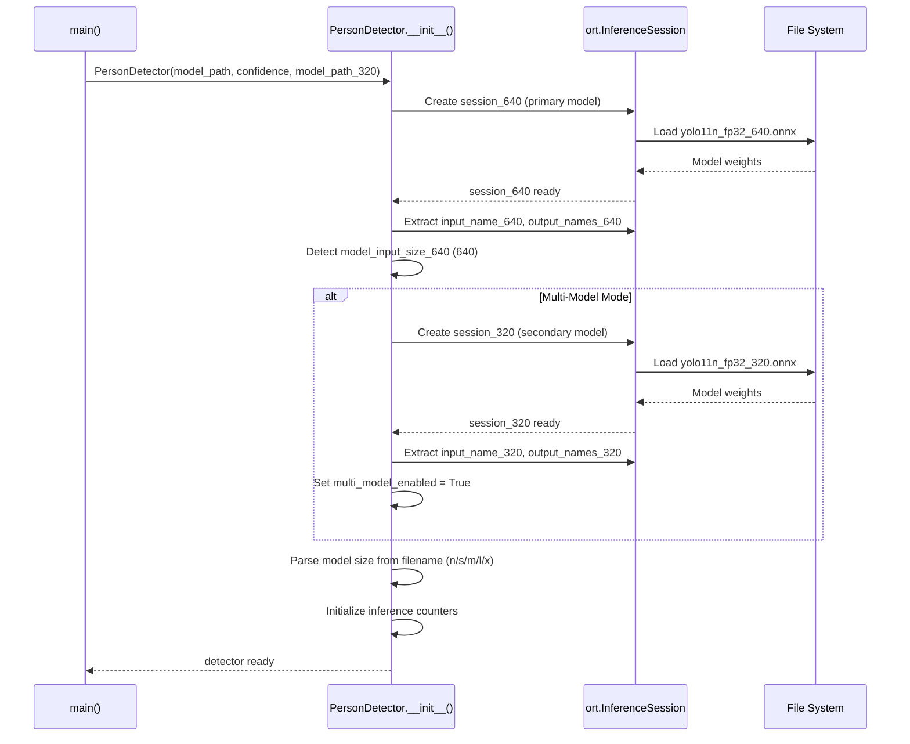
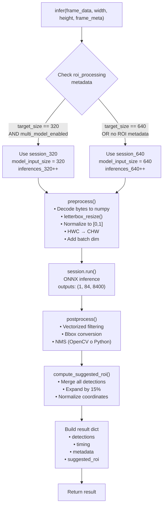
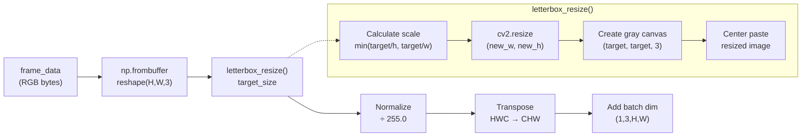
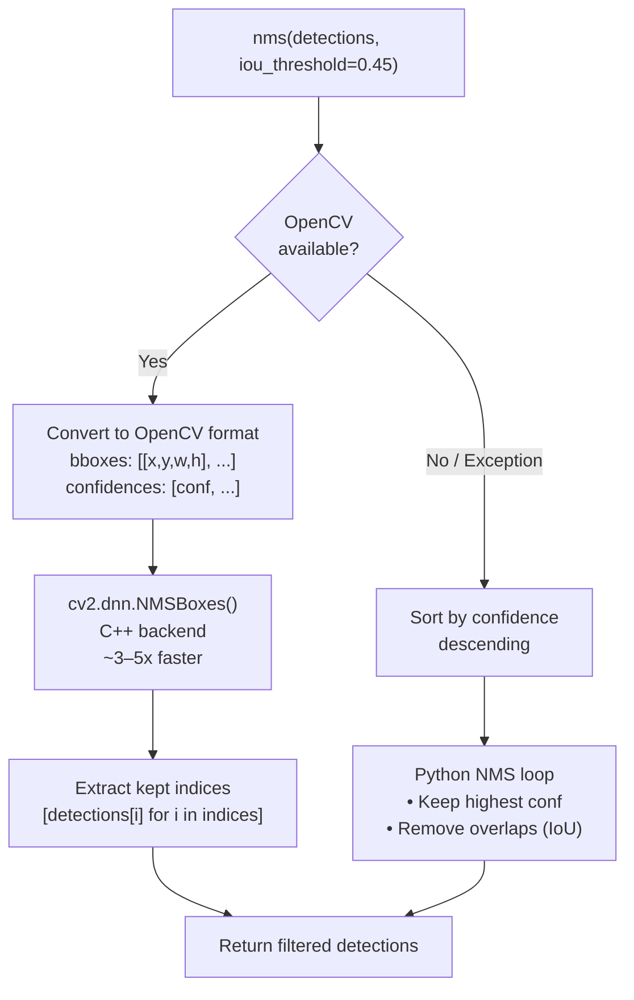
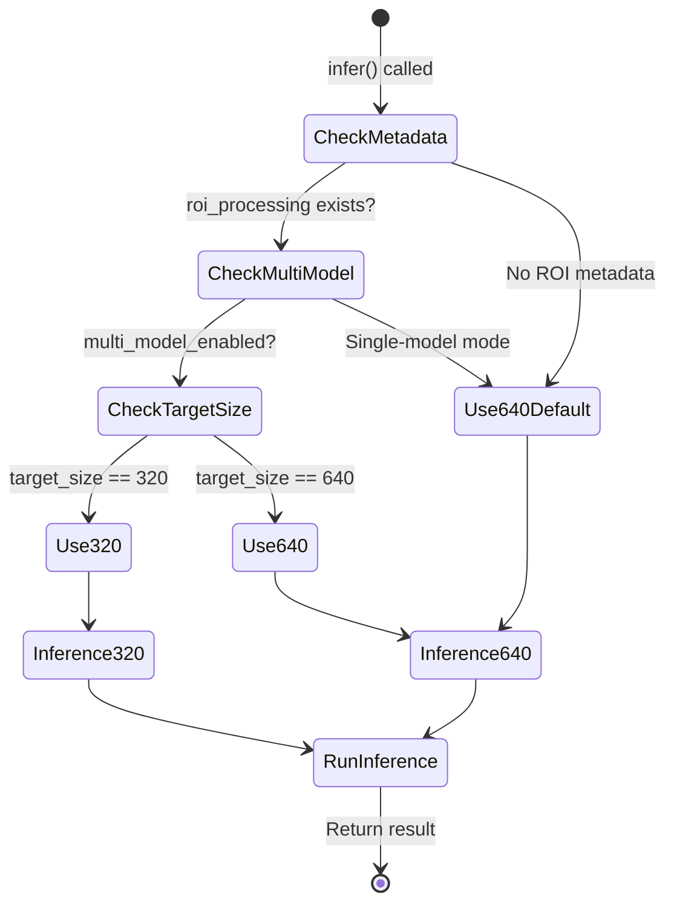
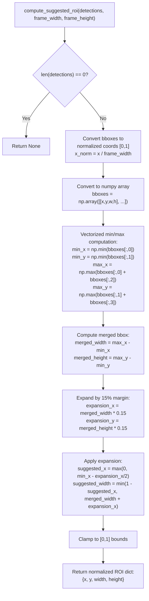
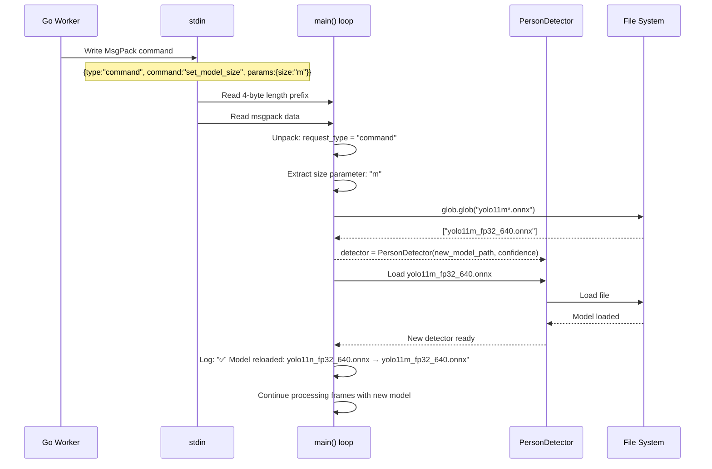
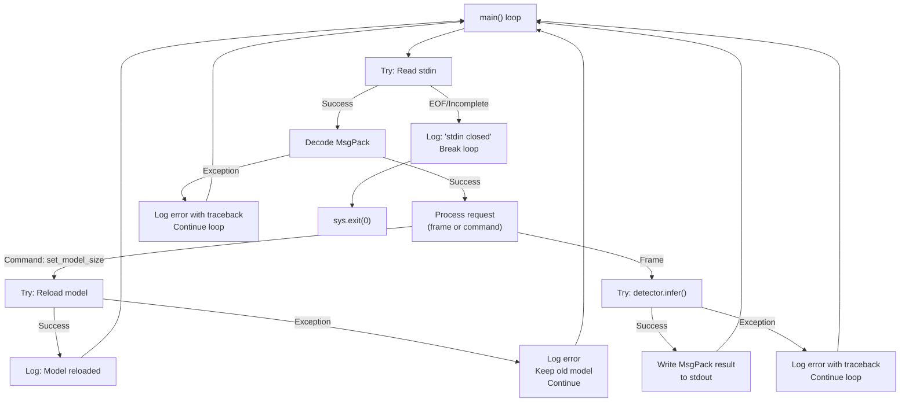
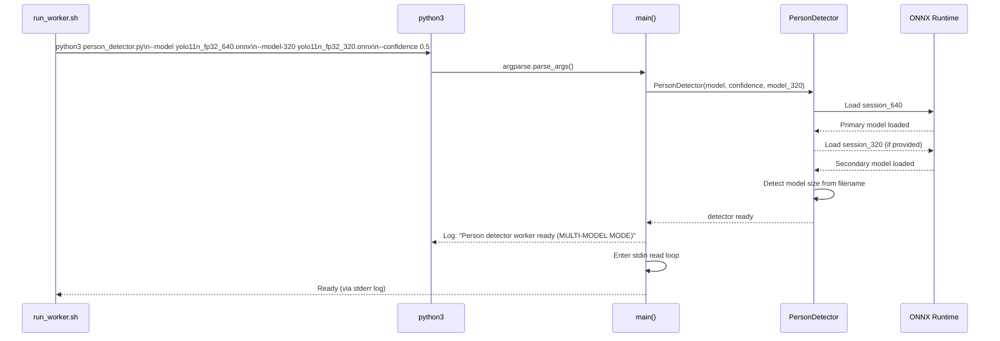
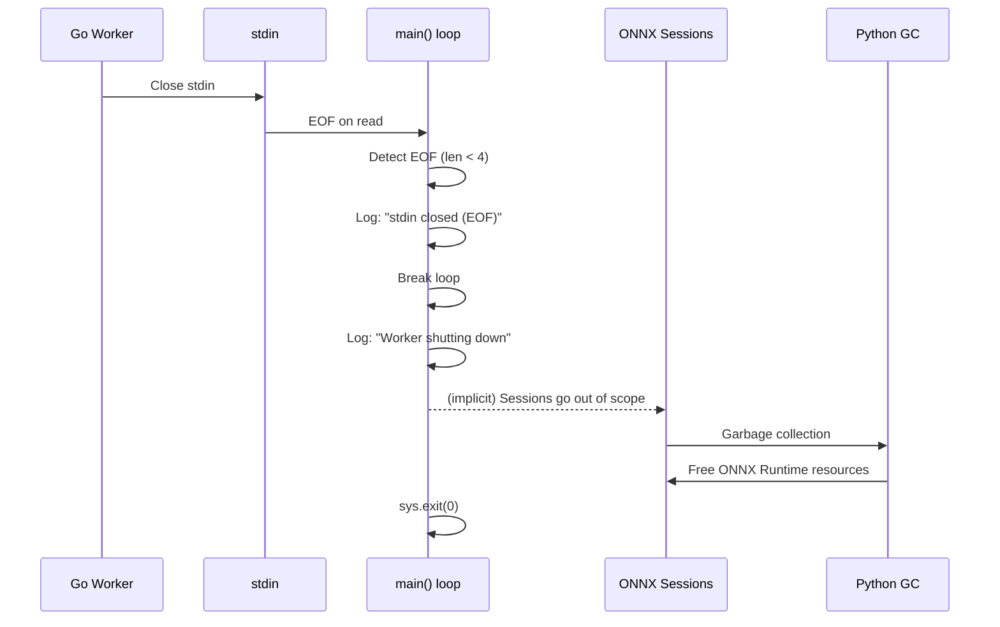

# Person Detector

Relevant source files

- [internal/roiprocessor/processor.go](internal/roiprocessor/processor.go)
- [models/person_detector.py](models/person_detector.py)

## Purpose and Scope

This document details the Python-based person detection worker implementation (`person_detector.py`), which performs YOLO11 ONNX inference for real-time person detection in video frames. The worker operates as a subprocess spawned by the Go service, communicating via stdin/stdout using a MsgPack-based protocol with length-prefix framing.

For information about the Go-side worker bridge that manages this Python process, see [Python Worker Bridge](2.5-python-worker-bridge.md). For details on the ROI attention system that selects which model to use, see [ROI Attention System](#2.3-roi-attention-system).

**Sources:** [models/person_detector.py1-329](models/person_detector.py#L1-L329)

---

## Architecture Overview

The person detector operates as an independent Python subprocess that receives frame data from Go and returns detection results. It maintains two ONNX Runtime sessions (320x320 and 640x640 models) to support the ROI attention system's multi-model optimization strategy.


```mermaid
flowchart LR
  %% Clúster Go
  subgraph GO["Go Worker Manager"]
    Manager["PythonPersonDetector<br/>(person_detector_python.go)"]
    InputChan["input channel<br/>(buffered: 5)"]
    ResultsChan["results channel<br/>(buffered: 10)"]

    Manager --> InputChan
    ResultsChan --> Manager
  end

  %% Clúster Python
  subgraph PY["Python Process (person_detector.py)"]
    Main["main() loop"]
    Detector["PersonDetector class"]

    Main --> Detector

    S320["session_320<br/>(ONNX Runtime)"]
    S640["session_640<br/>(ONNX Runtime)"]

    Detector -- "select model based on<br/>roi_processing.target_size" --> S320
    Detector -- "select model based on<br/>roi_processing.target_size" --> S640
  end

  %% Clúster ONNX
  subgraph ONNX["ONNX Models"]
    M320["yolo11n_fp32_320.onnx<br/>(320x320)"]
    M640["yolo11n_fp32_640.onnx<br/>(640x640)"]
  end

  %% Vínculos ONNX Runtime -> Modelos
  S320 -->|loads at startup| M320
  S640 -->|loads at startup| M640

  %% IPC entre Go y Python
  Manager -->|stdin: MsgPack<br/>(4-byte length + data)| Main
  Main -->|stdout: MsgPack<br/>(4-byte length + data)| Manager
  Main -.->|stderr: logs| Manager
```

**Communication Protocol:**

- **Input (Go → Python):** Frame data and metadata sent as MsgPack-encoded messages with 4-byte big-endian length prefix
- **Output (Python → Go):** Detection results sent as MsgPack-encoded messages with 4-byte big-endian length prefix
- **Logging (Python → Go):** Structured logs written to stderr, parsed by Go's `logStderr` goroutine

**Sources:** [models/person_detector.py1-40](models/person_detector.py#L1-L40) [models/person_detector.py293-329](models/person_detector.py#L293-L329)

---

## PersonDetector Class

The `PersonDetector` class encapsulates all inference logic, maintaining separate ONNX Runtime sessions for the multi-model system.

### Initialization





**Key Initialization Steps:**

|Step|Code Reference|Description|
|---|---|---|
|1. Load Primary Model|[models/person_detector.py366-374](models/person_detector.py#L366-L374)|Creates `session_640` with `CPUExecutionProvider`, extracts input/output metadata|
|2. Load Secondary Model|[models/person_detector.py377-390](models/person_detector.py#L377-L390)|Creates `session_320` if `model_path_320` provided, enables multi-model flag|
|3. Detect Model Size|[models/person_detector.py392-405](models/person_detector.py#L392-L405)|Regex pattern `yolo(?:11\|v8)([nsmxl])` to extract size letter from filename|
|4. Initialize Counters|[models/person_detector.py407-409](models/person_detector.py#L407-L409)|Sets `inferences_320` and `inferences_640` to 0 for telemetry|

**Sources:** [models/person_detector.py354-409](models/person_detector.py#L354-L409)

---

## Frame Processing Pipeline

The `infer()` method orchestrates the complete inference pipeline, dynamically selecting the appropriate model based on ROI metadata.





**Sources:** [models/person_detector.py634-729](models/person_detector.py#L634-L729)

---

### Preprocessing Pipeline

The `preprocess()` method transforms raw frame bytes into YOLO-compatible input tensors using letterbox resizing to maintain aspect ratios.





**Letterbox Resize Implementation:**

The letterbox algorithm maintains aspect ratio by:

1. Computing scale factor: `min(target_size / h, target_size / w)`
2. Resizing to `(new_w, new_h)` using bilinear interpolation
3. Creating gray canvas (`np.full((target_size, target_size, 3), 114)`) to avoid edge artifacts
4. Center-pasting the resized image

**Sources:** [models/person_detector.py411-472](models/person_detector.py#L411-L472)

---

### Postprocessing and NMS

The `postprocess()` method uses vectorized NumPy operations for high-performance filtering and bounding box conversion, followed by Non-Maximum Suppression.

#### Vectorized Filtering

```
# YOLO11 output: (1, 84, 8400) → (8400, 84)
# Extract person confidences (class 0) for all 8400 proposals
person_confs = output[:, 4]  # Shape: (8400,)

# Vectorized filtering (10-20x faster than Python loop)
mask = person_confs >= confidence_threshold
filtered_output = output[mask]
filtered_confs = person_confs[mask]
```

**Sources:** [models/person_detector.py473-541](models/person_detector.py#L473-L541)

#### Bounding Box Conversion

All coordinate transformations are performed using vectorized NumPy operations:

```
# Extract bbox coordinates (vectorized)
x_centers = filtered_output[:, 0]
y_centers = filtered_output[:, 1]
widths = filtered_output[:, 2]
heights = filtered_output[:, 3]

# Convert from center format to corner format (vectorized)
scale_x = orig_width / model_input_size
scale_y = orig_height / model_input_size

x1 = ((x_centers - widths/2) * scale_x).astype(int)
y1 = ((y_centers - heights/2) * scale_y).astype(int)
x2 = ((x_centers + widths/2) * scale_x).astype(int)
y2 = ((y_centers + heights/2) * scale_y).astype(int)

# Clip to image bounds (vectorized)
x1 = np.clip(x1, 0, orig_width)
y1 = np.clip(y1, 0, orig_height)
```

**Sources:** [models/person_detector.py502-523](models/person_detector.py#L502-L523)

#### Non-Maximum Suppression




The NMS implementation prioritizes OpenCV's C++ backend for performance:

**Performance Comparison:**

|Implementation|Method|Performance|
|---|---|---|
|OpenCV NMS|`cv2.dnn.NMSBoxes()`|C++ backend, ~3-5x faster|
|Python NMS|Pure NumPy/Python|Fallback, always works|

**Sources:** [models/person_detector.py542-633](models/person_detector.py#L542-L633)

---

## Multi-Model System (ROI Attention)

The person detector supports two ONNX models simultaneously to enable the ROI attention optimization strategy. Model selection is determined by the `roi_processing.target_size` field in frame metadata.

### Model Selection Logic




**Decision Flow:**

1. **Check ROI Metadata:** If `frame_meta["roi_processing"]` exists and `multi_model_enabled == True`, proceed to model selection
2. **Check Target Size:** If `target_size == 320`, use `session_320`; otherwise use `session_640`
3. **Fallback:** If no ROI metadata or single-model mode, always use `session_640`

**Model Performance Characteristics:**

|Model|Input Size|Inference Time (CPU)|Use Case|
|---|---|---|---|
|YOLO11n 320|320x320|~10-20ms|Small ROI crops, 2-3x faster|
|YOLO11n 640|640x640|~30-50ms|Full frames or large ROIs|
|YOLO11m 640|640x640|~80-120ms|Higher accuracy mode|

**Sources:** [models/person_detector.py634-672](models/person_detector.py#L634-L672)

---

## Suggested ROI Calculation (Hybrid Auto-Focus)

The `compute_suggested_roi()` method computes a suggested Region of Interest for the **next frame** based on current detections, using vectorized NumPy operations for high performance.



### Algorithm

**Computation Performance:**

The use of NumPy vectorized operations (`np.min`, `np.max`) makes this computation **~10x faster** than equivalent Go loops, which is why this calculation is performed in Python rather than Go.

**Example:**

Given 2 person detections at:

- Detection 1: `{x: 100, y: 200, width: 80, height: 150}` (frame: 1920x1080)
- Detection 2: `{x: 500, y: 180, width: 90, height: 160}`

```
# Normalize
bbox1 = [100/1920, 200/1080, 80/1920, 150/1080]  # [0.052, 0.185, 0.042, 0.139]
bbox2 = [500/1920, 180/1080, 90/1920, 160/1080]  # [0.260, 0.167, 0.047, 0.148]

# Vectorized min/max
min_x = 0.052, min_y = 0.167
max_x = 0.260 + 0.047 = 0.307, max_y = 0.185 + 0.139 = 0.324

# Merged
merged = {x: 0.052, y: 0.167, width: 0.255, height: 0.157}

# Expand 15%
suggested = {x: 0.033, y: 0.155, width: 0.293, height: 0.181}
```

**Sources:** [models/person_detector.py731-790](models/person_detector.py#L731-L790)

---

## Communication Protocol

### Input Protocol (Go → Python)

Frames and commands are sent as MsgPack-encoded messages with 4-byte big-endian length prefixes:

```
[4 bytes: message length (big-endian)] [N bytes: msgpack data]
```

**Frame Request Schema:**

```
{
  "type": "frame",  // Optional, defaults to "frame"
  "frame_data": <bytes>,  // Raw RGB bytes (not base64!)
  "width": 1920,
  "height": 1080,
  "meta": {
    "instance_id": "node_001",
    "room_id": "room_A",
    "seq": 12345,
    "timestamp": "2025-10-09T14:30:00.123456789Z",
    "roi_processing": {  // Optional, for multi-model selection
      "target_size": 320,
      "crop_applied": false,
      "num_rois": 2
    }
  }
}
```

**Command Request Schema:**

```
{
  "type": "command",
  "command": "set_model_size",
  "params": {
    "size": "m"  // n/s/m/l/x
  }
}
```

**Sources:** [models/person_detector.py816-837](models/person_detector.py#L816-L837)

---

### Output Protocol (Python → Go)

Detection results are sent as MsgPack-encoded messages with 4-byte big-endian length prefixes:

```
{
  "type": "person_detection",
  "instance_id": "node_001",
  "room_id": "room_A",
  "timestamp": "2025-10-09T14:30:00.123456Z",
  "frame_seq": 12345,
  "data": {
    "detections": [
      {
        "bbox": {"x": 100, "y": 200, "width": 150, "height": 300},
        "confidence": 0.87
      }
    ],
    "count": 1,
    "metadata": {
      "processing_time_ms": 45.2,
      "frame_width": 1920,
      "frame_height": 1080,
      "img_size": "640x640",
      "model_size": "n",
      "imgsz": 640,
      "model_selected": "640",  // Which model was used
      "roi_attention": false,   // Was ROI attention active
      "roi_processing": null    // Echo back ROI metadata
    }
  },
  "timing": {
    "preprocess_ms": 1.5,
    "inference_ms": 42.1,
    "postprocess_ms": 1.6,
    "total_ms": 45.2
  },
  "suggested_roi": {  // For next frame (hybrid auto-focus)
    "x": 0.25,
    "y": 0.30,
    "width": 0.40,
    "height": 0.35
  }
}
```

**Sources:** [models/person_detector.py693-729](models/person_detector.py#L693-L729) [models/person_detector.py909-918](models/person_detector.py#L909-L918)

---

## Hot-Reload Support





The person detector supports runtime model hot-swapping via the `set_model_size` command, enabling model changes without process restart.

**Implementation Details:**

1. **Pattern Matching:** Supports multiple filename patterns: `yolo11{size}.onnx`, `yolo11{size}_*.onnx`, `yolov8{size}.onnx`, `yolov8{size}_*.onnx`
2. **Glob Search:** Uses `glob.glob()` to find first matching model file in the same directory as the current model
3. **Atomic Replacement:** Creates new `PersonDetector` instance, replacing the old one (old ONNX sessions garbage collected)
4. **Error Handling:** If model not found or load fails, keeps old model and logs error

**Sources:** [models/person_detector.py842-888](models/person_detector.py#L842-L888)

---

## Performance Optimizations

The person detector employs several vectorization strategies for high-throughput inference:

### Optimization Summary Table

|Optimization|Implementation|Performance Gain|Code Reference|
|---|---|---|---|
|**Vectorized Filtering**|`person_confs >= threshold` (NumPy mask)|10-20x faster than Python loop|[models/person_detector.py490-497](models/person_detector.py#L490-L497)|
|**Vectorized Bbox Conversion**|NumPy operations on all boxes simultaneously|~5-10x faster than loops|[models/person_detector.py502-523](models/person_detector.py#L502-L523)|
|**OpenCV NMS**|`cv2.dnn.NMSBoxes()` C++ backend|3-5x faster than Python NMS|[models/person_detector.py553-576](models/person_detector.py#L553-L576)|
|**OpenCV Resize**|`cv2.resize()` C++ backend|~2-3x faster than PIL|[models/person_detector.py463-471](models/person_detector.py#L463-L471)|
|**Multi-Model System**|YOLO320 for small crops|2-3x faster inference|[models/person_detector.py647-664](models/person_detector.py#L647-L664)|
|**Suggested ROI (NumPy)**|`np.min()`, `np.max()` vectorized|~10x faster than Go loops|[models/person_detector.py757-763](models/person_detector.py#L757-L763)|

### Memory Characteristics

- **Per Model:** ~500MB ONNX Runtime session
- **Multi-Model Total:** ~1GB RAM
- **Frame Buffer:** Minimal (single frame in memory)
- **CPU Usage:** 30-50% single core for YOLO11n @ 640x640

**Sources:** [models/person_detector.py246-274](models/person_detector.py#L246-L274)

---

## Error Handling





The person detector implements comprehensive error handling to maintain service stability:

**Error Categories:**

|Error Type|Handling Strategy|Impact|
|---|---|---|
|**Stdin EOF**|Clean shutdown, exit(0)|Process terminates gracefully|
|**MsgPack Decode Error**|Log error, skip message, continue|Frame dropped|
|**Missing frame_data**|Log error, skip, continue|Frame dropped|
|**ONNX Inference Error**|Log with traceback, skip frame|Frame dropped|
|**Model Reload Failure**|Log error, keep old model|Hot-reload fails, service continues|
|**KeyboardInterrupt**|Log "interrupted", clean shutdown|Process terminates gracefully|
|**Fatal Error**|Log with traceback, exit(1)|Process restart required|

**Sources:** [models/person_detector.py816-930](models/person_detector.py#L816-L930)

---

## Startup and Shutdown

### Startup Sequence




**Command-Line Arguments:**

|Argument|Required|Default|Description|
|---|---|---|---|
|`--model`|Yes|-|Path to primary ONNX model (usually 640x640)|
|`--model-320`|No|None|Path to secondary ONNX model (320x320) for ROI attention|
|`--confidence`|No|0.5|Confidence threshold for person detections|

**Sources:** [models/person_detector.py793-815](models/person_detector.py#L793-L815)

---

### Shutdown Sequence





**Graceful Shutdown Guarantees:**

1. **No explicit cleanup needed:** ONNX Runtime sessions automatically freed by Python garbage collector
2. **No data loss:** All in-flight frames are completed before shutdown
3. **Exit code 0:** Indicates clean shutdown (not a crash)

**Sources:** [models/person_detector.py820-830](models/person_detector.py#L820-L830) [models/person_detector.py929-930](models/person_detector.py#L929-L930)