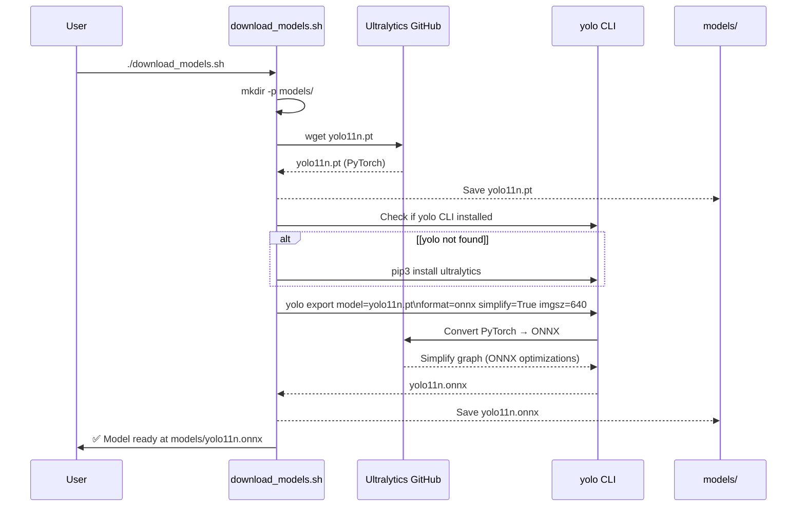
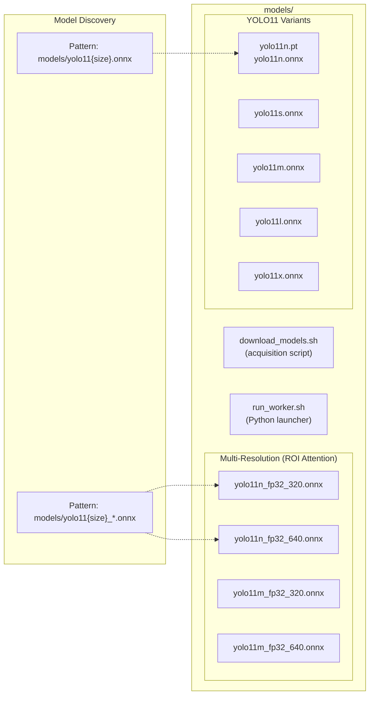
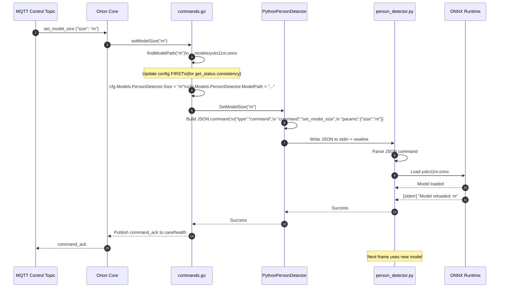

# Model Management

Relevant source files

- [internal/core/commands.go](internal/core/commands.go)
- [internal/worker/person_detector_python.go](internal/worker/person_detector_python.go)
- [models/download_models.sh](models/download_models.sh)
- [tools/orion-config/commands/model.go](tools/orion-config/commands/model.go)

This document covers the ONNX model lifecycle in the Orion system: downloading YOLO11 models, exporting them to ONNX format, organizing model files, and performing runtime model hot-swaps without service restart. For information about the Python inference worker that consumes these models, see [Person Detector](4.1-person-detector.md). For runtime configuration commands, see [Command Reference](3.2-command-reference.md).

---

## YOLO11 Model Variants

Orion supports five YOLO11 model sizes with different accuracy/speed trade-offs:

|Size|Model Name|Accuracy (COCO mAP)|Inference Time (640x640)|Use Case|
|---|---|---|---|---|
|`n`|yolo11n|~85%|~20ms|Real-time processing, high frame rates|
|`s`|yolo11s|~88%|~35ms|Balanced accuracy and speed|
|`m`|yolo11m|~92%|~50ms|Improved accuracy for critical zones|
|`l`|yolo11l|~94%|~80ms|High accuracy applications|
|`x`|yolo11x|~95%|~120ms|Maximum accuracy, lower frame rates|

The system supports multi-resolution exports for each model size (320x320 and 640x640) to enable the ROI attention system described in [ROI Attention System](#2.3-roi-attention-system).

**Sources:** [tools/orion-config/commands/model.go24-31](tools/orion-config/commands/model.go#L24-L31) [internal/worker/person_detector_python.go39-43](internal/worker/person_detector_python.go#L39-L43)

---

## Model Download Workflow




**Download and Export Process**

The `download_models.sh` script automates model acquisition:

1. **Download PyTorch checkpoint** - Fetches `.pt` file from Ultralytics releases
2. **Install Ultralytics CLI** - Ensures `yolo` command is available
3. **Export to ONNX** - Converts PyTorch model with simplification enabled
4. **Validate output** - Displays file size and configuration instructions

The script downloads from Ultralytics' official releases (v8.3.0) and uses the `yolo export` command with `simplify=True` to optimize the ONNX graph for faster inference.

**Sources:** [models/download_models.sh1-61](models/download_models.sh#L1-L61)

---

## Model File Organization





**File Naming Conventions**

Models follow a structured naming pattern:

- **Base format**: `yolo11{size}.onnx` (e.g., `yolo11n.onnx`)
- **Multi-resolution format**: `yolo11{size}_fp32_{resolution}.onnx` (e.g., `yolo11n_fp32_320.onnx`)

The `findModelPath()` function uses glob patterns to locate models:

1. First tries exact match: `models/yolo11{size}.onnx`
2. Falls back to wildcard: `models/yolo11{size}_*.onnx`

This allows flexibility in model file naming while maintaining predictable discovery.

**Sources:** [internal/core/commands.go268-287](internal/core/commands.go#L268-L287) [internal/worker/person_detector_python.go229](internal/worker/person_detector_python.go#L229-L229)

---

## Runtime Model Hot-Swap




**Hot-Swap Implementation**

The model hot-swap mechanism enables changing YOLO model size without restarting the service:

**Go Side (internal/worker/person_detector_python.go)**

- `SetModelSize(size string)` validates size (n/s/m/l/x)
- Constructs JSON command: `{"type": "command", "command": "set_model_size", "params": {"size": "m"}}`
- Writes command to Python worker's stdin with newline delimiter
- No blocking - command executes asynchronously

**Orchestration Side (internal/core/commands.go)**

- `setModelSize(size string)` orchestrates the update:
    1. Validates model size against allowed values
    2. Calls `findModelPath(size)` to locate ONNX file
    3. **Updates config FIRST** (ensures `get_status` reflects change immediately)
    4. Sends hot-swap command to all workers
    5. Rolls back config on failure

**Python Side (person_detector.py)**

- Multiplexes stdin: JSON commands vs MsgPack frames
- Detects `"type": "command"` to distinguish control messages
- Reloads ONNX model in-process (no subprocess restart)
- Logs reload confirmation to stderr

**Configuration Consistency**

The system updates `cfg.Models.PersonDetector` before sending worker commands. This ensures that if a client queries `get_status` during the swap, they see the new model size immediately rather than stale configuration.

**Sources:** [internal/worker/person_detector_python.go904-946](internal/worker/person_detector_python.go#L904-L946) [internal/core/commands.go210-266](internal/core/commands.go#L210-L266)

---

## Model Discovery and Path Resolution

**Path Resolution Algorithm**

The `findModelPath()` function implements a two-stage glob pattern search:

**Stage 1: Exact Match**

- Pattern: `models/yolo11{size}.onnx`
- Example: `models/yolo11n.onnx`
- Use case: Simple single-resolution models

**Stage 2: Wildcard Match**

- Pattern: `models/yolo11{size}_*.onnx`
- Example: `models/yolo11n_fp32_640.onnx`
- Use case: Multi-resolution models with metadata in filename

The function returns the first match from either pattern, enabling flexible file naming while maintaining predictable discovery. If no model is found, it returns an error with attempted patterns for debugging.

**Example Resolution**:

```
// Input: size = "n"
// Tries: 
//   1. "models/yolo11n.onnx" → found ✓
//   2. (skipped - already matched)
// Returns: "models/yolo11n.onnx"

// Input: size = "m" (only multi-res available)
// Tries:
//   1. "models/yolo11m.onnx" → not found
//   2. "models/yolo11m_*.onnx" → matches "yolo11m_fp32_640.onnx" ✓
// Returns: "models/yolo11m_fp32_640.onnx"
```

**Sources:** [internal/core/commands.go268-287](internal/core/commands.go#L268-L287)

---

## Multi-Model ROI Attention Support


```mermaid
flowchart LR
    %% Clusters
    subgraph Config[Worker Configuration]
        MP640[modelPath<br/>(640x640 primary)]
        MP320[modelPath320<br/>(320x320 secondary)]
    end

    subgraph Worker[PythonPersonDetector]
        Init[NewPythonPersonDetector()]
        Spawn[spawnPythonProcess()]
    end

    subgraph PyArgs[Python Launch Args]
        Arg1[--model models/yolo11n_640.onnx]
        Arg2[--model-320 models/yolo11n_320.onnx]
    end

    subgraph Py[person_detector.py]
        LoadP[Load primary model (640)]
        LoadS[Load secondary model (320)]
        Select[Select model based on<br/>frame.roi_processing.target_size]
    end

    %% Edges
    MP640 --> Init
    MP320 --> Init
    Init  --> Spawn
    Spawn --> Arg1
    Spawn --> Arg2
    Arg1  --> LoadP
    Arg2  --> LoadS
    LoadP --> Select
    LoadS --> Select
```


**Multi-Resolution Model Loading**

The worker supports loading two ONNX models simultaneously to enable intelligent model selection based on ROI size:

**Configuration**

- `modelPath`: Primary 640x640 model (always required)
- `modelPath320`: Secondary 320x320 model (optional, enables ROI attention)

**Worker Initialization** When `modelPath320` is configured:

1. Worker logs: `"multi-model ROI attention enabled"`
2. Spawns Python with `--model-320` argument
3. Python loads both models into ONNX Runtime

**Runtime Selection** The ROI processor (see [ROI Attention System](#2.3-roi-attention-system)) sets `frame.ROIProcessing.TargetSize` to either 320 or 640 based on merged ROI area. Python worker selects the appropriate model for each frame.

**Sources:** [internal/worker/person_detector_python.go261-305](internal/worker/person_detector_python.go#L261-L305) [internal/worker/person_detector_python.go378-396](internal/worker/person_detector_python.go#L378-L396)

---

## Configuration Integration

**YAML Configuration Example**

```
models:
  person_detector:
    model_path: models/yolo11n_fp32_640.onnx
    model_path_320: models/yolo11n_fp32_320.onnx  # Optional for ROI attention
    size: n
    confidence: 0.5
    max_inference_rate_hz: 2.0
```

**Runtime Configuration Commands**

```
# Set model size (hot-swap)
mosquitto_pub -t "care/control/node_001" -m '{
  "command": "set_model_size",
  "params": {"size": "m"}
}'

# Query current model
mosquitto_pub -t "care/control/node_001" -m '{"command": "get_status"}'
```

The `get_status` response includes current model configuration:

```
{
  "config": {
    "models": {
      "person_detector": {
        "model_path": "models/yolo11m.onnx",
        "size": "m",
        "confidence": 0.5,
        "max_inference_rate_hz": 2.0
      }
    }
  }
}
```

**Sources:** [internal/core/commands.go14-92](internal/core/commands.go#L14-L92) [tools/orion-config/commands/model.go1-91](tools/orion-config/commands/model.go#L1-L91)