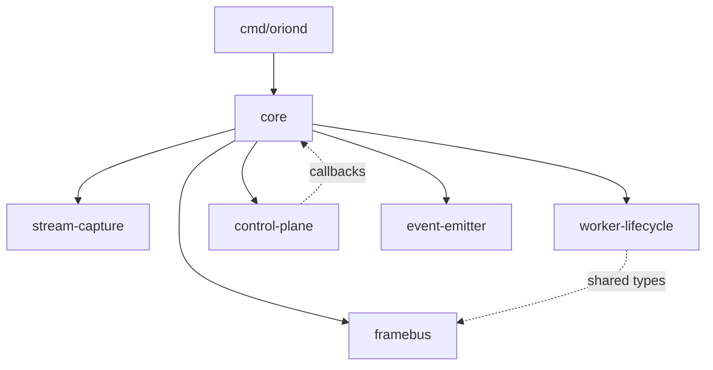

# ADR-001: Multi-Module Monorepo Layout

**Fecha**: 2025-11-03
**Estado**: ✅ Aprobado
**Autores**: Ernesto (Visiona) + Gaby (AI Companion)
**Contexto**: Sprint Planning - Orion 2.0 Foundation (v1.5)

---

## 📋 Contexto y Problema

Durante la planificación de Orion 2.0, necesitábamos decidir la estructura de paquetes para implementar bounded contexts claros según el C4 Model.

### Opciones Evaluadas

1. **Multi-Module Monorepo** (Kubernetes style)
2. **Single Module + Internal Packages** (HashiCorp style)
3. **Hybrid - Core + Plugin Modules** (NATS.io style)

### Requerimientos Clave

- ✅ Bounded contexts independientes con evolución propia
- ✅ Documentación localizada por módulo (CLAUDE.md, BACKLOG, DESIGN)
- ✅ Recipes configurables (edge-device vs datacenter)
- ✅ Versionado semántico independiente por módulo
- ✅ Testing granular (módulo por módulo)
- ✅ Path claro para añadir nuevos bounded contexts

---

## 🎯 Decisión

**Elegimos Opción 1: Multi-Module Monorepo (Go Workspaces)**

### Clarificación: Mono-repo vs Multi-repo

✅ **SÍ hacemos**: Multi-Module **MONO-REPO**
- Un solo repositorio Git: `github.com/e7canasta/orion-care-sensor`
- Múltiples módulos Go (cada uno con `go.mod`)
- Go workspace (`go.work`) para desarrollo local
- Commits atómicos cross-module

❌ **NO hacemos**: Multi-repo (repos separados por módulo)
- NO: `github.com/e7canasta/orion-stream-capture` (repo separado)
- NO: `github.com/e7canasta/orion-worker-lifecycle` (repo separado)

### Estructura

```
OrionWork/
├── go.work                          # Workspace declaration
├── modules/
│   ├── stream-capture/              # BC: Stream Acquisition
│   │   ├── go.mod
│   │   ├── CLAUDE.md                # Documentación específica
│   │   ├── BACKLOG.md               # Sprint 1.1
│   │   ├── docs/DESIGN.md
│   │   └── internal/                # Privado al módulo
│   ├── worker-lifecycle/            # BC: Worker Lifecycle
│   │   ├── go.mod
│   │   ├── CLAUDE.md
│   │   ├── BACKLOG.md               # Sprint 1.2
│   │   └── docs/
│   ├── framebus/                    # BC: Frame Distribution
│   ├── control-plane/               # BC: Control Plane
│   ├── event-emitter/               # BC: Event Emission
│   └── core/                        # BC: Application Core
└── cmd/oriond/                      # Binary principal
```

### Module Paths

```
github.com/e7canasta/orion/stream-capture
github.com/e7canasta/orion/worker-lifecycle
github.com/e7canasta/orion/framebus
github.com/e7canasta/orion/control-plane
github.com/e7canasta/orion/event-emitter
github.com/e7canasta/orion/core
github.com/e7canasta/orion/oriond
```

---

## 💡 Rationale

### Por Qué Multi-Module

1. **Evolución Independiente**
   - Cada módulo puede llegar a `v1.0` a su propio ritmo
   - Breaking changes no afectan módulos no dependientes
   - Semantic versioning real por bounded context

2. **Documentación Localizada**
   - Cada módulo con su `CLAUDE.md` específico
   - Backlog granular (Sprint 1.1 en stream-capture, Sprint 1.2 en worker-lifecycle)
   - Decisiones arquitectónicas documentadas en `docs/DESIGN.md` del módulo
   - Proposals/RFCs en `docs/proposals/` del módulo

3. **Recipes Configurables**
   ```yaml
   # recipes/edge-device.yaml
   modules:
     - stream-capture@v0.1.0
     - worker-lifecycle@v0.1.0
     - framebus@v0.1.0
     - core@v0.1.0

   # recipes/datacenter.yaml
   modules:
     - stream-capture@v0.2.0  # Multi-stream support
     - worker-lifecycle@v0.3.0  # Advanced orchestration
     - framebus@v0.2.0
     - control-plane@v0.2.0
     - core@v0.2.0
   ```

4. **Testing Granular**
   ```bash
   # Test solo stream-capture
   cd modules/stream-capture && go test ./...

   # Test todos los módulos
   ./scripts/test-all.sh
   ```

5. **Boundary Enforcement**
   - Go no permite importar `internal/` de otro módulo
   - Dependencias circulares detectadas por Go toolchain
   - Public API explícita por módulo

### Por Qué NO Single Module

- ❌ Acoplamiento accidental (Go permite importar `internal/worker` desde `internal/stream`)
- ❌ Versionado global (breaking change en un módulo afecta versión de todos)
- ❌ Documentación centralizada dificulta entender bounded contexts
- ❌ No hay enforcement de dependency graph

### Por Qué NO Hybrid Plugin

- ❌ Over-engineering para v1.5
- ❌ Complejidad en bootstrapping
- ❌ Plugin pattern premature optimization

---

## 🏗️ Dependency Graph



**Dependency Rules**:
- ✅ `cmd/oriond` → `core` (entry point)
- ✅ `core` → all modules (orchestrator)
- ✅ Leaf modules (`stream`, `framebus`, `emitter`) are independent
- ❌ `stream` CANNOT import `worker` (enforced by Go)
- ❌ Circular dependencies forbidden

---

## 🏷️ Versionado en Mono-repo

### Git Tags por Módulo

Aunque es un solo repositorio, cada módulo se versiona independientemente:

```bash
# Versionar módulo stream-capture
git tag modules/stream-capture/v0.1.0
git push origin modules/stream-capture/v0.1.0

# Versionar módulo worker-lifecycle
git tag modules/worker-lifecycle/v0.1.0
git push origin modules/worker-lifecycle/v0.1.0

# Versionar core (puede tener versión diferente)
git tag modules/core/v0.2.0
git push origin modules/core/v0.2.0
```

### Consumo Externo (Otros Proyectos)

```go
// Otro proyecto puede importar módulos específicos
import (
    capture "github.com/e7canasta/orion-care-sensor/modules/stream-capture"
    worker "github.com/e7canasta/orion-care-sensor/modules/worker-lifecycle"
)

// go.mod especifica versiones independientes
require (
    github.com/e7canasta/orion-care-sensor/modules/stream-capture v0.1.0
    github.com/e7canasta/orion-care-sensor/modules/worker-lifecycle v0.2.0
)
```

### Desarrollo Local (Go Workspace)

Durante desarrollo en el workspace, `go.work` usa paths locales:

```go
// go.work
go 1.21

use (
    ./modules/stream-capture
    ./modules/worker-lifecycle
    ./modules/core
    ./cmd/oriond
)
```

**Benefit**: No necesitas `replace` directives en `go.mod` durante desarrollo local.

---

## 📚 Documentation Structure Per Module

Cada módulo incluye:

```
modules/stream-capture/
├── CLAUDE.md              # Guía para AI companion (Claude)
├── README.md              # Overview para humanos
├── BACKLOG.md             # Sprint-specific tasks
├── docs/
│   ├── DESIGN.md          # Architectural decisions
│   └── proposals/         # RFCs antes de implementar
└── internal/              # Implementation details
```

### Template: CLAUDE.md

```markdown
# CLAUDE.md - {Module Name}

## Module Overview
**Bounded Context**: {Context Name}
**Module Path**: github.com/e7canasta/orion/{module}
**Version**: v0.1.0

## Responsibility
- ✅ What this module DOES

## Anti-Responsibility
- ❌ What this module DOES NOT do

## Public API
```go
// Interfaces y tipos exportados
```

## Dependencies
- Internal packages
- External modules

## Testing
```bash
# How to run tests
```

## Backlog
See BACKLOG.md for sprint-specific tasks
```

---

## 🔧 Go Workspace Configuration

`go.work`:
```go
go 1.21

use (
    ./modules/stream-capture
    ./modules/worker-lifecycle
    ./modules/framebus
    ./modules/control-plane
    ./modules/event-emitter
    ./modules/core
    ./cmd/oriond
)
```

**Benefits**:
- Local development con replace directives automáticos
- Un solo `go mod download` para todo el workspace
- IDE support (gopls entiende workspaces)

---

## 🚀 Migration Path (Orion 1.0 → 2.0)

### Phase 1: Scaffold (Sprint 1.1)
1. Crear estructura `modules/`
2. Generar `go.work`
3. Migrar `stream-capture` como módulo piloto
4. Crear template `CLAUDE.md` reutilizable

### Phase 2: Extract Modules (Sprint 1.2, 2)
1. Extraer `worker-lifecycle`
2. Extraer `control-plane`
3. Extraer `framebus`, `event-emitter`

### Phase 3: Core Orchestrator (Sprint 3)
1. Extraer `core` como módulo orquestador
2. Actualizar `cmd/oriond` para usar módulos
3. Validar dependency graph

---

## 🎸 Consecuencias

### Positivas ✅

1. **Claridad Arquitectónica**
   - Bounded contexts enforcement a nivel de Go toolchain
   - Documentación localizada reduce cognitive load
   - Dependency graph explícito

2. **Escalabilidad**
   - Añadir nuevos módulos sin modificar existentes
   - Versioning independiente permite evolución gradual
   - Recipes permiten deployments configurables

3. **Developer Experience**
   - CLAUDE.md específico acelera onboarding por módulo
   - Testing granular reduce tiempo de feedback loop
   - Backlog granular facilita pair programming

4. **Mantenibilidad**
   - Breaking changes aislados por módulo
   - Proposals/RFCs documentan decisiones antes de implementar
   - ADRs (como este) capturan context histórico

### Negativas ⚠️

1. **Complejidad Inicial**
   - Overhead de setup (go.work, múltiples go.mod)
   - Curva de aprendizaje para Go workspaces
   - Más archivos que mantener (CLAUDE.md, BACKLOG.md por módulo)

2. **Dependency Management**
   - Versioning entre módulos requiere disciplina
   - Breaking changes necesitan coordinación
   - `go.work` puede divergir de production builds

3. **Tooling**
   - Algunos tools no entienden workspaces (legacy)
   - CI/CD necesita scripts para test all modules
   - IDEs antiguos pueden tener issues

### Mitigations 🛡️

1. **Scripts de Automatización**
   - `scripts/create-module.sh` - Genera estructura completa
   - `scripts/test-all.sh` - Run tests de todos los módulos
   - `scripts/sync-versions.sh` - Detecta version mismatches

2. **Templates Reutilizables**
   - Template de CLAUDE.md en `BACKLOG/TEMPLATES/`
   - Template de BACKLOG.md sprint-specific
   - Template de docs/DESIGN.md

3. **Documentation Discipline**
   - Regla: No commit sin actualizar BACKLOG.md si hay lecciones
   - Regla: Breaking changes requieren ADR
   - Regla: Proposals en `docs/proposals/` antes de implementar

---

## 🔗 Referencias

- [C4 Model - Orion 2.0](../C4_MODEL.md)
- [Plan Evolutivo](../ORION_2.0_PLAN_EVOLUTIVO.md)
- [Backlog - Fase 1](../../../BACKLOG/FASE_1_FOUNDATION.md)
- [Go Workspaces Documentation](https://go.dev/doc/tutorial/workspaces)
- [Kubernetes Project Layout](https://github.com/kubernetes/kubernetes)

---

## 📝 Notas de Sesión

**Contexto de la decisión**:
- Ernesto pidió "estado del arte en estructura de paquetes"
- Se evaluaron 3 opciones (multi-module, single-module, hybrid)
- Decisión basada en:
  - Evolución independiente de bounded contexts
  - Documentación localizada (CLAUDE.md, BACKLOG por módulo)
  - Recipes configurables para deployments
  - Versionado semántico real

**Quote de Ernesto**:
> "me gusta el uno te explico por que por que van a ir evolucionando vamos a configurar distintas recipes.. ademas cada modulo debe tener su proppio claude.md y documentacion que es importante tener su propiop plan y backlog, proposals y disenio"

**Filosofía aplicada**:
- ✅ "Complejidad por diseño, no por accidente"
- ✅ Bounded contexts claros (C4 Model)
- ✅ Knowledge Management (documentación localizada)
- ✅ "Tocar blues = conocer escalas + improvisar con contexto"

---

**Estado**: ✅ Aprobado
**Próximo paso**: Crear scaffold de directorios + templates (Sprint 1.1)
