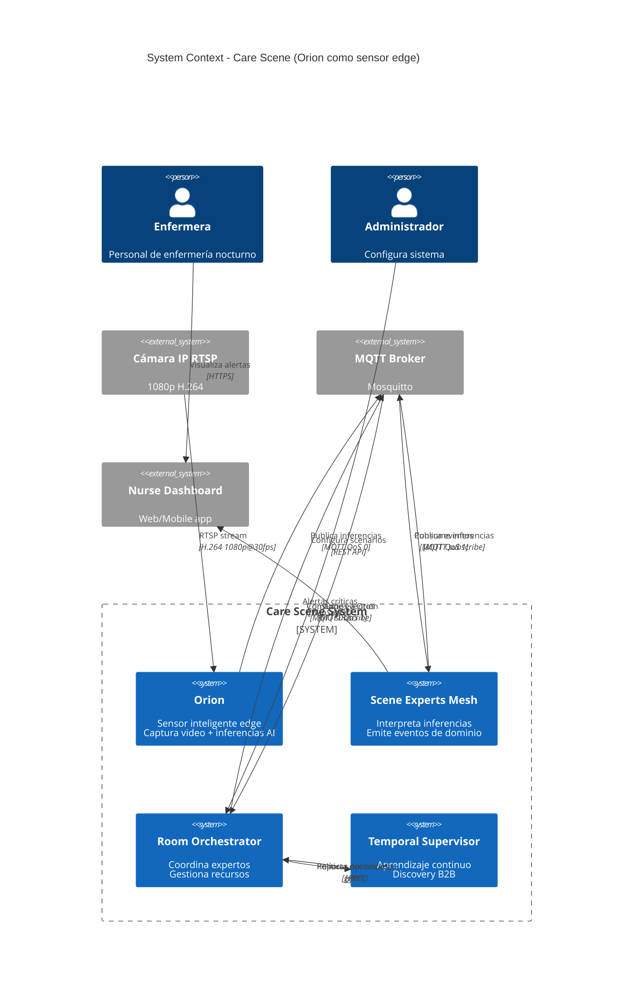
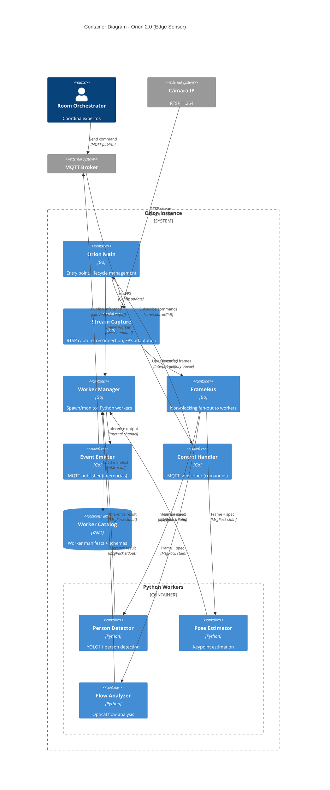
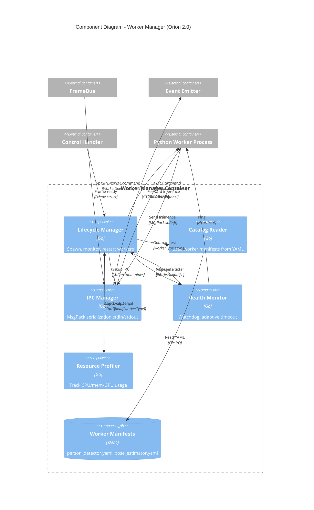
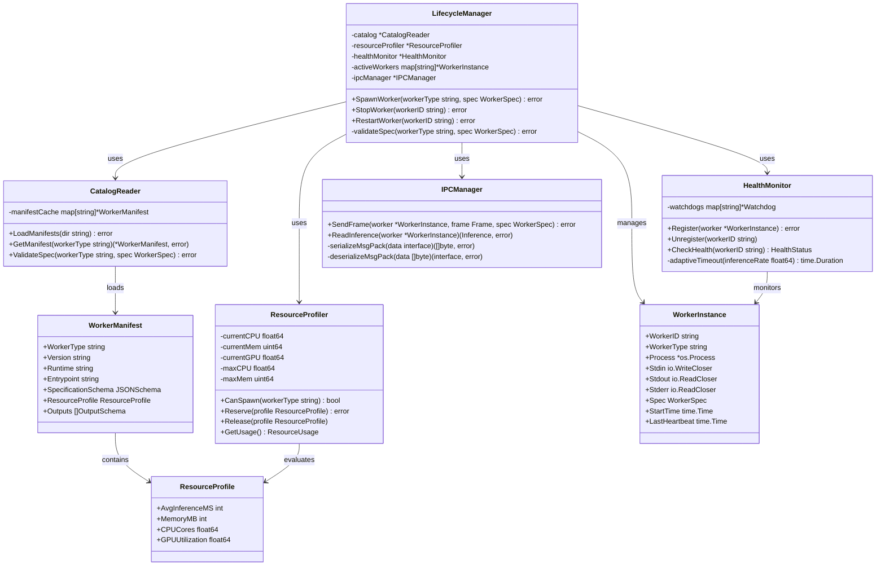

# 🏗️ C4 Model - Orion 2.0 + Care Scene

**Versión:** Draft v1.0
**Fecha:** 2025-11-03
**Autores:** Ernesto (Visiona) + Gaby (AI Companion)
**Propósito:** Blueprint arquitectónico para Orion 2.0 en contexto Care Scene

---

## 📐 C1 - System Context Diagram

### **"El Big Picture: Orion en el ecosistema Care Scene"**



### **Descripción de Actores y Sistemas**

| Elemento | Tipo | Responsabilidad |
|---|---|---|
| **Enfermera** | Actor | Recibe alertas, interviene en situaciones de riesgo |
| **Administrador** | Actor | Configura scenarios, gestiona políticas |
| **Orion** | System | Sensor objetivo: captura video, ejecuta workers AI, emite inferencias |
| **Scene Experts Mesh** | System | Interpreta inferencias, emite eventos de dominio (sleep.restless, edge.confirmed) |
| **Room Orchestrator** | System | Coordina expertos, gestiona recursos, ejecuta scenarios |
| **Temporal Supervisor** | System | Aprendizaje continuo, discovery B2B, compliance |
| **Cámara IP** | External | Fuente de video RTSP |
| **MQTT Broker** | External | Bus de eventos (data + control plane) |
| **Nurse Dashboard** | External | UI para enfermeras |

---

## 📦 C2 - Container Diagram

### **"Dentro de Orion: Containers y su interacción"**



### **Descripción de Containers**

| Container | Tecnología | Responsabilidad | Bounded Context |
|---|---|---|---|
| **Orion Main** | Go | Entry point, config loader, lifecycle | Application Core |
| **Stream Capture** | Go (GStreamer CGo) | RTSP capture, reconnection, warm-up | Stream Acquisition |
| **Worker Manager** | Go | Spawn/monitor Python workers, IPC MsgPack | Worker Lifecycle |
| **FrameBus** | Go | Non-blocking fan-out, drop policy | Frame Distribution |
| **Event Emitter** | Go | MQTT publisher (data plane) | Event Emission |
| **Control Handler** | Go | MQTT subscriber (control plane) | Command Processing |
| **Worker Catalog** | YAML files | Worker manifests, schemas, resource profiles | Worker Registry |
| **Person Detector** | Python (ONNX) | YOLO11 person detection | AI Inference |
| **Pose Estimator** | Python (ONNX) | Keypoint estimation | AI Inference |
| **Flow Analyzer** | Python (OpenCV) | Optical flow motion | AI Inference |

---

## 🔧 C3 - Component Diagram

### **"Dentro de Worker Manager: Componentes clave"**



### **Descripción de Componentes (Worker Manager)**

| Component             | Responsabilidad                                                     | Bounded Context             |
| --------------------- | ------------------------------------------------------------------- | --------------------------- |
| **Lifecycle Manager** | Spawn workers via exec.Command, monitor processes, one-shot restart | Worker Process Management   |
| **Catalog Reader**    | Load YAML manifests, validate schemas, cache manifests              | Worker Configuration        |
| **IPC Manager**       | MsgPack serialization, 4-byte length prefix, stdin/stdout handling  | Inter-Process Communication |
| **Health Monitor**    | Adaptive watchdog (max(30s, 3×inference_period)), heartbeat checks  | Worker Health               |
| **Resource Profiler** | Track CPU/mem/GPU usage, CanSpawn decision, resource limits         | Resource Management         |

---

## 💻 C4 - Code Diagram (Ejemplo: Lifecycle Manager)

### **"Código real: LifecycleManager en Go"**



### **Pseudocódigo (SpawnWorker)**

```go
// internal/worker/lifecycle_manager.go

func (lm *LifecycleManager) SpawnWorker(workerType string, spec WorkerSpec) error {
    // 1. Get manifest from catalog
    manifest, err := lm.catalog.GetManifest(workerType)
    if err != nil {
        return fmt.Errorf("manifest not found: %w", err)
    }

    // 2. Validate spec against manifest schema
    if err := lm.catalog.ValidateSpec(workerType, spec); err != nil {
        return fmt.Errorf("invalid spec: %w", err)
    }

    // 3. Check resource capacity
    if !lm.resourceProfiler.CanSpawn(workerType) {
        return fmt.Errorf("insufficient resources for %s", workerType)
    }

    // 4. Reserve resources
    if err := lm.resourceProfiler.Reserve(manifest.ResourceProfile); err != nil {
        return fmt.Errorf("resource reservation failed: %w", err)
    }

    // 5. Spawn subprocess
    cmd := exec.Command(manifest.Runtime, manifest.Entrypoint)

    stdin, _ := cmd.StdinPipe()
    stdout, _ := cmd.StdoutPipe()
    stderr, _ := cmd.StderrPipe()

    if err := cmd.Start(); err != nil {
        lm.resourceProfiler.Release(manifest.ResourceProfile)
        return fmt.Errorf("failed to start worker: %w", err)
    }

    // 6. Create WorkerInstance
    workerID := fmt.Sprintf("%s-%d", workerType, time.Now().Unix())
    instance := &WorkerInstance{
        WorkerID:   workerID,
        WorkerType: workerType,
        Process:    cmd.Process,
        Stdin:      stdin,
        Stdout:     stdout,
        Stderr:     stderr,
        Spec:       spec,
        StartTime:  time.Now(),
    }

    lm.activeWorkers[workerID] = instance

    // 7. Register with health monitor
    if err := lm.healthMonitor.Register(instance); err != nil {
        lm.StopWorker(workerID)
        return fmt.Errorf("health monitor registration failed: %w", err)
    }

    // 8. Setup IPC
    go lm.ipcManager.ReadLoop(instance)

    log.Printf("Worker spawned: %s (PID: %d)", workerID, cmd.Process.Pid)
    return nil
}
```

---

## 📋 Resumen de Bounded Contexts (Todos los niveles)

| Nivel | Bounded Context | Responsabilidad | Anti-responsabilidad |
|---|---|---|---|
| **C1** | Care Scene System | Sistema completo de monitoreo inteligente | ❌ NO es solo video analytics |
| **C2** | Orion | Sensor edge objetivo | ❌ NO interpreta eventos clínicos |
| **C2** | Scene Experts | Interpretación de inferencias | ❌ NO ejecuta modelos AI |
| **C2** | Room Orchestrator | Coordinación de expertos | ❌ NO hace inferencias |
| **C3** | Stream Capture | Captura RTSP, reconexión | ❌ NO procesa frames |
| **C3** | Worker Lifecycle | Spawn/monitor workers | ❌ NO conoce qué hace el worker |
| **C3** | FrameBus | Fan-out no bloqueante | ❌ NO inspecciona frames |
| **C3** | Event Emission | Publicar MQTT | ❌ NO interpreta eventos |
| **C4** | Lifecycle Manager | Gestión de procesos Python | ❌ NO ejecuta inferencias |
| **C4** | Catalog Reader | Carga manifests YAML | ❌ NO ejecuta workers |
| **C4** | IPC Manager | Serialización MsgPack | ❌ NO valida datos |
| **C4** | Health Monitor | Watchdog adaptativo | ❌ NO reinicia infinito |

---

## 🎯 Uso del C4 Model en Próximas Sesiones

### **Para Sprint Planning:**
1. **C1 Context:** ¿Qué sistema externo necesitamos integrar?
2. **C2 Container:** ¿Qué container modificamos/creamos?
3. **C3 Component:** ¿Qué componentes dentro del container?
4. **C4 Code:** ¿Qué clases/funciones específicas?

### **Para Code Reviews:**
1. Validar que cambios respetan bounded contexts
2. Verificar que no se cruzan anti-responsabilidades
3. Confirmar que APIs entre containers son claras

### **Para Onboarding:**
1. Nuevo dev lee C1 → Entiende big picture (30 min)
2. Lee C2 → Entiende containers (1 hora)
3. Lee C3 del área que tocará → Entiende componentes (2 horas)
4. Lee C4 si necesita código específico (1 hora)

**Total: ~4-5 horas para entender arquitectura completa** (vs 2-3 días sin C4)

---

## 📁 Dónde Guardar Este C4 Model

```
OrionWork/
├── docs/
│   ├── DESIGN/
│   │   ├── Big Picture.md              # Existente
│   │   ├── C4_MODEL.md                 # NUEVO (este archivo)
│   │   └── ARCHITECTURE_DECISIONS.md   # Futuro (ADRs)
│   └── API/
│       ├── MQTT_TOPICS.md              # Data/Control plane
│       └── WORKER_CATALOG_SCHEMA.md    # Worker manifests
└── CLAUDE.md                           # Referencia a C4 Model
```

---

## 🎸 Epílogo

> **"Un buen diagrama vale más que mil líneas de código para entender arquitectura."**

Este C4 Model es **vivo**. Se actualiza con cada cambio arquitectónico significativo.

**Para próxima sesión:**
- ✅ Tenemos C4 completo
- ✅ Tenemos Plan Evolutivo (3 fases)
- ✅ Tenemos Memoria de Valor
- ✅ Tenemos Manifiesto Blues

**Listo para Sprint 1: Bounded Contexts Básicos** 🚀

---

**Versión:** Draft v1.0
**Fecha:** 2025-11-03
**Autores:** Ernesto (Visiona) + Gaby (AI Companion)

---

**📚 Documentación Relacionada:**
- [Big Picture.md](Big%20Picture.md) - Arquitectura Orion 1.0
- [MANIFESTO_DISENO - Blues Style.md](../../MANIFESTO_DISENO%20-%20Blues%20Style.md) - Filosofía de diseño
- [../CLAUDE.md](../../CLAUDE.md) - Guía general del proyecto
