# FrameBus Architecture

Relevant source files:
- [framebus.go](framebus.go)
- [internal/bus/bus.go](internal/bus/bus.go)
- [CLAUDE.md](CLAUDE.md)
- [README.md](README.md)

---

## Purpose and Scope

The FrameBus module provides **non-blocking frame distribution** to multiple subscribers using a fan-out pattern with intentional drop policy. This document covers the architectural design, implementation details, concurrency model, performance characteristics, and design decisions of the FrameBus module as a standalone library within the Orion 2.0 multi-module architecture.

For high-level overview and bounded context, see [CLAUDE.md](CLAUDE.md). For usage examples and quick start, see [README.md](README.md).

---

## Architectural Position

FrameBus is a **foundational bounded context** in the Orion 2.0 architecture, designed as a **generic, reusable library** with zero dependencies on other Orion modules.

### System Context (C4 Level 1)


**Sources:** [CLAUDE.md#L6-L23](CLAUDE.md#L6-L23)

### Container Diagram (C4 Level 2)


**Sources:** [internal/bus/bus.go#L94-L112](internal/bus/bus.go#L94-L112)

---

## Component Architecture (C4 Level 3)

### Internal Structure

The FrameBus implementation follows Go's `internal/` package pattern to enforce API boundaries:

```
framebus/
├── framebus.go         # Public API (type aliases)
├── helpers.go          # Public utility functions
├── doc.go              # Package documentation
└── internal/
    └── bus/
        ├── bus.go      # Core implementation
        └── bus_test.go # Unit tests
```

**API Boundary Enforcement:**
- ✅ Compiler prevents external imports of `internal/bus`
- ✅ Public API in `framebus.go` uses type aliases to internal types
- ✅ Implementation details hidden from consumers
- ✅ Enables evolution without breaking changes

**Sources:** [framebus.go#L44-L76](framebus.go#L44-L76), [CLAUDE.md#L348-L371](CLAUDE.md#L348-L371)

### Component Decomposition


**Sources:** [internal/bus/bus.go#L88-L112](internal/bus/bus.go#L88-L112)

---

## Core Data Structures

### Frame Structure

The `Frame` type is intentionally generic and metadata-rich:

```go
type Frame struct {
    Data      []byte            // Raw frame data (JPEG, PNG, raw pixels)
    Seq       uint64            // Monotonic sequence number
    Timestamp time.Time         // Capture timestamp
    Metadata  map[string]string // Extensible metadata
}
```

**Design Rationale:**
- `Data []byte` - Opaque binary payload, no assumptions about encoding
- `Seq uint64` - Enables duplicate detection and ordering
- `Timestamp time.Time` - High-precision timing for latency tracking
- `Metadata map[string]string` - Extensible context (room_id, instance_id, ROI data)

**Sources:** [internal/bus/bus.go#L14-L27](internal/bus/bus.go#L14-L27)

### Statistics Structures

```go
type BusStats struct {
    TotalPublished uint64                    // Publish() call count
    TotalSent      uint64                    // Sum(sent) across subscribers
    TotalDropped   uint64                    // Sum(dropped) across subscribers
    Subscribers    map[string]SubscriberStats // Per-subscriber breakdown
}

type SubscriberStats struct {
    Sent    uint64  // Frames successfully sent
    Dropped uint64  // Frames dropped (channel full)
}

// Internal atomic counters (not exported)
type subscriberStats struct {
    sent    atomic.Uint64
    dropped atomic.Uint64
}
```

**Invariant Property:**
```
TotalSent + TotalDropped == TotalPublished × len(Subscribers)
```

This invariant is enforced by the `Publish()` implementation and verified in property-based tests.

**Sources:** [internal/bus/bus.go#L29-L51](internal/bus/bus.go#L29-L51), [internal/bus/bus.go#L88-L92](internal/bus/bus.go#L88-L92)

---

## Concurrency Model

### Thread Safety Guarantees

FrameBus provides **strong concurrency guarantees** without requiring caller coordination:

| Operation | Concurrent Publishers | Concurrent Subscribe/Unsubscribe | Concurrent Stats |
|-----------|----------------------|-----------------------------------|------------------|
| `Publish()` | ✅ Safe | ✅ Safe | ✅ Safe |
| `Subscribe()` | ✅ Safe | ✅ Safe | ✅ Safe |
| `Unsubscribe()` | ✅ Safe | ✅ Safe | ✅ Safe |
| `Stats()` | ✅ Safe | ✅ Safe | ✅ Safe |
| `Close()` | ✅ Safe (idempotent) | ✅ Safe | ✅ Safe |

### Synchronization Primitives

```mermaid
graph TB
    subgraph "Synchronization Strategy"
        direction TB
        
        subgraph "RWMutex (sync.RWMutex)"
            RLOCK[RLock: Publish, Stats<br/>Read subscriber map]
            LOCK[Lock: Subscribe, Unsubscribe, Close<br/>Modify subscriber map]
        end
        
        subgraph "Atomic Operations (atomic.Uint64)"
            ATOMIC[Add: Increment counters in Publish<br/>Load: Read counters in Stats]
        end
        
        subgraph "Critical Sections"
            CS1[Publish: RLock → iterate map → atomic.Add]
            CS2[Subscribe: Lock → map insert → Unlock]
            CS3[Stats: RLock → atomic.Load → aggregate]
        end
    end
    
    RLOCK --> CS1
    RLOCK --> CS3
    LOCK --> CS2
    ATOMIC --> CS1
    ATOMIC --> CS3
    
    style RLOCK fill:#17a2b8,color:#fff,stroke:#117a8b
    style LOCK fill:#dc3545,color:#fff,stroke:#bd2130
    style ATOMIC fill:#28a745,color:#fff,stroke:#1e7e34
```



**Sources:** [internal/bus/bus.go#L94-L103](internal/bus/bus.go#L94-L103)

### Lock Contention Analysis

#### Publish() - Concurrent Fan-out (ADR-007)

**Implementation:** Goroutine-based concurrent fan-out (since 2025-11-05)

```go
func (b *bus) Publish(frame Frame) {
    b.totalPublished.Add(1)  // 1. Atomic increment (no lock)

    // 2. Fast snapshot: Capture cache pointer
    b.mu.RLock()
    if b.closed {
        b.mu.RUnlock()
        panic("publish on closed bus")
    }

    // Special case: First Publish() after Subscribe()
    if len(b.sortedCache) == 0 && b.cacheDirty.Load() {
        // Rebuild synchronously (ensures first frame not dropped)
        b.mu.RUnlock()
        b.mu.Lock()
        if b.needsSorting() {
            b.sortedCache = b.sortSubscribersByPriority()
        } else {
            b.sortedCache = b.subscribersToSlice()
        }
        b.cacheDirty.Store(false)
        b.mu.Unlock()
        b.mu.RLock()
    }

    cache := b.sortedCache
    dirty := b.cacheDirty.Load()
    b.mu.RUnlock()

    // 3. Fire-and-forget: Spawn sends concurrently
    for _, sub := range cache {
        go b.sendToSubscriber(sub, frame)  // Goroutine per subscriber
    }

    // 4. Async rebuild (if dirty) for the NEXT frame
    if dirty && len(cache) > 0 {
        go b.rebuildCacheAsync()
    }
}

func (b *bus) sendToSubscriber(sub sortedSubscriber, frame Frame) {
    // Safe stats update (subscriber might be unsubscribed)
    updateStats := func(f func(*subscriberStats)) {
        b.mu.RLock()
        stats, exists := b.stats[sub.id]
        b.mu.RUnlock()
        if exists {
            f(stats)  // Atomic ops inside
        }
    }

    select {
    case sub.entry.ch <- frame:
        updateStats(func(s *subscriberStats) { s.sent.Add(1) })
    default:
        if sub.entry.priority == PriorityCritical {
            if b.retryCritical(sub.entry.ch, frame) {
                updateStats(func(s *subscriberStats) { s.sent.Add(1) })
            } else {
                updateStats(func(s *subscriberStats) {
                    s.dropped.Add(1)
                    s.criticalDropped.Add(1)
                })
            }
        } else {
            updateStats(func(s *subscriberStats) { s.dropped.Add(1) })
        }
    }
}
```

**Concurrency Characteristics:**
- ✅ **Fire-and-forget semantics** - Publish returns immediately after spawning goroutines
- ✅ **Parallel fan-out** - All subscribers receive frames concurrently (O(1) wall-clock)
- ✅ **RLock held minimally** - Only during cache snapshot (~100ns)
- ✅ **No blocking on subscriber channels** - Each goroutine handles blocking independently
- ✅ **Safe async stats** - Update only if subscriber still exists (handles unsubscribe race)
- ✅ **Async cache rebuild** - Rebuild happens in background, applied to next frame

**Performance Comparison:**

| Subscribers | Sequential (old) | Concurrent (new) | Speedup |
|------------|------------------|------------------|---------|
| 1          | 500ns           | 329ns            | 1.5x    |
| 5          | 2.5μs           | 1.4μs            | 1.8x    |
| 10         | 5μs             | 2.7μs            | 1.8x    |
| 50         | 25μs            | 12.5μs           | 2x      |
| 100        | 50μs            | 25μs             | 2x      |

**Measured Performance:** ~2.7μs per `Publish()` call with 10 subscribers (vs 5μs sequential)

**Design Rationale:** See [ADR-007: Concurrent Fan-out](docs/adr/007-concurrent-fan-out.md)

**Sources:** [internal/bus/bus.go#L365-L408](internal/bus/bus.go#L365-L408), [internal/bus/bus.go#L718-L752](internal/bus/bus.go#L718-L752)

#### Subscribe/Unsubscribe - Rare Operations

```go
func (b *bus) Subscribe(id string, ch chan<- Frame) error {
    b.mu.Lock()          // Write lock (exclusive)
    defer b.mu.Unlock()
    
    // ... map modification ...
    
    b.subscribers[id] = ch
    b.stats[id] = &subscriberStats{}
    
    return nil
}
```

**Contention Impact:**
- ⚠️ **Blocks Publish() during modification** - Write lock blocks all readers
- ✅ **Acceptable for rare operations** - Subscribe/Unsubscribe are infrequent (startup/shutdown)
- ✅ **Sub-millisecond duration** - Map operations are O(1)

**Design Trade-off:** Prioritize read performance (Publish) over write performance (Subscribe). This aligns with the access pattern: millions of Publish calls, dozens of Subscribe calls.

**Sources:** [internal/bus/bus.go#L114-L135](internal/bus/bus.go#L114-L135), [internal/bus/bus.go#L137-L154](internal/bus/bus.go#L137-L154)

---

## Non-Blocking Publish Algorithm

### Core Algorithm (Concurrent Fan-out)

The heart of FrameBus is the concurrent fan-out with non-blocking sends:

```go
// 1. Fast snapshot (minimal lock time)
b.mu.RLock()
cache := b.sortedCache
dirty := b.cacheDirty.Load()
b.mu.RUnlock()

// 2. Fire-and-forget: Spawn goroutines for parallel sends
for _, sub := range cache {
    go b.sendToSubscriber(sub, frame)
}

// 3. Async rebuild (if needed) for next frame
if dirty && len(cache) > 0 {
    go b.rebuildCacheAsync()
}

// Non-blocking send in each goroutine
func sendToSubscriber(sub sortedSubscriber, frame Frame) {
    select {
    case sub.entry.ch <- frame:
        // Success: frame sent to subscriber
        updateStats(sent)
    default:
        // Channel full: drop frame (or retry if Critical)
        if sub.entry.priority == PriorityCritical {
            retryCritical(sub, frame)
        } else {
            updateStats(dropped)
        }
    }
}
```

This pattern provides **guaranteed non-blocking behavior** with **O(1) wall-clock time** regardless of subscriber count.

### Execution Flow

```mermaid
sequenceDiagram
    participant P as Publisher
    participant B as FrameBus
    participant G1 as Goroutine 1
    participant G2 as Goroutine 2
    participant G3 as Goroutine 3
    participant S1 as Subscriber 1 (fast)
    participant S2 as Subscriber 2 (slow)
    participant S3 as Subscriber 3 (fast)

    Note over P: Frame captured
    P->>B: Publish(frame)

    Note over B: totalPublished.Add(1)
    Note over B: RLock + snapshot
    Note over B: RUnlock (~100ns)

    par Parallel sends
        B->>G1: spawn goroutine
        B->>G2: spawn goroutine
        B->>G3: spawn goroutine
    end

    B-->>P: Return (fire-and-forget)

    rect rgba(40, 167, 69, 0.1)
        Note right of P: Publish latency: ~1-3 μs<br/>Goroutine spawn + return
    end

    par Concurrent fan-out
        G1->>S1: select { case ch <- frame }
        Note over S1: Channel has space
        S1-->>G1: ✅ Frame sent
        Note over G1: sent.Add(1)

        G2->>S2: select { case ch <- frame }
        Note over S2: Channel FULL
        S2-->>G2: ❌ Would block
        Note over G2: default: dropped.Add(1)

        G3->>S3: select { case ch <- frame }
        Note over S3: Channel has space
        S3-->>G3: ✅ Frame sent
        Note over G3: sent.Add(1)
    end

    rect rgba(23, 162, 184, 0.1)
        Note right of G1: All sends complete in parallel<br/>Wall-clock: max(send_time) ≈ 500ns
    end
```



### Timing Analysis (Concurrent Model)

| Operation | Time Complexity | Duration | Notes |
|-----------|-----------------|----------|-------|
| **Snapshot** | O(1) | ~100ns | RLock + copy pointer + RUnlock |
| **Spawn goroutines** | O(N) | ~100ns × N | Fire-and-forget (non-blocking) |
| **Publish() return** | O(1) | ~1-3μs | Returns before sends complete |
| **Send (parallel)** | O(1) per goroutine | ~500ns | All goroutines run concurrently |
| **Wall-clock total** | **O(1)** | **~1-3μs** | Independent of subscriber count |

**Sequential vs Concurrent:**
- Sequential: `O(N × 500ns)` = 5μs for 10 subscribers
- Concurrent: `O(max(500ns))` = ~2.7μs for 10 subscribers (1.8x speedup)

**Critical Property:** The concurrent model provides **constant wall-clock time** regardless of subscriber count, making it suitable for Multi-stream Orion 2.0 (100+ subscribers).

**Sources:** [internal/bus/bus.go#L365-L408](internal/bus/bus.go#L365-L408), [ADR-007](docs/adr/007-concurrent-fan-out.md)

---

## Drop Policy Deep Dive

### Philosophy: Latency > Completeness

FrameBus implements an **intentional drop policy** based on the principle:

> "Processing the most recent frame is more valuable than processing a backlog of stale frames."

This philosophy is critical for **real-time video processing** where temporal relevance matters more than exhaustive processing.

### Drop Mechanics


### Drop Rate Calculation

The module provides helper functions for drop rate analysis:

```go
// Global drop rate (0.0 to 1.0)
func CalculateDropRate(stats BusStats) float64 {
    total := stats.TotalSent + stats.TotalDropped
    if total == 0 {
        return 0.0
    }
    return float64(stats.TotalDropped) / float64(total)
}

// Per-subscriber drop rate
func CalculateSubscriberDropRate(stats BusStats, subscriberID string) float64 {
    sub, exists := stats.Subscribers[subscriberID]
    if !exists {
        return 0.0
    }
    total := sub.Sent + sub.Dropped
    if total == 0 {
        return 0.0
    }
    return float64(sub.Dropped) / float64(total)
}
```

**Sources:** [helpers.go](helpers.go), [helpers_test.go](helpers_test.go)

### Expected Drop Rates in Real Workloads

#### Example 1: Inference Worker (1 Hz processing)

**Scenario:**
- Stream: 30 FPS (30 frames/sec published)
- Worker: 1 Hz inference rate (1 frame/sec processed)
- Channel buffer: 5 frames

**Analysis:**
```
Frames published/sec:  30
Frames processed/sec:   1
Frames sent/sec:        1
Frames dropped/sec:    29

Drop rate: 29/30 = 96.7%
```

**Interpretation:** ✅ **This is NORMAL and DESIRED**. The worker processes the most recent frame every second, discarding intermediate frames.

#### Example 2: Fast Logger (30 FPS processing)

**Scenario:**
- Stream: 30 FPS
- Logger: 30 Hz write rate
- Channel buffer: 10 frames

**Analysis:**
```
Frames published/sec:  30
Frames processed/sec:  30
Frames sent/sec:       30
Frames dropped/sec:     0

Drop rate: 0/30 = 0%
```

**Interpretation:** ✅ Perfect match between publish and process rates.

#### Example 3: Bursty Processor (variable latency)

**Scenario:**
- Stream: 30 FPS
- Processor: Usually 30 Hz, occasionally blocks for 500ms
- Channel buffer: 5 frames

**Analysis:**
```
Normal operation:  0% drops
During 500ms block: 30 frames published, 5 buffered, 25 dropped
Post-block: Resumes normal operation immediately

Overall drop rate: ~10-20% (depends on burst frequency)
```

**Interpretation:** ✅ Channel buffer absorbs brief delays, drops occur during sustained slowness.

**Sources:** [README.md#L164-L171](README.md#L164-L171)

---

## Priority-Based Load Shedding with Critical Retry

### Philosophy: Protect Critical Workloads Under Load

FrameBus extends the basic drop policy with **priority-based load shedding** to protect mission-critical subscribers during system overload. The principle:

> "Under load, drop frames to lower-priority subscribers first. Critical subscribers get retry protection."

This extension enables **SLA differentiation** where business-critical workloads (e.g., fall detection, medical alerts) are protected while experimental or best-effort workloads (e.g., research models, telemetry) absorb the load shedding.

### Priority Levels

```go
const (
    PriorityCritical    SubscriberPriority = 0  // Never drop if possible (retry)
    PriorityHigh        SubscriberPriority = 1  // Drop only under severe load
    PriorityNormal      SubscriberPriority = 2  // Default (backward compatible)
    PriorityBestEffort  SubscriberPriority = 3  // Drop first under any load
)
```

### Critical Retry Logic

When a **PriorityCritical** subscriber's channel is full, FrameBus performs a **1ms timeout retry** before dropping:

```go
// Non-critical: Drop immediately
select {
case ch <- frame:
    sent.Add(1)
default:
    dropped.Add(1)  // ❌ Drop
}

// Critical: Retry with timeout
select {
case ch <- frame:
    sent.Add(1)
default:
    // Channel full - retry with timeout
    if retryCritical(ch, frame) {
        sent.Add(1)              // ✅ Retry succeeded
    } else {
        dropped.Add(1)           // ❌ Timeout
        criticalDropped.Add(1)   // 🚨 Alert metric
    }
}
```

**Key Properties:**
- **Blocking window:** Up to 1ms (configurable in future)
- **Fallback:** Still drops if retry times out
- **Observability:** `CriticalDropped` metric tracks retry failures

**Sources:** [internal/bus/bus.go#L546-L562](internal/bus/bus.go#L546-L562)

### Retry Mechanism

```mermaid
sequenceDiagram
    participant P as Publish()
    participant B as FrameBus
    participant C as Critical Subscriber Channel (Full)

    Note over P: Frame for critical subscriber
    P->>B: Publish(frame)

    B->>C: select { case ch <- frame }
    Note over C: ❌ Buffer full (immediate check)
    C-->>B: Would block (default case)

    Note over B: Priority == Critical?

    rect rgba(220, 53, 69, 0.1)
        Note over B: retryCritical(ch, frame)
        B->>C: select with 1ms timeout

        alt Subscriber drains within 1ms
            Note over C: ✅ Space available
            C-->>B: Frame sent
            Note over B: sent.Add(1)
        else Timeout after 1ms
            Note over C: ❌ Still full
            C-->>B: Timeout
            Note over B: dropped.Add(1)<br/>criticalDropped.Add(1)
        end
    end

    B-->>P: Return
```



### Load Shedding Sequence

Frames are distributed to subscribers **in priority order** (Critical first, BestEffort last):


**Ordering guarantee:** Under simultaneous load, Critical subscribers receive frames before BestEffort subscribers have a chance to process, naturally biasing the distribution.

### CriticalDropped Metric

The `CriticalDropped` counter is a **critical alert signal**:

```go
type SubscriberStats struct {
    Sent            uint64  // Frames successfully sent
    Dropped         uint64  // Total frames dropped
    CriticalDropped uint64  // 🚨 Dropped despite retry (Critical only)
    Priority        SubscriberPriority
}
```

**Interpretation:**
- `CriticalDropped = 0` → ✅ Normal operation (Critical worker keeping up)
- `CriticalDropped > 0` → 🚨 **Alert condition** (Critical worker cannot keep up even with retry protection)

**Alerting Example:**
```go
stats := bus.Stats()
for id, sub := range stats.Subscribers {
    if sub.Priority == PriorityCritical && sub.CriticalDropped > 0 {
        // 🚨 CRITICAL ALERT
        log.Error("Critical worker dropping frames despite retry",
            "worker", id,
            "criticalDropped", sub.CriticalDropped,
            "dropRate", float64(sub.Dropped)/float64(sub.Sent+sub.Dropped))

        // Trigger remediation: restart worker, scale up resources, etc.
        alerting.Critical("framebus_critical_worker_saturated", id)
    }
}
```

### Performance Impact

| Scenario | Latency Impact | Frequency |
|----------|---------------|-----------|
| **Normal (no drops)** | 0 ns | 99.9% of operations |
| **Non-critical drop** | 0 ns (immediate drop) | Depends on load |
| **Critical retry success** | +50-500 μs (subscriber drains) | Rare (brief backlogs) |
| **Critical retry timeout** | +1ms (full timeout) | Very rare (saturation) |

**Expected overhead:** ~0 ns in practice, as Critical subscribers are typically sized to avoid drops.

**Sources:** [internal/bus/bus.go#L337-L361](internal/bus/bus.go#L337-L361), [DESIGN_PRIORITY_SUBSCRIBERS.md](DESIGN_PRIORITY_SUBSCRIBERS.md)

### Design Decisions

| Decision | Rationale | Trade-off |
|----------|-----------|-----------|
| **1ms timeout** | Balance between retry protection and Publish() latency | Hardcoded (not configurable yet - YAGNI) |
| **Retry only Critical** | Avoids complexity for common cases | High/Normal/BestEffort drop immediately |
| **Sorting every Publish()** | Simple implementation, works for 2-100 subscribers | O(N log N) overhead (~200ns for 10 subscribers) |
| **No pre-sorted cache** | Simpler code, no cache invalidation complexity | Could optimize if N > 100 |

**Future optimization:** If subscriber count exceeds 100, consider caching sorted order and invalidating on Subscribe/Unsubscribe.

---

## Performance Characteristics

### Latency Analysis

| Operation | Hot Path | Cold Path | Typical Latency |
|-----------|----------|-----------|-----------------|
| `Publish()` | Yes | - | 2-5 μs (10 subscribers) |
| `Subscribe()` | - | Yes | 100-500 μs (map modification) |
| `Unsubscribe()` | - | Yes | 100-500 μs (map modification) |
| `Stats()` | Semi-hot | - | 5-10 μs (10 subscribers) |
| `Close()` | - | Yes | 100-500 μs (one-time) |

**Measurement conditions:** Intel Core i7-10750H, 10 subscribers, 5-frame buffers, no blocking subscribers.

**Sources:** Benchmark data from [internal/bus/bus_test.go](internal/bus/bus_test.go)

### Memory Characteristics

#### Fixed Memory Model

FrameBus uses a **constant memory footprint** regardless of throughput:

```
Total Memory = Subscriber Count × (Channel Buffer Size × Frame Size + 32 bytes)
                + Map Overhead (~100 bytes/subscriber)
```

**Example Calculation (10 subscribers, buffer=5, frame=50KB):**
```
Channels: 10 × (5 × 50KB) = 2.5 MB
Atomic counters: 10 × 32 bytes = 320 bytes
Map overhead: 10 × 100 bytes = 1 KB

Total: ~2.5 MB (constant, regardless of publish rate)
```

**Key Property:** No unbounded queues, no memory growth over time.

#### Memory Safety

- ✅ **No memory leaks** - Channels owned by subscribers, not FrameBus
- ✅ **No reference cycles** - Clean ownership model
- ✅ **GC-friendly** - Minimal allocations in hot path (frame struct is reused by subscribers)

**Sources:** [internal/bus/bus.go#L94-L112](internal/bus/bus.go#L94-L112)

### Throughput Characteristics

| Metric | Value | Test Conditions |
|--------|-------|-----------------|
| **Max Publish Rate** | 100,000 frames/sec | 10 subscribers, no channel blocking |
| **Sustainable Rate** | 50,000 frames/sec | 10 subscribers, 10% blocking |
| **Subscriber Scalability** | Linear up to 100 subscribers | Degradation at 1000+ subscribers |

**Bottleneck:** Map iteration in `Publish()` loop. With 1000+ subscribers, RLock contention becomes noticeable.

**Sources:** Benchmark data from [internal/bus/bus_test.go](internal/bus/bus_test.go)

---

## Lifecycle Management

### Creation and Initialization

```go
bus := framebus.New()
```

**State after `New()`:**
- ✅ Ready to accept `Subscribe()` calls
- ✅ `Publish()` is no-op (zero subscribers)
- ✅ `Stats()` returns zeros
- ✅ Not closed

**Sources:** [internal/bus/bus.go#L105-L112](internal/bus/bus.go#L105-L112)

### Subscription Lifecycle


**Sources:** [internal/bus/bus.go#L114-L154](internal/bus/bus.go#L114-L154)

### Graceful Shutdown


**Critical Design Decision:** FrameBus **does not close subscriber channels**. This prevents the "double-close panic" and follows Go's ownership principle: "The creator owns cleanup."

**Sources:** [internal/bus/bus.go#L231-L245](internal/bus/bus.go#L231-L245), [CLAUDE.md#L34-L47](CLAUDE.md#L34-L47)

---

## Error Handling

### Error Types

```go
var (
    ErrSubscriberExists   = errors.New("subscriber id already exists")
    ErrSubscriberNotFound = errors.New("subscriber id not found")
    ErrBusClosed          = errors.New("bus is closed")
)
```

### Error Handling Strategy

| Condition | Method | Behavior | Rationale |
|-----------|--------|----------|-----------|
| Duplicate subscriber ID | `Subscribe()` | Return `ErrSubscriberExists` | Caller mistake, recoverable |
| Unknown subscriber ID | `Unsubscribe()` | Return `ErrSubscriberNotFound` | Caller mistake, recoverable |
| Publish on closed bus | `Publish()` | **Panic** | Programmer error, fail-fast |
| Subscribe on closed bus | `Subscribe()` | Return `ErrBusClosed` | Graceful shutdown, recoverable |
| Nil channel | `Subscribe()` | Return error | Caller mistake, recoverable |

**Panic vs Error Return:**
- **Panic** for unrecoverable programmer errors (publishing after shutdown)
- **Error return** for recoverable runtime conditions (duplicate IDs)

**Sources:** [internal/bus/bus.go#L53-L62](internal/bus/bus.go#L53-L62), [internal/bus/bus.go#L164-L184](internal/bus/bus.go#L164-L184)

### Nil Channel Protection

```go
func (b *bus) Subscribe(id string, ch chan<- Frame) error {
    if ch == nil {
        return errors.New("subscriber channel cannot be nil")
    }
    // ...
}
```

This prevents runtime panics from attempting to send to a nil channel.

**Sources:** [internal/bus/bus.go#L116-L118](internal/bus/bus.go#L116-L118)

---

## Architecture Decision Records

### ADR-001: Channel-Based Subscriber Pattern

**Context:** Need generic pub/sub mechanism that doesn't couple to specific worker types (e.g., `InferenceWorker` interface).

**Decision:** Use **raw Go channels** for subscriber registration instead of interface-based registration.

**Rationale:**
- ✅ **Maximum decoupling** - No dependency on worker types
- ✅ **Idiomatic Go** - Channels are the natural communication primitive
- ✅ **Zero interface overhead** - Direct channel operations
- ✅ **Flexible buffer sizing** - Subscriber controls buffer (not FrameBus)

**Consequences:**
- ✅ FrameBus is reusable across different domains (not just video inference)
- ✅ Subscribers can be any goroutine that reads from a channel
- ⚠️ Subscribers must manage their own channel lifecycle (close channels)

**Alternative Considered:** Interface-based registration (`Register(Worker)` where `Worker` has `SendFrame()`). Rejected due to tight coupling.

**Sources:** [CLAUDE.md#L50-L74](CLAUDE.md#L50-L74)

---

### ADR-002: Non-Blocking Publish with Drop Policy

**Context:** Need to prevent slow subscribers from blocking the publisher (camera stream).

**Decision:** Use `select` with `default` case to implement **intentional frame dropping** when channels are full.

**Rationale:**
- ✅ **Latency > Completeness** - Real-time processing requires fresh frames
- ✅ **Publisher isolation** - Slow subscribers don't affect publish rate
- ✅ **Predictable performance** - Constant-time execution regardless of subscriber state
- ✅ **No unbounded memory growth** - Fixed channel buffers

**Consequences:**
- ✅ Drop statistics expose subscriber health (observable bottlenecks)
- ✅ System maintains real-time responsiveness under load
- ⚠️ Requires consumer understanding that delivery is **best-effort, not guaranteed**

**Alternative Considered:** Blocking send with timeout. Rejected because:
- ❌ Still introduces variable latency
- ❌ Timeout management complexity
- ❌ Doesn't align with real-time philosophy

**Sources:** [internal/bus/bus.go#L174-L183](internal/bus/bus.go#L174-L183), [CLAUDE.md#L19-L23](CLAUDE.md#L19-L23)

---

### ADR-003: Stats Tracking with Atomic Counters

**Context:** Need observable metrics without sacrificing hot-path performance.

**Decision:** Use **`atomic.Uint64`** for per-subscriber counters, aggregate in `Stats()`.

**Rationale:**
- ✅ **Lock-free hot path** - No mutex in `Publish()` for counter updates
- ✅ **Accurate accounting** - Atomic operations ensure no race conditions
- ✅ **Snapshot consistency** - `Stats()` uses RLock to freeze map, then atomic loads
- ✅ **Minimal overhead** - Atomic increment is ~5ns (vs ~50ns for mutex)

**Consequences:**
- ✅ `Publish()` latency reduced by 10x (vs mutex-protected counters)
- ✅ `Stats()` is eventually consistent (reads may be slightly stale)
- ⚠️ Memory order: Atomic counters may not reflect exact publish order (acceptable for stats)

**Alternative Considered:** Mutex-protected counters. Rejected due to unacceptable lock contention in hot path.

**Sources:** [internal/bus/bus.go#L88-L92](internal/bus/bus.go#L88-L92), [internal/bus/bus.go#L192-L220](internal/bus/bus.go#L192-L220)

---

### ADR-004: RWMutex for Subscriber Map

**Context:** Need thread-safe map access with concurrent publishers and occasional modifications.

**Decision:** Use **`sync.RWMutex`** for subscriber map protection (RLock in hot path, Lock for modifications).

**Rationale:**
- ✅ **Concurrent readers** - Multiple `Publish()` calls can proceed in parallel
- ✅ **Rare writer penalty** - Subscribe/Unsubscribe are infrequent (startup/shutdown)
- ✅ **Fair scheduling** - Prevents writer starvation
- ✅ **Standard library** - No external dependencies

**Consequences:**
- ✅ Excellent read performance (~100ns RLock overhead)
- ⚠️ Subscribe/Unsubscribe briefly block Publish (acceptable trade-off)
- ⚠️ Not suitable for 1000+ subscriber scenarios (map iteration becomes bottleneck)

**Alternative Considered:** Lock-free map (sync.Map). Rejected because:
- ❌ Iteration requires locking anyway
- ❌ More complex semantics
- ❌ No measurable performance gain for our access pattern

**Sources:** [internal/bus/bus.go#L96](internal/bus/bus.go#L96), [internal/bus/bus.go#L167-L168](internal/bus/bus.go#L167-L168)

---

### ADR-005: No Channel Closing by FrameBus

**Context:** Who is responsible for closing subscriber channels during shutdown?

**Decision:** **Subscribers own their channels** - FrameBus never closes channels.

**Rationale:**
- ✅ **Ownership principle** - "The creator owns cleanup" (Go idiom)
- ✅ **Prevents double-close panic** - FrameBus doesn't know if channel is still in use
- ✅ **Flexible lifecycle** - Subscribers can outlive FrameBus
- ✅ **Clear contract** - Documented in `Close()` godoc

**Consequences:**
- ✅ No risk of "double-close" runtime panics
- ✅ Subscribers have full control over channel lifecycle
- ⚠️ Requires documentation and examples to clarify ownership

**Real-World Incident:** The prototype version had FrameBus close channels, causing panics when subscribers tried to close their own channels. This ADR documents the fix.

**Sources:** [internal/bus/bus.go#L229-L245](internal/bus/bus.go#L229-L245), [CLAUDE.md#L305-L318](CLAUDE.md#L305-L318)

---

### ADR-006: Panic on Publish to Closed Bus

**Context:** How should `Publish()` behave when called on a closed bus?

**Decision:** **Panic** with message "publish on closed bus".

**Rationale:**
- ✅ **Fail-fast** - Indicates programmer error (publishing after shutdown)
- ✅ **No silent failures** - Ensures bugs are caught immediately
- ✅ **Idiomatic Go** - Panics for unrecoverable errors (like nil pointer dereference)
- ✅ **Recoverable** - Caller can use `defer/recover` if needed

**Consequences:**
- ✅ Bugs in shutdown sequencing are immediately visible
- ⚠️ Requires correct shutdown coordination (stop publishers before closing bus)
- ⚠️ Documented in godoc with recovery example

**Alternative Considered:** Return error or silently ignore. Rejected because:
- ❌ Silent ignore hides bugs
- ❌ Returning error changes API signature (impacts performance)
- ❌ Publish after close should never happen in correct programs

**Sources:** [internal/bus/bus.go#L170-L172](internal/bus/bus.go#L170-L172), [CLAUDE.md#L143-L158](CLAUDE.md#L143-L158)

---

### ADR-007: Generic Frame Type with Metadata

**Context:** Frame structure needs to be extensible for different use cases (inference, encoding, logging).

**Decision:** Use **generic `Frame` struct** with:
- `Data []byte` (opaque payload)
- `Seq uint64` (ordering)
- `Timestamp time.Time` (timing)
- `Metadata map[string]string` (extensible context)

**Rationale:**
- ✅ **Domain-agnostic** - Works for any binary data distribution
- ✅ **Metadata extensibility** - No code changes needed for new context fields
- ✅ **Timing support** - Enables latency tracking across pipeline
- ✅ **Ordering support** - `Seq` enables duplicate detection

**Consequences:**
- ✅ FrameBus is reusable beyond video (could distribute any data)
- ⚠️ Metadata map requires allocation (acceptable overhead ~200 bytes)
- ⚠️ No compile-time type safety for metadata (string keys)

**Alternative Considered:** Parameterized generic type `FrameBus[T any]`. Rejected because:
- ❌ Requires Go 1.18+ (increased minimum version)
- ❌ More complex API for marginal type safety gain
- ❌ Metadata pattern is more flexible

**Sources:** [internal/bus/bus.go#L14-L27](internal/bus/bus.go#L14-L27)

---

### ADR-008: Internal Package for Implementation Hiding

**Context:** Need to evolve implementation without breaking API consumers.

**Decision:** Use **Go's `internal/` package pattern**:
- Public API in `framebus/framebus.go` (type aliases)
- Implementation in `framebus/internal/bus/` (hidden)

**Rationale:**
- ✅ **Compiler-enforced encapsulation** - External packages cannot import `internal/`
- ✅ **API evolution** - Can refactor implementation without breaking consumers
- ✅ **Clear boundaries** - Separates contract from implementation
- ✅ **Standard Go pattern** - Used by stdlib and major projects

**Consequences:**
- ✅ Freedom to refactor internals (e.g., switch from map to slice)
- ✅ Clear documentation separation (API vs implementation)
- ⚠️ Requires type aliases in public API (minor boilerplate)

**Sources:** [framebus.go#L44-L76](framebus.go#L44-L76), [CLAUDE.md#L348-L371](CLAUDE.md#L348-L371)

---

## Testing Strategy

### Unit Tests

Located in [internal/bus/bus_test.go](internal/bus/bus_test.go):

| Test Category | Coverage | Key Tests |
|--------------|----------|-----------|
| **Basic Operations** | ✅ | Subscribe, Unsubscribe, Publish, Stats, Close |
| **Error Cases** | ✅ | Duplicate ID, unknown ID, nil channel, closed bus |
| **Concurrency** | ✅ | Parallel Publish, concurrent Subscribe/Unsubscribe |
| **Drop Policy** | ✅ | Full channel drops frames, partial delivery |
| **Stats Accuracy** | ✅ | Invariant: TotalSent + TotalDropped = TotalPublished × Subscribers |
| **Lifecycle** | ✅ | Close is idempotent, operations fail after close |

### Property-Based Tests

Key invariants verified:

```go
// Invariant 1: Accounting
TotalSent + TotalDropped == TotalPublished × len(Subscribers)

// Invariant 2: Monotonicity
stats_t2.TotalPublished >= stats_t1.TotalPublished

// Invariant 3: Per-subscriber sum
Sum(subscriber.Sent + subscriber.Dropped) == TotalSent + TotalDropped
```

### Race Detection

```bash
go test -race ./...
```

All tests pass with race detector enabled, confirming thread safety.

### Benchmarks

```bash
go test -bench=. -benchmem ./internal/bus
```

Sample results:
```
BenchmarkPublish/1_subscriber-8      2000000   500 ns/op   0 allocs/op
BenchmarkPublish/10_subscribers-8     500000  2500 ns/op   0 allocs/op
BenchmarkPublish/100_subscribers-8     50000 25000 ns/op   0 allocs/op
```

**Interpretation:** Linear scaling with subscriber count, zero allocations in hot path.

---

## Integration Patterns

### Pattern 1: Core Orchestration

```go
// Core manages framebus lifecycle
type Core struct {
    frameBus framebus.Bus
    workers  []Worker
}

func (c *Core) Initialize() error {
    c.frameBus = framebus.New()
    
    // Subscribe workers
    for _, worker := range c.workers {
        workerCh := make(chan framebus.Frame, 5)
        if err := c.frameBus.Subscribe(worker.ID(), workerCh); err != nil {
            return err
        }
        
        // Worker lifecycle manages goroutine
        worker.Start(workerCh)
    }
    
    return nil
}

func (c *Core) Shutdown() error {
    // Stop publishers first
    c.stopStreamCapture()
    
    // Stop workers
    for _, worker := range c.workers {
        worker.Stop()
    }
    
    // Close bus last
    return c.frameBus.Close()
}
```

**Sources:** [CLAUDE.md#L130-L157](CLAUDE.md#L130-L157)

### Pattern 2: Stats Monitoring

```go
func monitorBusHealth(bus framebus.Bus, interval time.Duration) {
    ticker := time.NewTicker(interval)
    defer ticker.Stop()
    
    for range ticker.C {
        stats := bus.Stats()
        
        globalDropRate := framebus.CalculateDropRate(stats)
        
        if globalDropRate > 0.99 {
            log.Warn("excessive drops", "rate", globalDropRate)
        }
        
        // Per-subscriber analysis
        for id, sub := range stats.Subscribers {
            subDropRate := float64(sub.Dropped) / float64(sub.Sent + sub.Dropped)
            
            log.Info("subscriber stats",
                "id", id,
                "sent", sub.Sent,
                "dropped", sub.Dropped,
                "drop_rate", subDropRate,
            )
        }
    }
}
```

**Sources:** [helpers.go](helpers.go)

### Pattern 3: Dynamic Worker Management

```go
// Add worker at runtime
func (c *Core) AddWorker(workerID string) error {
    workerCh := make(chan framebus.Frame, 5)
    
    if err := c.frameBus.Subscribe(workerID, workerCh); err != nil {
        return err
    }
    
    worker := NewWorker(workerID, workerCh)
    worker.Start()
    
    c.workers = append(c.workers, worker)
    return nil
}

// Remove worker at runtime
func (c *Core) RemoveWorker(workerID string) error {
    // Stop worker first
    worker := c.findWorker(workerID)
    worker.Stop()
    
    // Unsubscribe from bus
    if err := c.frameBus.Unsubscribe(workerID); err != nil {
        return err
    }
    
    // Close worker's channel (worker owns it)
    close(worker.Channel())
    
    return nil
}
```

**Sources:** [CLAUDE.md#L160-L169](CLAUDE.md#L160-L169)

---

## Migration from Prototype

### Prototype Architecture (Orion 1.x)

```go
// OLD: Coupled to InferenceWorker interface
type FrameBus interface {
    Register(worker InferenceWorker)
    Start(ctx context.Context)
    Stop()
    StartStatsLogger(ctx context.Context, interval time.Duration)
}

// OLD: Worker has SendFrame method
type InferenceWorker interface {
    SendFrame(frame Frame) error  // Blocking!
    // ...
}
```

**Problems:**
- ❌ Tight coupling to `InferenceWorker` type
- ❌ FrameBus manages worker lifecycle (violates SRP)
- ❌ FrameBus manages logging (violates SRP)
- ❌ Blocking `SendFrame()` could stall publisher

### Orion 2.0 Architecture

```go
// NEW: Generic channel-based API
type Bus interface {
    Subscribe(id string, ch chan<- Frame) error
    Unsubscribe(id string) error
    Publish(frame Frame)  // Non-blocking!
    Stats() BusStats
    Close() error
}

// NEW: Workers don't need special interface
// Any goroutine reading from a channel works!
```

**Improvements:**
- ✅ Decoupled from worker types (generic)
- ✅ Single responsibility (just frame distribution)
- ✅ Consumer interprets stats (FrameBus just provides data)
- ✅ Non-blocking guarantee in API contract

**Sources:** [CLAUDE.md#L307-L338](CLAUDE.md#L307-L338)

### Migration Guide

| Prototype Code | Orion 2.0 Code |
|---------------|----------------|
| `frameBus.Register(worker)` | `frameBus.Subscribe(worker.ID(), workerCh)` |
| `frameBus.Start(ctx)` | ❌ Removed (workers manage own lifecycle) |
| `frameBus.StartStatsLogger(ctx, 10*time.Second)` | `go monitorBusHealth(frameBus, 10*time.Second)` |
| `worker.SendFrame(frame)` | `workerCh <- frame` (internal to bus) |
| Drop errors returned | Drops tracked in `Stats()` |

**Sources:** [CLAUDE.md#L320-L338](CLAUDE.md#L320-L338)

---

## Anti-Patterns

### ❌ Anti-Pattern 1: Using FrameBus to Manage Worker Lifecycle

```go
// DON'T
bus.Start(ctx)  // ❌ This doesn't exist
bus.Stop()      // ❌ This doesn't exist

// DO
for _, worker := range workers {
    worker.Start(ctx)  // Worker manages its own lifecycle
    frameCh := make(chan framebus.Frame, 5)
    bus.Subscribe(worker.ID(), frameCh)
}
```

**Why:** Violates Single Responsibility Principle. Worker lifecycle is managed by `worker-lifecycle` module.

**Sources:** [CLAUDE.md#L223-L235](CLAUDE.md#L223-L235)

---

### ❌ Anti-Pattern 2: Expecting Guaranteed Delivery

```go
// DON'T
bus.Publish(criticalFrame)
// ❌ Assumes frame is delivered to all subscribers (not guaranteed!)

// DO
if isCritical(frame) {
    // Use different mechanism for critical data
    persistentQueue.Enqueue(frame)
} else {
    // Best-effort delivery for real-time data
    bus.Publish(frame)
}
```

**Why:** FrameBus is **best-effort** by design. Use a different system for guaranteed delivery.

**Sources:** [CLAUDE.md#L237-L250](CLAUDE.md#L237-L250)

---

### ❌ Anti-Pattern 3: Small Channel Buffers for Slow Subscribers

```go
// DON'T
slowWorkerCh := make(chan framebus.Frame, 1)  // ❌ Too small for 100ms processing
bus.Subscribe("slow-worker", slowWorkerCh)

// Publish at 30 FPS
for frame := range stream {  // 33ms interval
    bus.Publish(frame)       // Drops ~67% of frames
}

// DO
slowWorkerCh := make(chan framebus.Frame, 10)  // Absorbs burst
bus.Subscribe("slow-worker", slowWorkerCh)
```

**Why:** Channel buffer should accommodate processing latency variations. Use: `buffer ≥ (max_latency / frame_interval) + headroom`.

**Sources:** [CLAUDE.md#L252-L266](CLAUDE.md#L252-L266), [CLAUDE.md#L211-L219](CLAUDE.md#L211-L219)

---

### ❌ Anti-Pattern 4: Interpreting Stats Inside FrameBus

```go
// DON'T (inside FrameBus)
func (b *bus) Publish(frame Frame) {
    stats := b.Stats()
    if stats.TotalDropped > threshold {
        log.Warn("high drops!")  // ❌ Not FrameBus responsibility
    }
    // ...
}

// DO (in consumer)
func monitorHealth(bus framebus.Bus) {
    stats := bus.Stats()
    if stats.TotalDropped > threshold {
        alerting.Warn("framebus high drops", stats)
    }
}
```

**Why:** FrameBus provides data, consumers interpret it. Separation of concerns.

**Sources:** [CLAUDE.md#L268-L284](CLAUDE.md#L268-L284)

---

## Future Evolution

### Potential Enhancements (NOT in current scope)

#### 1. Functional Options Pattern

```go
// Hypothetical future API
bus := framebus.New(
    framebus.WithInitialCapacity(100),
    framebus.WithMetricsExporter(prometheus.Registry),
)
```

**Benefit:** Extensible configuration without breaking changes.

**Trade-off:** Adds complexity for minimal current benefit.

#### 2. Context Propagation

```go
// Hypothetical future API
bus.Publish(ctx, frame)  // Propagate traceID for distributed tracing
```

**Benefit:** OpenTelemetry integration.

**Trade-off:** Adds cognitive overhead for simple use cases.

#### 3. Pluggable Drop Policies

```go
// Hypothetical future API
bus := framebus.New(
    framebus.WithDropPolicy(framebus.DropOldest),  // vs current DropNewest
)
```

**Benefit:** Flexibility for different workload patterns.

**Trade-off:** Dilutes core philosophy ("drop new frames, process recent").

**Current Decision:** Defer these enhancements until demonstrated need. YAGNI principle applies.

**Sources:** [INFORME_ARQUITECTURA.md#L148-L159](Externo%20-%20INFORME_ARQUITECTURA%20-%20Propuestas.md#L148-L159)

---

## References

### Internal Documentation
- [CLAUDE.md](CLAUDE.md) - Bounded context and API contract
- [README.md](README.md) - Quick start and usage examples
- [docs/adr/](docs/adr/) - Architecture Decision Records (detailed rationale)

### Prototype Documentation
- `/References/orion-prototipe/internal/framebus/bus.go` - Original implementation
- `/home/visiona/Work/OrionWork/modules/framebus/2.4-frame-distribution.md` - Prototype architecture doc

### Related Orion 2.0 Modules
- `stream-capture` - Publishes frames to FrameBus
- `worker-lifecycle` - Subscribes to FrameBus, manages worker goroutines
- `core` - Orchestrates FrameBus + other modules
- `observability` - Reads FrameBus stats for monitoring

### External References
- [Go Concurrency Patterns: Pipelines and cancellation](https://go.dev/blog/pipelines) - Channel patterns
- [Effective Go: Concurrency](https://go.dev/doc/effective_go#concurrency) - RWMutex usage
- [The Go Memory Model](https://go.dev/ref/mem) - Atomic operations semantics

---

## Appendix: Code Statistics

```
$ cloc framebus/
-------------------------------------------------------------------------------
Language                     files          blank        comment           code
-------------------------------------------------------------------------------
Go                               4             67            149            246
Markdown                         3            120              0            450
-------------------------------------------------------------------------------
SUM:                             7            187            149            696
-------------------------------------------------------------------------------
```

**Code-to-Documentation Ratio:** 1:1.8 (high documentation coverage)

**Source:** Generated 2025-11-04

---

**Document Version:** 1.0
**Last Updated:** 2025-11-04
**Author:** Orion Architecture Team
**Status:** Living Document
