# FrameBus C4 Model - Architecture Views

**Target Audience:** Architects, Technical Leads, AI Assistants (Claude Code), Senior Engineers

**Purpose:** Progressive architectural views of FrameBus module using the C4 model (Context → Containers → Components → Code). Each level adds technical depth for different stakeholder needs.

**Related Documents:**
- [ARCHITECTURE.md](ARCHITECTURE.md) - Deep technical implementation details
- [CLAUDE.md](CLAUDE.md) - Bounded context and API contract
- [README.md](README.md) - Quick start and usage guide

---

## Document Structure

This document follows the **C4 Model** progressive disclosure pattern:

| Level | View | Audience | Focus |
|-------|------|----------|-------|
| **C1** | System Context | Non-technical stakeholders, architects | FrameBus in Orion ecosystem |
| **C2** | Container | Architects, tech leads | Runtime containers and technology choices |
| **C3** | Component | Senior engineers | Internal module structure |
| **C4** | Code | Developers, AI assistants | Implementation patterns and data flow |

---

## C1: System Context Diagram

**Audience:** Product managers, architects, new team members

**Question Answered:** "Where does FrameBus fit in the Orion 2.0 ecosystem?"

### System Context View


### Key Relationships

| From | To | Protocol | Data | Frequency |
|------|-----|----------|------|-----------|
| **RTSP Camera** | Stream Capture | RTSP/RTP | H.264 video | 30 FPS continuous |
| **Stream Capture** | FrameBus | Go method call | `Publish(Frame)` | 30/sec (or throttled) |
| **FrameBus** | Worker Lifecycle | Go channels | `chan Frame` | Non-blocking fan-out |
| **Worker Lifecycle** | Python Workers | stdin/stdout MsgPack | Binary frames + metadata | Per-worker rate |
| **Python Workers** | Core | Go channels | `InferenceResult` | 1-2 Hz per worker |
| **Core** | MQTT Broker | MQTT Publish | JSON events | On inference complete |
| **MQTT Broker** | Control Plane | MQTT Subscribe | JSON commands | Event-driven |

### System Responsibilities

**FrameBus Responsibility:**
> "Non-blocking distribution of frames from one publisher to N subscribers with intentional drop policy"

**NOT FrameBus Responsibility:**
- ❌ Frame capture (Stream Capture module)
- ❌ Frame processing/inference (Python Workers)
- ❌ Worker lifecycle management (Worker Lifecycle module)
- ❌ Stats interpretation/alerting (Observability module)
- ❌ Service orchestration (Core module)

**Bounded Context:** Data distribution with drop semantics, not data production or consumption.

**Sources:** [CLAUDE.md#L6-L47](CLAUDE.md#L6-L47)

---

## C2: Container Diagram

**Audience:** Architects, DevOps engineers, tech leads

**Question Answered:** "What are the runtime containers and how do they communicate?"

### Container View - Runtime Architecture


### Technology Stack

| Layer | Technology | Justification |
|-------|-----------|---------------|
| **Programming Language** | Go 1.21+ | Concurrency primitives, compiled binary, low latency |
| **Public API** | Go interface + type aliases | Clean contract, implementation hiding via `internal/` |
| **Concurrency** | Goroutines + channels | Idiomatic Go, CSP model |
| **Thread Safety** | `sync.RWMutex` + `atomic.Uint64` | Read-heavy optimization, lock-free counters |
| **IPC to Python** | stdin/stdout MsgPack | Low overhead (~1-2ms), process isolation |
| **Data Serialization** | MsgPack binary | 5x faster than JSON+base64 for binary frames |
| **Testing** | Go testing + race detector | Built-in toolchain, property-based tests |

### Container Responsibilities

| Container | Process | Threads | Memory | Purpose |
|-----------|---------|---------|--------|---------|
| **FrameBus** | Shared (part of oriond) | 0 dedicated goroutines | ~100 bytes + channel buffers | Frame distribution |
| **Publisher** | Shared | 1 goroutine (`consumeFrames`) | Stream buffer (~500KB) | Frame publishing |
| **Subscribers** | Shared | N goroutines (1 per worker) | N × buffer × frame size | Frame processing |
| **Python Workers** | 1 subprocess per worker | 4 threads each | ~200MB (ONNX model) | Inference execution |

**Memory Calculation Example (10 workers, 5-frame buffer, 50KB/frame):**
```
FrameBus overhead:     ~10KB (maps + stats)
Channel buffers:       10 × 5 × 50KB = 2.5MB
Python subprocesses:   10 × 200MB = 2GB

Total: ~2.5GB (dominated by Python/ONNX)
```

### Communication Patterns

#### 1. Non-Blocking Fan-out (FrameBus → Subscribers)

```go
// Hot path: 2-5 microseconds
for id, ch := range b.subscribers {  // RLock held
    select {
    case ch <- frame:                 // Non-blocking send
        b.stats[id].sent.Add(1)       // Atomic increment
    default:                          // Channel full
        b.stats[id].dropped.Add(1)    // Atomic increment
    }
}
```

**Characteristics:**
- ✅ Non-blocking (never waits)
- ✅ O(N) where N = subscriber count
- ✅ Constant memory (no unbounded queues)
- ✅ Isolation (slow subscriber doesn't affect others)

#### 2. Synchronous Call (Publisher → FrameBus)

```go
// consumeFrames goroutine
for frame := range streamCh {
    processedFrame := roiProcessor.Process(frame)
    frameBus.Publish(processedFrame)  // Synchronous call
}
```

**Characteristics:**
- ✅ Synchronous method call (same goroutine)
- ✅ Returns immediately (non-blocking)
- ✅ No goroutine per publish (zero allocation)

#### 3. Channel Communication (FrameBus → Worker)

```go
// Worker goroutine
for frame := range workerCh {  // Blocking receive
    result := processFrame(frame)
    resultCh <- result
}
```

**Characteristics:**
- ✅ Buffered channel (absorbs burst)
- ✅ Blocking receive (backpressure to worker)
- ⚠️ Full channel causes drops (intentional)

**Sources:** [internal/bus/bus.go#L164-L184](internal/bus/bus.go#L164-L184)

---

## C3: Component Diagram

**Audience:** Senior engineers, module contributors

**Question Answered:** "What are the internal components and their interactions?"

### Component View - Internal Structure


### Component Responsibilities

| Component | Responsibility | State Managed | Thread Safety |
|-----------|---------------|---------------|---------------|
| **Bus Interface** | Public contract definition | None (interface) | N/A |
| **bus struct** | Core implementation | All internal state | RWMutex + atomic |
| **Subscribe** | Add subscriber to map | `subscribers`, `stats` | Exclusive lock (Lock) |
| **Unsubscribe** | Remove subscriber from map | `subscribers`, `stats` | Exclusive lock (Lock) |
| **Publish** | Fan-out to all subscribers | Counter updates only | Shared lock (RLock) + atomic |
| **Stats** | Aggregate current metrics | Read-only snapshot | Shared lock (RLock) + atomic loads |
| **Close** | Mark bus as closed | `closed` flag | Exclusive lock (Lock) |
| **subscribers map** | Channel registry | `map[string]chan<- Frame` | RWMutex protected |
| **stats map** | Metrics storage | `map[string]*subscriberStats` | RWMutex protected |
| **subscriberStats** | Per-subscriber counters | `sent`, `dropped` atomic | Lock-free (atomic) |

### Data Flow Diagram


### State Machine - Subscriber Lifecycle


### Concurrency Architecture


**Concurrency Guarantees:**

| Operation | Lock Type | Concurrent Readers | Concurrent Writers | Blocking |
|-----------|-----------|-------------------|-------------------|----------|
| `Publish()` | RLock | ✅ Multiple | ❌ Blocked by Subscribe | Never |
| `Subscribe()` | Lock | ❌ Blocked | ❌ Serialized | Brief (~100μs) |
| `Unsubscribe()` | Lock | ❌ Blocked | ❌ Serialized | Brief (~100μs) |
| `Stats()` | RLock | ✅ Multiple | ❌ Blocked by Subscribe | Never |
| `Close()` | Lock | ❌ Blocked | ❌ Serialized | Brief (~100μs) |

**Sources:** [internal/bus/bus.go#L94-L112](internal/bus/bus.go#L94-L112), [ARCHITECTURE.md#L260-L365](ARCHITECTURE.md#L260-L365)

---

## C4: Code Level Diagrams

**Audience:** Developers, AI assistants (Claude Code), code reviewers

**Question Answered:** "How is the code structured and how does data flow through it?"

### Code Structure - Package Layout

```
framebus/
├── framebus.go              # Public API (78 lines)
│   ├── type Bus = bus.Bus           # Interface alias
│   ├── type Frame = bus.Frame       # Struct alias
│   ├── type BusStats = bus.BusStats
│   ├── func New() Bus               # Constructor
│   └── var Err* = bus.Err*          # Error exports
│
├── helpers.go               # Utility functions (45 lines)
│   ├── func CalculateDropRate(stats BusStats) float64
│   └── func CalculateSubscriberDropRate(stats BusStats, id string) float64
│
├── helpers_test.go          # Helper tests (60 lines)
│
├── doc.go                   # Package documentation
│
└── internal/bus/
    ├── bus.go               # Core implementation (246 lines)
    │   ├── type Frame struct            # Data structure
    │   ├── type BusStats struct         # Metrics snapshot
    │   ├── type SubscriberStats struct  # Per-subscriber metrics
    │   ├── type subscriberStats struct  # Internal atomic counters
    │   ├── type bus struct              # Implementation
    │   ├── func New() Bus
    │   ├── func (b *bus) Subscribe(id string, ch chan<- Frame) error
    │   ├── func (b *bus) Unsubscribe(id string) error
    │   ├── func (b *bus) Publish(frame Frame)
    │   ├── func (b *bus) Stats() BusStats
    │   └── func (b *bus) Close() error
    │
    └── bus_test.go          # Unit tests (400+ lines)
        ├── TestSubscribe
        ├── TestUnsubscribe
        ├── TestPublish
        ├── TestPublishNonBlocking
        ├── TestStats
        ├── TestClose
        ├── TestConcurrentPublish
        └── BenchmarkPublish
```

### Data Structure - Memory Layout


### Publish() - Hot Path Analysis

```go
// Hot path: Called 30-1000 times per second
func (b *bus) Publish(frame Frame) {
    // Step 1: Atomic increment (no lock, ~5ns)
    b.totalPublished.Add(1)
    
    // Step 2: Acquire read lock (shared, allows concurrent readers, ~100ns)
    b.mu.RLock()
    defer b.mu.RUnlock()
    
    // Step 3: Check closed flag (fail-fast)
    if b.closed {
        panic("publish on closed bus")
    }
    
    // Step 4: Fan-out loop (O(N) where N = subscriber count)
    for id, ch := range b.subscribers {
        // Step 5: Non-blocking select (~100ns per subscriber)
        select {
        case ch <- frame:
            // Success path: Atomic increment (no lock, ~5ns)
            b.stats[id].sent.Add(1)
        default:
            // Drop path: Atomic increment (no lock, ~5ns)
            b.stats[id].dropped.Add(1)
        }
    }
    // Step 6: Release lock (defer)
}
```

**Performance Profile (10 subscribers):**
```
Atomic increment (totalPublished):     5 ns
RLock acquisition:                   100 ns
Closed check:                          5 ns
Map iteration:                        50 ns
Select operations (10×):           1,000 ns (100ns each)
Atomic increments (10×):              50 ns (5ns each)
RUnlock:                              50 ns
───────────────────────────────────────────
Total:                             1,260 ns ≈ 1.3 μs
```

**Scaling:**
- 1 subscriber:    ~500 ns
- 10 subscribers:  ~1.3 μs
- 100 subscribers: ~11 μs
- Linear O(N) scaling

**Sources:** [internal/bus/bus.go#L164-L184](internal/bus/bus.go#L164-L184)

### Subscribe() - Registration Flow

```go
func (b *bus) Subscribe(id string, ch chan<- Frame) error {
    // Step 1: Validate input
    if ch == nil {
        return errors.New("subscriber channel cannot be nil")
    }
    
    // Step 2: Acquire write lock (exclusive, blocks all operations)
    b.mu.Lock()
    defer b.mu.Unlock()
    
    // Step 3: Check closed state
    if b.closed {
        return ErrBusClosed
    }
    
    // Step 4: Check for duplicate ID
    if _, exists := b.subscribers[id]; exists {
        return ErrSubscriberExists
    }
    
    // Step 5: Register subscriber
    b.subscribers[id] = ch
    b.stats[id] = &subscriberStats{}  // Zero counters
    
    return nil
}
```

**Time Complexity:**
- Input validation: O(1)
- Map lookup (exists check): O(1) average, O(N) worst case
- Map insertion: O(1) amortized
- **Total: O(1) amortized**

**Lock Duration:** ~100-500 μs (blocks all Publish operations during this time)

**Sources:** [internal/bus/bus.go#L114-L135](internal/bus/bus.go#L114-L135)

### Stats() - Aggregation Flow

```go
func (b *bus) Stats() BusStats {
    // Step 1: Acquire read lock (shared)
    b.mu.RLock()
    defer b.mu.RUnlock()
    
    // Step 2: Initialize result
    result := BusStats{
        TotalPublished: b.totalPublished.Load(),  // Atomic load
        Subscribers:    make(map[string]SubscriberStats),
    }
    
    var totalSent, totalDropped uint64
    
    // Step 3: Iterate stats map (O(N))
    for id, stats := range b.stats {
        sent := stats.sent.Load()        // Atomic load
        dropped := stats.dropped.Load()  // Atomic load
        
        totalSent += sent
        totalDropped += dropped
        
        result.Subscribers[id] = SubscriberStats{
            Sent:    sent,
            Dropped: dropped,
        }
    }
    
    // Step 4: Set aggregated totals
    result.TotalSent = totalSent
    result.TotalDropped = totalDropped
    
    return result
}
```

**Invariant Verification:**
```go
// Property-based test invariant
assert(stats.TotalSent + stats.TotalDropped == 
       stats.TotalPublished × len(stats.Subscribers))
```

**Time Complexity:**
- RLock: O(1)
- Map iteration: O(N) where N = subscriber count
- Atomic loads: O(1) per subscriber (2× per subscriber)
- **Total: O(N)**

**Typical Duration:** 5-10 μs for 10 subscribers

**Sources:** [internal/bus/bus.go#L192-L220](internal/bus/bus.go#L192-L220)

### Thread Safety - Race Condition Prevention

```mermaid
sequenceDiagram
    participant G1 as Goroutine 1<br/>Publish
    participant G2 as Goroutine 2<br/>Publish
    participant G3 as Goroutine 3<br/>Subscribe
    participant L as RWMutex
    participant M as subscribers map
    participant A as Atomic Counters
    
    Note over G1,G2: Concurrent publishers
    
    G1->>L: RLock()
    activate G1
    Note over G1: ✅ Acquired (shared)
    
    G2->>L: RLock()
    activate G2
    Note over G2: ✅ Acquired (shared)
    
    par Concurrent reads
        G1->>M: range subscribers
        M-->>G1: channels
        G1->>A: sent.Add(1)
    and
        G2->>M: range subscribers
        M-->>G2: channels
        G2->>A: dropped.Add(1)
    end
    
    G3->>L: Lock()
    Note over G3: ⏳ Waiting for RLocks to release
    
    G1->>L: RUnlock()
    deactivate G1
    
    G2->>L: RUnlock()
    deactivate G2
    
    activate G3
    Note over G3: ✅ Acquired (exclusive)
    G3->>M: subscribers[new_id] = ch
    G3->>L: Unlock()
    deactivate G3
    
    rect rgba(220, 53, 69, 0.1)
        Note right of G3: Subscribe briefly blocks<br/>Publish operations
    end
```



**Race Conditions Prevented:**

| Scenario | Without Mutex | With RWMutex | With Atomic |
|----------|--------------|--------------|-------------|
| Concurrent Publish reads map | ❌ Data race | ✅ Safe (RLock) | N/A |
| Concurrent Publish + Subscribe | ❌ Corruption | ✅ Safe (Lock blocks RLock) | N/A |
| Concurrent counter updates | ❌ Lost updates | N/A | ✅ Safe (atomic.Add) |
| Concurrent Stats reads | ❌ Inconsistent snapshot | ✅ Safe (RLock) | ✅ Safe (atomic.Load) |

**Verified by:** `go test -race ./...` (all tests pass)

### Drop Policy - Decision Tree


**Drop Decision Logic:**

```go
// Pseudo-code representation
if channel_has_space(ch):
    send(ch, frame)           // ✅ Frame sent
    metrics.sent++
else:
    // Do nothing (drop)       // ❌ Frame dropped
    metrics.dropped++

// NEVER:
// - Block waiting for space
// - Queue to retry later
// - Throw error
```

**Drop Rate Examples:**

| Scenario | Publish Rate | Process Rate | Buffer | Drop Rate |
|----------|-------------|-------------|--------|-----------|
| Fast worker | 30 FPS | 30 FPS | 5 | 0% (perfect match) |
| Slow worker | 30 FPS | 1 Hz | 5 | 96.7% (expected) |
| Bursty worker | 30 FPS | 30 Hz avg, 500ms stalls | 5 | 10-20% (buffer absorbs) |
| Very slow worker | 30 FPS | 0.1 Hz | 5 | 99.7% (severe mismatch) |

**Philosophy:** High drop rates are **normal and desired** for real-time processing. Processing fresh frames > processing stale backlog.

**Sources:** [ARCHITECTURE.md#L453-L572](ARCHITECTURE.md#L453-L572)

---

## Cross-Cutting Concerns

### 1. Performance Optimization Strategy

| Optimization | Technique | Impact |
|--------------|-----------|--------|
| **Lock-free counters** | `atomic.Uint64` instead of mutex | 10x faster increments (5ns vs 50ns) |
| **Read-write lock** | `RWMutex` instead of `Mutex` | Concurrent publishers (no serialization) |
| **Non-blocking send** | `select default` pattern | Zero wait time (constant latency) |
| **Zero allocations in hot path** | Channel reuse, no heap escapes | GC-friendly (no pressure) |
| **Small critical sections** | RLock only during map iteration | Minimal lock contention |

**Benchmark Results:**
```
BenchmarkPublish/1_subscriber-8      2000000   500 ns/op   0 allocs/op
BenchmarkPublish/10_subscribers-8     500000  2500 ns/op   0 allocs/op
BenchmarkPublish/100_subscribers-8     50000 25000 ns/op   0 allocs/op
```

### 2. Error Handling Philosophy

| Error Type | Strategy | Example |
|-----------|----------|---------|
| **Programmer errors** | Panic | Publish on closed bus |
| **Recoverable errors** | Return error | Duplicate subscriber ID |
| **Operational errors** | Metrics | Frame drops (not errors!) |

**Rationale:**
- Panic = "This should never happen in correct code"
- Error return = "Caller can recover"
- Metrics = "Expected behavior, not an error"

### 3. Observability Design


**Design Principle:** FrameBus collects data, consumers interpret it. No logging/alerting inside FrameBus.

**Sources:** [CLAUDE.md#L34-L47](CLAUDE.md#L34-L47)

---

## Architecture Decision Records Summary

### ADR Quick Reference

| ADR | Decision | Rationale | Trade-off |
|-----|----------|-----------|-----------|
| **ADR-001** | Channel-based subscriber pattern | Maximum decoupling from worker types | Subscribers manage channel lifecycle |
| **ADR-002** | Non-blocking publish with drop policy | Latency > completeness | Best-effort delivery (no guarantees) |
| **ADR-003** | Atomic counters for stats | Lock-free hot path | Eventually consistent stats |
| **ADR-004** | RWMutex for subscriber map | Concurrent publishers | Subscribe blocks Publish briefly |
| **ADR-005** | No channel closing by FrameBus | Ownership principle (prevent double-close) | Requires clear documentation |
| **ADR-006** | Panic on publish to closed bus | Fail-fast for programmer errors | Requires correct shutdown sequence |
| **ADR-007** | Generic Frame type with metadata | Domain-agnostic reusability | Metadata map allocation overhead |
| **ADR-008** | Internal package for implementation hiding | API evolution without breaking changes | Type alias boilerplate |

**Full details:** See [ARCHITECTURE.md#L758-L1017](ARCHITECTURE.md#L758-L1017)

---

## Deployment View

### Runtime Configuration

FrameBus has **zero runtime configuration**. All behavior is determined at compile-time:

| Aspect | Configured By | Set At |
|--------|--------------|--------|
| **Channel buffer size** | Subscriber (channel creation) | Initialization |
| **Subscriber count** | Dynamic (Subscribe/Unsubscribe) | Runtime |
| **Drop policy** | Code (hardcoded `select default`) | Compile-time |
| **Stats collection** | Always enabled | Compile-time |

**No configuration files, no environment variables, no feature flags.**

### Process Model

```
┌─────────────────────────────────────────────────┐
│ Orion Process (oriond)                          │
│                                                 │
│  ┌─────────────────────────────────────────┐   │
│  │ Main Goroutine                           │   │
│  │  - Initialization                         │   │
│  │  - Signal handling                        │   │
│  └─────────────────────────────────────────┘   │
│                                                 │
│  ┌─────────────────────────────────────────┐   │
│  │ Publisher Goroutine (consumeFrames)     │   │
│  │  - Reads from stream                     │   │
│  │  - Calls frameBus.Publish()              │   │
│  └─────────────────────────────────────────┘   │
│                                                 │
│  ┌─────────────────────────────────────────┐   │
│  │ FrameBus (library, no goroutines)       │   │
│  │  - Synchronous operations                │   │
│  │  - Non-blocking by design                │   │
│  └─────────────────────────────────────────┘   │
│                                                 │
│  ┌─────────────────────────────────────────┐   │
│  │ Subscriber Goroutines (N workers)       │   │
│  │  - Read from channels                    │   │
│  │  - Process frames                        │   │
│  └─────────────────────────────────────────┘   │
│                                                 │
│  ┌─────────────────────────────────────────┐   │
│  │ Observability Goroutines                 │   │
│  │  - Stats logger (10s ticker)             │   │
│  │  - Health monitor (watchdog)             │   │
│  └─────────────────────────────────────────┘   │
└─────────────────────────────────────────────────┘
```

**Key Point:** FrameBus is a **library**, not a service. It has no dedicated goroutines or background tasks.

---

## Testing Architecture

### Test Pyramid


### Test Coverage

| Test Category | Coverage | Test Count | Purpose |
|--------------|----------|------------|---------|
| **Unit Tests** | 100% (all public methods) | 15+ | Correctness |
| **Property Tests** | 3 invariants | 3 | Accounting accuracy |
| **Concurrency Tests** | Race detector enabled | 5+ | Thread safety |
| **Benchmarks** | Hot path (Publish) | 3 scenarios | Performance regression |
| **Error Cases** | All error paths | 8+ | Error handling |

**Test Execution:**
```bash
# All tests with race detector
go test -race ./...

# Benchmarks
go test -bench=. -benchmem ./internal/bus

# Coverage report
go test -coverprofile=coverage.out ./...
go tool cover -html=coverage.out
```

**Sources:** [internal/bus/bus_test.go](internal/bus/bus_test.go), [ARCHITECTURE.md#L1019-L1067](ARCHITECTURE.md#L1019-L1067)

---

## Appendix A: Metrics Reference

### BusStats Structure

```go
type BusStats struct {
    TotalPublished uint64                    // Total Publish() calls
    TotalSent      uint64                    // Successful sends (sum across subscribers)
    TotalDropped   uint64                    // Dropped frames (sum across subscribers)
    Subscribers    map[string]SubscriberStats // Per-subscriber breakdown
}

type SubscriberStats struct {
    Sent    uint64  // Frames successfully sent to this subscriber
    Dropped uint64  // Frames dropped for this subscriber
}
```

### Metric Formulas

| Metric | Formula | Interpretation |
|--------|---------|----------------|
| **Global Drop Rate** | `TotalDropped / (TotalSent + TotalDropped)` | Overall system pressure |
| **Subscriber Drop Rate** | `sub.Dropped / (sub.Sent + sub.Dropped)` | Individual worker health |
| **Publish Efficiency** | `TotalSent / (TotalPublished × SubscriberCount)` | Average delivery rate |
| **Expected Frames** | `TotalPublished × len(Subscribers)` | Theoretical max sent |

### Helper Functions

```go
// Global drop rate (0.0 to 1.0)
func CalculateDropRate(stats BusStats) float64 {
    total := stats.TotalSent + stats.TotalDropped
    if total == 0 {
        return 0.0
    }
    return float64(stats.TotalDropped) / float64(total)
}

// Per-subscriber drop rate (0.0 to 1.0)
func CalculateSubscriberDropRate(stats BusStats, subscriberID string) float64 {
    sub, exists := stats.Subscribers[subscriberID]
    if !exists {
        return 0.0
    }
    total := sub.Sent + sub.Dropped
    if total == 0 {
        return 0.0
    }
    return float64(sub.Dropped) / float64(total)
}
```

**Sources:** [helpers.go](helpers.go)

---

## Appendix B: Glossary

| Term | Definition |
|------|------------|
| **Bounded Context** | DDD concept - FrameBus's scope is "non-blocking frame distribution" |
| **Drop Policy** | Intentional frame dropping when subscriber channels are full |
| **Fan-out** | One publisher → N subscribers pattern |
| **Hot Path** | Code executed frequently (Publish method) |
| **Non-blocking** | Operation that never waits (constant-time guarantee) |
| **Latency > Completeness** | Design philosophy prioritizing fresh data over exhaustive processing |
| **RWMutex** | Read-Write Mutex allowing concurrent readers |
| **Atomic Operations** | Lock-free counter operations (atomic.Uint64) |
| **Subscriber** | Entity registered to receive frames via channel |
| **Publisher** | Entity calling Publish() to distribute frames |
| **Channel Buffer** | Go channel capacity (size set by subscriber) |
| **Select Default** | Non-blocking channel send pattern |
| **Stats Snapshot** | Immutable copy of metrics at point in time |
| **Internal Package** | Go's `internal/` directory preventing external imports |

---

## Appendix C: References

### Internal Documentation
- [ARCHITECTURE.md](ARCHITECTURE.md) - Deep technical implementation
- [CLAUDE.md](CLAUDE.md) - Bounded context and API contract
- [README.md](README.md) - Quick start guide
- [2.4-frame-distribution.md](2.4-frame-distribution.md) - Prototype architecture

### Code References
- [framebus.go](framebus.go) - Public API (78 lines)
- [internal/bus/bus.go](internal/bus/bus.go) - Implementation (246 lines)
- [helpers.go](helpers.go) - Utility functions (45 lines)
- [internal/bus/bus_test.go](internal/bus/bus_test.go) - Tests (400+ lines)

### External References
- [C4 Model](https://c4model.com/) - Architecture visualization approach
- [Go Concurrency Patterns](https://go.dev/blog/pipelines) - Channel patterns
- [Effective Go](https://go.dev/doc/effective_go) - Go idioms
- [The Go Memory Model](https://go.dev/ref/mem) - Concurrency semantics

---

## Document Metadata

**Version:** 1.0
**Last Updated:** 2025-11-04
**Authors:** Orion Architecture Team
**Review Cycle:** Quarterly
**Status:** Living Document

**Change Log:**
- 2025-11-04: Initial version - Complete C4 model (C1→C2→C3→C4)

**Next Review:** 2026-02-04

---

**Visualization Key:**

| Color | Meaning |
|-------|---------|
| 🟦 Blue | FrameBus components (focus of this doc) |
| 🟩 Green | Public API / Success paths |
| 🟥 Red | Hot path / Critical sections |
| 🟨 Yellow | Data structures / State |
| 🟪 Purple | External systems |
| ⬜ Gray | Supporting components |
