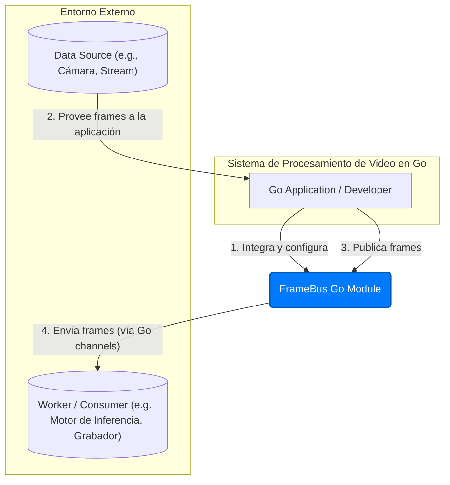
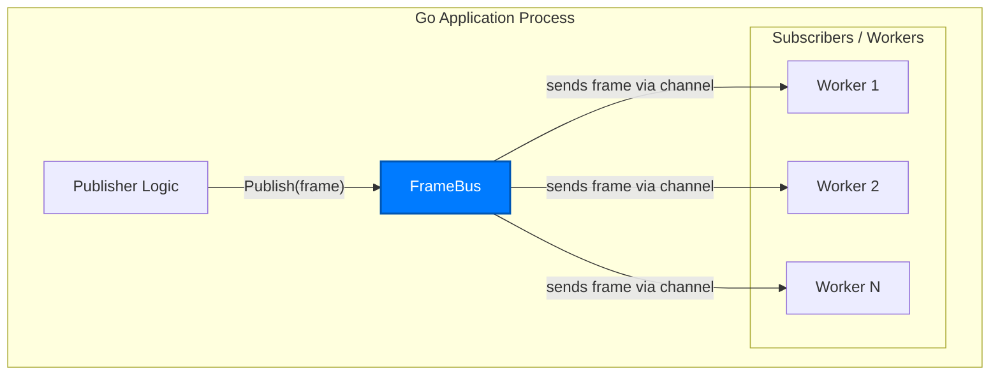

## **Informe de Arquitectura y Consultoría: Módulo `framebus`**

**Fecha:** 4 de Noviembre de 2025
**Autor:** Gemini AI Consultant

### **1. Introducción**

Este documento presenta un análisis de la arquitectura del módulo `framebus` de Go. El propósito de `framebus` es proporcionar un mecanismo de distribución de datos (frames) en tiempo real, de un publicador a múltiples subscriptores, bajo un estricto principio de baja latencia.

El análisis se basa en el modelo C4 (Contexto, Contenedores, Componentes) para describir la arquitectura en diferentes niveles de abstracción. Finalmente, se ofrece una valoración consultiva y una serie de recomendaciones para la evolución del módulo.

### 2. Resumen Ejecutivo (Análisis Consultivo) ###


El módulo `framebus` exhibe una arquitectura **excepcionalmente clara, enfocada y robusta** para su caso de uso específico. Su diseño se adhiere de manera ejemplar a la filosofía de "latencia sobre completitud", una necesidad crítica en sistemas de procesamiento de video en tiempo real.

**Fortalezas Clave:**


*   **Propósito Único y Claro:** El módulo hace una sola cosa y la hace bien: distribuir frames de forma no bloqueante. Evita la sobre-ingeniería al delegar responsabilidades como el ciclo de vida de los workers o el logging.
*   **Seguridad en Concurrencia:** El uso idiomático de primitivas de Go (`sync.RWMutex`, `atomic.Uint64`) garantiza un funcionamiento seguro y eficiente en entornos con múltiples goroutines.
*   **Rendimiento Optimizado:** La lógica de `Publish` es no bloqueante y minimiza la contención de locks (usa un `RLock` para la lectura del mapa de subscriptores y `atomic` para los contadores), asegurando una latencia de microsegundos.
*   **Observabilidad Integrada:** La capacidad de obtener estadísticas detalladas de envíos y descartes (globales y por subscriptor) es una característica fundamental que facilita el monitoreo y la depuración del sistema en producción.
*   **API Limpia y Desacoplada:** La interfaz pública es mínima y fácil de entender. El uso de canales de Go para la subscripción desacopla `framebus` de la implementación concreta de los workers.

En resumen, `framebus` es un ejemplo de libro de texto de un módulo de Go bien diseñado: es idiomático, eficiente, seguro y cumple su propósito con elegancia.

### **3. Modelo de Arquitectura (C4 Model)**

#### **3.1. Nivel 1: Contexto del Sistema (C1)**

Muestra a `framebus` interactuando con sus usuarios y los sistemas de su entorno.



#### **3.2. Nivel 2: Contenedores (C2)**

Muestra los componentes principales dentro del proceso de la aplicación que utiliza `framebus`.



#### **3.3. Nivel 3: Componentes (C3)**

Muestra los componentes internos que conforman el módulo `framebus`.

```mermaid
graph TD
    subgraph "FrameBus Component"
        direction TB

        API[Public API framebus.Bus)]
        
        subgraph "Internal Implementation (bus.bus struct)"
            SM[Subscription Manager]
            PC[Publishing Core]
            ST[Statistics Tracker]
        end
    end

    API --"expone"--> SM
    API --"expone"--> PC
    API --"expone"--> ST

    SM --"usa"--> Mutex(sync.RWMutex)
    PC --"usa"--> Mutex
    ST --"usa"--> Mutex
    
    PC --"actualiza"--> Counters(atomic.Uint64)
    ST --"lee"--> Counters

    style API fill:#bde0ff,stroke:#0056b3
```

**Descripción de Componentes Internos:**

1.  **Public API (`framebus.Bus`):** La interfaz pública que define el contrato del módulo (`Subscribe`, `Unsubscribe`, `Publish`, `Stats`, `Close`). Actúa como una fachada limpia sobre la implementación interna.
2.  **Subscription Manager:** Responsable de la lógica de `Subscribe` y `Unsubscribe`. Utiliza un `map[string]chan<- Frame` para almacenar los subscriptores y un `sync.RWMutex` para garantizar la seguridad en la modificación concurrente de este mapa.
3.  **Publishing Core:** El corazón del método `Publish`. Itera sobre el mapa de subscriptores (protegido por un `RLock`) y ejecuta la lógica `select` no bloqueante para enviar o descartar el frame.
4.  **Statistics Tracker:** Gestiona los contadores de estadísticas. Utiliza contadores `atomic.Uint64` para `sent` y `dropped` por subscriptor, lo que permite actualizaciones de alto rendimiento sin necesidad de un lock completo dentro del bucle de `Publish`. El método `Stats()` luego agrega estos valores atómicos en una estructura de instantánea (snapshot).

### **4. Propuesta de Implementación y Hoja de Ruta**

La implementación actual es de alta calidad y sirve como una base sólida. Las siguientes propuestas no son para corregir defectos, sino para sugerir posibles vías de evolución y refinar aún más la ergonomía del módulo.

#### **Validación del Diseño Actual**

*   **Estructura del Paquete:** La separación entre el paquete público `framebus` y el paquete `internal/bus` es una **excelente práctica** en Go. Expone una API limpia mientras oculta los detalles de implementación. **Mantener esta estructura.**
*   **Gestión de Estado:** El uso combinado de un `RWMutex` para la estructura de subscriptores (que cambia con poca frecuencia) y contadores `atomic` para las estadísticas (que cambian constantemente) es una **optimización de rendimiento idiomática y eficaz**.

#### **Recomendaciones y Hoja de Ruta Futura**

1.  **Patrón de Opciones Funcionales para la Configuración:**
    *   **Propuesta:** En lugar de que `New()` no reciba argumentos, se podría adoptar el patrón de "opciones funcionales" para una configuración más flexible en el futuro.
    *   **Ejemplo:**
        ```go
        // Se podría añadir una opción para, por ejemplo, pre-alocar la capacidad del mapa de subscriptores.
        bus := framebus.New(framebus.WithInitialCapacity(10)) 
        ```
    *   **Beneficio:** Permite añadir nuevas opciones de configuración sin romper la API existente. Es un patrón muy común y flexible en librerías de Go.

2.  **Propagación de Contexto (Context Propagation):**
    *   **Propuesta:** Considerar añadir soporte para `context.Context` en los métodos de la API, especialmente en `Publish`.
    *   **Ejemplo:** `Publish(ctx context.Context, frame Frame)`
    *   **Beneficio:** Permitiría a los llamadores propagar señales de cancelación, timeouts o valores a través del sistema. Aunque `Publish` es no bloqueante, esto podría ser útil para escenarios de tracing distribuido (por ejemplo, propagar un `traceID` a través del `ctx`).

3.  **Manejo de Pánico en `Publish`:**
    *   **Análisis:** Actualmente, `Publish` en un bus cerrado provoca un `panic`. Esto está documentado y es una decisión de diseño válida para forzar al programador a manejar correctamente el ciclo de vida del bus ("fail fast").
    *   **Propuesta Alternativa:** Se podría considerar que `Publish` en un bus cerrado simplemente no haga nada y descarte el frame.
    *   **Recomendación:** **Mantener el pánico actual.** Es más explícito y fuerza a un uso correcto. Sin embargo, se podría añadir una nota en la documentación del método `Publish` sugiriendo el uso de `defer/recover` si el llamador no puede garantizar que no publicará en un bus cerrado.

4.  **Estrategias de Descarte (Drop Policies):**
    *   **Visión a Futuro:** Si el módulo necesitara más flexibilidad, se podría explorar la idea de hacer la estrategia de descarte configurable.
    *   **Ejemplo:**
        ```go
        // Hipotético: una política que bloquea en lugar de descartar.
        bus := framebus.New(framebus.WithDropPolicy(framebus.DropNone)) 
        ```
    *   **Recomendación:** Mantener la simplicidad actual. La política de descarte es la característica principal y distintiva del módulo. Añadir más políticas podría diluir su propósito. Guardar esta idea para una futura versión mayor (v2) si surge una demanda clara.

### **Conclusión Final de Consultoría**

El módulo `framebus` es un componente de software de alta calidad que resuelve un problema difícil de manera simple y elegante. La arquitectura es sólida, el código es idiomático y el rendimiento está optimizado para su caso de uso principal.

Mi recomendación principal es **proteger esta simplicidad y enfoque**. Las mejoras sugeridas, como el patrón de opciones funcionales, deben adoptarse principalmente para mejorar la extensibilidad futura sin complicar la API actual. El proyecto es un activo valioso tal como está.
