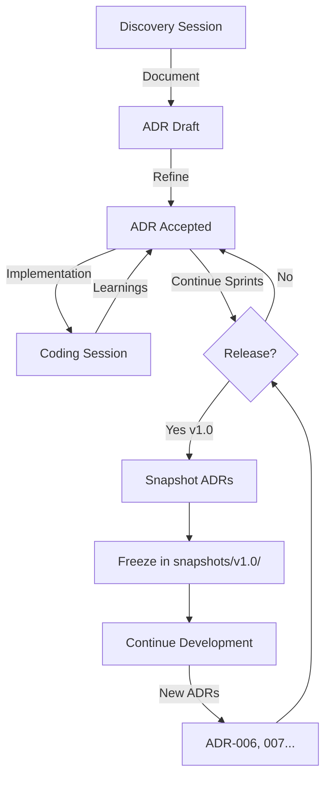

# ADR-000: Architecture Documentation Workflow

**Status**: Accepted (Meta-ADR)
**Date**: 2025-01-05
**Authors**: Ernesto + Gaby
**Type**: Process (not technical decision)

---

## Changelog

| Version | Date       | Author          | Changes                                  |
|---------|------------|-----------------|------------------------------------------|
| 1.0     | 2025-01-05 | Ernesto + Gaby  | Initial workflow pattern (café insight) |

---

## Context

### The Problem: Static vs Living Documentation

**Traditional approaches fail at extremes**:

**❌ Pure Static** (Enterprise):
- Documentation written once, never updated
- Becomes stale (code diverges from docs)
- Developers stop reading (trust code over docs)

**❌ Pure Living** (Startup chaos):
- No documentation (tribal knowledge)
- "Just read the code" (reverse-engineering every time)
- Knowledge evaporates when people leave

**Neither works for life-critical systems like Alerta Care.**

---

### Our Context: Solo-Founder → Senior Team

**Current** (2025-01-05):
- Solo-founder (Ernesto, 40 años, arqui-picacodigo)
- Claude as pair-discovery colleague
- MVP phase (6-month horizon)

**Future** (6-12 months):
- Senior devs joining (colleagues, not juniors)
- Production deployment (fall detection, life-critical)
- Evolution driven by business (discovering new needs)

**Requirements**:
1. **Onboarding**: New senior dev should understand design in <2 hours
2. **Evolution**: System will change, docs must track changes
3. **Decision memory**: "Why did we do X?" must be answerable 12 months later
4. **Pragmatism**: Documentation is investment, not overhead

---

## Decision: Living Docs + Release Snapshots

**Philosophy**: Documentation evolves like code, with checkpoints.

**Pattern**: Inspired by:
- **Docker images**: Layers + tags (snapshots at releases)
- **Git workflow**: Active development + tagged releases
- **LLM context compacting**: Working memory + periodic snapshots

---

## Implementation

### Phase 1: Living Documentation (During Development)

**ADRs are editable** during active development:

```
Sprint 1-5 (MVP development):
├── ADR-001 (sync.Cond) - may be refined
├── ADR-002 (Zero-copy) - may add consequences
├── ADR-003 (Batching) - may adjust threshold
└── ADR-004 (JIT) - may expand rationale

✅ Editing allowed: Refine, add context, expand rationale
❌ No rewriting history: Changelog tracks all changes
```

**Why living**:
- Insights emerge during implementation (not all upfront)
- Coding reveals edge cases (update ADR with learnings)
- Pair-discovery is iterative (not waterfall)

**Example** (real):
- ADR-005 started as "Proposed" (bug discovered in test)
- Discovery session → decision → "Accepted"
- Café-talk → Worker Agency insight added (section 2.1)
- **Same ADR, evolved in real-time**

---

### Phase 2: Snapshot at Release

**When**: Major release (v1.0, v2.0) or significant milestone

**What**: Freeze current ADR state as snapshot

```
docs/ADR/
├── snapshots/
│   ├── v1.0/  (MVP release, 2025-06-01)
│   │   ├── 001-sync-cond.md
│   │   ├── 002-zero-copy.md
│   │   ├── 003-batching.md
│   │   ├── 004-symmetric-jit.md
│   │   └── 005-graceful-shutdown.md
│   └── v1.1/  (future)
│       └── (includes v1.0 + new ADRs)
├── current/ → symlink to active version
└── (active ADRs, continue evolving)
```

**Why snapshot**:
- Freeze "state of the art at this moment"
- Onboarding references stable version (not moving target)
- Evolution is visible (v1.0 → v1.1 diff shows changes)

**Like Docker tags**: `framesupplier:v1.0` (immutable), `framesupplier:latest` (evolves)

---

### Phase 3: Evolution (Post-Snapshot)

**After snapshot, ADRs continue evolving**:

```
Post-v1.0 release:
├── ADR-001 to 005 (frozen in snapshot/v1.0/)
├── ADR-006 (NEW: Priority-based distribution)
├── ADR-007 (NEW: Multi-stream support)
└── ADR-005 (v1.1) - may reference 006, add notes

✅ New ADRs added incrementally
✅ Old ADRs may be superseded (mark status: "Deprecated by ADR-006")
❌ Old ADRs never deleted (decision history preserved)
```

**Deprecation pattern**:
```markdown
# ADR-003: Batching with Threshold=8

**Status**: Deprecated by ADR-006 (Priority-based batching)
**Original Date**: 2025-01-05
**Deprecated**: 2025-08-15

## Why Deprecated
ADR-006 introduced priority-based distribution, which supersedes
simple batching. Threshold=8 still applies, but within priority tiers.

See: ADR-006 for current implementation.
```

---

## Workflow Diagram



---

## The Blues Philosophy Applied to Docs

### Pure Structure (Rigid)
```
Enterprise approach:
- 80-page architecture document
- Written once, signed off by committee
- Never updated (out of date in 6 months)
- Result: Nobody reads, trust code instead
```

### Pure Improvisation (Chaos)
```
Startup approach:
- No docs ("just read the code")
- Tribal knowledge (in people's heads)
- Onboarding = 2 weeks reverse-engineering
- Result: Knowledge evaporates when people leave
```

### Blues (Pragmatic Evolution)
```
Our approach:
- ADRs = structure (template, format, categories)
- Content = improvisation (adapt to context, refine during sprints)
- Snapshots = checkpoints (freeze at releases)
- Result: Living knowledge, preserved evolution
```

**Pattern**: "Improvise within structure, checkpoint at milestones"

---

## Modularidad Habilita Pensamiento Compositional

### Emergent Insight (Café Synapse, 2025-01-05)

**Context**: Discussing ADR-005, Claude mentioned:
> "En 6 meses, si multi-stream requiere ctx-aware → ADR-006 migra a Option C"

**Ernesto's instant reaction**:
> "Filosofía Unix (compose commands) → múltiples FrameSuppliers en orchestrator, no un FrameSupplier gigante"

**This is gold.** Modularidad fit enables compositional thinking.

---

### The Pattern: Unix Philosophy vs Feature Creep

**❌ Feature Creep Approach** (monolith evolution):
```go
// FrameSupplier v2.0 grows to handle multi-stream internally
type Supplier struct {
    streams map[string]*Stream  // NEW: multi-stream
    priorities map[string]int    // NEW: priority
    rateLimits map[string]float64 // NEW: per-stream rate
    // ... God Object emerges
}

// Single instance, many responsibilities
supplier := NewSupplier()
supplier.AddStream("camera1", 30fps)
supplier.AddStream("camera2", 5fps)
supplier.SetPriority("camera1", Critical)
```

**Result**: FrameSupplier bounded context expands (distribution → orchestration).

---

**✅ Unix Philosophy Approach** (composition):
```go
// FrameSupplier stays simple (single stream, distribution only)
type Supplier struct {
    inbox *Mailbox
    slots sync.Map
    // ... bounded context preserved
}

// Orchestrator composes N instances
orchestrator := NewOrchestrator()
orchestrator.AddSupplier("camera1", NewSupplier(30fps))
orchestrator.AddSupplier("camera2", NewSupplier(5fps))

// Composición externa, no feature creep interna
```

**Result**: FrameSupplier bounded context preserved, orchestration is separate concern.

---

### Why This Matters

**Modularidad fit** (bounded contexts desde día 1) enables:
- ✅ Thinking in **composition** (Unix pipes, not monolith methods)
- ✅ Scaling by **duplication** (N suppliers, not 1 supplier with N streams)
- ✅ Evolution without **feature creep** (orchestrator grows, supplier stays focused)

**Without bounded context discipline**:
- ❌ Feature creep natural ("just add multi-stream to FrameSupplier")
- ❌ God Object emerges (Supplier handles everything)
- ❌ Refactor painful (breaking changes, not additive)

**Named Pattern**: **"Compositional Thinking via Bounded Context Discipline"**

**Portability**: Applies to all Orion 2.0 modules:
- Stream-Capture: Single camera (not multi-camera orchestrator)
- Worker-Lifecycle: Single worker (not fleet manager)
- FrameSupplier: Single stream (not multi-stream router)

**Orchestration layer** (future module) composes these, doesn't embed them.

---

## Constraints

### Non-Negotiable

1. **Changelog required**: Every ADR must track version history
2. **No silent edits**: Changes during "living" phase must be noted
3. **Snapshots immutable**: Once frozen, never modified (like git tag)

### Desired

4. **Concise ADRs**: Depth > length, but avoid 1000+ lines
5. **Reference ADRs**: Link related ADRs (dependency graph helps)
6. **Rationale > description**: Focus on "why", not "what" (code shows "what")

---

## Success Criteria

### For Onboarding (New Senior Dev)
```
Day 1, Hour 1:
- Read ADR-DEPENDENCY-GRAPH.md (15 min)
- Choose reading path (architecture-first)
- Read ADR-004 (JIT symmetry, 20 min)

Day 1, Hour 2:
- Read ADR-001, 002, 003 (primitives + perf, 40 min)
- Read ADR-005 (lifecycle, 20 min)

Result: Understand design decisions in <2 hours
        (vs 2 weeks reverse-engineering code)
```

---

### For Evolution (6 Months Later)
```
Question: "Why did we reject ctx-aware Subscribe?"

Process:
1. Open ADR-005 § Alternatives Rejected
2. Read Option C rationale (breaking change, no clear benefit over A)
3. Evaluate if context changed (multi-stream NOW requires ctx?)
4. Decide consciously (upgrade to C, or maintain A + orchestrate)

Result: Decision memory preserved, evolution is conscious
```

---

### For Production Incidents (12 Months Later)
```
Incident: "FrameSupplier dropped 10,000 frames @ 3am"

Investigation:
1. Check RUNBOOKS.md § High Drop Rate
2. Review ADR-003 § Batching (expected drops @ high load)
3. Check ADR-004 § JIT Semantics (drops are feature, not bug)
4. Analyze: Is this operational (expected) or design flaw?

Result: ADRs inform incident analysis (not just runbooks)
```

---

## Alternatives Considered

### Alternative A: Static Docs Only
**Rejected**: Becomes stale, developers stop trusting docs

### Alternative B: No Snapshots (Always Living)
**Rejected**: Onboarding references moving target (confusing)

### Alternative C: Git Tags Only (No ADR Snapshots)
**Rejected**: Git tags = entire repo, ADR snapshots = architectural decisions only (more granular)

---

## Consequences

### Positive ✅

1. **Decision memory**: "Why X?" answerable 12 months later
2. **Conscious evolution**: Snapshots show delta (v1.0 → v1.1 changes visible)
3. **Onboarding efficiency**: Senior dev productive in <2 hours (not 2 weeks)
4. **Knowledge preservation**: When Ernesto takes vacation, decisions documented
5. **Compositional thinking**: Bounded contexts enable Unix-style composition

### Negative ❌

1. **Maintenance overhead**: Snapshots must be created at releases (manual step)
2. **Discipline required**: Team must update ADRs during "living" phase
3. **Directory structure**: snapshots/ folder adds complexity (but manageable)

### Mitigation

**Overhead**: Snapshots every 3-6 months (not every sprint) → ~1 hour work
**Discipline**: Claude as pair-discovery colleague enforces ADR updates
**Directory**: ADR-DEPENDENCY-GRAPH.md helps navigate snapshots

---

## Implementation Checklist

**For v1.0 Release** (6 months):
- [ ] Create `docs/ADR/snapshots/v1.0/` directory
- [ ] Copy ADR-001 through ADR-005 (as accepted)
- [ ] Add `README.md` in snapshot: "This snapshot represents state at v1.0 release"
- [ ] Symlink `docs/ADR/current/` → `snapshots/v1.0/`
- [ ] Tag git repo: `v1.0-architecture`
- [ ] Update ADR-DEPENDENCY-GRAPH.md with snapshot timeline

**For Post-v1.0 Evolution**:
- [ ] Continue editing ADRs in root `docs/ADR/` (living phase)
- [ ] Add new ADRs (006, 007...) as needed
- [ ] Update dependency graph when new ADRs added
- [ ] At v1.1 release, repeat snapshot process

---

## Related Decisions

- **ADR-DEPENDENCY-GRAPH.md**: Visual navigation of ADR relationships
- **RUNBOOKS.md**: Operational knowledge (complements ADRs)
- **PAIR_DISCOVERY_PROTOCOL.md**: Process for creating ADRs

---

## References

### Inspiration
- **Docker images**: Layered architecture + immutable tags
- **Git workflow**: Working tree + tagged releases
- **LLM context**: Active context + periodic compacting
- **Unix philosophy**: Small modules, external composition

### Related Docs
- `/docs/ADR/` - All architecture decision records
- `/PAIR_DISCOVERY_PROTOCOL.md` - How decisions emerge
- `CLAUDE.md` - Module-specific operating instructions

---

## Meta: Why ADR-000?

**This is a meta-ADR** (about ADRs themselves, not technical decision).

**Numbered 000** because:
- Read BEFORE other ADRs (foundational)
- Explains workflow (how to interpret other ADRs)
- Never deprecated (process pattern, not technical choice)

**When to update**:
- If workflow pattern changes (e.g., monthly snapshots instead of release-based)
- If new insight emerges (like compositional thinking example)
- NOT for every ADR addition (that's normal evolution)

---

## Emergent Patterns

### Pattern 1: Café-Talk Crystallization

**Origin**: Worker Agency insight (ADR-005, post-decision café)

**Pattern**: Best insights often emerge AFTER formal decision
- Discovery → Decision → Crystallize
- But also: Crystallize → Café → Capture emergent insight
- Don't lose post-decision synapses

**Application**: When insight emerges post-ADR, add to existing ADR (changelog it)

---

### Pattern 2: Unix Philosophy via Bounded Contexts

**Origin**: Multi-stream discussion (this ADR)

**Pattern**: Bounded context discipline → compositional thinking
- NOT: "Add feature to existing module"
- YES: "Compose N instances of focused module"

**Application**: When tempted to expand module, ask:
- "Can orchestrator compose N instances instead?"
- "Is this feature creep or legitimate expansion?"

---

**Review Status**: ✅ Accepted (Meta-Pattern, Foundational)

**Last Updated**: 2025-01-05 (café insight: compositional thinking)
