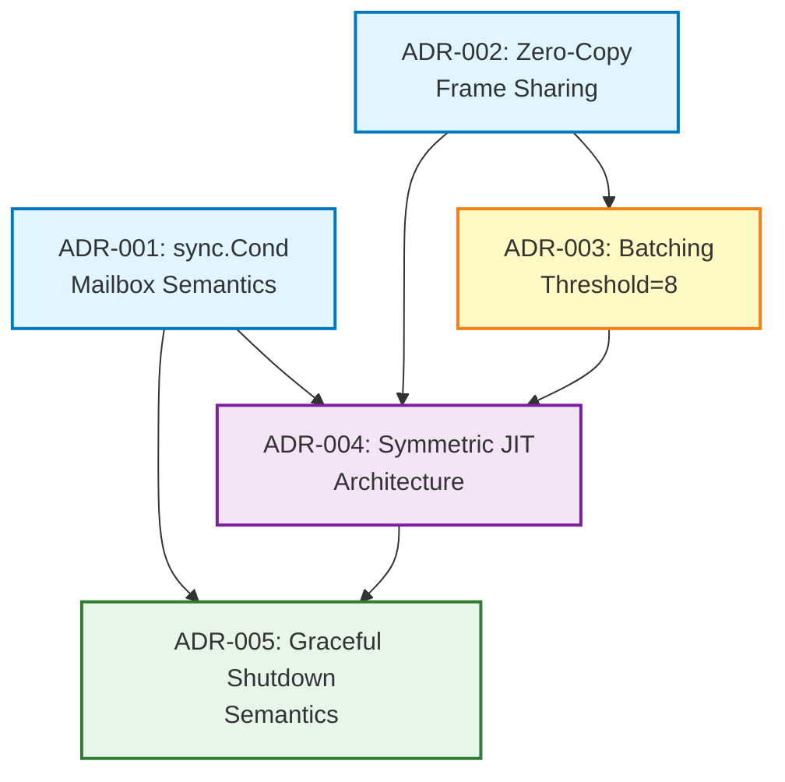
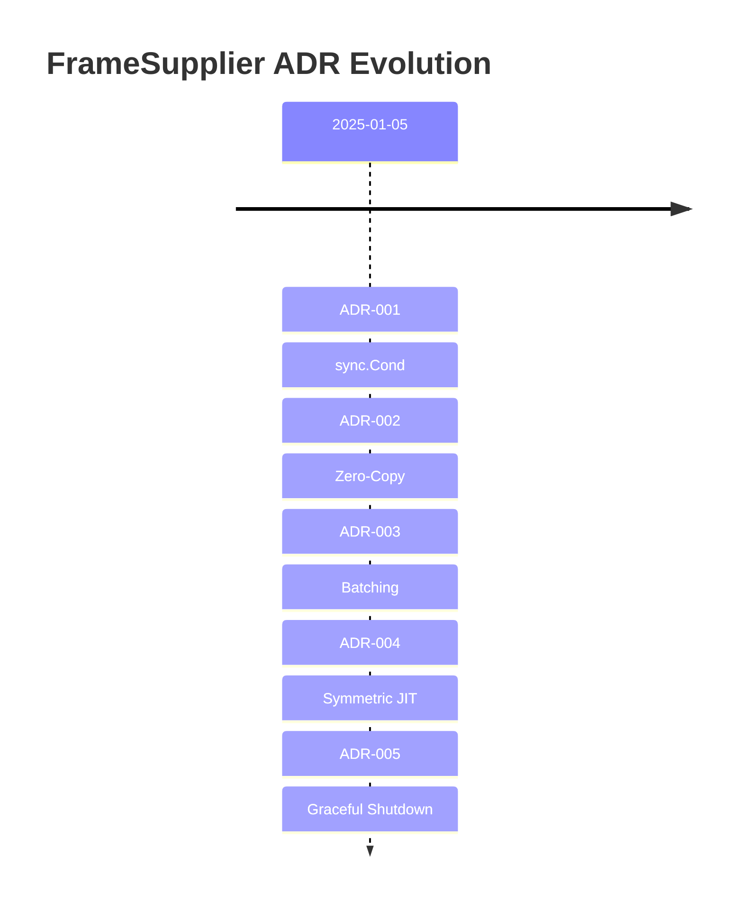

# ADR Dependency Graph - FrameSupplier Module

**Purpose**: Visual map of architectural decisions and their relationships
**Audience**: Onboarding developers, architects reviewing design
**Updated**: 2025-01-05

---

## Quick Navigation by Category

### 🔧 Primitives (Foundation)
- **ADR-001**: sync.Cond for Mailbox Semantics → Blocking/non-blocking primitives
- **ADR-002**: Zero-Copy Frame Sharing → Memory efficiency

### ⚡ Performance
- **ADR-003**: Batching with Threshold=8 → Scale optimization

### 🏛️ Architecture
- **ADR-004**: Symmetric JIT Architecture → End-to-end consistency

### 🔄 Lifecycle
- **ADR-005**: Graceful Shutdown Semantics → Clean exit patterns

---

## Dependency Graph



---

## Dependency Explanation

### ADR-001 → ADR-004 (sync.Cond enables JIT Symmetry)
**Relationship**: ADR-004 uses sync.Cond (from ADR-001) for both inbox and worker slots
**Rationale**: Symmetric JIT requires same primitives at all levels
**Impact**: If ADR-001 changed (e.g., channels instead), ADR-004 invalidated

---

### ADR-001 → ADR-005 (sync.Cond enables Wake-on-Stop)
**Relationship**: ADR-005 uses `slot.cond.Broadcast()` to wake workers
**Rationale**: Graceful shutdown requires waking blocked workers (sync.Cond primitive)
**Impact**: If ADR-001 used channels, ADR-005 solution would be different (close channel vs broadcast)

---

### ADR-002 → ADR-003 (Zero-Copy amplifies Batching Value)
**Relationship**: Zero-copy makes batching cheaper (no N×copy overhead)
**Rationale**: If we copied frames, batching would be expensive (192 MB/s @ 64 workers)
**Impact**: Without zero-copy, batching threshold would be higher (break-even at fewer workers)

---

### ADR-002 → ADR-004 (Zero-Copy applies JIT-wide)
**Relationship**: JIT symmetry includes zero-copy at all levels (inbox, slots)
**Rationale**: Consistency: same frame pointer from GStreamer → inbox → workers
**Impact**: If ADR-002 changed (copy frames), ADR-004 would need deep-copy at inbox

---

### ADR-003 → ADR-004 (Batching is Part of JIT Optimization)
**Relationship**: Batching (ADR-003) is optimization inside distributeToWorkers (ADR-004)
**Rationale**: JIT architecture document includes batching as performance mechanism
**Impact**: ADR-003 could be replaced (e.g., parallel goroutines) without breaking JIT semantics

---

### ADR-004 → ADR-005 (Symmetric Lifecycle)
**Relationship**: ADR-005 extends JIT symmetry to lifecycle (inbox stop → slot stop)
**Rationale**: "Casa de herrero" applies to lifecycle, not just JIT semantics
**Impact**: If ADR-004 didn't establish symmetry, ADR-005 could use different shutdown patterns (e.g., timeout)

---

## Reading Order for Onboarding

### Path 1: Implementation-First (Bottom-Up)
```
1. ADR-001 (Primitives: sync.Cond)
2. ADR-002 (Primitives: Zero-copy)
3. ADR-003 (Performance: Batching)
4. ADR-004 (Architecture: JIT symmetry)
5. ADR-005 (Lifecycle: Shutdown)
```

**Audience**: Developers implementing FrameSupplier code
**Goal**: Understand building blocks before big picture

---

### Path 2: Architecture-First (Top-Down)
```
1. ADR-004 (Architecture: JIT symmetry) ← START HERE
2. ADR-001 (Why sync.Cond for mailboxes?)
3. ADR-002 (Why zero-copy?)
4. ADR-003 (Why batching?)
5. ADR-005 (How shutdown works?)
```

**Audience**: Architects reviewing design
**Goal**: Big picture first, details second

---

### Path 3: Problem-Driven (Discovery Order)
```
1. ADR-001 (Bug: Double-close panic → sync.Cond solution)
2. ADR-004 (Design: JIT symmetry → inbox mailbox)
3. ADR-002 (Scale: 64 workers × 100KB → zero-copy)
4. ADR-003 (Perf: Sequential slow @ scale → batching)
5. ADR-005 (Bug: TestGracefulShutdown fail → Stop closes slots)
```

**Audience**: Learning design process (how decisions emerged)
**Goal**: Understand context and evolution

---

## Impact Analysis Matrix

**Question**: "If I change ADR-X, what else breaks?"

| Change ADR | Impacts         | Severity | Notes                                           |
|------------|-----------------| -------- |-------------------------------------------------|
| **ADR-001** | 004, 005        | 🔴 High  | Core primitive, breaks JIT + shutdown           |
| **ADR-002** | 003, 004        | 🟡 Medium| Performance + architecture, but replaceable     |
| **ADR-003** | None            | 🟢 Low   | Optimization, can be replaced without breaking  |
| **ADR-004** | 005             | 🟡 Medium| Architecture principle, shutdown depends on it  |
| **ADR-005** | None            | 🟢 Low   | Lifecycle only, doesn't affect distribution     |

---

## Cross-Cutting Concerns

### Thread Safety
**Involved ADRs**: 001, 003, 005
**Pattern**: sync.Cond + mutex + atomic operations
**Docs**: ARCHITECTURE.md § Concurrency Model

---

### Performance
**Involved ADRs**: 002, 003
**Pattern**: Zero-copy + batching
**Docs**: ARCHITECTURE.md § Performance Analysis

---

### Bounded Context
**Involved ADRs**: 004, 005
**Pattern**: Distribution only (NOT worker lifecycle)
**Docs**: ADR-005 § Worker Agency

---

## Evolution Timeline



**All decided in single pair-discovery session** (2025-01-05)
**Status**: Complete design, ready for implementation

---

## Future ADRs (Potential)

### ADR-006: Priority-Based Distribution (Proposed)
**Trigger**: Multi-SLA workers (Critical vs BestEffort)
**Dependencies**: Would extend ADR-003 (batching with priority queue)
**Impact**: ADR-004 (JIT symmetry maintained, but slots have priority field)

---

### ADR-007: Multi-Stream Support (Planned for Phase 2)
**Trigger**: Multiple cameras (stream1 @ 30fps, stream2 @ 5fps)
**Dependencies**: Would extend ADR-004 (per-stream inboxes, JIT symmetry preserved)
**Impact**: ADR-001, 002, 005 (primitives unchanged, just N instances)

---

## Emergent Patterns (Cross-ADR Insights)

### Pattern 1: Physical Invariants Simplify Design
**Origin**: ADR-003 (distribution latency << inter-frame interval)
**Applied in**: ADR-004 (fire-and-forget distribution)
**Portability**: Any real-time pipeline (stream-capture, worker-lifecycle)

---

### Pattern 2: Casa de Herrero, Cuchillo de Acero
**Origin**: ADR-004 (JIT symmetry)
**Applied in**: ADR-005 (symmetric lifecycle)
**Principle**: Practice what you preach (JIT on input + output, lifecycle create + destroy)

---

### Pattern 3: Notification Contract in Peer Architecture
**Origin**: ADR-005 (Worker agency)
**Principle**: Modules notify (readFunc → nil), don't control (worker decides exit/retry)
**Portability**: All Orion 2.0 bounded contexts (no hierarchical control)

---

## Validation Checklist (For Future ADRs)

Before accepting new ADR, check:

- [ ] **Dependencies clear**: Does it depend on existing ADRs? (update graph)
- [ ] **Bounded context**: Does it expand scope? (justify or reject)
- [ ] **Symmetry**: Does it break ADR-004 JIT symmetry? (fix or document exception)
- [ ] **Performance**: Does it impact ADR-002/003? (measure or analyze)
- [ ] **Lifecycle**: Does it affect ADR-005 shutdown? (test graceful exit)

---

## References

- **ADRs**: `/docs/ADR/001-*.md` through `/docs/ADR/005-*.md`
- **Architecture**: `/docs/ARCHITECTURE.md`
- **C4 Model**: `/docs/C4_MODEL.md`
- **Discovery Protocol**: `/PAIR_DISCOVERY_PROTOCOL.md`

---

## Meta: About This Document

**Purpose**: ADR dependency graph for big-picture understanding

**NOT a replacement for**:
- Reading individual ADRs (still need full context)
- ARCHITECTURE.md (implementation details)
- C4_MODEL.md (component diagrams)

**Use cases**:
- ✅ Onboarding: "Which ADRs should I read first?"
- ✅ Impact analysis: "If I change X, what breaks?"
- ✅ Design review: "Are decisions consistent?"
- ✅ Evolution tracking: "How did we get here?"

---

**Last Updated**: 2025-01-05 (after ADR-005 acceptance)
**Next Update**: When ADR-006 proposed (add to graph)
**Maintainer**: Update this graph when new ADRs accepted
