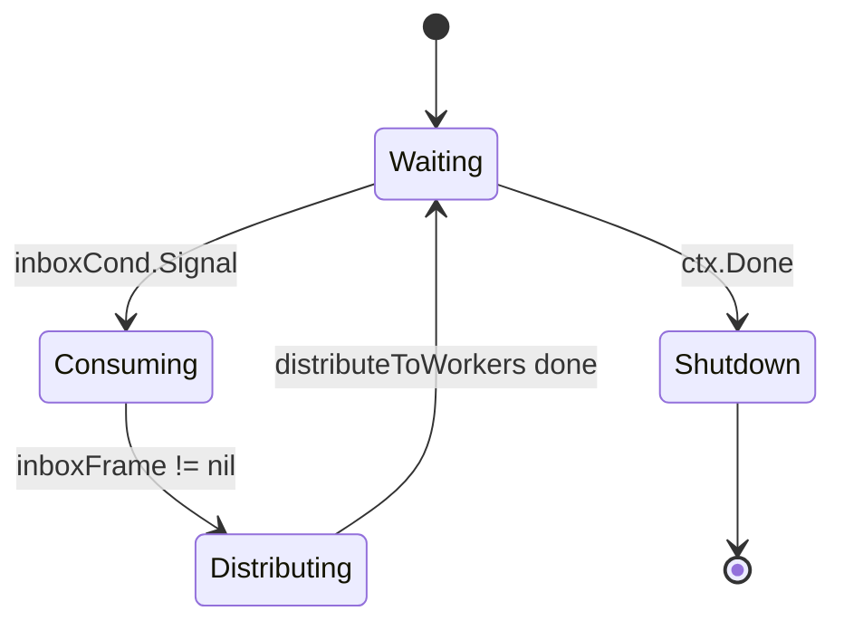
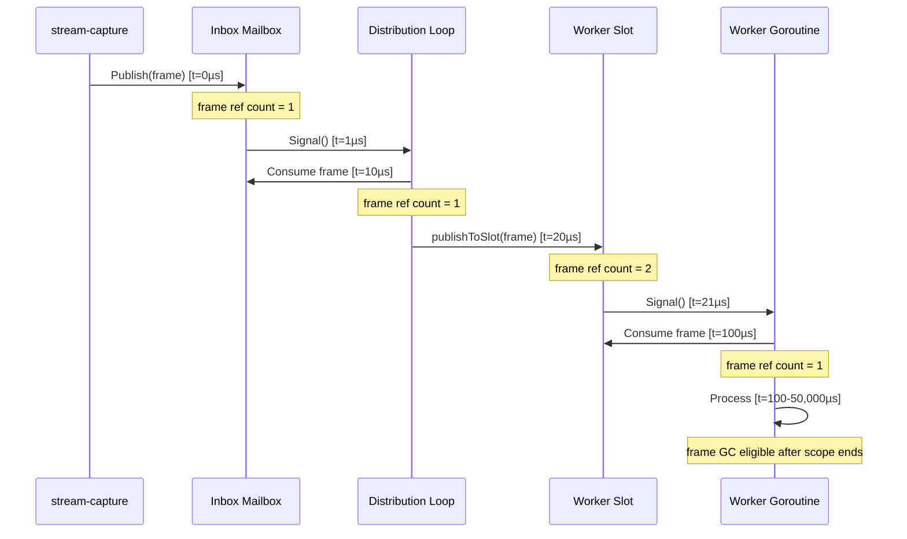

# Architecture: FrameSupplier

**Module**: `modules/framesupplier`
**Version**: 0.1 (Design Proposal)
**Philosophy**: Just-In-Time Frame Distribution with Symmetric Mailbox Architecture

---

## Changelog

| Version | Date       | Author          | Changes                                    |
|---------|------------|-----------------|--------------------------------------------|
| 0.1     | 2025-01-05 | Ernesto + Gaby  | Initial architecture - JIT mailbox design  |

---

## Table of Contents

1. [Overview](#overview)
2. [Core Algorithms](#core-algorithms)
3. [Concurrency Model](#concurrency-model)
4. [Memory Model](#memory-model)
5. [Performance Analysis](#performance-analysis)
6. [Error Handling](#error-handling)
7. [Operational Monitoring](#operational-monitoring)

---

## Overview

### Design Philosophy

**"Casa de herrero, cuchillo de acero"** - We practice what we preach.

Orion's philosophy: **"Drop frames, never queue. Latency > Completeness."**

FrameSupplier extends this philosophy through **symmetric JIT architecture**:

```
stream-capture → Supplier → Workers
      ↓              ↓          ↓
   Mailbox       Mailbox    Mailbox
   Overwrite     Overwrite  Overwrite
```

Each level maintains "latest frame only", dropping stale frames to maintain real-time responsiveness.

### Key Characteristics

- **Non-blocking Publish**: `Publish(*Frame)` never blocks, returns in ~1µs
- **Blocking Consume**: Workers block until frame available (intentional, not a bug)
- **Zero-copy**: Shared pointers, immutable contract (compete with GStreamer/DeepStream)
- **Batching**: Threshold-based parallelism (sequential ≤8 workers, concurrent >8)
- **Operational Stats**: Idle detection, drop counters (not benchmarking)

---

## Core Algorithms

### Algorithm 1: Inbox Mailbox (Publisher → Supplier)

**Purpose**: Accept frames from stream-capture without blocking (30fps rate).

```go
// Publish: Non-blocking overwrite
func (s *Supplier) Publish(frame *Frame) {
    s.inboxMu.Lock()

    if s.inboxFrame != nil {
        s.inboxDrops++  // Distribution hasn't consumed previous frame
    }

    s.inboxFrame = frame
    s.inboxCond.Signal()  // Wake distribution goroutine

    s.inboxMu.Unlock()
}
```

**Latency**: O(1) - Lock + pointer assign + signal ≈ 1µs

**Drops**: In practice 0 (distribution is 330× faster than 30fps source).

**Invariant**: `inboxFrame` is either nil (consumed) or points to latest frame (unconsumed).

---

### Algorithm 2: Distribution Loop (Inbox → Workers)

**Purpose**: Consume inbox, fan-out to all worker slots with batching.

```go
func (s *Supplier) distributionLoop() {
    defer s.wg.Done()

    for {
        // Wait for frame or shutdown
        s.inboxMu.Lock()
        for s.inboxFrame == nil {
            if s.ctx.Err() != nil {
                s.inboxMu.Unlock()
                return
            }
            s.inboxCond.Wait()
        }

        frame := s.inboxFrame
        s.inboxFrame = nil  // Mark as consumed
        s.inboxMu.Unlock()

        // Distribute (may take 100µs with 64 workers)
        s.distributeToWorkers(frame)
    }
}
```

**State Machine**:



**Blocking Semantics**: Uses `sync.Cond.Wait()` to block when inbox empty (efficient, no busy-wait).

---

### Algorithm 3: Batched Distribution (Supplier → Workers)

**Purpose**: Fan-out frame to N workers with threshold-based parallelism.

```go
const publishBatchSize = 8  // Guardrail

func (s *Supplier) distributeToWorkers(frame *Frame) {
    frame.Seq = atomic.AddUint64(&s.publishSeq, 1)

    // Snapshot slots (sync.Map → slice)
    var slots []*WorkerSlot
    s.slots.Range(func(key, value interface{}) bool {
        slots = append(slots, value.(*WorkerSlot))
        return true
    })

    workerCount := len(slots)

    // Sequential path: ≤8 workers (0 goroutines)
    if workerCount <= publishBatchSize {
        for _, slot := range slots {
            s.publishToSlot(slot, frame)
        }
        return
    }

    // Parallel path: >8 workers (fire-and-forget batching)
    for i := 0; i < workerCount; i += publishBatchSize {
        end := i + publishBatchSize
        if end > workerCount {
            end = workerCount
        }

        batch := slots[i:end]
        go func(b []*WorkerSlot) {  // No wg.Wait (fire-and-forget)
            for _, slot := range b {
                s.publishToSlot(slot, frame)
            }
        }(batch)
    }
}
```

**Decision Tree**:

```
workerCount ≤ 8?
├─ YES: Sequential (for loop, 0 goroutines)
│         Latency: N × 1µs
│         Example: 8 workers = 8µs
│
└─ NO:  Parallel (batches of 8)
          Goroutines: ⌈N / 8⌉
          Latency: ~20µs (spawn overhead) + max(batch latencies)
          Example: 64 workers = 8 goroutines, 30µs total
```

**Why threshold=8?**
- Sequential cost: 8 workers × 1µs = 8µs (acceptable)
- Goroutine spawn cost: ~2µs + 2KB stack
- Break-even: >8 workers (parallelism benefit > spawn cost)

**Why fire-and-forget (no wg.Wait)?**
- @ 1fps: Inter-frame interval = 1000ms
- Distribution latency: ~100µs (64 workers)
- **Ratio**: 1000ms / 0.1ms = 10,000×
- **Impossible for frame N+1 to overtake N** (distribution completes 10,000× faster than next frame arrives)

---

### Algorithm 4: Worker Slot Mailbox (Supplier → Worker)

**Purpose**: Per-worker mailbox with overwrite and blocking consume.

```go
func (s *Supplier) publishToSlot(slot *WorkerSlot, frame *Frame) {
    slot.mu.Lock()
    defer slot.mu.Unlock()

    if slot.closed {
        return  // Worker unsubscribed
    }

    if slot.frame != nil {
        // Worker hasn't consumed previous frame
        slot.consecutiveDrops++
        slot.totalDrops++
    }

    slot.frame = frame
    slot.cond.Signal()  // Wake worker if waiting
}
```

**Worker Consume (Blocking)**:

```go
func (s *Supplier) Subscribe(workerID string) func() *Frame {
    slot := &WorkerSlot{}
    slot.cond = sync.NewCond(&slot.mu)
    s.slots.Store(workerID, slot)

    return func() *Frame {
        slot.mu.Lock()
        defer slot.mu.Unlock()

        // Wait until frame available or closed
        for slot.frame == nil && !slot.closed {
            slot.cond.Wait()
        }

        if slot.closed {
            return nil  // Unsubscribed
        }

        frame := slot.frame
        slot.frame = nil  // Mark as consumed
        slot.lastConsumedAt = time.Now()
        slot.lastConsumedSeq = frame.Seq
        slot.consecutiveDrops = 0  // Reset (worker is alive)

        return frame
    }
}
```

**Invariants**:
1. `slot.frame == nil` ⟺ Worker consumed last frame
2. `slot.frame != nil` ⟺ Worker has unconsumed frame
3. `consecutiveDrops` resets on successful consume (operational health metric)

---

## Concurrency Model

### Goroutine Topology

```
stream-capture goroutine
    ↓ Publish(*Frame)
Inbox Mailbox
    ↓ Signal
Distribution Goroutine (1)
    ↓ distributeToWorkers
Batch Goroutines (0-N/8)
    ↓ publishToSlot
Worker Slots (N)
    ↓ Signal
Worker Goroutines (N)
```

**Total Goroutines**:
- **Fixed**: 1 (distributionLoop)
- **Transient**: 0 (≤8 workers) or ⌈N/8⌉ (>8 workers)
- **Worker-owned**: N (workers call readFunc in their goroutines)

**No Lifecycle Management**: Supplier doesn't spawn worker goroutines (workers do).

---

### Synchronization Primitives

#### 1. Inbox Mailbox
```go
inboxMu    sync.Mutex     // Protects inboxFrame
inboxCond  *sync.Cond     // Signals distribution goroutine
inboxFrame *Frame         // Single-slot buffer
```

**Why sync.Cond?**
- Distribution goroutine needs to **block** when inbox empty (efficient sleep)
- Channels would require buffering (queue) or busy-wait (CPU waste)

#### 2. Worker Slots
```go
slots sync.Map  // Concurrent map: workerID → *WorkerSlot
```

**Why sync.Map?**
- Read-heavy (distributeToWorkers reads all slots every frame)
- Write-rare (Subscribe/Unsubscribe infrequent)
- `sync.RWMutex + map` would serialize all reads (bottleneck)

#### 3. Per-Worker Mailbox
```go
slot.mu    sync.Mutex   // Protects slot.frame
slot.cond  *sync.Cond   // Signals worker goroutine
slot.frame *Frame       // Single-slot buffer
```

**Critical Section Duration**: ~1µs (pointer check + assign + signal)

**Contention**: Low (each worker has independent lock)

---

### Memory Barriers

**Atomic Operations**:
```go
publishSeq uint64  // Global sequence number (atomic increment)
```

**Why atomic?**
- Accessed by distributionLoop (read-modify-write) and Stats (read)
- No mutex needed (single uint64 increment is atomic)

**Happens-Before Relationships**:

```
Publish → inboxMu.Lock → inboxFrame = frame → inboxMu.Unlock
  ↓ happens-before
inboxMu.Lock → frame := inboxFrame → inboxMu.Unlock
  ↓ happens-before
slot.mu.Lock → slot.frame = frame → slot.mu.Unlock
  ↓ happens-before
slot.mu.Lock → frame := slot.frame → slot.mu.Unlock
```

Go memory model guarantees visibility through mutex lock/unlock.

---

## Memory Model

### Zero-Copy Design

**Motivation**: Compete with GStreamer/DeepStream (all-in-RAM, zero-copy).

```
GStreamer appsink (C memory)
    ↓ C.GoBytes (ONLY COPY)
Go *Frame.Data (Go heap)
    ↓ Shared pointer (0 copies)
Inbox mailbox
    ↓ Shared pointer (0 copies)
Worker slots (N)
    ↓ Shared pointer (0 copies)
Worker goroutines (N)
    ↓ MsgPack serialize (inevitable, subprocess boundary)
Python stdin
```

**Total Copies**:
1. **C → Go**: 1 copy (inevitable, CGo boundary)
2. **Go → Go**: 0 copies (shared pointers)
3. **Go → Python**: 1 serialize (inevitable, subprocess boundary)

**Within FrameSupplier**: 0 copies ✅

---

### Immutability Contract

**Frame struct**:
```go
type Frame struct {
    Data      []byte    // MUST NOT modify after Publish
    Width     int
    Height    int
    Timestamp time.Time
    Seq       uint64
}
```

**Contract**:
- **Publisher**: MUST NOT modify `frame.Data` after calling `Publish(frame)`
- **Workers**: MUST NOT modify `frame.Data` (read-only)
- **Enforcement**: Documentation (runtime checks would add overhead)

**Rationale**:
- Shared pointer requires immutability
- Go doesn't have `const` or borrow checker (Rust)
- Trust between components (bounded context boundaries)

---

### Frame Lifetime



**GC Eligibility**: Frame becomes GC-eligible when last worker finishes processing (no more references).

---

## Performance Analysis

### Latency Budget @ 1fps

| Component            | Latency     | % of Budget (1000ms) |
|----------------------|-------------|----------------------|
| Publish()            | 1µs         | 0.0001%              |
| Distribution (64w)   | 100µs       | 0.01%                |
| Worker consume       | ~0 (blocking)| N/A                 |
| Python inference     | 20-50ms     | 2-5%                 |
| **Total overhead**   | **100µs**   | **0.01%**            |

**Insight**: FrameSupplier overhead is **4 orders of magnitude** below inter-frame interval.

---

### Scalability Analysis

#### Scenario: 64 workers @ 30fps

**Without batching** (sequential):
- Latency: 64 workers × 1µs = 64µs
- Budget @ 30fps: 33,000µs (33ms)
- Utilization: 64µs / 33,000µs = 0.2%

**With batching** (threshold=8):
- Goroutines: 8 (batches of 8 workers)
- Spawn: 8 × 2µs = 16µs
- Parallel execution: max(batch) = 8µs
- Total: 16µs + 8µs = 24µs
- Utilization: 24µs / 33,000µs = 0.07%

**Benefit**: 50% latency reduction, but both are negligible vs budget.

**Real benefit**: Guardrails for future (higher FPS, complex publishToSlot logic).

---

### Memory Overhead

**Per-worker memory**:
```
WorkerSlot struct:
- mu:               8 bytes (Mutex)
- cond:             8 bytes (pointer)
- frame:            8 bytes (pointer)
- lastConsumedAt:   24 bytes (time.Time)
- lastConsumedSeq:  8 bytes
- consecutiveDrops: 8 bytes
- totalDrops:       8 bytes
- closed:           1 byte
Total:              ~73 bytes
```

**64 workers**: 64 × 73 = **4,672 bytes** (~5KB)

**Transient goroutines** (>8 workers):
- Stack per goroutine: 2KB
- Max goroutines: ⌈64/8⌉ = 8
- Transient memory: 8 × 2KB = **16KB** (short-lived)

**Total overhead**: <20KB (negligible for Go runtime)

---

## Error Handling

### Panic Recovery

**Philosophy**: Fail fast at load time, not runtime.

**No Panics in Normal Operation**:
- `Publish()`: No panics (nil check on frame could be added if needed)
- `Subscribe()`: Returns function, no validation (trust caller)
- `distributeToWorkers()`: No panics (sync.Map.Range is safe)

**Potential Panics** (programmer errors):
- `Publish(nil)` → panic (nil dereference) → **Design Decision**: Let it panic (caller bug)
- `readFunc()` called after `Unsubscribe()` → returns nil (graceful)

---

### Shutdown Sequence

**Graceful Shutdown**:
```go
supplier.Stop()
    ↓ cancel context
    ↓ inboxCond.Signal (wake distribution loop)
    ↓ distributionLoop exits
    ↓ wg.Wait (blocks until distributionLoop done)
    ↓ return
```

**Worker Cleanup**:
```go
supplier.Unsubscribe(workerID)
    ↓ slot.mu.Lock
    ↓ slot.closed = true
    ↓ slot.cond.Signal (wake worker if blocked)
    ↓ slot.mu.Unlock
    ↓ slots.Delete(workerID)

Worker goroutine:
    ↓ readFunc() returns nil
    ↓ Worker exits loop
```

**No Forced Termination**: Workers detect closure via nil return, exit gracefully.

---

## Operational Monitoring

### Stats Collection

**Two Levels of Drops**:

1. **Inbox Drops** (should be ~0):
   - Meaning: Distribution loop can't keep up with publisher
   - Action: Bug investigation (deadlock? CPU starvation?)

2. **Worker Drops** (expected):
   - Meaning: Worker inference slower than source FPS
   - Action: Operational decision (acceptable for BestEffort workers)

**Stats API**:
```go
type SupplierStats struct {
    InboxDrops  uint64
    WorkerStats map[string]WorkerStats
}

type WorkerStats struct {
    WorkerID         string
    LastConsumedAt   time.Time
    LastConsumedSeq  uint64
    ConsecutiveDrops uint64
    TotalDrops       uint64
    IsIdle           bool  // true if lastConsumedAt > 30s ago
}

func (s *Supplier) Stats() SupplierStats
```

---

### Idle Detection

**Definition**: Worker hasn't consumed frame in >30s.

**Use Cases**:
1. **Critical workers** (PersonDetector): Idle = restart required
2. **BestEffort workers** (VLM): Idle = expected (low priority)

**Implementation**:
```go
func (s *Supplier) Stats() SupplierStats {
    // ...
    stat.IsIdle = time.Since(slot.lastConsumedAt) > 30*time.Second
    // ...
}
```

**Caller Decision** (not FrameSupplier's responsibility):
```go
// In worker-lifecycle module
for _, stat := range supplier.Stats().WorkerStats {
    if stat.WorkerID == "PersonDetector" && stat.IsIdle {
        workerManager.Restart("PersonDetector")
    }
}
```

---

### Drop Metrics

**consecutiveDrops**: Resets on successful consume.
- **Meaning**: Current streak of unconsumed frames
- **Use**: Detect sudden worker slowdown (was healthy, now struggling)

**totalDrops**: Lifetime counter.
- **Meaning**: Historical drop count
- **Use**: Trend analysis, SLA compliance

**Example**:
```
Worker: PoseWorker
LastConsumedAt:   2025-01-05 10:30:15
LastConsumedSeq:  1000
ConsecutiveDrops: 5       ← Last 5 frames dropped (concerning)
TotalDrops:       127     ← 127 drops lifetime (12.7% @ 1000 frames)
IsIdle:           false
```

**SLA Check**:
```go
// PoseWorker SLA: <10% drops
dropRate := float64(stat.TotalDrops) / float64(stat.LastConsumedSeq)
if dropRate > 0.10 {
    log.Warn("PoseWorker exceeds SLA", "rate", dropRate)
}
```

---

## Design Patterns

### 1. Mailbox Pattern (Actor Model)

**Characteristics**:
- Single-slot buffer (not queue)
- Non-blocking send, blocking receive
- Overwrite policy (JIT semantics)

**Why not Channels?**
```go
// ❌ Channel approach (queue semantics)
ch := make(chan *Frame, 1)
select {
case ch <- frame:
default:
    // Drop (but old frame still in channel!)
}

// ✅ Mailbox approach (overwrite semantics)
slot.mu.Lock()
slot.frame = frame  // Always overwrites
slot.cond.Signal()
slot.mu.Unlock()
```

**Difference**: Channel drops **new** frame, mailbox drops **old** frame.

---

### 2. Symmetric Architecture

**Pattern**: Same pattern at multiple levels.

```
Level 1: stream-capture → Supplier inbox
Level 2: Supplier → Worker slots
Level 3: Worker Go → Worker Python (stdin buffer)
```

All use:
- Non-blocking publish
- Mailbox overwrite
- Blocking consume

**Benefits**:
- Conceptual simplicity (learn once, apply everywhere)
- Consistent JIT semantics end-to-end
- Predictable latency (no surprise buffering)

---

### 3. Threshold-Based Batching

**Pattern**: Algorithmic complexity adapts to scale.

```go
if N <= threshold {
    sequential()  // Simple, zero overhead
} else {
    parallel()    // Complex, justified by scale
}
```

**Benefits**:
- Small deployments: Simple, fast
- Large deployments: Scales gracefully
- No premature optimization (YAGNI)

---

## Testing Strategy

### Unit Tests
- `Publish()` non-blocking (timeout test)
- Mailbox overwrite (publish 2 frames, worker consumes 1 → gets latest)
- Stats accuracy (drop counters, idle detection)
- Graceful shutdown (no leaked goroutines)

### Integration Tests
- Multi-worker scenarios (64 workers, 1000 frames)
- Stress test (30fps publish, 1fps consume)
- Unsubscribe during blocking read

### Benchmarks
- `Publish()` latency (8, 16, 32, 64 workers)
- Sequential vs batching crossover (validate threshold=8)
- Memory allocations (should be 0 in steady state)

---

## Future Enhancements

### Phase 2: Multi-Stream Support

**Change**: Add `streamID` to Frame.

```go
type Frame struct {
    StreamID  string  // NEW
    Data      []byte
    // ...
}

func (s *Supplier) Subscribe(workerID, streamID string) func() *Frame
```

**Implementation**: Filter in distributeToWorkers (skip workers not subscribed to streamID).

---

### Phase 3: Priority-Based Distribution

**Change**: Workers declare priority, skip low-priority under load.

```go
func (s *Supplier) SubscribeWithPriority(workerID string, priority int) func() *Frame

func (s *Supplier) publishToSlot(slot *WorkerSlot, frame *Frame) {
    if systemLoad > 0.8 && slot.priority == Low {
        return  // Skip low-priority workers under load
    }
    // ...
}
```

**Not in Scope**: Priority/scheduling is worker-lifecycle responsibility (not distribution).

---

## References

- **C4_MODEL.md**: High-level views (context, containers, components)
- **ADR-001**: sync.Cond for Mailbox Semantics
- **ADR-002**: Zero-Copy Frame Sharing
- **ADR-003**: Batching with Threshold=8
- **ADR-004**: Symmetric JIT Architecture

---

**Review Status**: 🟡 Design Proposal (Implementation Pending)
