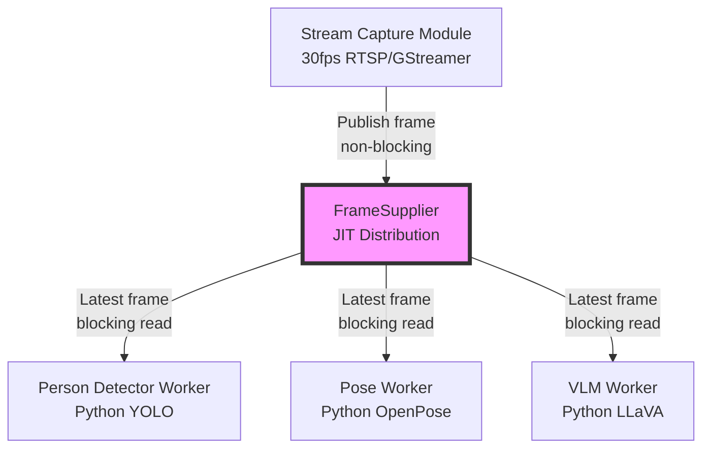
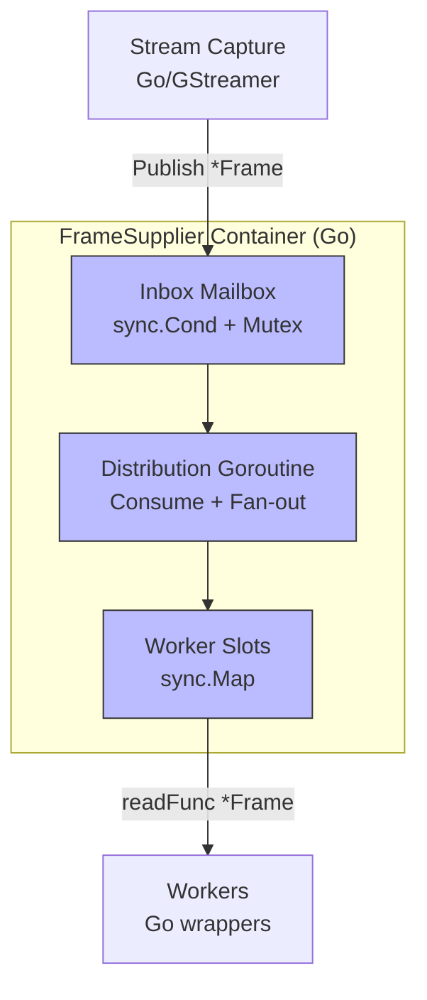
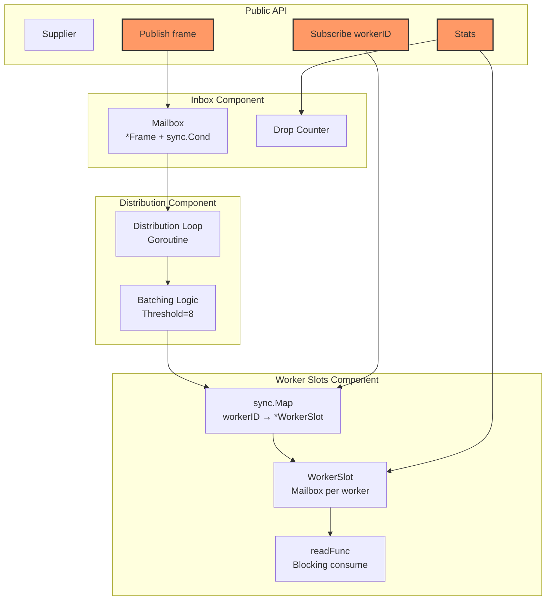

# C4 Model: FrameSupplier

**Module**: `modules/framesupplier`
**Purpose**: Non-blocking frame distribution with drop policy for real-time video processing
**Philosophy**: "Drop frames, never queue. Latency > Completeness."

---

## Changelog

| Version | Date       | Author          | Changes                                    |
|---------|------------|-----------------|--------------------------------------------|
| 0.1     | 2025-01-05 | Ernesto + Gaby  | Initial design - JIT architecture proposal |

---

## Level 1: System Context



**Key Relationships**:
- **Stream Capture → FrameSupplier**: Non-blocking publish (30fps), overwrite policy
- **FrameSupplier → Workers**: Blocking consume (variable fps per worker), mailbox per worker

**JIT Philosophy**: Each component maintains "latest frame" mailbox, dropping stale frames. No queuing at any level.

---

## Level 2: Container Diagram



**Technology Stack**:
- **Language**: Go 1.21+
- **Concurrency**: sync.Cond, sync.Mutex, sync.Map, atomic operations
- **Memory Model**: Zero-copy (shared pointers, immutable frames)
- **IPC**: None (in-process Go library)

**Data Flow**:
1. Stream Capture calls `Publish(*Frame)` → Inbox mailbox (1µs)
2. Distribution goroutine consumes inbox → Fan-out to N workers (100µs)
3. Workers call `readFunc()` → Block until frame available

---

## Level 3: Component Diagram



**Component Responsibilities**:

### Inbox Component
- **Purpose**: Accept frames from stream-capture (non-blocking)
- **Pattern**: Single-slot mailbox with sync.Cond
- **Drops**: Tracks inbox drops (should be ~0 in practice)

### Distribution Component
- **Purpose**: Fan-out frames to all worker slots
- **Pattern**: Batching with threshold=8 (sequential ≤8, concurrent >8)
- **Latency**: O(1) for ≤8 workers, O(N/8) goroutines for >8

### Worker Slots Component
- **Purpose**: Per-worker mailbox with blocking consume
- **Pattern**: sync.Map of WorkerSlots (each with sync.Cond)
- **Drops**: Tracks per-worker drops (operational monitoring)

---

## Level 4: Code Structure

### Package Layout
```
framesupplier/
├── supplier.go          # Public API + Supplier struct
├── inbox.go             # Inbox mailbox component
├── distribution.go      # Distribution loop + batching
├── worker_slot.go       # WorkerSlot struct + operations
├── stats.go             # Stats collection
├── frame.go             # Frame struct (immutable contract)
└── jit.go               # Optional: ConsumeJIT utility
```

### Core Types

```go
// Frame: Immutable by contract (never modify after Publish)
type Frame struct {
    Data      []byte    // JPEG bytes (zero-copy shared pointer)
    Width     int
    Height    int
    Timestamp time.Time
    Seq       uint64    // Global sequence from publisher
}

// Supplier: Main API
type Supplier struct {
    // Inbox mailbox (from stream-capture)
    inboxMu    sync.Mutex
    inboxCond  *sync.Cond
    inboxFrame *Frame
    inboxDrops uint64

    // Worker slots
    slots      sync.Map  // workerID → *WorkerSlot
    publishSeq uint64    // Atomic

    // Lifecycle
    ctx        context.Context
    cancel     context.CancelFunc
    wg         sync.WaitGroup
}

// WorkerSlot: Per-worker mailbox
type WorkerSlot struct {
    mu               sync.Mutex
    cond             *sync.Cond
    frame            *Frame  // nil = empty, non-nil = available
    lastConsumedAt   time.Time
    lastConsumedSeq  uint64
    consecutiveDrops uint64
    totalDrops       uint64
    closed           bool
}

// WorkerStats: Operational monitoring (not benchmarking)
type WorkerStats struct {
    WorkerID         string
    LastConsumedAt   time.Time
    LastConsumedSeq  uint64
    ConsecutiveDrops uint64
    TotalDrops       uint64
    IsIdle           bool  // true if lastConsumedAt > 30s ago
}
```

### API Flows

#### Subscribe Flow
```go
// Worker subscribes
readFunc := supplier.Subscribe("PersonDetector")

// Worker goroutine (blocking consume)
go func() {
    for {
        frame := readFunc()  // Blocks until frame available
        if frame == nil {
            return  // Unsubscribed
        }
        processFrame(frame)
    }
}()
```

#### Publish Flow
```go
// stream-capture publishes (non-blocking)
frame := &Frame{
    Data:      jpegBytes,
    Width:     640,
    Height:    480,
    Timestamp: time.Now(),
}
supplier.Publish(frame)  // Returns in ~1µs
```

#### Stats Flow
```go
// Operational monitoring
stats := supplier.Stats()
for workerID, stat := range stats.WorkerStats {
    if stat.IsIdle {
        log.Warn("Worker idle", "id", workerID, "since", stat.LastConsumedAt)
    }
    if stat.ConsecutiveDrops > 100 {
        log.Warn("Worker slow", "id", workerID, "drops", stat.ConsecutiveDrops)
    }
}
```

---

## Performance Characteristics

| Metric                  | Value (typical) | Value (worst case) | Budget @ 1fps |
|-------------------------|-----------------|---------------------|---------------|
| **Publish() latency**   | 1µs             | 20µs (spawn overhead)| 1,000,000µs   |
| **Distribution latency**| 100µs           | 100µs (64 workers)  | 1,000,000µs   |
| **Inbox drops**         | 0               | 0 (distribution 330× faster than 30fps) | N/A |
| **Worker drops**        | Variable        | Expected (different fps per worker) | N/A |

**Key Insight**: All latencies are **3-4 orders of magnitude** below inter-frame interval, making ordering issues impossible.

---

## Scalability Paths

### Current Design (Orion 1.5-2.0)
- **Workers**: 1-10 (POC to Expansion)
- **FPS**: 1fps inference, 30fps source
- **Deployment**: Single NUC, CPU inference

### Future Scaling
- **Workers**: 10-64 (Full deployment)
- **FPS**: 1-30fps inference (multi-stream)
- **Deployment**: Multi-NUC, GPU acceleration

**Design Accommodates**:
- ✅ Batching threshold (8) handles 64+ workers
- ✅ Zero-copy supports high-res frames (4K)
- ✅ Per-worker stats support SLA monitoring (Critical vs BestEffort)

---

## Integration Points

### Upstream: stream-capture
```go
// stream-capture owns GStreamer pipeline
type StreamCapture struct {
    supplier *framesupplier.Supplier
}

func (sc *StreamCapture) onFrameCallback(gstBuffer *C.GstBuffer) {
    frame := &framesupplier.Frame{
        Data: C.GoBytes(gstBuffer.data, gstBuffer.size),
        // ...
    }
    sc.supplier.Publish(frame)  // Non-blocking
}
```

### Downstream: worker-lifecycle
```go
// worker-lifecycle manages Python subprocess + Go wrapper
type WorkerManager struct {
    supplier *framesupplier.Supplier
}

func (wm *WorkerManager) StartWorker(workerID string) {
    readFunc := wm.supplier.Subscribe(workerID)

    go func() {
        for {
            frame := readFunc()
            // Send to Python subprocess via MsgPack stdin
            msgpack.Encode(pythonStdin, frame)
        }
    }()
}
```

---

## Design Philosophy Alignment

### Orion Principles
- ✅ **"Drop frames, never queue"**: Mailbox overwrite at 2 levels (inbox + per-worker)
- ✅ **"Latency > Completeness"**: Non-blocking publish, fire-and-forget distribution
- ✅ **"JIT Architecture"**: Toyota-style just-in-time, no inventory (buffering)

### Go Best Practices
- ✅ **Zero-copy**: Shared pointers, immutable contract
- ✅ **Sync primitives**: sync.Cond for blocking semantics (not channels)
- ✅ **Batching**: Threshold-based goroutine spawning (guardrails)

### "Complejidad por Diseño"
- ✅ **Atacar complejidad real**: JIT semantics, operational monitoring
- ❌ **No sobre-abstraer**: No generic pub/sub, specific to Orion Workers
- ✅ **Cohesión conceptual**: One responsibility (frame distribution)

---

## Future Considerations

### Phase 1 (Current Proposal)
- Single-stream distribution
- Operational stats (idle detection, drop counters)
- Zero-copy within Go

### Phase 2 (Multi-Stream)
- Add `streamID` to Frame struct
- Workers subscribe to specific streams
- Minimal API changes (internal routing only)

### Phase 3 (Shared Memory with Python)
- Replace MsgPack with mmap shared memory
- Eliminates Go→Python serialization
- Requires complex ownership/GC coordination (YAGNI for now)

---

## References

- **ARCHITECTURE.md**: Deep dive on algorithms, concurrency patterns
- **ADR-001**: sync.Cond for Mailbox Semantics
- **ADR-002**: Zero-Copy Frame Sharing
- **ADR-003**: Batching with Threshold=8
- **ADR-004**: Symmetric JIT Architecture

---

**Review Status**: 🟡 Design Proposal (Implementation Pending)
