# Stream Capture Architecture

**Module:** `stream-capture`  
**Bounded Context:** Stream Acquisition (Orion 2.0)  
**Version:** 2.0  
**Last Updated:** 2025-01-04


---

## Table of Contents

1. [Module Overview](#1-module-overview)
2. [StreamProvider Interface](#2-streamprovider-interface)
3. [RTSPStream Architecture](#3-rtspstream-architecture)
   - 3.1 [Component Structure](#31-component-structure)
   - 3.2 [GStreamer Pipeline](#32-gstreamer-pipeline)
   - 3.3 [Callback Lifecycle](#33-callback-lifecycle)
   - 3.4 [Hot-Reload Mechanism](#34-hot-reload-mechanism)
4. [Warmup & FPS Stability](#4-warmup--fps-stability)
5. [Hardware Acceleration (VAAPI)](#5-hardware-acceleration-vaapi)
6. [Reconnection Logic](#6-reconnection-logic)
7. [Frame Channel Buffering](#7-frame-channel-buffering)
8. [Statistics & Telemetry](#8-statistics--telemetry)
9. [Error Categorization](#9-error-categorization)
10. [Design Decisions](#10-design-decisions)

---

  
  ✅ Secciones Completadas:  
  
    - Module Overview - Responsabilidades y anti-responsabilidades  
    - StreamProvider Interface - Contrato completo + tabla comparativa  
    - RTSPStream Architecture    
      - ✅ 3.1: Component Structure (diagrama Mermaid de la struct)  
      - ✅ 3.2: GStreamer Pipeline (ambas variantes: Software + VAAPI)  
      - 🚧 3.3: Callback Lifecycle (TODO)  
      - ✅ 3.4: Hot-Reload Mechanism (state machine completo)  
    - Reconnection Logic - State machine + retry schedule  
    - Frame Channel Buffering - Non-blocking pattern + rationale  
    - Design Decisions - 6 ADRs documentados  
  
  🚧 Secciones TODO (placeholders):  
  
    - Warmup & FPS Stability - Algoritmo + criteria  
    - Hardware Acceleration - Detalles VAAPI  
    - Statistics & Telemetry - Lock-free design  
    - Error Categorization - Remediation table  
  
  -------------------------------------------------------------------------------  
  
  🎯 Diferencias clave vs CLAUDE.md  
  
┌───────────┬──────────────────────────────┬────────────────────────────────────┐ 
│ Aspecto   │ CLAUDE.md                    │ ARCHITECTURE.md                    │  
├───────────┼──────────────────────────────┼────────────────────────────────────┤  
│ Audiencia │ AI assistants + nuevos devs  │ Desarrolladores expertos           │  
├───────────┼──────────────────────────────┼────────────────────────────────────┤  
│ Propósito │ Onboarding + troubleshooting │ Referencia técnica                 │  
├───────────┼──────────────────────────────┼────────────────────────────────────┤  
│ Estilo    │ Tutorial (Quick Start first) │ Enciclopédico (contratos first)    │  
├───────────┼──────────────────────────────┼────────────────────────────────────┤  
│ Diagramas │ Funcionales (pipeline flow)  │ Estructurales (component diagrams) │  
├───────────┼──────────────────────────────┼────────────────────────────────────┤  
│ Ejemplos  │ Código ejecutable            │ Pseudocódigo + state machines      │  
└───────────┴──────────────────────────────┴────────────────────────────────────┘  
  
  -------------------------------------------------------------------------------  
  
  📊 Elementos Destacados  
  
  1. Diagramas Mermaid Nuevos:  
  
    - Component Structure (6 categorías de estado)  
    - Software vs VAAPI pipeline (comparativa visual)  
    - Hot-Reload State Machine  
    - Reconnection Logic State Machine  
  
  2. Tablas Comparativas:  
  
    - StreamProvider methods (5 métodos con guarantees)  
    - RTSPStream vs MockStream (7 features)  
    - Pipeline element configuration (12 elementos con todas las properties)  
    - Retry schedule (5 intentos con tiempos acumulados)  
  
  3. Design Decisions (ADRs locales):  
  
    - AD-1: Non-Blocking Channels  
    - AD-2: Atomic Statistics  
    - AD-3: Double-Close Protection  
    - AD-4: RGB Format Lock (VAAPI)  
    - AD-5: TCP-Only Transport  
    - AD-6: Warmup Fail-Fast  
  
  -------------------------------------------------------------------------------  
  
  🔄 Próximos Pasos  
  
  Opción A: Revisar el skeleton ahora y dame feedback  
  Opción B: Rellenar las secciones TODO antes de revisar  
  Opción C: Crear README.md primero (human-friendly overview)


---

## 1. Module Overview

**stream-capture** is a bounded context within Orion 2.0 responsible for video stream acquisition from RTSP sources. It provides a clean, production-ready Go interface (`StreamProvider`) wrapping GStreamer pipelines with hardware acceleration support (VAAPI), automatic reconnection, and hot-reload capabilities.

**Key Responsibilities:**
- RTSP stream acquisition with H.264 decode (hardware/software)
- Frame rate control with hot-reload (no restart required)
- Automatic reconnection with exponential backoff
- Hardware acceleration (Intel VAAPI) with fallback to software decode
- Frame distribution with non-blocking drop semantics
- Telemetry: FPS stability, decode latency (P95/mean/max), error categorization

**Anti-Responsibilities:**
- Frame processing/inference (handled by workers)
- Frame recording/storage (handled by event emitter)
- Multi-stream management (handled by core orchestrator)

**Sources:** [provider.go:8-124](../provider.go#L8-L124), [rtsp.go:16-62](../rtsp.go#L16-L62)

---

## 2. StreamProvider Interface

The `StreamProvider` interface defines the contract for all stream implementations. Currently, only `RTSPStream` is production-ready (MockStream exists for testing).

### 2.1 Interface Contract

| Method | Signature | Purpose | Blocking? |
|--------|-----------|---------|-----------|
| `Start()` | `Start(ctx) (<-chan Frame, error)` | Initialize stream, return frame channel | ❌ No (returns immediately) |
| `Stop()` | `Stop() error` | Graceful shutdown (3s timeout) | ✅ Yes (waits for goroutines) |
| `Stats()` | `Stats() StreamStats` | Return current statistics | ❌ No (atomic reads) |
| `SetTargetFPS()` | `SetTargetFPS(fps float64) error` | Hot-reload FPS (~2s interruption) | ✅ Yes (GStreamer caps update) |
| `Warmup()` | `Warmup(ctx, duration) (*WarmupStats, error)` | Measure FPS stability | ✅ Yes (blocks for duration) |

**Implementation Guarantees:**
- `Start()` returns channel that never closes until `Stop()`
- `Stop()` is idempotent (safe to call multiple times)
- `Stats()` is thread-safe (can be called from any goroutine)
- `SetTargetFPS()` supports hot-reload without restart
- `Warmup()` provides fail-fast validation for production use

**Sources:** [provider.go:8-124](../provider.go#L8-L124)

### 2.2 Implementation Comparison

| Feature | RTSPStream | MockStream | Notes |
|---------|------------|------------|-------|
| Production-ready | ✅ Yes | ❌ No (testing only) | MockStream lacks error simulation |
| Hardware acceleration | ✅ VAAPI support | N/A | Auto-fallback to software |
| Reconnection | ✅ Exponential backoff | N/A | 5 retries with backoff |
| Hot-reload FPS | ✅ Yes (~2s) | ✅ Yes (instant) | RTSPStream uses GStreamer caps |
| Warmup support | ✅ Yes | ✅ Yes | Both use same warmup algorithm |
| Error telemetry | ✅ 4 categories | ❌ No | Network/Codec/Auth/Unknown |
| Decode latency | ✅ VAAPI only | N/A | P95/mean/max tracking |

**Sources:** [rtsp.go:16-62](../rtsp.go#L16-L62), [internal/rtsp/callbacks.go](../internal/rtsp/callbacks.go)

---

## 3. RTSPStream Architecture

### 3.1 Component Structure

The `RTSPStream` struct maintains six categories of state:

```mermaid
flowchart TD
  subgraph RTSPStream["RTSPStream Struct"]
    direction TB
    
    Config["Configuration
    • rtspURL: string
    • width, height: int
    • targetFPS: float64
    • sourceStream: string
    • acceleration: HardwareAccel"]
    
    GStreamer["GStreamer References
    • elements: *PipelineElements
      - pipeline: *gst.Pipeline
      - appsink: *app.Sink
      - videorate: *gst.Element
      - capsfilter: *gst.Element
      - decoder: *gst.Element"]
    
    Channels["Channel Layer
    • frames: chan Frame (buffer: 10)
    • framesClosed: atomic.Bool"]
    
    Lifecycle["Lifecycle Control
    • ctx: context.Context
    • cancel: context.CancelFunc
    • wg: sync.WaitGroup
    • mu: sync.RWMutex"]
    
    Stats["Statistics (Atomic)
    • frameCount: uint64
    • framesDropped: uint64
    • bytesRead: uint64
    • reconnects: uint32
    • started, lastFrameAt: time.Time"]
    
    Telemetry["Telemetry
    • errorsNetwork: uint64
    • errorsCodec: uint64
    • errorsAuth: uint64
    • errorsUnknown: uint64
    • usingVAAPI: bool
    • decodeLatencies: atomic.Pointer"]
    
    Reconnect["Reconnection State
    • reconnectState: *ReconnectState
    • reconnectCfg: ReconnectConfig
      - maxRetries: int (5)
      - retryDelay: time.Duration (1s)
      - maxRetryDelay: time.Duration (30s)"]
    
    Config --> GStreamer
    GStreamer --> Channels
    Channels --> Lifecycle
    Lifecycle --> Stats
    Stats --> Telemetry
    Telemetry --> Reconnect
  end
```



**State Categories:**

1. **Configuration** - Immutable parameters loaded from `RTSPConfig`
2. **GStreamer References** - Pointers to pipeline elements for hot-reload
3. **Channel Layer** - Frame output with atomic double-close protection
4. **Lifecycle Control** - Context-based shutdown and mutex protection
5. **Statistics** - Atomic counters for lock-free monitoring
6. **Telemetry** - Error categorization and VAAPI latency tracking
7. **Reconnection State** - Exponential backoff state machine

**Sources:** [rtsp.go:16-62](../rtsp.go#L16-L62), [internal/rtsp/reconnect.go](../internal/rtsp/reconnect.go)

### 3.2 GStreamer Pipeline

#### 3.2.1 Software Decode Pipeline

```mermaid
flowchart LR
  RTSP["rtspsrc
  • location: rtspURL
  • protocols: 4 (TCP)
  • latency: 200ms"]
  
  Depay["rtph264depay
  H.264 RTP depayloader"]
  
  Decode["avdec_h264
  libav H.264 decoder
  (CPU-based)"]
  
  Convert["videoconvert
  Format conversion"]
  
  Scale["videoscale
  Resolution scaling"]
  
  Rate["videorate
  • drop-only: true
  • skip-to-first: true"]
  
  Caps["capsfilter
  video/x-raw,format=RGB
  width=W, height=H
  framerate=N/D"]
  
  Sink["appsink
  • sync: false
  • max-buffers: 1
  • drop: true
  • emit-signals: true"]
  
  RTSP -- "Dynamic pad-added" --> Depay
  Depay --> Decode --> Convert --> Scale --> Rate --> Caps --> Sink
```



#### 3.2.2 VAAPI Hardware Decode Pipeline

```mermaid
flowchart LR
  RTSP["rtspsrc
  • location: rtspURL
  • protocols: 4 (TCP)
  • latency: 200ms"]
  
  Depay["rtph264depay
  H.264 RTP depayloader"]
  
  Parse["h264parse
  Stream analysis
  for VAAPI"]
  
  Decode["vaapih264dec
  Intel Quick Sync
  (GPU-based)"]
  
  CapsRGB["capsfilter
  video/x-raw,format=RGB
  ⚠️ Forces RGB before rate
  (prevents VASurface negotiation)"]
  
  Rate["videorate
  • drop-only: true
  • skip-to-first: true"]
  
  CapsOut["capsfilter
  video/x-raw,format=RGB
  width=W, height=H
  framerate=N/D"]
  
  Sink["appsink
  • sync: false
  • max-buffers: 1
  • drop: true
  • emit-signals: true"]
  
  RTSP -- "Dynamic pad-added" --> Depay
  Depay --> Parse --> Decode --> CapsRGB --> Rate --> CapsOut --> Sink
```



**Key Differences (Software vs VAAPI):**

| Component | Software | VAAPI | Rationale |
|-----------|----------|-------|-----------|
| Decoder | `avdec_h264` | `vaapih264dec` | VAAPI uses Intel Quick Sync (GPU) |
| Parser | None | `h264parse` | VAAPI requires stream analysis |
| RGB Lock | After videorate | **Before videorate** | Prevents `video/x-raw(memory:VASurface)` negotiation issues |
| Latency Tracking | ❌ No | ✅ Yes | GPU decode benefits from telemetry |

**Sources:** [internal/rtsp/pipeline.go](../internal/rtsp/pipeline.go)

#### 3.2.3 Pipeline Element Configuration

| Element | Property | Value | Purpose |
|---------|----------|-------|---------|
| `rtspsrc` | `location` | `rtspURL` | RTSP stream URL |
| | `protocols` | `4` (TCP) | Maximum compatibility + go2rtc integration |
| | `latency` | `200ms` | Jitter buffer size |
| `rtph264depay` | (default) | - | RTP H.264 depayloading |
| `h264parse` (VAAPI only) | (default) | - | Stream analysis for VAAPI |
| `avdec_h264` / `vaapih264dec` | (default) | - | Software/hardware decode |
| `videoconvert` (software only) | (default) | - | Format conversion |
| `videoscale` (software only) | (default) | - | Resolution scaling |
| `videorate` | `drop-only` | `true` | Only drop frames, never duplicate |
| | `skip-to-first` | `true` | Skip initial frames until first keyframe |
| `capsfilter` (RGB lock) | `caps` | `video/x-raw,format=RGB` | Force RGB format (VAAPI) |
| `capsfilter` (output) | `caps` | `video/x-raw,format=RGB,width=W,height=H,framerate=N/D` | Final resolution and FPS |
| `appsink` | `sync` | `false` | Don't sync to clock (real-time) |
| | `max-buffers` | `1` | Only keep latest frame |
| | `drop` | `true` | Drop old frames when buffer full |
| | `emit-signals` | `true` | Enable `new-sample` callback |

**Sources:** [internal/rtsp/pipeline.go:61-295](../internal/rtsp/pipeline.go)

#### 3.2.4 Dynamic Pad Connection

The `rtspsrc` element creates output pads dynamically when it discovers the stream format. The `pad-added` signal connects the RTSP source to the depayloader:

```go
// Callback triggered when rtspsrc creates a new pad
onPadAdded := func(self *gst.Element, newPad *gst.Pad) {
    sinkPad := depay.GetStaticPad("sink")
    if sinkPad.IsLinked() {
        return // Already connected
    }
    newPad.Link(sinkPad) // Connect rtspsrc -> rtph264depay
}
```

**Sources:** [internal/rtsp/pipeline.go](../internal/rtsp/pipeline.go)

### 3.3 Callback Lifecycle

TODO: Document onNewSample → frame emission state machine

**Placeholder sections:**
- Frame extraction from GstSample
- RGB byte copy (no alpha channel)
- Non-blocking channel send
- Drop statistics increment
- Decode latency tracking (VAAPI only)

**Sources:** [internal/rtsp/callbacks.go](../internal/rtsp/callbacks.go)

### 3.4 Hot-Reload Mechanism

The `SetTargetFPS()` method implements lock-free FPS updates without restarting the GStreamer pipeline:


**Hot-Reload Steps:**

1. **Acquire Lock** (`mu.Lock()`) - Protects `targetFPS` and `capsfilter` reference
2. **Validate FPS** - Must be between 0.1 and 30 Hz
3. **Calculate Fraction** - Convert float to GStreamer framerate fraction:
   - For fps ≥ 1.0: `framerate = fps/1` (e.g., 5.0 → `5/1`)
   - For fps < 1.0: `framerate = 1/(1/fps)` (e.g., 0.5 → `1/2`)
4. **Update Capsfilter** - Set new caps on running pipeline element
5. **Release Lock** (`mu.Unlock()`)

**Interruption Window:** ~2 seconds (GStreamer caps negotiation)  
**Alternative Cost:** Full restart = 5-10 seconds (reconnection + warmup)

**Sources:** [rtsp.go:93-142](../rtsp.go#L93-L142) (legacy reference), similar implementation in new structure

---

## 4. Warmup & FPS Stability

TODO: Document warmup algorithm and stability criteria

**Placeholder sections:**
- Warmup algorithm pseudocode
- Stability criteria table (FPS stddev < 15%, jitter < 20%)
- Fail-fast pattern rationale
- Jitter calculation (inter-frame interval variance)

**Sources:** [warmup_stats.go](../warmup_stats.go), [internal/warmup/warmup.go](../internal/warmup/warmup.go)

---

## 5. Hardware Acceleration (VAAPI)

TODO: Document VAAPI acceleration details

**Placeholder sections:**
- AccelAuto vs AccelVAAPI vs AccelSoftware
- Fallback logic (VAAPI → Software)
- Decode latency tracking mechanism (atomic.Pointer[LatencyWindow])
- Performance comparison table (VAAPI ~20ms vs Software ~50ms)

**Sources:** [internal/rtsp/pipeline.go](../internal/rtsp/pipeline.go), [types.go:152-179](../types.go#L152-L179)

---

## 6. Reconnection Logic

RTSPStream implements exponential backoff reconnection for network resilience:


**Reconnection Parameters:**

| Parameter | Default Value | Purpose |
|-----------|---------------|---------|
| `maxRetries` | 5 | Maximum consecutive reconnection attempts |
| `retryDelay` | 1 second | Initial backoff delay |
| `maxRetryDelay` | 30 seconds | Maximum backoff cap |
| `currentRetries` | 0 (reset on success) | Attempt counter |

**Exponential Backoff Formula:**

```
delay = retryDelay × 2^(currentRetries-1)
delay = min(delay, maxRetryDelay)
```

**Retry Schedule:**

| Attempt | Delay | Cumulative Time |
|---------|-------|-----------------|
| 1 | 1s | 1s |
| 2 | 2s | 3s |
| 3 | 4s | 7s |
| 4 | 8s | 15s |
| 5 | 16s | 31s |
| After 5 failures | Stream stops | - |

**Success Condition:** On successful transition to `gst.StatePlaying`, `currentRetries` is reset to 0.

**Sources:** [internal/rtsp/reconnect.go](../internal/rtsp/reconnect.go), legacy reference [rtsp.go:173-366](../rtsp.go#L173-L366)

---

## 7. Frame Channel Buffering

Both stream providers use identical channel buffering strategies:

| Parameter | Value | Rationale |
|-----------|-------|-----------|
| Channel buffer | 10 frames | Absorbs temporary processing delays |
| Send behavior | Non-blocking | Drops frames rather than blocking pipeline |
| Channel capacity check | None | Always attempts send, relies on `select` default case |

**Non-Blocking Send Pattern:**

```go
// Non-blocking frame send (both RTSP and Mock)
select {
case s.frames <- frame:
    // Frame sent successfully
default:
    // Channel full - drop frame
    atomic.AddUint64(&s.framesDropped, 1)
    slog.Debug("dropping frame, channel full", "seq", frame.Seq)
}
```

**Design Rationale:**

This design prioritizes **real-time processing over completeness**. If downstream consumers (FrameBus, workers) cannot keep up, frames are dropped at the source rather than queuing indefinitely. This prevents:

- **Memory growth** from unbounded queues
- **Head-of-line blocking** (old frames blocking new frames)
- **Stale processing** (inference on outdated frames)

The system always processes **recent frames** rather than historical backlog, ensuring inference results reflect current state.

**Sources:** [internal/rtsp/callbacks.go](../internal/rtsp/callbacks.go)

---

## 8. Statistics & Telemetry

TODO: Document statistics tracking mechanisms

**Placeholder sections:**
- StreamStats field sources (atomic vs mutex)
- Lock-free design rationale
- Drop rate calculation
- Real FPS calculation (frameCount / uptime)

**Sources:** [types.go:23-66](../types.go#L23-L66), [rtsp.go:Stats() method](../rtsp.go)

---

## 9. Error Categorization

TODO: Document error classification and remediation

**Placeholder sections:**
- Error category table (Network/Codec/Auth/Unknown)
- GStreamer error message patterns
- Remediation strategies

**Sources:** [types.go:68-96](../types.go#L68-L96), [internal/rtsp/errors.go](../internal/rtsp/errors.go)

---

## 10. Design Decisions

### AD-1: Non-Blocking Channels with Drop Policy

**Decision:** Use non-blocking channel sends with frame dropping when buffer is full.

**Context:** Real-time video processing requires predictable latency. Queuing frames when consumers are slow leads to unbounded memory growth and processing of stale data.

**Rationale:**
- **Latency > Completeness**: Prefer dropping frames over queuing to maintain <2s latency
- **Predictable behavior**: Bounded buffer (10 frames) prevents memory growth
- **Real-time semantics**: Always process recent frames, not historical backlog

**Consequences:**
- ✅ Guaranteed bounded memory usage
- ✅ Predictable worst-case latency
- ❌ Frame loss under load (mitigated by drop statistics)

**Sources:** [Section 7](#7-frame-channel-buffering)

---

### AD-2: Atomic Statistics (Lock-Free Telemetry)

**Decision:** Use `sync/atomic` for statistics counters instead of mutex-protected fields.

**Context:** Statistics are updated in hot paths (GStreamer callbacks, frame emission) and read frequently by monitoring systems.

**Rationale:**
- **Performance**: Atomic operations are faster than mutex locks (~10ns vs ~100ns)
- **No contention**: Lock-free reads allow concurrent monitoring without blocking pipeline
- **Safety**: Atomic operations guarantee memory ordering

**Consequences:**
- ✅ Zero lock contention in hot paths
- ✅ Safe concurrent reads from monitoring goroutines
- ❌ Slightly more complex code (atomic.LoadUint64 vs direct field access)

**Sources:** [rtsp.go:39-62](../rtsp.go#L39-L62), [Section 8](#8-statistics--telemetry)

---

### AD-3: Double-Close Protection (Atomic Bool)

**Decision:** Use `atomic.Bool` (`framesClosed`) to protect against double-close panic on frame channel.

**Context:** During shutdown, two goroutines (Stop() + runPipeline error path) could attempt to close the frame channel simultaneously, causing panic.

**Rationale:**
- **Safety**: Atomic CAS (compare-and-swap) ensures only one close operation succeeds
- **Simplicity**: One atomic bool vs complex shutdown choreography
- **Performance**: Negligible overhead (one atomic load per close attempt)

**Consequences:**
- ✅ Eliminates double-close panics during shutdown races
- ✅ Minimal code complexity (2 lines)
- ❌ Slightly less obvious than explicit channel ownership

**Sources:** [rtsp.go:61](../rtsp.go#L61), CLAUDE.md Known Issues section

---

### AD-4: RGB Format Lock (VAAPI Pipeline)

**Decision:** Insert `capsfilter` with `video/x-raw,format=RGB` **before** `videorate` in VAAPI pipeline.

**Context:** VAAPI decoder outputs `video/x-raw(memory:VASurface)` which causes caps negotiation failures if RGB conversion happens after videorate.

**Rationale:**
- **GStreamer constraint**: VASurface memory can't be converted to RGB after rate limiting
- **Fail-fast**: Without RGB lock, pipeline fails at runtime with cryptic caps negotiation error
- **Minimal overhead**: Format conversion happens once per frame (not per-rate-limited frame)

**Consequences:**
- ✅ Stable VAAPI pipeline (no runtime caps errors)
- ✅ Clear separation: decode → RGB → rate → output
- ❌ Slight performance cost (RGB conversion before frame drop)

**Sources:** [internal/rtsp/pipeline.go:283-295](../internal/rtsp/pipeline.go), CLAUDE.md Known Issues

---

### AD-5: TCP-Only Transport (RTSP)

**Decision:** Configure `rtspsrc` with `protocols=4` (TCP only), not UDP/multicast.

**Context:** RTSP supports multiple transport protocols (UDP, TCP, HTTP tunneling, multicast).

**Rationale:**
- **Compatibility**: Works behind firewalls/NATs (outbound TCP connection)
- **go2rtc integration**: go2rtc prefers TCP for reliability
- **Simplicity**: No need to handle UDP port negotiation or packet loss

**Consequences:**
- ✅ Maximum compatibility with network infrastructure
- ✅ Simpler error handling (TCP connection state vs UDP packet loss)
- ❌ Higher latency than UDP (TCP overhead)
- ❌ No multicast support (acceptable for 1:1 camera streams)

**Sources:** [internal/rtsp/pipeline.go:61](../internal/rtsp/pipeline.go), CLAUDE.md Known Issues

---

### AD-6: Warmup Fail-Fast Pattern

**Decision:** `Warmup()` returns error if stream is unstable (FPS stddev > 15% OR jitter > 20%).

**Context:** Unstable streams cause unpredictable inference timing and can hide deeper issues (network, camera config).

**Rationale:**
- **Production safety**: Prevents deploying on unreliable streams
- **Fail-fast principle**: Catch configuration issues at startup, not after hours of operation
- **Clear signal**: Unstable stream = actionable error, not silent degradation

**Consequences:**
- ✅ Forces users to fix stream stability issues before production
- ✅ Clear pass/fail criteria (not subjective "seems slow")
- ❌ Requires 5-second warmup period (acceptable startup cost)

**Sources:** [Section 4](#4-warmup--fps-stability), [warmup_stats.go](../warmup_stats.go)

---

## Appendix A: Cross-References

**Related Documentation:**
- [CLAUDE.md](../CLAUDE.md) - AI companion guide with quick start, troubleshooting, and development workflow
- [README.md](../README.md) - Human-friendly module overview (TODO)
- Parent repository: [OrionWork/VAULT/arquitecture/ARCHITECTURE.md](../../../VAULT/arquitecture/ARCHITECTURE.md) - Orion 2.0 system architecture

**Source Files:**
- [provider.go](../provider.go) - StreamProvider interface definition
- [rtsp.go](../rtsp.go) - RTSPStream implementation
- [types.go](../types.go) - Type definitions (Frame, StreamStats, RTSPConfig)
- [warmup_stats.go](../warmup_stats.go) - Warmup statistics implementation
- [internal/rtsp/pipeline.go](../internal/rtsp/pipeline.go) - GStreamer pipeline construction
- [internal/rtsp/callbacks.go](../internal/rtsp/callbacks.go) - GStreamer callback handlers
- [internal/rtsp/reconnect.go](../internal/rtsp/reconnect.go) - Reconnection state machine
- [internal/rtsp/errors.go](../internal/rtsp/errors.go) - Error categorization

---

## Appendix B: Glossary

| Term | Definition |
|------|------------|
| **VAAPI** | Video Acceleration API - Intel's GPU video decode/encode interface |
| **GStreamer** | Multimedia framework for building video/audio pipelines |
| **RTP** | Real-time Transport Protocol - standard for video streaming |
| **RTSP** | Real-time Streaming Protocol - control protocol for RTSP streams |
| **H.264** | Video codec standard (also known as AVC, MPEG-4 Part 10) |
| **Caps** | Capabilities - GStreamer term for media format description |
| **Appsink** | GStreamer element that delivers frames to application code |
| **Depayloader** | GStreamer element that extracts media from RTP packets |
| **Jitter** | Variance in inter-frame intervals (smoothness metric) |
| **P95** | 95th percentile - value exceeded by only 5% of samples |

---

**Document Status:** 🚧 DRAFT - Skeleton complete, TODO sections need implementation  
**Next Steps:**
1. Fill section 3.3 (Callback Lifecycle)
2. Fill section 4 (Warmup & FPS Stability)
3. Fill section 5 (Hardware Acceleration)
4. Fill section 8 (Statistics & Telemetry)
5. Fill section 9 (Error Categorization)
6. Add code examples to sections 3.2-3.4
7. Cross-validate all source references against actual code
