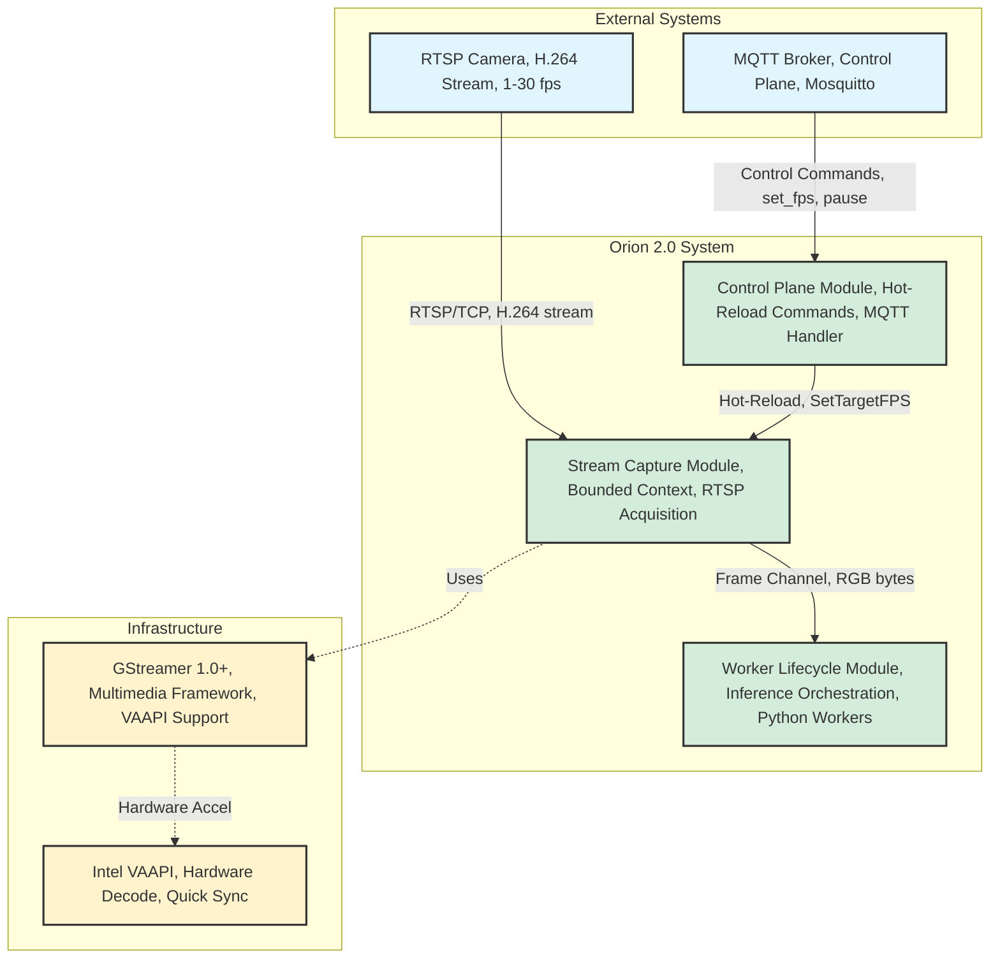
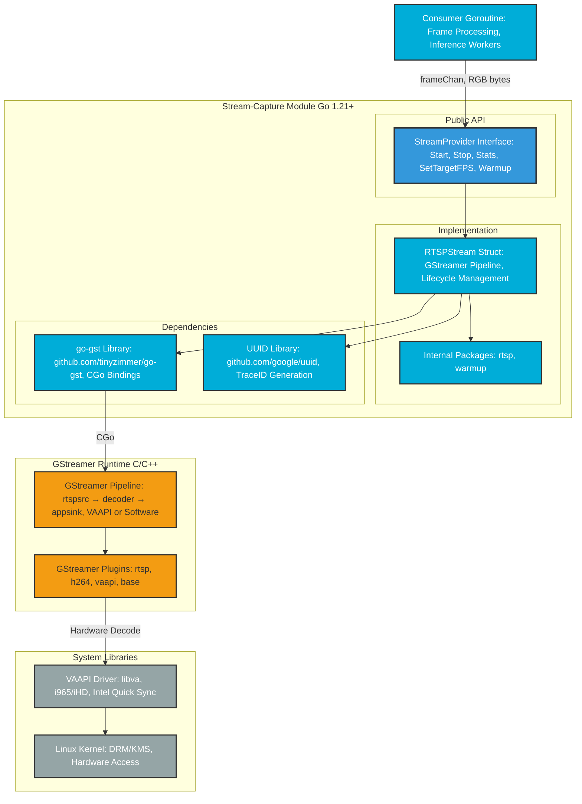
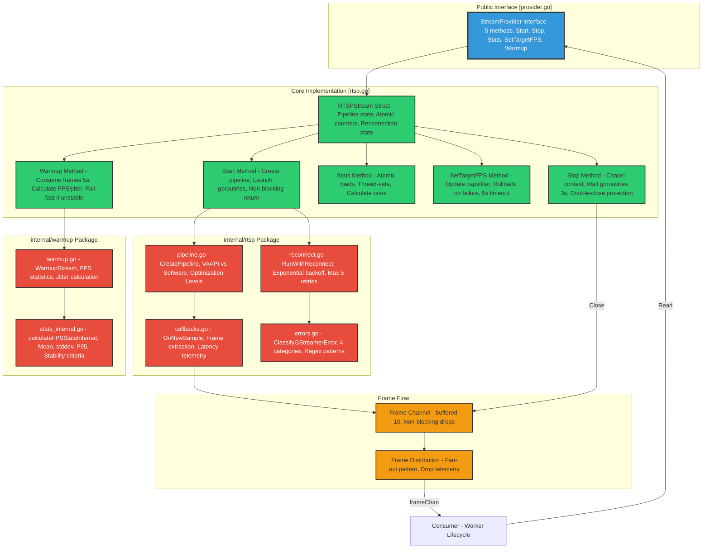
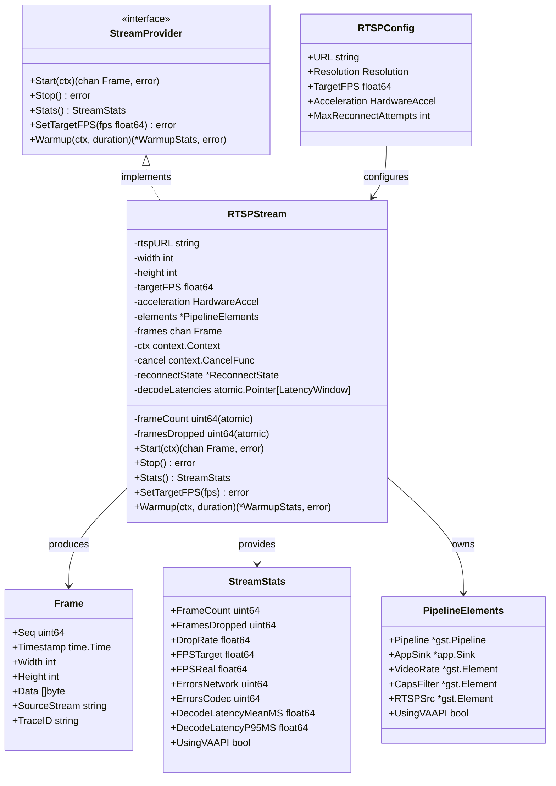
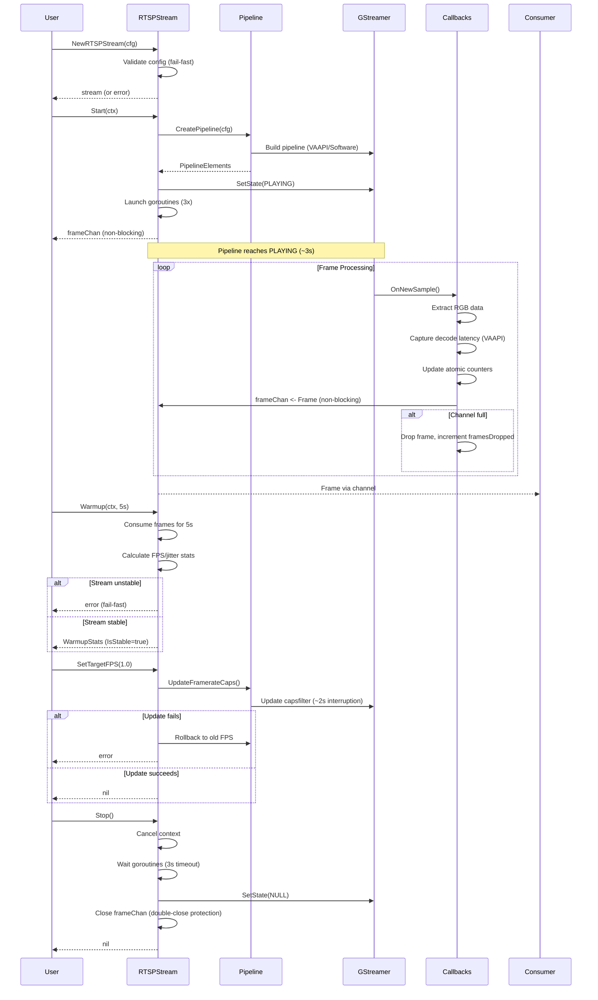
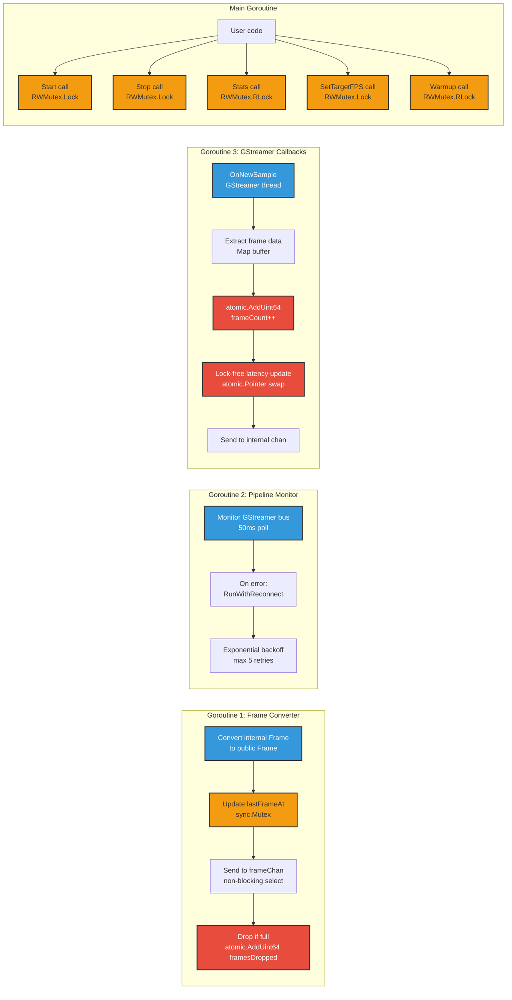

# C4 Model: Stream-Capture Module

**Orion 2.0 - Bounded Context: Stream Acquisition**

This document describes the architecture of the `stream-capture` module using the [C4 Model](https://c4model.com/) (Context, Container, Component, Code).

**Purpose**: Provide visual architecture reference for future Claude Code sessions and development team.

**Last Updated**: 2025-11-04
**Revision**: 1.0

---

## Table of Contents

1. [C1: System Context](#c1-system-context)
2. [C2: Container Diagram](#c2-container-diagram)
3. [C3: Component Diagram](#c3-component-diagram)
4. [C4: Code Diagram](#c4-code-diagram)
5. [Key Architectural Decisions](#key-architectural-decisions)

---

## C1: System Context

**Scope**: How stream-capture fits within Orion 2.0 ecosystem.

# End of Selection

**Key Interactions**:
- **RTSP Camera → Stream-Capture**: TCP-only H.264 stream (protocols=4)
- **Stream-Capture → Worker Lifecycle**: Non-blocking frame channel (RGB format, 10 buffer)
- **Control Plane → Stream-Capture**: Hot-reload commands (SetTargetFPS, Pause/Resume)
- **Stream-Capture ↔ GStreamer**: Pipeline management via go-gst bindings
- **GStreamer ↔ VAAPI**: Hardware decode acceleration (optional, auto-fallback)

**External Dependencies**:
- RTSP Camera (H.264 baseline/main profile)
- GStreamer 1.0+ (plugins: base, good, bad, vaapi)
- VAAPI drivers (intel-media-va-driver for Quick Sync)

---

## C2: Container Diagram

**Scope**: Technology containers within stream-capture module.

**Technology Stack**:
- **Go 1.21+**: Main language (concurrency, orchestration)
- **go-gst (CGo)**: GStreamer bindings (pipeline management)
- **GStreamer 1.0+**: Multimedia framework (RTSP, H.264 decode, format conversion)
- **VAAPI**: Hardware acceleration (Intel Quick Sync, optional)
- **Linux Kernel**: Hardware access (DRM/KMS for GPU decode)

**Key Container Boundaries**:
1. **Go Process** (stream-capture): Lifecycle, concurrency, API
2. **GStreamer Runtime** (C/C++): Pipeline execution, codec processing
3. **System Libraries** (VAAPI/Kernel): Hardware acceleration layer

---

## C3: Component Diagram

**Scope**: Internal components within stream-capture Go module.

# End of Selection

**Component Responsibilities**:

| Component | Responsibility | Thread-Safety | Key Files |
|-----------|---------------|---------------|-----------|
| **StreamProvider** | Public API contract | Interface (no state) | provider.go:17-124 |
| **RTSPStream** | Lifecycle orchestration | RWMutex + atomics | rtsp.go:16-822 |
| **Pipeline** | GStreamer pipeline creation | Stateless (called from Start) | internal/rtsp/pipeline.go |
| **Callbacks** | Frame extraction from GStreamer | Lock-free (atomic counters) | internal/rtsp/callbacks.go |
| **Reconnect** | Exponential backoff retry | Context-based cancellation | internal/rtsp/reconnect.go |
| **Errors** | GStreamer error classification | Stateless (pure function) | internal/rtsp/errors.go |
| **WarmupStream** | FPS stability validation | Consumes from channel | internal/warmup/warmup.go |
| **Frame Channel** | Non-blocking frame delivery | Go channel (buffered 10) | rtsp.go:126 |

---

## C4: Code Diagram

**Scope**: Key interfaces, structs, and functions (implementation details).

### Core Types

### Key Algorithms

### Thread Safety Model

**Thread-Safety Guarantees**:
- **RWMutex**: Protects pipeline state during Start/Stop/SetTargetFPS (exclusive), Stats/Warmup (shared)
- **Atomic operations**: frameCount, framesDropped, bytesRead, reconnects (lock-free)
- **atomic.Pointer**: decodeLatencies (lock-free read/write with copy-on-write pattern)
- **Channels**: Frame delivery (Go's built-in synchronization)
- **Context**: Goroutine lifecycle (cancel propagation)

---

## Key Architectural Decisions

### AD-1: Non-Blocking Frame Channel with Drop Policy

**Decision**: Use buffered channel (10 frames) with non-blocking send + drop tracking.

**Rationale**:
- Latency > Completeness (Orion philosophy)
- Prevents head-of-line blocking (slow consumer doesn't stall stream)
- Bounded memory (10 frames × 1280×720×3 bytes ≈ 26 MB worst case)
- Drop telemetry enables monitoring (DropRate in StreamStats)

**Trade-offs**:
- ✅ Predictable latency (<2s target)
- ✅ Graceful degradation (drops instead of crashes)
- ❌ Frame loss at high drop rates (>10% indicates consumer too slow)

**Code**: rtsp.go:246-258 (non-blocking select with drop tracking)

---

### AD-2: Fail-Fast Validation at Construction

**Decision**: Validate all configuration at `NewRTSPStream()` construction time.

**Rationale**:
- Detect errors early (before Start, before goroutines)
- Clear error messages at configuration time (not buried in runtime logs)
- Follows Go idiom: "Make zero values useful, but validate when needed"

**Validated at construction**:
- RTSP URL not empty
- Target FPS in range (0.1 - 30.0)
- Resolution valid
- GStreamer availability
- VAAPI availability (if forced)

**Code**: rtsp.go:64-106

---

### AD-3: Warmup Fail-Fast Pattern

**Decision**: `Warmup()` returns error if stream is unstable (FPS stddev > 15% or jitter > 20%).

**Rationale**:
- Prevents production use of unreliable streams
- Forces operator to fix network/camera issues before deployment
- Clear signal: "This stream is not production-ready"

**Stability Criteria**:
- FPS standard deviation < 15% of mean
- Jitter mean < 20% of expected interval
- Minimum 2 frames received

**Code**: rtsp.go:763-769 (fail-fast error return)

---

### AD-4: Lock-Free Telemetry with atomic.Pointer

**Decision**: Use `atomic.Pointer[LatencyWindow]` for decode latency tracking.

**Rationale**:
- Hot path (every frame) - locks would kill performance
- Copy-on-write pattern: read old, modify copy, swap pointer
- Bounded memory (ring buffer, 100 samples)
- Lock-free reads in Stats() method (no contention)

**Performance**: ~50-100ns overhead per frame (vs ~500ns with mutex)

**Code**: internal/rtsp/callbacks.go:126-146 (atomic pointer swap)

---

### AD-5: Exponential Backoff with Max 5 Retries

**Decision**: Reconnection uses exponential backoff (1s, 2s, 4s, 8s, 16s), then stops.

**Rationale**:
- "KISS Auto-Recovery" - one attempt at recovery, not infinite loops
- Persistent failures indicate deeper issues (corrupt model, missing deps)
- Prevents log spam and resource exhaustion
- Operator intervention required for persistent failures

**Trade-offs**:
- ✅ Simple, predictable behavior
- ✅ Prevents infinite restart loops
- ❌ Requires manual intervention after max retries

**Code**: internal/rtsp/reconnect.go:51-104

---

### AD-6: VAAPI with Auto-Fallback

**Decision**: Default acceleration mode is `AccelAuto` (try VAAPI, fallback to software).

**Rationale**:
- Best of both worlds: performance when available, reliability always
- Transparent to consumer (same API, same Frame format)
- Avoids deployment complexity (works on any hardware)

**Fallback Conditions**:
- VAAPI elements not installed (gstreamer1.0-vaapi)
- Hardware not compatible (AMD GPU, old Intel)
- VM environment (no GPU passthrough)

**Code**: internal/rtsp/pipeline.go:152-205 (auto-detection logic)

---

### AD-7: H.264-Specific Decoder

**Decision**: Use `vaapih264dec` (H.264-specific) instead of `vaapidecodebin` (generic).

**Rationale**:
- Eliminates codec probing overhead (~100ms at startup)
- Enables H.264-specific optimizations (low-latency mode for no B-frames)
- Clear failure mode (H.265 not supported, error at construction)

**Trade-offs**:
- ✅ Faster startup (no codec probing)
- ✅ Lower latency (H.264 optimizations)
- ❌ No H.265/HEVC support (requires pipeline change)

**Code**: internal/rtsp/pipeline.go:102-115 (vaapih264dec selection)

---

### AD-8: RGB Format Lock

**Decision**: Add `capsRGB` capsfilter after `videoconvert` to force RGB format.

**Rationale**:
- Prevents caps negotiation issues between VAAPI (NV12) and final RGB
- Without capsRGB: GStreamer attempts runtime negotiation, fails with `video/x-raw(memory:VASurface)`
- With capsRGB: Format locked early, GStreamer handles GPU→CPU transfer automatically

**Trade-offs**:
- ✅ Reliable caps negotiation
- ✅ No runtime failures
- ❌ One extra element in pipeline (minimal overhead)

**Code**: internal/rtsp/pipeline.go:283-295

---

## Diagram Legend

### C1 (Context) Colors:
- 🔵 External Systems (light blue)
- 🟢 Orion 2.0 Modules (green)
- 🟡 Infrastructure (yellow)

### C2 (Container) Colors:
- 🔵 Go Components (cyan)
- 🟠 GStreamer Runtime (orange)
- ⚫ System Libraries (gray)

### C3 (Component) Colors:
- 🔵 Public Interface (blue)
- 🟢 Core Implementation (green)
- 🔴 Internal Packages (red)
- 🟠 Frame Flow (orange)

---

## Future Enhancements (Out of Scope for v1.0)

1. **Multi-stream support** (C3: Add StreamPool component)
2. **H.265/HEVC codec** (C3: Add codec detection + vaapih265dec)
3. **UDP transport** (C3: Modify pipeline.go protocols parameter)
4. **Dynamic ROI** (C3: Add vaapipostproc crop parameters)
5. **Probe functionality** (C3: Re-enable GStreamer mainloop for bus probes)

---

## References

- **CLAUDE.md**: Module documentation for AI companion
- **ARCHITECTURE.md**: Orion 2.0 global architecture (4+1 views)
- **Code**: modules/stream-capture/*.go
- **C4 Model**: https://c4model.com/

---

**Maintained by**: Orion Architecture Team
**For questions**: See CLAUDE.md or contact team lead
